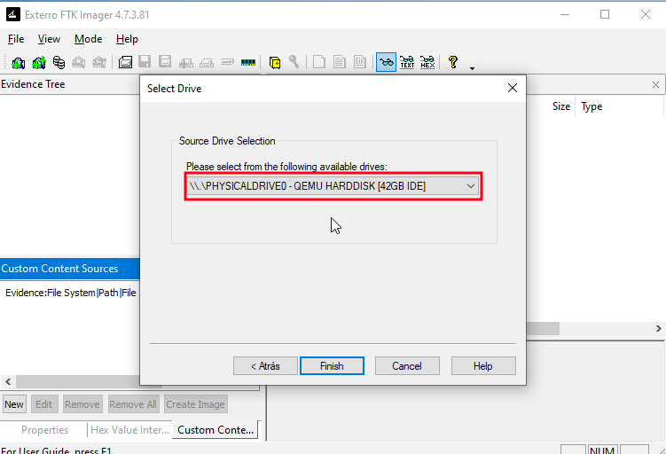
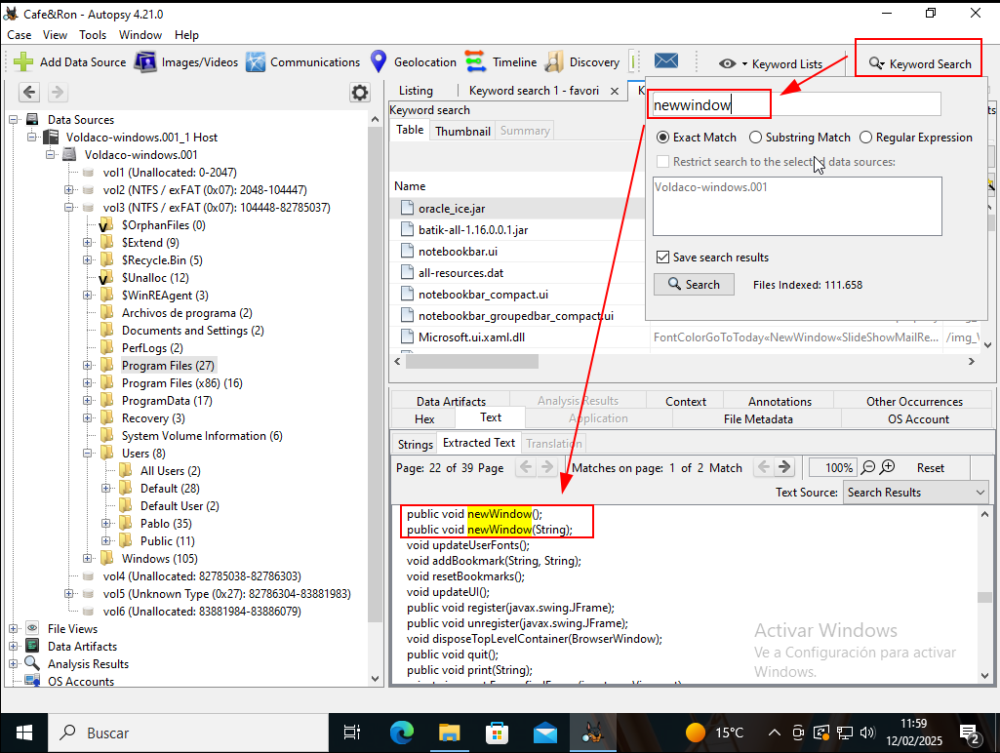

# Informática Forense

## Introducción

La informática forense es el conjunto de técnicas que nos permite obtener la máxima información posible tras un incidente o delito informático.

En esta práctica, se realizará la fase de toma de evidencias y análisis de las mismas sobre una máquina Linux y otra Windows. 

Vamos a suponer que pillamos al delincuente **in fraganti** y las máquinas se encontraban encendidas.

Sobre cada una de las máquinas vamos a realizar el proceso de toma de evidencias siguiendo las directrices contenidas en **RFC-3227**  (incluyendo un volcado de memoria y otro de disco duro), tomando las medidas necesarias para certificar posteriormente la cadena de custodia.

Ahora explicaré lo que es la **cadena de custodía** que en la introducción he hablado, y te quedaría igual, dejo por aquí lo que es:

Para esta práctica lo que deberiamos de hacer es asegurar lo que se llama **cadena de custodia** de lo que sería las evidencias que se han recogido, por lo que habría que evitar instalar los programas que necesitemos en la máquina de la cual estamos sospechando (como no tenemos suficiente memoria, esto no lo podré hacer, por lo que lo haré en la misma máquina).

Por lo que en terminos de buena praxis, se usaria lo que es un dispositivo externo (USB, disco duro externo) donde previamente hemos instalado las herramientas necesarias. Una vez que lo hemos conectado, vamos a proceder a ejecutar lo que sería el programa o programas, lo que esto cargara temporalmente en la RAM sin dejar ningún tipo de rastro.

Los dos tipos de volcado tanto el de memoria y el disco, van a estar en el disco que conectemoes externamente. Luego una vez hecho esto, lo que hariamos será extraer el disposituivo, y hariamos lo que es el análisis de la información obtenida en lo que sería en un entorno seguro.


Dejo por aquí diferenciado lo que sería ambas máquinas **Windows** y **Linux**.

# Windows

## Volcado de disco duro en Windows

Para realizar el volcado de disco duro, deberiamos de seguir los siguiente paso, los dejo por aqui de manera gráfica:


 




 

 

 

 

 

 

 

Aquí podemos ver los **hashes** que se nos han generado:

 

Y podemos ver un resumen de la creación de la imagen:

 

Nos dará los siguientes archivos en la ruta o más bien el disco del volcado el que elegimos:


## Volcado de memoria de windows

### ¿Que es el volcado de memoria?

Es una captura del contenido de la memoria RAM de un momento determinado. Esto sirve para ver como se encuentra el sistema operativo, aplicaciones en ejecución y los datos volatiles que pueden desaparecer tas un reinicio de la máquina.

### Herramienta usada

**FTK Imager** es una herramienta de análisis forense que permite extraer y visualizar imágenes de discos y memoria RAM sin alterar la evidencia.


 

 

 

 


## Volcado de registros en windows

Con esto lo que queremos hacer es extraer y analizar los archivos de registro, llamados **logs** que genera el sistema operativo y aplicaciones.

Por lo que debermos de hacer los siguientes pasos para proceder aa realizarlo:

 

Y nos dará los siguientes archivos:


## Instalación de autopsy

En este apartado procederemos a instalar la herramienta [Autopsy](https://www.autopsy.com/download/),una vez instalado, procedemos a ejecutarlo, como lo queria instalar en el **disco C** y este no me deja ya que el espacio es minúsculo, lo que hice fue añadir un disco de 10GB solamente para autpsy, por lo que quedara de la siguiente manera:


Y este se nos creara en el escritorio, y procedemos a ejecutarlo, y nos aparecera por panatalla lo siguiente, y procderemos a hacer un nuveo caso para lo que será esta práctica:


 

En este punto lo que tendremos que hacer es marcar lo que nos hace falta para esta práctica:

- **Nota**: Desmarcar la opción **Embedded File Extraction**, ya que esto lo qe haces es ir fichero por fichero y viendo lo que hay en su interior, si tu máquina solo esta hecha para la pr-actica no pasará nada, pero si tienes como la mia que esta desde septiembre en uso, **no lo recomiendo**.

 

 


Este proceso tardará bastante tiempo por lo que, tendremos que dejar el pc sin tener que tocarlo:


## Apartado de máquina Windows

En este apartado para hacer las comprobaciones, usaré lo que será la herramienta autopsy, volatily y por CMD para los distintos apartados, por lo que empezaré por los apartados de los cuales sacaré la información de **autopsy**:


### Autopsy

#### - Dispositivos USB conectados.


#### - Asociacion de extension de ficheros y aplicaciones.


#### - Aplicaciones usadas recientemente


#### - Ficheros abiertos recientemente


#### - Software instalado


#### - Contraseñas guardadas


#### - Cuentas de usuarios


#### - Historial de navegación y descargas. Cookies.
 
 ##### - Navergación:


 ##### - Descargas


 ##### - Cookies


#### - Volumenes cifrados


#### - Archivos con extensiones cambiadas.


#### - Archivos eliminados.


#### - Archivos ocultos.

En este apartado no lo he podido encontrar, ya que pense que al tener tanto tiempo la máquina y uso creí que tendría algun archivo, pero no ha sido el caso, asi que dejo como lo tendríamos que encontrar, y es buscando en su etiqueda de descripcion "**hidden**".

#### - Archivos con cadena determinada.



#### - Búsqueda de imagenes por ubicación.

Tras realizar lo que es el análisis foresnse de lo que es la imagen "Foto.jpg" usando la herramientas **Autopsy**, he podido comprobar la ausencia de metadatso de geolocalización en los datos extraídos, y para terminar de comprobar que no ha salido mal, lo que hice fue extraerla y llevarla a una página externa, dejó por aquí el prceso que llevé acabo.

Dejo por aqui las pruebas que hice en **Autopsy**:


Luego de comprobar que no iba, lo que hice fue extraer la foto, y comprobarlo


Comprobar en la página [geoimgr](https://tool.geoimgr.com/), y como podemos ver la localización esta perfectamente lista:


#### - Búsqueda de archivos por autor.


### AccessData Register Viewer

Para estos apartados me he descargado lo que es la herramienta **AccessData Registry Viewer**.


#### - Configuración del firewall de nodo.

Cuando abrimos el File cogemos el archivo System.


Dejo la ruta por aqui:

`SYSTEM\ControlSet001\Services\SharedAccess\Defaults\FirewallPolicy\FirewallRules`


#### -  Programas que se ejecutan en el Inicio

Cuando abrimos el File cogemos el archivo que pone software:


Dejo a la ruta por la cual se llega:

`Software\Microsoft\Windows\CurrentVersion\Run`


## Instalar Volatility


En este apartado dejo como he hecho para la instalación de lo que es la aplicacion de **Volatility** en mi host:

```
madandy@toyota-hilux:~/Documentos$ 
cd volatility3/
madandy@toyota-hilux:~/Documentos/volatility3$ 
cd ..
madandy@toyota-hilux:~/Documentos$ 
source volatility/bin/activate
(volatility) madandy@toyota-hilux:~/Documentos$ 
cd volatility3/
(volatility) madandy@toyota-hilux:~/Documentos/volatility3$ 
pip install volatility3/
ERROR: Directory 'volatility3/' is not installable. Neither 'setup.py' nor 'pyproject.toml' found.
(volatility) madandy@toyota-hilux:~/Documentos/volatility3$ 
pip install volatility3
Collecting volatility3
  Downloading volatility3-2.11.0-py3-none-any.whl (837 kB)
     ━━━━━━━━━━━━━━━━━━━━━━━━━━━━━━━━━━━━━━━ 837.6/837.6 kB 3.9 MB/s eta 0:00:00
Collecting pefile>=2023.2.7
  Downloading pefile-2024.8.26-py3-none-any.whl (74 kB)
     ━━━━━━━━━━━━━━━━━━━━━━━━━━━━━━━━━━━━━━━━ 74.8/74.8 kB 3.6 MB/s eta 0:00:00
Installing collected packages: pefile, volatility3
Successfully installed pefile-2024.8.26 volatility3-2.11.0
(volatility) madandy@toyota-hilux:~/Documentos/volatility3$ 

(volatility) madandy@toyota-hilux:~/Documentos/volatility3$ 
pip install -e .[dev]
Obtaining file:///home/madandy/Documentos/volatility3
  Installing build dependencies ... done
  Checking if build backend supports build_editable ... done
  Getting requirements to build editable ... done
  Preparing editable metadata (pyproject.toml) ... done
Requirement already satisfied: pefile>=2024.8.26 in /home/madandy/Documentos/volatility/lib/python3.11/site-packages (from volatility3==2.20.1) (2024.8.26)
Collecting jsonschema<5,>=4.23.0
  Using cached jsonschema-4.23.0-py3-none-any.whl (88 kB)
Collecting pyinstaller<7,>=6.5.0
  Downloading pyinstaller-6.12.0-py3-none-manylinux2014_x86_64.whl (716 kB)
     ━━━━━━━━━━━━━━━━━━━━━━━━━━━━━━━━━━━━━━━ 717.0/717.0 kB 3.7 MB/s eta 0:00:00
Collecting pyinstaller-hooks-contrib>=2024.9
  Downloading pyinstaller_hooks_contrib-2025.1-py3-none-any.whl (346 kB)
     ━━━━━━━━━━━━━━━━━━━━━━━━━━━━━━━━━━━━━━━ 346.4/346.4 kB 3.4 MB/s eta 0:00:00
Collecting types-jsonschema<5,>=4.23.0
  Downloading types_jsonschema-4.23.0.20241208-py3-none-any.whl (15 kB)
Collecting attrs>=22.2.0
  Downloading attrs-25.1.0-py3-none-any.whl (63 kB)
     ━━━━━━━━━━━━━━━━━━━━━━━━━━━━━━━━━━━━━━━━ 63.2/63.2 kB 4.1 MB/s eta 0:00:00
Collecting jsonschema-specifications>=2023.03.6
  Using cached jsonschema_specifications-2024.10.1-py3-none-any.whl (18 kB)
Collecting referencing>=0.28.4
  Downloading referencing-0.36.2-py3-none-any.whl (26 kB)
Collecting rpds-py>=0.7.1
  Downloading rpds_py-0.22.3-cp311-cp311-manylinux_2_17_x86_64.manylinux2014_x86_64.whl (381 kB)
     ━━━━━━━━━━━━━━━━━━━━━━━━━━━━━━━━━━━━━━━ 381.3/381.3 kB 3.3 MB/s eta 0:00:00
Requirement already satisfied: setuptools>=42.0.0 in /home/madandy/Documentos/volatility/lib/python3.11/site-packages (from pyinstaller<7,>=6.5.0->volatility3==2.20.1) (66.1.1)
Collecting altgraph
  Downloading altgraph-0.17.4-py2.py3-none-any.whl (21 kB)
Collecting packaging>=22.0
  Downloading packaging-24.2-py3-none-any.whl (65 kB)
     ━━━━━━━━━━━━━━━━━━━━━━━━━━━━━━━━━━━━━━━━ 65.5/65.5 kB 7.5 MB/s eta 0:00:00
Collecting yara-python<5,>=4.5.1
  Downloading yara_python-4.5.1-cp311-cp311-manylinux_2_17_x86_64.manylinux2014_x86_64.whl (2.3 MB)
     ━━━━━━━━━━━━━━━━━━━━━━━━━━━━━━━━━━━━━━━━ 2.3/2.3 MB 4.2 MB/s eta 0:00:00
Collecting capstone<6,>=5.0.3
  Downloading capstone-5.0.5-py3-none-manylinux_2_17_x86_64.manylinux2014_x86_64.whl (1.5 MB)
     ━━━━━━━━━━━━━━━━━━━━━━━━━━━━━━━━━━━━━━━━ 1.5/1.5 MB 4.2 MB/s eta 0:00:00
Collecting pycryptodome<4,>=3.21.0
  Downloading pycryptodome-3.21.0-cp36-abi3-manylinux_2_17_x86_64.manylinux2014_x86_64.whl (2.3 MB)
     ━━━━━━━━━━━━━━━━━━━━━━━━━━━━━━━━━━━━━━━━ 2.3/2.3 MB 4.0 MB/s eta 0:00:00
Collecting leechcorepyc<3,>=2.19.2
  Downloading leechcorepyc-2.20.0-cp36-abi3-manylinux1_x86_64.whl (191 kB)
     ━━━━━━━━━━━━━━━━━━━━━━━━━━━━━━━━━━━━━━━ 192.0/192.0 kB 2.8 MB/s eta 0:00:00
Collecting pillow<11.0.0,>=10.0.0
  Downloading pillow-10.4.0-cp311-cp311-manylinux_2_28_x86_64.whl (4.5 MB)
     ━━━━━━━━━━━━━━━━━━━━━━━━━━━━━━━━━━━━━━━━ 4.5/4.5 MB 3.0 MB/s eta 0:00:00
Collecting gcsfs>=2024.10.0
  Downloading gcsfs-2025.2.0-py2.py3-none-any.whl (35 kB)
Collecting s3fs>=2024.10.0
  Downloading s3fs-2025.2.0-py3-none-any.whl (30 kB)
Collecting aiohttp!=4.0.0a0,!=4.0.0a1
  Downloading aiohttp-3.11.12-cp311-cp311-manylinux_2_17_x86_64.manylinux2014_x86_64.whl (1.7 MB)
     ━━━━━━━━━━━━━━━━━━━━━━━━━━━━━━━━━━━━━━━━ 1.7/1.7 MB 4.1 MB/s eta 0:00:00
Collecting decorator>4.1.2
  Downloading decorator-5.1.1-py3-none-any.whl (9.1 kB)
Collecting fsspec==2025.2.0
  Downloading fsspec-2025.2.0-py3-none-any.whl (184 kB)
     ━━━━━━━━━━━━━━━━━━━━━━━━━━━━━━━━━━━━━━━ 184.5/184.5 kB 3.6 MB/s eta 0:00:00
Collecting google-auth>=1.2
  Downloading google_auth-2.38.0-py2.py3-none-any.whl (210 kB)
     ━━━━━━━━━━━━━━━━━━━━━━━━━━━━━━━━━━━━━━━ 210.8/210.8 kB 3.9 MB/s eta 0:00:00
Collecting google-auth-oauthlib
  Downloading google_auth_oauthlib-1.2.1-py2.py3-none-any.whl (24 kB)
Collecting google-cloud-storage
  Downloading google_cloud_storage-3.0.0-py2.py3-none-any.whl (173 kB)
     ━━━━━━━━━━━━━━━━━━━━━━━━━━━━━━━━━━━━━━━ 173.9/173.9 kB 4.4 MB/s eta 0:00:00
Collecting requests
  Downloading requests-2.32.3-py3-none-any.whl (64 kB)
     ━━━━━━━━━━━━━━━━━━━━━━━━━━━━━━━━━━━━━━━━ 64.9/64.9 kB 3.8 MB/s eta 0:00:00
Collecting typing-extensions>=4.4.0
  Downloading typing_extensions-4.12.2-py3-none-any.whl (37 kB)
Collecting aiobotocore<3.0.0,>=2.5.4
  Downloading aiobotocore-2.19.0-py3-none-any.whl (77 kB)
     ━━━━━━━━━━━━━━━━━━━━━━━━━━━━━━━━━━━━━━━━ 77.7/77.7 kB 9.2 MB/s eta 0:00:00
Collecting aioitertools<1.0.0,>=0.5.1
  Downloading aioitertools-0.12.0-py3-none-any.whl (24 kB)
Collecting botocore<1.36.4,>=1.36.0
  Downloading botocore-1.36.3-py3-none-any.whl (13.3 MB)
     ━━━━━━━━━━━━━━━━━━━━━━━━━━━━━━━━━━━━━━━━ 13.3/13.3 MB 2.8 MB/s eta 0:00:00
Collecting python-dateutil<3.0.0,>=2.1
  Downloading python_dateutil-2.9.0.post0-py2.py3-none-any.whl (229 kB)
     ━━━━━━━━━━━━━━━━━━━━━━━━━━━━━━━━━━━━━━━ 229.9/229.9 kB 3.9 MB/s eta 0:00:00
Collecting jmespath<2.0.0,>=0.7.1
  Downloading jmespath-1.0.1-py3-none-any.whl (20 kB)
Collecting multidict<7.0.0,>=6.0.0
  Using cached multidict-6.1.0-cp311-cp311-manylinux_2_17_x86_64.manylinux2014_x86_64.whl (129 kB)
Collecting urllib3!=2.2.0,<3,>=1.25.4
  Downloading urllib3-2.3.0-py3-none-any.whl (128 kB)
     ━━━━━━━━━━━━━━━━━━━━━━━━━━━━━━━━━━━━━━━ 128.4/128.4 kB 4.1 MB/s eta 0:00:00
Collecting wrapt<2.0.0,>=1.10.10
  Downloading wrapt-1.17.2-cp311-cp311-manylinux_2_5_x86_64.manylinux1_x86_64.manylinux_2_17_x86_64.manylinux2014_x86_64.whl (83 kB)
     ━━━━━━━━━━━━━━━━━━━━━━━━━━━━━━━━━━━━━━━━ 83.2/83.2 kB 2.7 MB/s eta 0:00:00
Collecting aiohappyeyeballs>=2.3.0
  Downloading aiohappyeyeballs-2.4.6-py3-none-any.whl (14 kB)
Collecting aiosignal>=1.1.2
  Downloading aiosignal-1.3.2-py2.py3-none-any.whl (7.6 kB)
Collecting frozenlist>=1.1.1
  Using cached frozenlist-1.5.0-cp311-cp311-manylinux_2_5_x86_64.manylinux1_x86_64.manylinux_2_17_x86_64.manylinux2014_x86_64.whl (274 kB)
Collecting propcache>=0.2.0
  Downloading propcache-0.2.1-cp311-cp311-manylinux_2_17_x86_64.manylinux2014_x86_64.whl (231 kB)
     ━━━━━━━━━━━━━━━━━━━━━━━━━━━━━━━━━━━━━━━ 231.1/231.1 kB 3.4 MB/s eta 0:00:00
Collecting yarl<2.0,>=1.17.0
  Downloading yarl-1.18.3-cp311-cp311-manylinux_2_17_x86_64.manylinux2014_x86_64.whl (344 kB)
     ━━━━━━━━━━━━━━━━━━━━━━━━━━━━━━━━━━━━━━━ 344.1/344.1 kB 4.1 MB/s eta 0:00:00
Collecting cachetools<6.0,>=2.0.0
  Downloading cachetools-5.5.1-py3-none-any.whl (9.5 kB)
Collecting pyasn1-modules>=0.2.1
  Downloading pyasn1_modules-0.4.1-py3-none-any.whl (181 kB)
     ━━━━━━━━━━━━━━━━━━━━━━━━━━━━━━━━━━━━━━━ 181.5/181.5 kB 2.1 MB/s eta 0:00:00
Collecting rsa<5,>=3.1.4
  Downloading rsa-4.9-py3-none-any.whl (34 kB)
Collecting requests-oauthlib>=0.7.0
  Downloading requests_oauthlib-2.0.0-py2.py3-none-any.whl (24 kB)
Collecting google-api-core<3.0.0dev,>=2.15.0
  Downloading google_api_core-2.24.1-py3-none-any.whl (160 kB)
     ━━━━━━━━━━━━━━━━━━━━━━━━━━━━━━━━━━━━━━━ 160.1/160.1 kB 4.0 MB/s eta 0:00:00
Collecting google-cloud-core<3.0dev,>=2.3.0
  Downloading google_cloud_core-2.4.1-py2.py3-none-any.whl (29 kB)
Collecting google-resumable-media>=2.7.2
  Downloading google_resumable_media-2.7.2-py2.py3-none-any.whl (81 kB)
     ━━━━━━━━━━━━━━━━━━━━━━━━━━━━━━━━━━━━━━━━ 81.3/81.3 kB 2.6 MB/s eta 0:00:00
Collecting google-crc32c<2.0dev,>=1.0
  Downloading google_crc32c-1.6.0-cp311-cp311-manylinux_2_17_x86_64.manylinux2014_x86_64.whl (32 kB)
Collecting charset-normalizer<4,>=2
  Downloading charset_normalizer-3.4.1-cp311-cp311-manylinux_2_17_x86_64.manylinux2014_x86_64.whl (143 kB)
     ━━━━━━━━━━━━━━━━━━━━━━━━━━━━━━━━━━━━━━━ 143.9/143.9 kB 4.8 MB/s eta 0:00:00
Collecting idna<4,>=2.5
  Downloading idna-3.10-py3-none-any.whl (70 kB)
     ━━━━━━━━━━━━━━━━━━━━━━━━━━━━━━━━━━━━━━━━ 70.4/70.4 kB 3.9 MB/s eta 0:00:00
Collecting certifi>=2017.4.17
  Downloading certifi-2025.1.31-py3-none-any.whl (166 kB)
     ━━━━━━━━━━━━━━━━━━━━━━━━━━━━━━━━━━━━━━━ 166.4/166.4 kB 3.8 MB/s eta 0:00:00
Collecting googleapis-common-protos<2.0.dev0,>=1.56.2
  Downloading googleapis_common_protos-1.66.0-py2.py3-none-any.whl (221 kB)
     ━━━━━━━━━━━━━━━━━━━━━━━━━━━━━━━━━━━━━━━ 221.7/221.7 kB 3.9 MB/s eta 0:00:00
Collecting protobuf!=3.20.0,!=3.20.1,!=4.21.0,!=4.21.1,!=4.21.2,!=4.21.3,!=4.21.4,!=4.21.5,<6.0.0.dev0,>=3.19.5
  Downloading protobuf-5.29.3-cp38-abi3-manylinux2014_x86_64.whl (319 kB)
     ━━━━━━━━━━━━━━━━━━━━━━━━━━━━━━━━━━━━━━━ 319.7/319.7 kB 3.9 MB/s eta 0:00:00
Collecting proto-plus<2.0.0dev,>=1.22.3
  Downloading proto_plus-1.26.0-py3-none-any.whl (50 kB)
     ━━━━━━━━━━━━━━━━━━━━━━━━━━━━━━━━━━━━━━━━ 50.2/50.2 kB 2.9 MB/s eta 0:00:00
Collecting pyasn1<0.7.0,>=0.4.6
  Downloading pyasn1-0.6.1-py3-none-any.whl (83 kB)
     ━━━━━━━━━━━━━━━━━━━━━━━━━━━━━━━━━━━━━━━━ 83.1/83.1 kB 4.8 MB/s eta 0:00:00
Collecting six>=1.5
  Downloading six-1.17.0-py2.py3-none-any.whl (11 kB)
Collecting oauthlib>=3.0.0
  Downloading oauthlib-3.2.2-py3-none-any.whl (151 kB)
     ━━━━━━━━━━━━━━━━━━━━━━━━━━━━━━━━━━━━━━━ 151.7/151.7 kB 4.4 MB/s eta 0:00:00
Building wheels for collected packages: volatility3
  Building editable for volatility3 (pyproject.toml) ... done
  Created wheel for volatility3: filename=volatility3-2.20.1-0.editable-py3-none-any.whl size=7588 sha256=c1bf2b00f517d4b43b1735fd3454d1ff69ad9810479b3eda69273e590db6d2bc
  Stored in directory: /tmp/pip-ephem-wheel-cache-o7o3h2e6/wheels/51/b4/f3/3753fc7cd5cff06af4395286d92f74ea4238e78a519c5ef94d
Successfully built volatility3
Installing collected packages: yara-python, altgraph, wrapt, volatility3, urllib3, typing-extensions, six, rpds-py, pycryptodome, pyasn1, protobuf, propcache, pillow, packaging, oauthlib, multidict, leechcorepyc, jmespath, idna, google-crc32c, fsspec, frozenlist, decorator, charset-normalizer, certifi, capstone, cachetools, attrs, aioitertools, aiohappyeyeballs, yarl, rsa, requests, referencing, python-dateutil, pyinstaller-hooks-contrib, pyasn1-modules, proto-plus, googleapis-common-protos, google-resumable-media, aiosignal, types-jsonschema, requests-oauthlib, pyinstaller, jsonschema-specifications, google-auth, botocore, aiohttp, jsonschema, google-auth-oauthlib, google-api-core, aiobotocore, s3fs, google-cloud-core, google-cloud-storage, gcsfs
  Attempting uninstall: volatility3
    Found existing installation: volatility3 2.11.0
    Uninstalling volatility3-2.11.0:
      Successfully uninstalled volatility3-2.11.0
Successfully installed aiobotocore-2.19.0 aiohappyeyeballs-2.4.6 aiohttp-3.11.12 aioitertools-0.12.0 aiosignal-1.3.2 altgraph-0.17.4 attrs-25.1.0 botocore-1.36.3 cachetools-5.5.1 capstone-5.0.5 certifi-2025.1.31 charset-normalizer-3.4.1 decorator-5.1.1 frozenlist-1.5.0 fsspec-2025.2.0 gcsfs-2025.2.0 google-api-core-2.24.1 google-auth-2.38.0 google-auth-oauthlib-1.2.1 google-cloud-core-2.4.1 google-cloud-storage-3.0.0 google-crc32c-1.6.0 google-resumable-media-2.7.2 googleapis-common-protos-1.66.0 idna-3.10 jmespath-1.0.1 jsonschema-4.23.0 jsonschema-specifications-2024.10.1 leechcorepyc-2.20.0 multidict-6.1.0 oauthlib-3.2.2 packaging-24.2 pillow-10.4.0 propcache-0.2.1 proto-plus-1.26.0 protobuf-5.29.3 pyasn1-0.6.1 pyasn1-modules-0.4.1 pycryptodome-3.21.0 pyinstaller-6.12.0 pyinstaller-hooks-contrib-2025.1 python-dateutil-2.9.0.post0 referencing-0.36.2 requests-2.32.3 requests-oauthlib-2.0.0 rpds-py-0.22.3 rsa-4.9 s3fs-2025.2.0 six-1.17.0 types-jsonschema-4.23.0.20241208 typing-extensions-4.12.2 urllib3-2.3.0 volatility3-2.20.1 wrapt-1.17.2 yara-python-4.5.1 yarl-1.18.3
(volatility) madandy@toyota-hilux:~/Documentos/volatility3$ 
```
### Montaje del disco de windows

Ahora tengo que montar el disco de windows en mi máquina física, el cual esta en esta ruta `/var/lib/libvirt/images/messirve.qcow2`, dejo el paso a paso, por lo que para ello hare lo siguiente:

```
madandy@toyota-hilux:~/Documentos$ 
source volatility/bin/activate
```
```
(volatility) madandy@toyota-hilux:~/Documentos$ cd
```
```
(volatility) madandy@toyota-hilux:~$ 
sudo modprobe nbd
```
```
(volatility) madandy@toyota-hilux:~$ 
sudo qemu-nbd --connect=/dev/nbd0 /var/lib/libvirt/images/messirve.qcow2
```
```
(volatility) madandy@toyota-hilux:~$ 
sudo fdisk -l /dev/nbd0
Disco /dev/nbd0: 80 GiB, 85899345920 bytes, 167772160 sectores
Unidades: sectores de 1 * 512 = 512 bytes
Tamaño de sector (lógico/físico): 512 bytes / 512 bytes
Tamaño de E/S (mínimo/óptimo): 512 bytes / 131072 bytes
Tipo de etiqueta de disco: gpt
Identificador del disco: 536AA375-A194-4A72-ABDB-FF3500C0D7F0

Disposit.   Comienzo     Final  Sectores Tamaño Tipo
/dev/nbd0p1       34     32767     32734    16M Reservado para Microsoft
/dev/nbd0p2    32768 167768063 167735296    80G Datos básicos de Microsoft
```
 
Este paso cuando lo vuleva a meter no hace falta ya que el directorio lo tengo montado
```
(volatility) madandy@toyota-hilux:~$ 
sudo mkdir -p /mnt/wessi
```

Por lo que vamso aquí:
```
(volatility) madandy@toyota-hilux:~$ 
sudo mount -o ro /dev/nbd0p2 /mnt/wessi/
```
Y comprobamos:
```
(volatility) madandy@toyota-hilux:~$ 
ls /mnt/wessi/
'$RECYCLE.BIN'                Voldaco-windows.003   Voldaco-windows.017
 default                      Voldaco-windows.004   Voldaco-windows.018
 DumpStack.log.tmp            Voldaco-windows.005   Voldaco-windows.019
 memdump.mem                  Voldaco-windows.006   Voldaco-windows.020
 pagefile.sys                 Voldaco-windows.007   Voldaco-windows.021
 SAM                          Voldaco-windows.008   Voldaco-windows.022
 SECURITY                     Voldaco-windows.009   Voldaco-windows.023
 software                     Voldaco-windows.010   Voldaco-windows.024
 system                       Voldaco-windows.011   Voldaco-windows.025
'System Volume Information'   Voldaco-windows.012   Voldaco-windows.026
 Users                        Voldaco-windows.013   Voldaco-windows.027
 Voldaco-windows.001          Voldaco-windows.014   Voldaco-windows.028
 Voldaco-windows.001.txt      Voldaco-windows.015
 Voldaco-windows.002          Voldaco-windows.016
```
A continuación:

```
(volatility) madandy@toyota-hilux:~/Documentos/volatility3$ 
python3 vol.py -f "/mnt/wessi/memdump.mem" windows.info
```
Y al cabo del rato nos dejara esto por pantalla:

```
Progress:  100.00               Reading Symbol layer                            Progress:  100.00               PDB scanning finished                                                                                              
Variable	Value

Kernel Base	0xf80181e00000
DTB	0x1aa000
Symbols	file:///home/madandy/Documentos/volatility3/volatility3/symbols/windows/ntkrnlmp.pdb/31034739C38F48130836BEEC344E2953-1.json.xz
Is64Bit	True
IsPAE	False
layer_name	0 WindowsIntel32e
memory_layer	1 FileLayer
KdVersionBlock	0xf80182a0f420
Major/Minor	15.19041
MachineType	34404
KeNumberProcessors	2
SystemTime	2025-02-11 11:35:31+00:00
NtSystemRoot	C:\Windows
NtProductType	NtProductWinNt
NtMajorVersion	10
NtMinorVersion	0
PE MajorOperatingSystemVersion	10
PE MinorOperatingSystemVersion	0
PE Machine	34404
PE TimeDateStamp	Wed Sep 19 19:34:01 2085
```

### Comprobaciones con Volatily

##### - Proceso en ejecución

Comando:

`python3 vol.py -f "/mnt/wessi/memdump.mem" windows.pslist.PsList`

Lo que se ve por pantalla:

```
(volatility) madandy@toyota-hilux:~/Documentos/volatility3$ 
python3 vol.py -f "/mnt/wessi/memdump.mem" windows.pslist.PsList
Volatility 3 Framework 2.20.1
Progress:  100.00		PDB scanning finished                        
PID	PPID	ImageFileName	Offset(V)	Threads	Handles	SessionId	Wow64	CreateTime	ExitTime	File output

4	0	System	0xcd0d6fe69040	128	-	N/A	False	2025-02-11 10:48:59.000000 UTC	N/A	Disabled
92	4	Registry	0xcd0d6ffe1080	4	-	N/A	False	2025-02-11 10:48:57.000000 UTC	N/A	Disabled
348	4	smss.exe	0xcd0d70932040	2	-	N/A	False	2025-02-11 10:48:59.000000 UTC	N/A	Disabled
448	440	csrss.exe	0xcd0d71c5d140	10	-	0	False	2025-02-11 10:49:04.000000 UTC	N/A	Disabled
520	440	wininit.exe	0xcd0d71fc8080	1	-	0	False	2025-02-11 10:49:04.000000 UTC	N/A	Disabled
532	512	csrss.exe	0xcd0d71c6e240	12	-	1	False	2025-02-11 10:49:04.000000 UTC	N/A	Disabled
616	512	winlogon.exe	0xcd0d75c1a080	6	-	1	False	2025-02-11 10:49:04.000000 UTC	N/A	Disabled
628	520	services.exe	0xcd0d75c1e180	7	-	0	False	2025-02-11 10:49:04.000000 UTC	N/A	Disabled
668	520	lsass.exe	0xcd0d75c53180	8	-	0	False	2025-02-11 10:49:04.000000 UTC	N/A	Disabled
780	520	fontdrvhost.ex	0xcd0d75c50080	5	-	0	False	2025-02-11 10:49:04.000000 UTC	N/A	Disabled
788	616	fontdrvhost.ex	0xcd0d75cb1240	5	-	1	False	2025-02-11 10:49:04.000000 UTC	N/A	Disabled
...
...
...
..
.

```

##### - Servicios en ejecución:

Comando:

`python3 vol.py -f "/mnt/wessi/memdump.mem" windows.getservicesids.GetServiceSIDs`

Lo que se ve por pantalla:

```
(volatility) madandy@toyota-hilux:~/Documentos/volatility3$ 
python3 vol.py -f "/mnt/wessi/memdump.mem" windows.getservicesids.GetServiceSIDs
Volatility 3 Framework 2.20.1
Progress:  100.00		PDB scanning finished                        
SID	Service

S-1-5-80-4151353957-356578678-4163131872-800126167-2037860865	.NET CLR Networking 4.0.0.0
S-1-5-80-1135273183-3738781202-689480478-891280274-255333391	.NET Memory Cache 4.0
S-1-5-80-3459415445-2224257447-3423677131-2829651752-4257665947	3ware
S-1-5-80-2917441881-3404282297-3983348447-1829381237-2935805708	AarSvc
S-1-5-80-2562693458-2107756303-4131822166-2036929544-2713175038	AarSvc_2c2a6
S-1-5-80-1975967573-2913356537-819030703-3730719923-1995772179	AcpiDev
S-1-5-80-2670625634-2386107419-4204951937-4094372046-2600379021	acpiex
S-1-5-80-3267050047-1503497915-401953950-2662906978-1179039408	acpipagr
S-1-5-80-772678238-4220935223-620583658-4118486195-1180343772	acpitime
S-1-5-80-1863632671-1375125309-1493738800-1551534981-2387622636	Acx01000
S-1-5-80-3261807240-4279319092-2126406095-947934052-2578847935	ADOVMPPackage
S-1-5-80-2046354688-3987051615-3879164971-215375460-2633017214	ADP80XX
S-1-5-80-1844980154-4174793104-2163481406-4132667491-3440554544	ad_driver10
S-1-5-80-521319896-1227547225-1440366370-1094984824-1952325498	afunix
S-1-5-80-3882103802-2937937445-2149894622-934926057-1088273958	ahcache
S-1-5-80-3532809085-2652327567-2620918877-1058261733-582902671	AJRouter
S-1-5-80-3520885947-347258037-358237196-958877718-2177097675	amdgpio2
S-1-5-80-3034931084-4111837248-3722498124-953434196-229084002	amdi2c
S-1-5-80-940484976-4139584748-3980625906-2403118188-3770008912	applockerfltr
S-1-5-80-2020831507-1298702824-3288167190-116113825-4190209	AppReadiness
S-1-5-80-3690054487-1922792274-847725564-1425669114-2396631621	AppVClient
S-1-5-80-1981223234-350633043-1452159618-11
....
...
..
.

```

##### - Puertos abiertos

Comando:

`python3 vol.py -f "/mnt/wessi/memdump.mem" windows.netstat.NetStat`

Lo que se ve por pantalla:

```
(volatility) madandy@toyota-hilux:~/Documentos/volatility3$ 
python3 vol.py -f "/mnt/wessi/memdump.mem" windows.netstat.NetStat
Volatility 3 Framework 2.20.1
Progress:  100.00		PDB scanning finished                        
Offset	Proto	LocalAddr	LocalPort	ForeignAddr	ForeignPort	State	PID	Owner	Created

0xcd0d76ed6010	TCPv4	172.22.6.200	49985	10.0.0.40	3260	SYN_SENT	4	System	2025-02-11 11:35:41.000000 UTC
0xcd0d781e6560	TCPv4	172.22.6.200	49837	23.192.237.201	443	CLOSE_WAIT	5408	SearchApp.exe	2025-02-11 11:02:15.000000 UTC
0xcd0d76f22010	TCPv4	172.22.6.200	49730	20.199.120.151	443	ESTABLISHED	2988	svchost.exe	2025-02-11 10:50:30.000000 UTC
0xcd0d71b6c050	TCPv4	172.22.6.200	49692	20.199.120.151	443	ESTABLISHED	2988	svchost.exe	2025-02-11 10:49:30.000000 UTC
0xcd0d776314d0	TCPv4	172.22.6.200	49836	23.192.237.199	443	CLOSE_WAIT	5408	SearchApp.exe	2025-02-11 11:02:15.000000 UTC
0xcd0d70feccb0	TCPv4	0.0.0.0	135	0.0.0.0	0	LISTENING	900	svchost.exe	2025-02-11 10:49:04.000000 UTC
0xcd0d70feccb0	TCPv6	::	135	::	0	LISTENING	900	svchost.exe	2025-02-11 10:49:04.000000 UTC
0xcd0d70fec5d0	TCPv4	0.0.0.0	135	0.0.0.0	0	LISTENING	900	svchost.exe	2025-02-11 10:49:04.000000 UTC
0xcd0d70fed650	TCPv4	192.168.56.1	139	0.0.0.0	0	LISTENING	4	System	2025-02-11 10:49:02.000000 UTC
0xcd0d77fc2650	TCPv4	169.254.50.42	139	0.0.0.0	0	LISTENING	4	System	2025-02-11 10:49:24.000000 UTC
0xcd0d7084b470	TCPv4	172.22.6.200	139	0.0.0.0	0	LISTENING	4	System	2025-02-11 10:49:28.000000 UTC
0xcd0d6fe89e10	TCPv4	0.0.0.0	445	0.0.0.0	0	LISTENING	4	System	2025-02-11 10:49:11.000000 UTC
0xcd0d6fe89e10	TCPv6	::	445	::	0	LISTENING	4	System	2025-02-11 10:49:11.000000 UTC
0xcd0d77fc1b50	TCPv4	0.0.0.0	5040	0.0.0.0	0	LISTENING	4492	svchost.exe	2025-02-11 10:49:13.000000 UTC
0xcd0d77fc2230	TCPv4	0.0.0.0	7680	0.0.0.0	0	LISTENING	5220	svchost.exe	2025-02-11 10:51:11.000000 UTC
0xcd0d77fc2230	TCPv6	::	7680	::	0	LISTENING	5220	svchost.exe	2025-02-11 10:51:11.000000 UTC
0xcd0d70fed4f0	TCPv4	0.0.0.0	49664	0.0.0.0	0	LISTENING	668	lsass.exe	2025-02-11 10:49:04.000000 UTC
0xcd0d70fed4f0	TCPv6	::	49664	::	0	LISTENING	668	lsass.exe	2025-02-11 10:49:04.000000 UTC
0xcd0d70fec050	TCPv4	0.0.0.0	49664	0.0.0.0	0	LISTENING	668	lsass.exe	2025-02-11 10:49:04.000000 UTC
0xcd0d70feda70	TCPv4	0.0.0.0	49665	0.0.0.0	0	LISTENING	520	wininit.exe	2025-02-11 10:49:04.000000 UTC
0xcd0d70feda70	TCPv6	::	49665	::	0	LISTENING	520	wininit.exe	2025-02-11 10:49:04.000000 UTC
0xcd0d70fed910	TCPv4	0.0.0.0	49665	0.0.0.0	0	LISTENING	520	wininit.exe	2025-02-11 10:49:04.000000 UTC
0xcd0d70fedd30	TCPv4	0.0.0.0	49666	0.0.0.0	0	LISTENING	1200	svchost.exe	2025-02-11 10:49:08.000000 UTC
0xcd0d70fedd30	TCPv6	::	49666	::	0	LISTENING	1200	svchost.exe	2025-02-11 10:49:08.000000 UTC
0xcd0d70fedbd0	TCPv4	0.0.0.0	49666	0.0.0.0	0	LISTENING	1200	svchost.exe	2025-02-11 10:49:08.000000 UTC
0xcd0d70fed390	TCPv4	0.0.0.0	49667	0.0.0.0	0	LISTENING	1288	svchost.exe	2025-02-11 10:49:08.000000 UTC
0xcd0d70fed390	TCPv6	::	49667	::	0	LISTENING	1288	svchost.exe	2025-02-11 10:49:08.000000 UTC
0xcd0d70fece10	TCPv4	0.0.0.0	49667	0.0.0.0	0	LISTENING	1288	svchost.exe	2025-02-11 10:49:08.000000 UTC
0xcd0d6fe89cb0	TCPv4	0.0.0.0	49669	0.0.0.0	0	LISTENING	2268	spoolsv.exe	2025-02-11 10:49:10.000000 UTC
0xcd0d6fe89cb0	TCPv6	::	49669	::	0	LISTENING	2268	spoolsv.exe	2025-02-11 10:49:10.000000 UTC
0xcd0d6fe89b50	TCPv4	0.0.0.0	49669	0.0.0.0	0	LISTENING	2268	spoolsv.exe	2025-02-11 10:49:10.000000 UTC
0xcd0d77fc24f0	TCPv4	0.0.0.0	49670	0.0.0.0	0	LISTENING	628	services.exe	2025-02-11 10:49:11.000000 UTC
0xcd0d77fc24f0	TCPv6	::	49670	::	0	LISTENING	628	services.exe	2025-02-11 10:49:11.000000 UTC
0xcd0d6fe89310	TCPv4	0.0.0.0	49670	0.0.0.0	0	LISTENING	628	services.exe	2025-02-11 10:49:11.000000 UTC
0xcd0d7084cd30	TCPv4	0.0.0.0	49671	0.0.0.0	0	LISTENING	2588	svchost.exe	2025-02-11 10:49:12.000000 UTC
0xcd0d7084cd30	TCPv6	::	49671	::	0	LISTENING	2588	svchost.exe	2025-02-11 10:49:12.000000 UTC
0xcd0d7084bcb0	TCPv4	0.0.0.0	49671	0.0.0.0	0	LISTENING	2588	svchost.exe	2025-02-11 10:49:12.000000 UTC
0xcd0d70efa7c0	UDPv4	192.168.56.1	137	*	0		4	System	2025-02-11 10:49:02.000000 UTC
0xcd0d766af010	UDPv4	169.254.50.42	137	*	0		4	System	2025-02-11 10:49:24.000000 UTC
0xcd0d761846a0	UDPv4	172.22.6.200	137	*	0		4	System	2025-02-11 10:49:28.000000 UTC
0xcd0d70efa310	UDPv4	192.168.56.1	138	*	0		4	System	2025-02-11 10:49:02.000000 UTC
0xcd0d766ae6b0	UDPv4	169.254.50.42	138	*	0		4	System	2025-02-11 10:49:24.000000 UTC
0xcd0d76184510	UDPv4	172.22.6.200	138	*	0		4	System	2025-02-11 10:49:28.000000 UTC
0xcd0d762ee180	UDPv4	0.0.0.0	500	*	0		2572	svchost.exe	2025-02-11 10:49:11.000000 UTC
0xcd0d762ee180	UDPv6	::	500	*	0		2572	svchost.exe	2025-02-11 10:49:11.000000 UTC
0xcd0d762ebc00	UDPv4	0.0.0.0	500	*	0		2572	svchost.exe	2025-02-11 10:49:11.000000 UTC
0xcd0d7618b400	UDPv6	fe80::416b:88fd:ab37:55a6	1900	*	0		3464	svchost.exe	2025-02-11 10:49:28.000000 UTC
0xcd0d7618f280	UDPv6	fe80::6478:7ca3:29c2:90b0	1900	*	0		3464	svchost.exe	2025-02-11 10:49:28.000000 UTC
0xcd0d7618e470	UDPv6	::1	1900	*	0		3464	svchost.exe	2025-02-11 10:49:28.000000 UTC
0xcd0d7618f5a0	UDPv4	169.254.50.42	1900	*	0		3464	svchost.exe	2025-02-11 10:49:28.000000 UTC
0xcd0d7618fa50	UDPv4	172.22.6.200	1900	*	0		3464	svchost.exe	2025-02-11 10:49:28.000000 UTC
0xcd0d76191cb0	UDPv4	192.168.56.1	1900	*	0		3464	svchost.exe	2025-02-11 10:49:28.000000 UTC
0xcd0d761903b0	UDPv4	127.0.0.1	1900	*	0		3464	svchost.exe	2025-02-11 10:49:28.000000 UTC
0xcd0d762ee310	UDPv4	0.0.0.0	4500	*	0		2572	svchost.exe	2025-02-11 10:49:11.000000 UTC
0xcd0d762ee310	UDPv6	::	4500	*	0		2572	svchost.exe	2025-02-11 10:49:11.000000 UTC
0xcd0d762f0700	UDPv4	0.0.0.0	4500	*	0		2572	svchost.exe	2025-02-11 10:49:11.000000 UTC
0xcd0d7a8d0280	UDPv4	0.0.0.0	5050	*	0		4492	svchost.exe	2025-02-11 10:49:13.000000 UTC
0xcd0d761857d0	UDPv4	0.0.0.0	5353	*	0		1932	svchost.exe	2025-02-11 10:49:28.000000 UTC
0xcd0d761857d0	UDPv6	::	5353	*	0		1932	svchost.exe	2025-02-11 10:49:28.000000 UTC
0xcd0d76186db0	UDPv4	0.0.0.0	5353	*	0		1932	svchost.exe	2025-02-11 10:49:28.000000 UTC
0xcd0d7618aaa0	UDPv4	0.0.0.0	5355	*	0		1932	svchost.exe	2025-02-11 10:49:28.000000 UTC
....
..
.
.

```

##### - Conexiones establecidas por la máquina:

Comando:

`python3 vol.py -f "/mnt/wessi/memdump.mem" windows.netscan.NetScan`

Lo que se ve por pantalla:

```
(volatility) madandy@toyota-hilux:~/Documentos/volatility3$ 
python3 vol.py -f "/mnt/wessi/memdump.mem" windows.netscan.NetScan
Volatility 3 Framework 2.20.1
Progress:  100.00		PDB scanning finished                        
Offset	Proto	LocalAddr	LocalPort	ForeignAddr	ForeignPort	State	PID	Owner	Created

0xcd0d6fe89310	TCPv4	0.0.0.0	49670	0.0.0.0	0	LISTENING	628	services.exe	2025-02-11 10:49:11.000000 UTC
0xcd0d6fe89b50	TCPv4	0.0.0.0	49669	0.0.0.0	0	LISTENING	2268	spoolsv.exe	2025-02-11 10:49:10.000000 UTC
0xcd0d6fe89cb0	TCPv4	0.0.0.0	49669	0.0.0.0	0	LISTENING	2268	spoolsv.exe	2025-02-11 10:49:10.000000 UTC
0xcd0d6fe89cb0	TCPv6	::	49669	::	0	LISTENING	2268	spoolsv.exe	2025-02-11 10:49:10.000000 UTC
0xcd0d6fe89e10	TCPv4	0.0.0.0	445	0.0.0.0	0	LISTENING	4	System	2025-02-11 10:49:11.000000 UTC
0xcd0d6fe89e10	TCPv6	::	445	::	0	LISTENING	4	System	2025-02-11 10:49:11.000000 UTC
0xcd0d6ff3b010	TCPv4	172.22.6.200	49707	172.22.0.3	80	CLOSED	7916	msedge.exe	2025-02-11 10:49:33.000000 UTC
0xcd0d6ff3d010	TCPv4	172.22.6.200	49984	10.0.0.40	3260	CLOSED	4	System	2025-02-11 11:35:21.000000 UTC
0xcd0d7084b470	TCPv4	172.22.6.200	139	0.0.0.0	0	LISTENING	4	System	2025-02-11 10:49:28.000000 UTC
0xcd0d7084bcb0	TCPv4	0.0.0.0	49671	0.0.0.0	0	LISTENING	2588	svchost.exe	2025-02-11 10:49:12.000000 UTC
0xcd0d7084cd30	TCPv4	0.0.0.0	49671	0.0.0.0	0	LISTENING	2588	svchost.exe	2025-02-11 10:49:12.000000 UTC
0xcd0d7084cd30	TCPv6	::	49671	::	0	LISTENING	2588	svchost.exe	2025-02-11 10:49:12.000000 UTC
0xcd0d70efa310	UDPv4	192.168.56.1	138	*	0		4	System	2025-02-11 10:49:02.000000 UTC
0xcd0d70efa7c0	UDPv4	192.168.56.1	137	*	0		4	System	2025-02-11 10:49:02.000000 UTC
0xcd0d70fec050	TCPv4	0.0.0.0	49664	0.0.0.0	0	LISTENING	668	lsass.exe	2025-02-11 10:49:04.000000 UTC
0xcd0d70fec5d0	TCPv4	0.0.0.0	135	0.0.0.0	0	LISTENING	900	svchost.exe	2025-02-11 10:49:04.000000 UTC
0xcd0d70feccb0	TCPv4	0.0.0.0	135	0.0.0.0	0	LISTENING	900	svchost.exe	2025-02-11 10:49:04.000000 UTC
0xcd0d70feccb0	TCPv6	::	135	::	0	LISTENING	900	svchost.exe	2025-02-11 10:49:04.000000 UTC
0xcd0d70fece10	TCPv4	0.0.0.0	49667	0.0.0.0	0	LISTENING	1288	svchost.exe	2025-02-11 10:49:08.000000 UTC
0xcd0d70fed390	TCPv4	0.0.0.0	49667	0.0.0.0	0	LISTENING	1288	svchost.exe	2025-02-11 10:49:08.000000 UTC
0xcd0d70fed390	TCPv6	::	49667	::	0	LISTENING	1288	svchost.exe	2025-02-11 10:49:08.000000 UTC
0xcd0d70fed4f0	TCPv4	0.0.0.0	49664	0.0.0.0	0	LISTENING	668	lsass.exe	2025-02-11 10:49:04.000000 UTC
0xcd0d70fed4f0	TCPv6	::	49664	::	0	LISTENING	668	lsass.exe	2025-02-11 10:49:04.000000 UTC
0xcd0d70fed650	TCPv4	192.168.56.1	139	0.0.0.0	0	LISTENING	4	System	2025-02-11 10:49:02.000000 UTC
0xcd0d70fed910	TCPv4	0.0.0.0	49665	0.0.0.0	0	LISTENING	520	wininit.exe	2025-02-11 10:49:04.000000 UTC
0xcd0d70feda70	TCPv4	0.0.0.0	49665	0.0.0.0	0	LISTENING	520	wininit.exe	2025-02-11 10:49:04.000000 UTC
0xcd0d70feda70	TCPv6	::	49665	::	0	LISTENING	520	wininit.exe	2025-02-11 10:49:04.000000 UTC
0xcd0d70fedbd0	TCPv4	0.0.0.0	49666	0.0.0.0	0	LISTENING	1200	svchost.exe	2025-02-11 10:49:08.000000 UTC
0xcd0d70fedd30	TCPv4	0.0.0.0	49666	0.0.0.0	0	LISTENING	1200	svchost.exe	2025-02-11 10:49:08.000000 UTC
0xcd0d70fedd30	TCPv6	::	49666	::	0	LISTENING	1200	svchost.exe	2025-02-11 10:49:08.000000 UTC
0xcd0d71b6c050	TCPv4	172.22.6.200	49692	20.199.120.151	443	ESTABLISHED	2988	svchost.exe	2025-02-11 10:49:30.000000 UTC
0xcd0d76184510	UDPv4	172.22.6.200	138	*	0		4	System	2025-02-11 10:49:28.000000 UTC
0xcd0d761846a0	UDPv4	172.22.6.200	137	*	0		4	System	2025-02-11 10:49:28.000000 UTC
0xcd0d76184ce0	UDPv4	0.0.0.0	0	*	0		1932	svchost.exe	2025-02-11 10:49:28.000000 UTC
0xcd0d76184ce0	UDPv6	::	0	*	0		1932	svchost.exe	2025-02-11 10:49:28.000000 UTC
0xcd0d761857d0	UDPv4	0.0.0.0	5353	*	0		1932	svchost.exe	2025-02-11 10:49:28.000000 UTC
0xcd0d761857d0	UDPv6	::	5353	*	0		1932	svchost.exe	2025-02-11 10:49:28.000000 UTC
0xcd0d76186db0	UDPv4	0.0.0.0	5353	*	0		1932	svchost.exe	2025-02-11 10:49:28.000000 UTC
0xcd0d7618aaa0	UDPv4	0.0.0.0	5355	*	0		1932	svchost.exe	2025-02-11 10:49:28.000000 UTC
0xcd0d7618aaa0	UDPv6	::	5355	*	0		1932	svchost.exe	2025-02-11 10:49:28.000000 UTC
0xcd0d7618b400	UDPv6	fe80::416b:88fd:ab37:55a6	1900	*	0		3464	svchost.exe	2025-02-11 10:49:28.000000 UTC
0xcd0d7618b8b0	UDPv4	0.0.0.0	5355	*	0		1932	svchost.exe	2025-02-11 10:49:28.000000 UTC
0xcd0d7618e470	UDPv6	::1	1900	*	0		3464	svchost.exe	2025-02-11 10:49:28.000000 UTC
0xcd0d7618f280	UDPv6	fe80::6478:7ca3:29c2:90b0	1900	*	0		3464	svchost.exe	2025-02-11 10:49:28.000000 UTC
0xcd0d7618f5a0	UDPv4	169.254.50.42	1900	*	0		3464	svchost.exe	2025-02-11 10:49:28.000000 UTC
0xcd0d7618fa50	UDPv4	172.22.6.200	1900	*	0		3464	svchost.exe	2025-02-11 10:49:28.000000 UTC
0xcd0d761903b0	UDPv4	127.0.0.1	1900	*	0		3464	svchost.exe	2025-02-11 10:49:28.000000 UTC
0xcd0d76190860	UDPv4	169.254.50.42	53224	*	0		3464	svchost.exe	2025-02-11 10:49:28.000000 UTC
0xcd0d76190b80	UDPv4	172.22.6.200	53225	*	0		3464	svchost.exe	2025-02-11 10:49:28.000000 UTC
0xcd0d761914e0	UDPv6	fe80::6478:7ca3:29c2:90b0	53222	*	0		3464	svchost.exe	2025-02-11 10:49:28.000000 UTC
0xcd0d76191cb0	UDPv4	192.168.56.1	1900	*	0		3464	svchost.exe	2025-02-11 10:49:28.000000 UTC
0xcd0d76192160	UDPv6	fe80::416b:88fd:ab37:55a6	53221	*	0		3464	svchost.exe	2025-02-11 10:49:28.000000 UTC
0xcd0d76192610	UDPv4	192.168.56.1	53226	*	0		3464	svchost.exe	2025-02-11 10:49:28.000000 UTC
0xcd0d761927a0	UDPv4	127.0.0.1	53227	*	0		3464	svchost.exe	2025-02-11 10:49:28.000000 UTC
0xcd0d76192930	UDPv6	::1	53223	*	0		3464	svchost.exe	2025-02-11 10:49:28.000000 UTC
0xcd0d762ebc00	UDPv4	0.0.0.0	500	*	0		2572	svchost.exe	2025-02-11 10:49:11.000000 UTC
0xcd0d762ee180	UDPv4	0.0.0.0	500	*	0		2572	svchost.exe	2025-02-11 10:49:11.000000 UTC
0xcd0d762ee180	UDPv6	::	500	*	0		2572	svchost.exe	2025-02-11 10:49:11.000000 UTC
0xcd0d762ee310	UDPv4	0.0.0.0	4500	*	0		2572	svchost.exe	2025-02-11 10:49:11.000000 UTC
0xcd0d762ee310	UDPv6	::	4500	*	0		2572	svchost.exe	2025-02-11 10:49:11.000000 UTC
0xcd0d762f0700	UDPv4	0.0.0.0	4500	*	0		2572	svchost.exe	2025-02-11 10:49:11.000000 UTC
0xcd0d762f2640	UDPv4	0.0.0.0	0	*	0		2572	svchost.exe	2025-02-11 10:49:11.000000 UTC
0xcd0d762f2640	UDPv6	::	0	*	0		2572	svchost.exe	2025-02-11 10:49:11.000000 UTC
0xcd0d766ae6b0	UDPv4	169.254.50.42	138	*	0		4	System	2025-02-11 10:49:24.000000 UTC
0xcd0d766af010	UDPv4	169.254.50.42	137	*	0		4	System	2025-02-11 10:49:24.000000 UTC
0xcd0d76a22010	TCPv4	172.22.6.200	49761	172.22.0.3	80	CLOSED	7916	msedge.exe	2025-02-11 10:53:29.000000 UTC
0xcd0d76ed6010	TCPv4	172.22.6.200	49985	10.0.0.40	3260	SYN_SENT	4	System	2025-02-11 11:35:41.000000 UTC
0xcd0d76f22010	TCPv4	172.22.6.200	49730	20.199.120.151	443	ESTABLISHED	2988	svchost.exe	2025-02-11 10:50:30.000000 UTC
0xcd0d7713ea20	TCPv4	172.22.6.200	49706	172.22.0.3	80	CLOSED	7916	msedge.exe	2025-02-11 10:49:33.000000 UTC
0xcd0d771bf490	TCPv4	172.22.6.200	49843	204.79.197.222	443	CLOSED	5408	SearchApp.exe	2025-02-11 11:02:17.000000 UTC
0xcd0d771f56c0	UDPv4	127.0.0.1	58543	*	0		2984	svchost.exe	2025-02-11 10:49:11.000000 UTC
0xcd0d776314d0	TCPv4	172.22.6.200	49836	23.192.237.199	443	CLOSE_WAIT	5408	
.....
...
..
.

```

##### - Sesiones de usuario establecidas remotamente.

Comando:

`python3 vol.py -f "/mnt/wessi/memdump.mem" windows.sessions.Sessions`

Lo que se por pantalla:

```
(volatility) madandy@toyota-hilux:~/Documentos/volatility3$ 
python3 vol.py -f "/mnt/wessi/memdump.mem" windows.sessions.Sessions
Volatility 3 Framework 2.20.1
Progress:  100.00		PDB scanning finished                        
Session ID	Session Type	Process ID	Process	User Name	Create Time

N/A	-	4	System	-	2025-02-11 10:48:59.000000 UTC
N/A	-	92	Registry	-	2025-02-11 10:48:57.000000 UTC
N/A	-	348	smss.exe	-	2025-02-11 10:48:59.000000 UTC
0	-	448	csrss.exe	/SYSTEM	2025-02-11 10:49:04.000000 UTC
0	-	520	wininit.exe	-	2025-02-11 10:49:04.000000 UTC
0	-	628	services.exe	/SYSTEM	2025-02-11 10:49:04.000000 UTC
0	-	668	lsass.exe	/SYSTEM	2025-02-11 10:49:04.000000 UTC
0	-	780	fontdrvhost.ex	-	2025-02-11 10:49:04.000000 UTC
0	-	796	svchost.exe	WORKGROUP/DESKTOP-KOTMO09$	2025-02-11 10:49:04.000000 UTC
0	-	900	svchost.exe	WORKGROUP/DESKTOP-KOTMO09$	2025-02-11 10:49:04.000000 UTC
0	-	956	svchost.exe	WORKGROUP/DESKTOP-KOTMO09$	2025-02-11 10:49:04.000000 UTC
0	-	64	svchost.exe	WORKGROUP/DESKTOP-KOTMO09$	2025-02-11 10:49:05.000000 UTC
0	-	1032	svchost.exe	WORKGROUP/DESKTOP-KOTMO09$	2025-02-11 10:49:05.000000 UTC
0	-	1064	svchost.exe	WORKGROUP/DESKTOP-KOTMO09$	2025-02-11 10:49:05.000000 UTC
0	-	1080	svchost.exe	WORKGROUP/DESKTOP-KOTMO09$	2025-02-11 10:49:05.000000 UTC
0	-	1200	svchost.exe	WORKGROUP/DESKTOP-KOTMO09$	2025-02-11 10:49:05.000000 UTC
0	-	1272	svchost.exe	NT AUTHORITY/SERVICIO LOCAL	2025-02-11 10:49:08.000000 UTC
0	-	1280	svchost.exe	NT AUTHORITY/SERVICIO LOCAL	2025-02-11 10:49:08.000000 UTC
0	-	1288	svchost.exe	NT AUTHORITY/SERVICIO LOCAL	2025-02-11 10:49:08.000000 UTC
0	-	1296	svchost.exe	NT AUTHORITY/SERVICIO LOCAL	2025-02-11 10:49:08.000000 UTC
0	-	1472	svchost.exe	WORKGROUP/DESKTOP-KOTMO09$	2025-02-11 10:49:08.000000 UTC
0	-	1500	svchost.exe	WORKGROUP/DESKTOP-KOTMO09$	2025-02-11 10:49:08.000000 UTC
0	-	1516	svchost.exe	NT AUTHORITY/SERVICIO LOCAL	2025-02-11 10:49:08.000000 UTC
0	-	1564	svchost.exe	WORKGROUP/DESKTOP-KOTMO09$	2025-02-11 10:49:08.000000 UTC
0	-	1572	svchost.exe	NT AUTHORITY/SERVICIO LOCAL	2025-02-11 10:49:08.000000 UTC
0	-	1600	svchost.exe	NT AUTHORITY/SERVICIO LOCAL	2025-02-11 10:49:08.000000 UTC
0	-	1640	svchost.exe	NT AUTHORITY/SERVICIO LOCAL	2025-02-11 10:49:08.000000 UTC
0	-	1784	svchost.exe	NT AUTHORITY/SERVICIO LOCAL	2025-02-11 10:49:08.000000 UTC
0	-	1816	svchost.exe	NT AUTHORITY/SERVICIO LOCAL	2025-02-11 10:49:08.000000 UTC
0	-	1892	svchost.exe	WORKGROUP/DESKTOP-KOTMO09$	2025-02-11 10:49:08.000000 UTC
0	-	1932	svchost.exe	WORKGROUP/DESKTOP-KOTMO09$	2025-02-11 10:49:08.000000 UTC
0	-	1968	svchost.exe	NT AUTHORITY/SERVICIO LOCAL	2025-02-11 10:49:09.000000 UTC
0	-	1976	svchost.exe	NT AUTHORITY/SERVICIO LOCAL	2025-02-11 10:49:09.000000 UTC
0	-	2044	svchost.exe	WORKGROUP/DESKTOP-KOTMO09$	2025-02-11 10:49:09.000000 UTC
0	-	1420	svchost.exe	WORKGROUP/DESKTOP-KOTMO09$	2025-02-11 10:49:10.000000 UTC
0	-	2100	svchost.exe	WORKGROUP/DESKTOP-KOTMO09$	2025-02-11 10:49:10.000000 UTC
0	-	2108	svchost.exe	WORKGROUP/DESKTOP-KOTMO09$	2025-02-11 10:49:10.000000 UTC
0	-	2140	svchost.exe	NT AUTHORITY/SERVICIO LOCAL	2025-02-11 10:49:10.000000 UTC
0	-	2204	svchost.exe	NT AUTHORITY/SERVICIO LOCAL	2025-02-11 10:49:10.000000 UTC
0	-	2268	spoolsv.exe	WORKGROUP/DESKTOP-KOTMO09$	2025-02-11 10:49:10.000000 UTC
0	-	2328	svchost.exe	NT AUTHORITY/SERVICIO LOCAL	2025-02-11 10:49:10.000000 UTC
0	-	2384	svchost.exe	WORKGROUP/DESKTOP-KOTMO09$	2025-02-11 10:49:11.000000 UTC
0	-	2516	svchost.exe	NT AUTHORITY/SERVICIO LOCAL	2025-02-11 10:49:11.000000 UTC
0	-	2572	svchost.exe	WORKGROUP/DESKTOP-KOTMO09$	2025-02-11 10:49:11.000000 UTC
0	-	2588	svchost.exe	WORKGROUP/DESKTOP-KOTMO09$	2025-02-11 10:49:11.000000 UTC
0	-	2724	svchost.exe	WORKGROUP/DESKTOP-KOTMO09$	2025-02-11 10:49:11.000000 UTC
0	-	2732	svchost.exe	WORKGROUP/DESKTOP-KOTMO09$	2025-02-11 10:49:11.000000 UTC
0	-	2752	svchost.exe	WORKGROUP/DESKTOP-KOTMO09$	2025-02-11 10:49:11.000000 UTC
0	-	2764	svchost.exe	NT AUTHORITY/SERVICIO LOCAL	2025-02-11 10:49:11.000000 UTC
0	-	2772	svchost.exe	WORKGROUP/DESKTOP-KOTMO09$	2025-02-11 10:49:11.000000 UTC
0	-	2820	MpDefenderCore	WORKGROUP/DESKTOP-KOTMO09$	2025-02-11 10:49:11.000000 UTC
0	-	2848	svchost.exe	WORKGROUP/DESKTOP-KOTMO09$	2025-02-11 10:49:11.000000 UTC
0	-	2892	svchost.exe	WORKGROUP/DESKTOP-KOTMO09$	2025-02-11 10:49:11.000000 UTC
0	-	2900	svchost.exe	NT AUTHORITY/SERVICIO LOCAL	2025-02-11 10:49:11.000000 UTC
0	-	2928	MsMpEng.exe	WORKGROUP/DESKTOP-KOTMO09$	2025-02-11 10:49:11.000000 UTC
0	-	2936	wireguard.exe	WORKGROUP/DESKTOP-KOTMO09$	2025-02-11 10:49:11.000000 UTC
0	-	2952	wireguard.exe	WORKGROUP/DESKTOP-KOTMO09$	2025-02-11 10:49:11.000000 UTC
0	-	2988	svchost.exe	WORKGROUP/DESKTOP-KOTMO09$	2025-02-11 10:49:11.000000 UTC
0	-	2444	svchost.exe	NT AUTHORITY/SERVICIO LOCAL	2025-02-11 10:49:11.000000 UTC
0	-	2984	svchost.exe	WORKGROUP/DESKTOP-KOTMO09$	2025-02-11 10:49:11.000000 UTC
0	-	3160	dasHost.exe	NT AUTHORITY/SERVICIO LOCAL	2025-02-11 10:49:11.000000 UTC
0	-	3332	svchost.exe	WORKGROUP/DESKTOP-KOTMO09$	2025-02-11 10:49:11.000000 UTC
0	-	3464	svchost.exe	NT AUTHORITY/SERVICIO LOCAL	2025-02-11 10:49:11.000000 UTC
0	-	3696	dllhost.exe	-	2025-02-11 10:49:12.000000 UTC
0	-	3952	MicrosoftEdgeU	WORKGROUP/DESKTOP-KOTMO09$	2025-02-11 10:49:12.000000 UTC
0	-	3996	svchost.exe	WORKGROUP/DESKTOP-KOTMO09$	2025-02-11 10:49:12.000000 UTC
0	-	4080	svchost.exe	WORKGROUP/DESKTOP-KOTMO09$	2025-02-11 10:49:12.000000 UTC
0	-	4328	SearchIndexer.	WORKGROUP/DESKTOP-KOTMO09$	2025-02-11 10:49:12.000000 UTC
0	-	4492	svchost.exe	NT AUTHORITY/SERVICIO LOCAL	2025-02-11 10:49:12.000000 UTC
0	-	4700	svchost.exe	NT AUTHORITY/SERVICIO LOCAL	2025-02-11 10:49:13.000000 UTC
0	-	5076	AggregatorHost	WORKGROUP/DESKTOP-KOTMO09$	2025-02-11 10:49:13.000000 UTC
0	-	6588	svchost.exe	NT AUTHORITY/SERVICIO LOCAL	2025-02-11 10:49:16.000000 UTC
0	-	7076	svchost.exe	NT AUTHORITY/SERVICIO LOCAL	2025-02-11 10:49:18.000000 UTC
0	-	6608	NisSrv.exe	NT AUTHORITY/SERVICIO LOCAL	2025-02-11 10:49:20.000000 UTC
0	-	4652	SecurityHealth	WORKGROUP/DESKTOP-KOTMO09$	2025-02-11 10:49:25.000000 UTC
0	-	6960	svchost.exe	WORKGROUP/DESKTOP-KOTMO09$	2025-02-11 10:49:30.000000 UTC
0	-	8364	svchost.exe	WORKGROUP/DESKTOP-KOTMO09$	2025-02-11 10:49:30.000000 UTC
0	-	8680	svchost.exe	WORKGROUP/DESKTOP-KOTMO09$	2025-02-11 10:49:31.000000 UTC
0	-	8536	svchost.exe	WORKGROUP/DESKTOP-KOTMO09$	2025-02-11 10:49:59.000000 UTC
0	-	2284	svchost.exe	-	2025-02-11 10:50:46.000000 UTC
0	-	5220	svchost.exe	WORKGROUP/DESKTOP-KOTMO09$	2025-02-11 10:51:11.000000 UTC
0	-	892	svchost.exe	WORKGROUP/DESKTOP-KOTMO09$	2025-02-11 10:51:12.000000 UTC
0	-	7596	svchost.exe	NT AUTHORITY/SERVICIO LOCAL	2025-02-11 10:51:12.000000 UTC
0	-	8512	svchost.exe	WORKGROUP/DESKTOP-KOTMO09$	2025-02-11 10:58:05.000000 UTC
0	-	4436	svchost.exe	WORKGROUP/DESKTOP-KOTMO09$	2025-02-11 11:19:13.000000 UTC
0	-	6604	svchost.exe	WORKGROUP/DESKTOP-KOTMO09$	2025-02-11 11:30:33.000000 UTC
0	-	1120	svchost.exe	WORKGROUP/DESKTOP-KOTMO09$	2025-02-11 11:30:35.000000 UTC
0	-	6292	audiodg.exe	NT AUTHORITY/SERVICIO LOCAL	2025-02-11 11:34:08.000000 UTC
1	-	532	csrss.exe	/SYSTEM	2025-02-11 10:49:04.000000 UTC
1	-	616	winlogon.exe	/SYSTEM	2025-02-11 10:49:04.000000 UTC
1	-	788	fontdrvhost.ex	-	2025-02-11 10:49:04.000000 UTC
1	-	1256	dwm.exe	/SYSTEM	2025-02-11 10:49:08.000000 UTC
1	-	1304	LogonUI.exe	-	2025-02-11 10:49:08.000000 UTC
1	-	3644	sihost.exe	DESKTOP-KOTMO09/Pablo	2025-02-11 10:49:12.000000 UTC
1	-	3672	svchost.exe	DESKTOP-KOTMO09/Pablo	2025-02-11 10:49:12.000000 UTC
1	-	3748	wireguard.exe	DESKTOP-KOTMO09/Pablo	2025-02-11 10:49:12.000000 UTC
1	-	3768	svchost.exe	DESKTOP-KOTMO09/Pablo	2025-02-11 10:49:12.000000 UTC
1	-	3932	taskhostw.exe	DESKTOP-KOTMO09/Pablo	2025-02-11 10:49:12.000000 UTC
1	-	2840	ctfmon.exe	DESKTOP-KOTMO09/Pablo	2025-02-11 10:49:12.000000 UTC
1	-	4508	userinit.exe	-	2025-02-11 10:49:12.000000 UTC
1	Console	4584	explorer.exe	DESKTOP-KOTMO09/Pablo	2025-02-11 10:49:12.000000 UTC
1	-	2924	svchost.exe	DESKTOP-KOTMO09/Pablo	2025-02-11 10:49:14.000000 UTC
1	-	5200	StartMenuExper	DESKTOP-KOTMO09/Pablo	2025-02-11 10:49:14.000000 UTC
1	-	5280	RuntimeBroker.	DESKTOP-KOTMO09/Pablo	2025-02-11 10:49:14.000000 UTC
1	-	5408	SearchApp.exe	DESKTOP-KOTMO09/Pablo	2025-02-11 10:49:14.000000 UTC
1	-	5480	RuntimeBroker.	DESKTOP-KOTMO09/Pablo	2025-02-11 10:49:14.000000 UTC
1	-	6028	LockApp.exe	-	2025-02-11 10:49:15.000000 UTC
1	-	6216	RuntimeBroker.	DESKTOP-KOTMO09/Pablo	2025-02-11 10:49:16.000000 UTC
1	-	6396	RuntimeBroker.	DESKTOP-KOTMO09/Pablo	2025-02-11 10:49:16.000000 UTC
1	Console	7040	SecurityHealth	DESKTOP-KOTMO09/Pablo	2025-02-11 10:49:25.000000 UTC
1	-	1384	OneDrive.exe	-	2025-02-11 10:49:26.000000 UTC
1	Console	7476	msedge.exe	DESKTOP-KOTMO09/Pablo	2025-02-11 10:49:27.000000 UTC
1	-	7560	taskhostw.exe	DESKTOP-KOTMO09/Pablo	2025-02-11 10:49:28.000000 UTC
1	Console	7692	msedge.exe	DESKTOP-KOTMO09/Pablo	2025-02-11 10:49:29.000000 UTC
1	-	7888	msedge.exe	-	2025-02-11 10:49:29.000000 UTC
1	Console	7916	msedge.exe	DESKTOP-KOTMO09/Pablo	2025-02-11 10:49:29.000000 UTC
1	-	7940	msedge.exe	-	2025-02-11 10:49:29.000000 UTC
1	-	9100	SystemSettings	-	2025-02-11 10:49:58.000000 UTC
1	-	9108	ApplicationFra	DESKTOP-KOTMO09/Pablo	2025-02-11 10:49:58.000000 UTC
1	-	7556	UserOOBEBroker	DESKTOP-KOTMO09/Pablo	2025-02-11 10:49:59.000000 UTC
1	-	7036	svchost.exe	DESKTOP-KOTMO09/Pablo	2025-02-11 10:51:12.000000 UTC
1	-	2564	ShellExperienc	DESKTOP-KOTMO09/Pablo	2025-02-11 10:53:12.000000 UTC
1	-	4272	RuntimeBroker.	DESKTOP-KOTMO09/Pablo	2025-02-11 10:53:13.000000 UTC
1	-	8944	TextInputHost.	DESKTOP-KOTMO09/Pablo	2025-02-11 10:53:49.000000 UTC
1	-	9140	SearchApp.exe	-	2025-02-11 10:56:15.000000 UTC
1	-	6828	msedgewebview2	-	2025-02-11 10:56:15.000000 UTC
1	-	1196	msedgewebview2	-	2025-02-11 10:56:15.000000 UTC
1	-	3288	msedgewebview2	-	2025-02-11 10:56:15.000000 UTC
1	-	2496	msedgewebview2	-	2025-02-11 10:56:15.000000 UTC
1	-	4380	msedgewebview2	-	2025-02-11 10:56:16.000000 UTC
1	-	5172	msedgewebview2	-	2025-02-11 10:56:16.000000 UTC
1	-	7440	dllhost.exe	DESKTOP-KOTMO09/Pablo	2025-02-11 11:02:14.000000 UTC
1	-	940	dllhost.exe	DESKTOP-KOTMO09/Pablo	2025-02-11 11:02:25.000000 UTC
1	Console	908	FileCoAuth.exe	DESKTOP-KOTMO09/Pablo	2025-02-11 11:18:05.000000 UTC
1	-	4792	smartscreen.ex	DESKTOP-KOTMO09/Pablo	2025-02-11 11:34:08.000000 UTC
1	-	540	FTK Imager.exe	DESKTOP-KOTMO09/Pablo	2025-02-11 11:34:10.000000 UTC
N/A	-	1148	MemCompression	-	2025-02-11 10:49:05.000000 UTC

```

##### - Variables de entorno.

Comando:

`python3 vol.py -f "/mnt/wessi/memdump.mem" windows.envars.Envars`

Lo que se ve por pantalla:

```
(volatility) madandy@toyota-hilux:~/Documentos/volatility3$ 
python3 vol.py -f "/mnt/wessi/memdump.mem" windows.envars.Envars
Volatility 3 Framework 2.20.1
Progress:  100.00		PDB scanning finished                        
PID	Process	Block	Variable	Value

348	smss.exe	0x20ee1602900	Path	C:\Windows\System32
348	smss.exe	0x20ee1602900	SystemDrive	C:
348	smss.exe	0x20ee1602900	SystemRoot	C:\Windows
448	csrss.exe	0x2189fc02ef0	ComSpec	C:\Windows\system32\cmd.exe
448	csrss.exe	0x2189fc02ef0	DriverData	C:\Windows\System32\Drivers\DriverData
448	csrss.exe	0x2189fc02ef0	NUMBER_OF_PROCESSORS	2
448	csrss.exe	0x2189fc02ef0	OS	Windows_NT
448	csrss.exe	0x2189fc02ef0	Path	C:\Program Files\Common Files\Oracle\Java\javapath;C:\Windows\system32;C:\Windows;C:\Windows\System32\Wbem;C:\Windows\System32\WindowsPowerShell\v1.0\;C:\Windows\System32\OpenSSH\;C:\Program Files\WireGuard\
448	csrss.exe	0x2189fc02ef0	PATHEXT	.COM;.EXE;.BAT;.CMD;.VBS;.VBE;.JS;.JSE;.WSF;.WSH;.MSC
448	csrss.exe	0x2189fc02ef0	PROCESSOR_ARCHITECTURE	AMD64
448	csrss.exe	0x2189fc02ef0	PROCESSOR_IDENTIFIER	Intel64 Family 6 Model 154 Stepping 3, GenuineIntel
448	csrss.exe	0x2189fc02ef0	PROCESSOR_LEVEL	6
448	csrss.exe	0x2189fc02ef0	PROCESSOR_REVISION	9a03
448	csrss.exe	0x2189fc02ef0	PSModulePath	%ProgramFiles%\WindowsPowerShell\Modules;C:\Windows\system32\WindowsPowerShell\v1.0\Modules
448	csrss.exe	0x2189fc02ef0	SystemDrive	C:
448	csrss.exe	0x2189fc02ef0	SystemRoot	C:\Windows
448	csrss.exe	0x2189fc02ef0	TEMP	C:\Windows\TEMP
448	csrss.exe	0x2189fc02ef0	TMP	C:\Windows\TEMP
448	csrss.exe	0x2189fc02ef0	USERNAME	SYSTEM
448	csrss.exe	0x2189fc02ef0	VBOX_MSI_INSTALL_PATH	C:\Program Files\Oracle\VirtualBox\
448	csrss.exe	0x2189fc02ef0	windir	C:\Windows
532	csrss.exe	0x18b84602ef0	ComSpec	C:\Windows\system32\cmd.exe
532	csrss.exe	0x18b84602ef0	DriverData	C:\Windows\System32\Drivers\DriverData
532	csrss.exe	0x18b84602ef0	NUMBER_OF_PROCESSORS	2
532	csrss.exe	0x18b84602ef0	OS	Windows_NT
532	csrss.exe	0x18b84602ef0	Path	C:\Program Files\Common Files\Oracle\Java\javapath;C:\Windows\system32;C:\Windows;C:\Windows\System32\Wbem;C:\Windows\System32\WindowsPowerShell\v1.0\;C:\Windows\System32\OpenSSH\;C:\Program Files\WireGuard\
532	csrss.exe	0x18b84602ef0	PATHEXT	.COM;.EXE;.BAT;.CMD;.VBS;.VBE;.JS;.JSE;.WSF;.WSH;.MSC
532	csrss.exe	0x18b84602ef0	PROCESSOR_ARCHITECTURE	AMD64
532	csrss.exe	0x18b84602ef0	PROCESSOR_IDENTIFIER	Intel64 Family 6 Model 154 Stepping 3, GenuineIntel
532	csrss.exe	0x18b84602ef0	PROCESSOR_LEVEL	6
532	csrss.exe	0x18b84602ef0	PROCESSOR_REVISION	9a03
532	csrss.exe	0x18b84602ef0	PSModulePath	%ProgramFiles%\WindowsPowerShell\Modules;C:\Windows\system32\WindowsPowerShell\v1.0\Modules
532	csrss.exe	0x18b84602ef0	SystemDrive	C:
532	csrss.exe	0x18b84602ef0	SystemRoot	C:\Windows
532	csrss.exe	0x18b84602ef0	TEMP	C:\Windows\TEMP
532	csrss.exe	0x18b84602ef0	TMP	C:\Windows\TEMP
532	csrss.exe	0x18b84602ef0	USERNAME	SYSTEM
532	csrss.exe	0x18b84602ef0	VBOX_MSI_INSTALL_PATH	C:\Program Files\Oracle\VirtualBox\
532	csrss.exe	0x18b84602ef0	windir	C:\Windows
616	winlogon.exe	0x2d8d51a16d0	ALLUSERSPROFILE	C:\ProgramData
616	winlogon.exe	0x2d8d51a16d0	CommonProgramFiles	C:\Program Files\Common Files
616	winlogon.exe	0x2d8d51a16d0	CommonProgramFiles(x86)	C:\Program Files (x86)\Common Files
616	winlogon.exe	0x2d8d51a16d0	CommonProgramW6432	C:\Program Files\Common Files
616	winlogon.exe	0x2d8d51a16d0	COMPUTERNAME	DESKTOP-KOTMO09
616	winlogon.exe	0x2d8d51a16d0	ComSpec	C:\Windows\system32\cmd.exe
616	winlogon.exe	0x2d8d51a16d0	DriverData	C:\Windows\System32\Drivers\DriverData
616	winlogon.exe	0x2d8d51a16d0	NUMBER_OF_PROCESSORS	2
616	winlogon.exe	0x2d8d51a16d0	OS	Windows_NT
616	winlogon.exe	0x2d8d51a16d0	Path	C:\Program Files\Common Files\Oracle\Java\javapath;C:\Windows\system32;C:\Windows;C:\Windows\System32\Wbem;C:\Windows\System32\WindowsPowerShell\v1.0\;C:\Windows\System32\OpenSSH\;C:\Program Files\WireGuard\
616	winlogon.exe	0x2d8d51a16d0	PATHEXT	.COM;.EXE;.BAT;.CMD;.VBS;.VBE;.JS;.JSE;.WSF;.WSH;.MSC
616	winlogon.exe	0x2d8d51a16d0	PROCESSOR_ARCHITECTURE	AMD64
616	winlogon.exe	0x2d8d51a16d0	PROCESSOR_IDENTIFIER	Intel64 Family 6 Model 154 Stepping 3, GenuineIntel
616	winlogon.exe	0x2d8d51a16d0	PROCESSOR_LEVEL	6
616	winlogon.exe	0x2d8d51a16d0	PROCESSOR_REVISION	9a03
616	winlogon.exe	0x2d8d51a16d0	ProgramData	C:\ProgramData
616	winlogon.exe	0x2d8d51a16d0	ProgramFiles	C:\Program Files
616	winlogon.exe	0x2d8d51a16d0	ProgramFiles(x86)	C:\Program Files (x86)
616	winlogon.exe	0x2d8d51a16d0	ProgramW6432	C:\Program Files
616	winlogon.exe	0x2d8d51a16d0	PSModulePath	%ProgramFiles%\WindowsPowerShell\Modules;C:\Windows\system32\WindowsPowerShell\v1.0\Modules
616	winlogon.exe	0x2d8d51a16d0	PUBLIC	C:\Users\Public
616	winlogon.exe	0x2d8d51a16d0	SystemDrive	C:
616	winlogon.exe	0x2d8d51a16d0	SystemRoot	C:\Windows
616	winlogon.exe	0x2d8d51a16d0	TEMP	C:\Windows\TEMP
616	winlogon.exe	0x2d8d51a16d0	TMP	C:\Windows\TEMP
616	winlogon.exe	0x2d8d51a16d0	USERNAME	SYSTEM
616	winlogon.exe	0x2d8d51a16d0	USERPROFILE	C:\Windows\system32\config\systemprofile
616	winlogon.exe	0x2d8d51a16d0	VBOX_MSI_INSTALL_PATH	C:\Program Files\Oracle\VirtualBox\
616	winlogon.exe	0x2d8d51a16d0	windir	C:\Windows
628	services.exe	0x24650a03230	ALLUSERSPROFILE	C:\ProgramData
628	services.exe	0x24650a03230	CommonProgramFiles	C:\Program Files\Common Files
628	services.exe	0x24650a03230	CommonProgramFiles(x86)	C:\Program Files (x86)\Common Files
628	services.exe	0x24650a03230	CommonProgramW6432	C:\Program Files\Common Files
628	services.exe	0x24650a03230	COMPUTERNAME	DESKTOP-KOTMO09
628	services.exe	0x24650a03230	ComSpec	C:\Windows\system32\cmd.exe
628	services.exe	0x24650a03230	DriverData	C:\Windows\System32\Drivers\DriverData
628	services.exe	0x24650a03230	NUMBER_OF_PROCESSORS	2
628	services.exe	0x24650a03230	OS	Windows_NT
628	services.exe	0x24650a03230	Path	C:\Program Files\Common Files\Oracle\Java\javapath;C:\Windows\system32;C:\Windows;C:\Windows\System32\Wbem;C:\Windows\System32\WindowsPowerShell\v1.0\;C:\Windows\System32\OpenSSH\;C:\Program Files\WireGuard\
628	services.exe	0x24650a03230	PATHEXT	.COM;.EXE;.BAT;.CMD;.VBS;.VBE;.JS;.JSE;.WSF;.WSH;.MSC
628	services.exe	0x24650a03230	PROCESSOR_ARCHITECTURE	AMD64
628	services.exe	0x24650a03230	PROCESSOR_IDENTIFIER	Intel64 Family 6 Model 154 Stepping 3, GenuineIntel
628	services.exe	0x24650a03230	PROCESSOR_LEVEL	6
628	services.exe	0x24650a03230	PROCESSOR_REVISION	9a03
628	services.exe	0x24650a03230	ProgramData	C:\ProgramData
628	services.exe	0x24650a03230	ProgramFiles	C:\Program Files
628	services.exe	0x24650a03230	ProgramFiles(x86)	C:\Program Files (x86)
628	services.exe	0x24650a03230	ProgramW6432	C:\Program Files
628	services.exe	0x24650a03230	PSModulePath	%ProgramFiles%\WindowsPowerShell\Modules;C:\Windows\system32\WindowsPowerShell\v1.0\Modules
628	services.exe	0x24650a03230	PUBLIC	C:\Users\Public
628	services.exe	0x24650a03230	SystemDrive	C:
628	services.exe	0x24650a03230	SystemRoot	C:\Windows
628	services.exe	0x24650a03230	TEMP	C:\Windows\TEMP
628	services.exe	0x24650a03230	TMP	C:\Windows\TEMP
628	services.exe	0x24650a03230	USERNAME	SYSTEM
628	services.exe	0x24650a03230	USERPROFILE	C:\Windows\system32\config\systemprofile
628	services.exe	0x24650a03230	VBOX_MSI_INSTALL_PATH	C:\Program Files\Oracle\VirtualBox\
628	services.exe	0x24650a03230	windir	C:\Windows
668	lsass.exe	0x1ddf3603230	ALLUSERSPROFILE	C:\ProgramData
668	lsass.exe	0x1ddf3603230	CommonProgramFiles	C:\Program Files\Common Files
668	lsass.exe	0x1ddf3603230	CommonProgramFiles(x86)	C:\Program Files (x86)\Common Files
668	lsass.exe	0x1ddf3603230	CommonProgramW6432	C:\Program Files\Common Files
668	lsass.exe	0x1ddf3603230	COMPUTERNAME	DESKTOP-KOTMO09
668	lsass.exe	0x1ddf3603230	ComSpec	C:\Windows\system32\cmd.exe
668	lsass.exe	0x1ddf3603230	DriverData	C:\Windows\System32\Drivers\DriverData
668	lsass.exe	0x1ddf3603230	NUMBER_OF_PROCESSORS	2
668	lsass.exe	0x1ddf3603230	OS	Windows_NT
668	lsass.exe	0x1ddf3603230	Path	C:\Windows\System32
668	lsass.exe	0x1ddf3603230	PATHEXT	.COM;.EXE;.BAT;.CMD;.VBS;.VBE;.JS;.JSE;.WSF;.WSH;.MSC
668	lsass.exe	0x1ddf3603230	PROCESSOR_ARCHITECTURE	AMD64
668	lsass.exe	0x1ddf3603230	PROCESSOR_IDENTIFIER	Intel64 Family 6 Model 154 Stepping 3, GenuineIntel
668	lsass.exe	0x1ddf3603230	PROCESSOR_LEVEL	6
668	lsass.exe	0x1ddf3603230	PROCESSOR_REVISION	9a03
668	lsass.exe	0x1ddf3603230	ProgramData	C:\ProgramData
668	lsass.exe	0x1ddf3603230	ProgramFiles	C:\Program Files
668	lsass.exe	0x1ddf3603230	ProgramFiles(x86)	C:\Program Files (x86)
668	lsass.exe	0x1ddf3603230	ProgramW6432	C:\Program Files
668	lsass.exe	0x1ddf3603230	PSModulePath	%ProgramFiles%\WindowsPowerShell\Modules;C:\Windows\system32\WindowsPowerShell\v1.0\Modules
668	lsass.exe	0x1ddf3603230	PUBLIC	C:\Users\Public
668	lsass.exe	0x1ddf3603230	SystemDrive	C:
668	lsass.exe	0x1ddf3603230	SystemRoot	C:\Windows
668	lsass.exe	0x1ddf3603230	TEMP	C:\Windows\TEMP
668	lsass.exe	0x1ddf3603230	TMP	C:\Windows\TEMP
668	lsass.exe	0x1ddf3603230	USERNAME	SYSTEM
668	lsass.exe	0x1ddf3603230	USERPROFILE	C:\Windows\system32\config\systemprofile
668	lsass.exe	0x1ddf3603230	VBOX_MSI_INSTALL_PATH	C:\Program Files\Oracle\VirtualBox\
668	lsass.exe	0x1ddf3603230	windir	C:\Windows
668	lsass.exe	0x1ddf3603230	TEMP	C:\Windows\TEMP
668	lsass.exe	0x1ddf3603230	TMP	C:\Windows\TEMP
668	lsass.exe	0x1ddf3603230	USERNAME	SYSTEM
668	lsass.exe	0x1ddf3603230	USERPROFILE	C:\Windows\system32\config\systemprofile
668	lsass.exe	0x1ddf3603230	VBOX_MSI_INSTALL_PATH	C:\Program Files\Oracle\VirtualBox\
668	lsass.exe	0x1ddf3603230	windir	C:\Windows
796	svchost.exe	0x18da2803420	ALLUSERSPROFILE	C:\ProgramData
796	svchost.exe	0x18da2803420	APPDATA	C:\Windows\system32\config\systemprofile\AppData\Roaming
796	svchost.exe	0x18da2803420	CommonProgramFiles	C:\Program Files\Common Files
796	svchost.exe	0x18da2803420	CommonProgramFiles(x86)	C:\Program Files (x86)\Common Files
796	svchost.exe	0x18da2803420	CommonProgramW6432	C:\Program Files\Common Files
796	svchost.exe	0x18da2803420	COMPUTERNAME	DESKTOP-KOTMO09
796	svchost.exe	0x18da2803420	ComSpec	C:\Windows\system32\cmd.exe
796	svchost.exe	0x18da2803420	DriverData	C:\Windows\System32\Drivers\DriverData
796	svchost.exe	0x18da2803420	LOCALAPPDATA	C:\Windows\system32\config\systemprofile\AppData\Local
796	svchost.exe	0x18da2803420	NUMBER_OF_PROCESSORS	2
796	svchost.exe	0x18da2803420	OS	Windows_NT
796	svchost.exe	0x18da2803420	Path	C:\Program Files\Common Files\Oracle\Java\javapath;C:\Windows\system32;C:\Windows;C:\Windows\System32\Wbem;C:\Windows\System32\WindowsPowerShell\v1.0\;C:\Windows\System32\OpenSSH\;C:\Program Files\WireGuard\;C:\Windows\system32\config\systemprofile\AppData\Local\Microsoft\WindowsApps
796	svchost.exe	0x18da2803420	PATHEXT	.COM;.EXE;.BAT;.CMD;.VBS;.VBE;.JS;.JSE;.WSF;.WSH;.MSC
796	svchost.exe	0x18da2803420	PROCESSOR_ARCHITECTURE	AMD64
796	svchost.exe	0x18da2803420	PROCESSOR_IDENTIFIER	Intel64 Family 6 Model 154 Stepping 3, GenuineIntel
796	svchost.exe	0x18da2803420	PROCESSOR_LEVEL	6
796	svchost.exe	0x18da2803420	PROCESSOR_REVISION	9a03
796	svchost.exe	0x18da2803420	ProgramData	C:\ProgramData
796	svchost.exe	0x18da2803420	ProgramFiles	C:\Program Files
796	svchost.exe	0x18da2803420	ProgramFiles(x86)	C:\Program Files (x86)
796	svchost.exe	0x18da2803420	ProgramW6432	C:\Program Files
796	svchost.exe	0x18da2803420	PSModulePath	%ProgramFiles%\WindowsPowerShell\Modules;C:\Windows\system32\WindowsPowerShell\v1.0\Modules
796	svchost.exe	0x18da2803420	PUBLIC	C:\Users\Public
796	svchost.exe	0x18da2803420	SystemDrive	C:
796	svchost.exe	0x18da2803420	SystemRoot	C:\Windows
796	svchost.exe	0x18da2803420	TEMP	C:\Windows\TEMP
796	svchost.exe	0x18da2803420	TMP	C:\Windows\TEMP
796	svchost.exe	0x18da2803420	USERDOMAIN	WORKGROUP
796	svchost.exe	0x18da2803420	USERNAME	DESKTOP-KOTMO09$
796	svchost.exe	0x18da2803420	USERPROFILE	C:\Windows\system32\config\systemprofile
796	svchost.exe	0x18da2803420	VBOX_MSI_INSTALL_PATH	C:\Program Files\Oracle\VirtualBox\
796	svchost.exe	0x18da2803420	windir	C:\Windows
900	svchost.exe	0x23e9be034a0	ALLUSERSPROFILE	C:\ProgramData
900	svchost.exe	0x23e9be034a0	APPDATA	C:\Windows\ServiceProfiles\NetworkService\AppData\Roaming
900	svchost.exe	0x23e9be034a0	CommonProgramFiles	C:\Program Files\Common Files
900	svchost.exe	0x23e9be034a0	CommonProgramFiles(x86)	C:\Program Files (x86)\Common Files
900	svchost.exe	0x23e9be034a0	CommonProgramW6432	C:\Program Files\Common Files
900	svchost.exe	0x23e9be034a0	COMPUTERNAME	DESKTOP-KOTMO09
900	svchost.exe	0x23e9be034a0	ComSpec	C:\Windows\system32\cmd.exe
900	svchost.exe	0x23e9be034a0	DriverData	C:\Windows\System32\Drivers\DriverData
900	svchost.exe	0x23e9be034a0	LOCALAPPDATA	C:\Windows\ServiceProfiles\NetworkService\AppData\Local
900	svchost.exe	0x23e9be034a0	NUMBER_OF_PROCESSORS	2
900	svchost.exe	0x23e9be034a0	OS	Windows_NT
900	svchost.exe	0x23e9be034a0	Path	C:\Program Files\Common Files\Oracle\Java\javapath;C:\Windows\system32;C:\Windows;C:\Windows\System32\Wbem;C:\Windows\System32\WindowsPowerShell\v1.0\;C:\Windows\System32\OpenSSH\;C:\Program Files\WireGuard\;C:\Windows\ServiceProfiles\NetworkService\AppData\Local\Microsoft\WindowsApps
900	svchost.exe	0x23e9be034a0	PATHEXT	.COM;.EXE;.BAT;.CMD;.VBS;.VBE;.JS;.JSE;.WSF;.WSH;.MSC
900	svchost.exe	0x23e9be034a0	PROCESSOR_ARCHITECTURE	AMD64
900	svchost.exe	0x23e9be034a0	PROCESSOR_IDENTIFIER	Intel64 Family 6 Model 154 Stepping 3, GenuineIntel
900	svchost.exe	0x23e9be034a0	PROCESSOR_LEVEL	6
900	svchost.exe	0x23e9be034a0	PROCESSOR_REVISION	9a03
900	svchost.exe	0x23e9be034a0	ProgramData	C:\ProgramData
900	svchost.exe	0x23e9be034a0	ProgramFiles	C:\Program Files
900	svchost.exe	0x23e9be034a0	ProgramFiles(x86)	C:\Program Files (x86)
900	svchost.exe	0x23e9be034a0	ProgramW6432	C:\Program Files
900	svchost.exe	0x23e9be034a0	PSModulePath	%ProgramFiles%\WindowsPowerShell\Modules;C:\Windows\system32\WindowsPowerShell\v1.0\Modules
900	svchost.exe	0x23e9be034a0	PUBLIC	C:\Users\Public
900	svchost.exe	0x23e9be034a0	SystemDrive	C:
900	svchost.exe	0x23e9be034a0	SystemRoot	C:\Windows
900	svchost.exe	0x23e9be034a0	TEMP	C:\Windows\SERVIC~1\NETWOR~1\AppData\Local\Temp
900	svchost.exe	0x23e9be034a0	TMP	C:\Windows\SERVIC~1\NETWOR~1\AppData\Local\Temp
900	svchost.exe	0x23e9be034a0	USERDOMAIN	WORKGROUP
900	svchost.exe	0x23e9be034a0	USERNAME	DESKTOP-KOTMO09$
900	svchost.exe	0x23e9be034a0	USERPROFILE	C:\Windows\ServiceProfiles\NetworkService
900	svchost.exe	0x23e9be034a0	VBOX_MSI_INSTALL_PATH	C:\Program Files\Oracle\VirtualBox\
900	svchost.exe	0x23e9be034a0	windir	C:\Windows
956	svchost.exe	0x284e1203420	ALLUSERSPROFILE	C:\ProgramData
956	svchost.exe	0x284e1203420	APPDATA	C:\Windows\system32\config\systemprofile\AppData\Roaming
956	svchost.exe	0x284e1203420	CommonProgramFiles	C:\Program Files\Common Files
956	svchost.exe	0x284e1203420	CommonProgramFiles(x86)	C:\Program Files (x86)\Common Files
956	svchost.exe	0x284e1203420	CommonProgramW6432	C:\Program Files\Common Files
956	svchost.exe	0x284e1203420	COMPUTERNAME	DESKTOP-KOTMO09
956	svchost.exe	0x284e1203420	ComSpec	C:\Windows\system32\cmd.exe
956	svchost.exe	0x284e1203420	DriverData	C:\Windows\System32\Drivers\DriverData
956	svchost.exe	0x284e1203420	LOCALAPPDATA	C:\Windows\system32\config\systemprofile\AppData\Local
956	svchost.exe	0x284e1203420	NUMBER_OF_PROCESSORS	2
956	svchost.exe	0x284e1203420	OS	Windows_NT
956	svchost.exe	0x284e1203420	Path	C:\Program Files\Common Files\Oracle\Java\javapath;C:\Windows\system32;C:\Windows;C:\Windows\System32\Wbem;C:\Windows\System32\WindowsPowerShell\v1.0\;C:\Windows\System32\OpenSSH\;C:\Program Files\WireGuard\;C:\Windows\system32\config\systemprofile\AppData\Local\Microsoft\WindowsApps
956	svchost.exe	0x284e1203420	PATHEXT	.COM;.EXE;.BAT;.CMD;.VBS;.VBE;.JS;.JSE;.WSF;.WSH;.MSC
956	svchost.exe	0x284e1203420	PROCESSOR_ARCHITECTURE	AMD64
956	svchost.exe	0x284e1203420	PROCESSOR_IDENTIFIER	Intel64 Family 6 Model 154 Stepping 3, GenuineIntel
956	svchost.exe	0x284e1203420	PROCESSOR_LEVEL	6
956	svchost.exe	0x284e1203420	PROCESSOR_REVISION	9a03
956	svchost.exe	0x284e1203420	ProgramData	C:\ProgramData
956	svchost.exe	0x284e1203420	ProgramFiles	C:\Program Files
956	svchost.exe	0x284e1203420	ProgramFiles(x86)	C:\Program Files (x86)
956	svchost.exe	0x284e1203420	ProgramW6432	C:\Program Files
956	svchost.exe	0x284e1203420	PSModulePath	%ProgramFiles%\WindowsPowerShell\Modules;C:\Windows\system32\WindowsPowerShell\v1.0\Modules
956	svchost.exe	0x284e1203420	PUBLIC	C:\Users\Public
....
...
..
.
```
### Desmonatje de lo que sería el disco de windows en mi host.
Ahora solo faltaria desmontar el disco que acabamos de monmtar, por lo que recurriremos a los siguientes comandos:


```
(volatility) madandy@toyota-hilux:/mnt$ 
sudo umount wessi 
(volatility) madandy@toyota-hilux:/mnt$ 
sudo qemu-nbd --disconnect /dev/nbd0
/dev/nbd0 disconnected

```

## Desde terminal del powershell

##### - Contenido de la cahé DNS


```
Windows PowerShell
Copyright (C) Microsoft Corporation. Todos los derechos reservados.

Prueba la nueva tecnología PowerShell multiplataforma https://aka.ms/pscore6

PS C:\Windows\system32> ipconfig /displaydns

Configuración IP de Windows

    client.wns.windows.com
    ----------------------------------------
    Nombre de registro  . : client.wns.windows.com
    Tipo de registro  . . : 5
    Período de vida . . . : 97
    Longitud de datos . . : 8
    Sección . . . . . . . : respuesta
    Registro CNAME. . . . : wns.notify.trafficmanager.net


    Nombre de registro  . : wns.notify.trafficmanager.net
    Tipo de registro  . . : 1
    Período de vida . . . : 97
    Longitud de datos . . : 4
    Sección . . . . . . . : respuesta
    Un registro (host). . : 4.207.247.138


    tsfe.trafficshaping.dsp.mp.microsoft.com
    ----------------------------------------
    Nombre de registro  . : tsfe.trafficshaping.dsp.mp.microsoft.com
    Tipo de registro  . . : 5
    Período de vida . . . : 188
    Longitud de datos . . : 8
    Sección . . . . . . . : respuesta
    Registro CNAME. . . . : tsfe.trafficmanager.net


    Nombre de registro  . : tsfe.trafficmanager.net
    Tipo de registro  . . : 1
    Período de vida . . . : 188
    Longitud de datos . . : 4
    Sección . . . . . . . : respuesta
    Un registro (host). . : 13.79.163.91


    geo.prod.do.dsp.mp.microsoft.com
    ----------------------------------------
    Nombre de registro  . : geo.prod.do.dsp.mp.microsoft.com
    Tipo de registro  . . : 5
    Período de vida . . . : 110
    Longitud de datos . . : 8
    Sección . . . . . . . : respuesta
    Registro CNAME. . . . : geo.prod.do.dsp.trafficmanager.net


    Nombre de registro  . : geo.prod.do.dsp.trafficmanager.net
    Tipo de registro  . . : 5
    Período de vida . . . : 110
    Longitud de datos . . : 8
    Sección . . . . . . . : respuesta
    Registro CNAME. . . . : array509.prod.do.dsp.mp.microsoft.com


    Nombre de registro  . : array509.prod.do.dsp.mp.microsoft.com
    Tipo de registro  . . : 1
    Período de vida . . . : 110
    Longitud de datos . . : 4
    Sección . . . . . . . : respuesta
    Un registro (host). . : 52.167.160.173


    array520.prod.do.dsp.mp.microsoft.com
    ----------------------------------------
    Nombre de registro  . : array520.prod.do.dsp.mp.microsoft.com
    Tipo de registro  . . : 1
    Período de vida . . . : 1486
    Longitud de datos . . : 4
    Sección . . . . . . . : respuesta
    Un registro (host). . : 52.177.176.186


    api.msn.com
    ----------------------------------------
    Nombre de registro  . : api.msn.com
    Tipo de registro  . . : 5
    Período de vida . . . : 64
    Longitud de datos . . : 8
    Sección . . . . . . . : respuesta
    Registro CNAME. . . . : api-msn-com.a-0003.a-msedge.net


    Nombre de registro  . : api-msn-com.a-0003.a-msedge.net
    Tipo de registro  . . : 5
    Período de vida . . . : 64
    Longitud de datos . . : 8
    Sección . . . . . . . : respuesta
    Registro CNAME. . . . : icePrime.a-0003.dc-msedge.net


    Nombre de registro  . : icePrime.a-0003.dc-msedge.net
    Tipo de registro  . . : 5
    Período de vida . . . : 64
    Longitud de datos . . : 8
    Sección . . . . . . . : respuesta
    Registro CNAME. . . . : a-0003.dc-msedge.net


    Nombre de registro  . : a-0003.dc-msedge.net
    Tipo de registro  . . : 1
    Período de vida . . . : 64
    Longitud de datos . . : 4
    Sección . . . . . . . : respuesta
    Un registro (host). . : 131.253.33.203


    slscr.update.microsoft.com
    ----------------------------------------
    Nombre de registro  . : slscr.update.microsoft.com
    Tipo de registro  . . : 5
    Período de vida . . . : 101
    Longitud de datos . . : 8
    Sección . . . . . . . : respuesta
    Registro CNAME. . . . : sls.update.microsoft.com


    Nombre de registro  . : sls.update.microsoft.com
    Tipo de registro  . . : 5
    Período de vida . . . : 101
    Longitud de datos . . : 8
    Sección . . . . . . . : respuesta
    Registro CNAME. . . . : glb.sls.prod.dcat.dsp.trafficmanager.net


    Nombre de registro  . : glb.sls.prod.dcat.dsp.trafficmanager.net
    Tipo de registro  . . : 1
    Período de vida . . . : 101
    Longitud de datos . . : 4
    Sección . . . . . . . : respuesta
    Un registro (host). . : 4.245.163.56


    login.live.com
    ----------------------------------------
    Nombre de registro  . : login.live.com
    Tipo de registro  . . : 5
    Período de vida . . . : 43
    Longitud de datos . . : 8
    Sección . . . . . . . : respuesta
    Registro CNAME. . . . : login.msa.msidentity.com


    Nombre de registro  . : login.msa.msidentity.com
    Tipo de registro  . . : 5
    Período de vida . . . : 43
    Longitud de datos . . : 8
    Sección . . . . . . . : respuesta
    Registro CNAME. . . . : www.tm.lg.prod.aadmsa.akadns.net


    Nombre de registro  . : www.tm.lg.prod.aadmsa.akadns.net
    Tipo de registro  . . : 5
    Período de vida . . . : 43
    Longitud de datos . . : 8
    Sección . . . . . . . : respuesta
    Registro CNAME. . . . : www.a.lg.prod.aadmsa.akadns.net


    Nombre de registro  . : www.a.lg.prod.aadmsa.akadns.net
    Tipo de registro  . . : 5
    Período de vida . . . : 43
    Longitud de datos . . : 8
    Sección . . . . . . . : respuesta
    Registro CNAME. . . . : default.a.lg.prod.aadmsa.akadns.net


    Nombre de registro  . : default.a.lg.prod.aadmsa.akadns.net
    Tipo de registro  . . : 5
    Período de vida . . . : 43
    Longitud de datos . . : 8
    Sección . . . . . . . : respuesta
    Registro CNAME. . . . : prdv4a.aadg.msidentity.com


    Nombre de registro  . : prdv4a.aadg.msidentity.com
    Tipo de registro  . . : 5
    Período de vida . . . : 43
    Longitud de datos . . : 8
    Sección . . . . . . . : respuesta
    Registro CNAME. . . . : www.tm.v4.a.prd.aadg.akadns.net


    Nombre de registro  . : www.tm.v4.a.prd.aadg.akadns.net
    Tipo de registro  . . : 1
    Período de vida . . . : 43
    Longitud de datos . . : 4
    Sección . . . . . . . : respuesta
    Un registro (host). . : 20.190.181.3


    Nombre de registro  . : www.tm.v4.a.prd.aadg.akadns.net
    Tipo de registro  . . : 1
    Período de vida . . . : 43
    Longitud de datos . . : 4
    Sección . . . . . . . : respuesta
    Un registro (host). . : 40.126.53.8


    Nombre de registro  . : www.tm.v4.a.prd.aadg.akadns.net
    Tipo de registro  . . : 1
    Período de vida . . . : 43
    Longitud de datos . . : 4
    Sección . . . . . . . : respuesta
    Un registro (host). . : 40.126.53.21


    Nombre de registro  . : www.tm.v4.a.prd.aadg.akadns.net
    Tipo de registro  . . : 1
    Período de vida . . . : 43
    Longitud de datos . . : 4
    Sección . . . . . . . : respuesta
    Un registro (host). . : 20.190.181.23


    Nombre de registro  . : www.tm.v4.a.prd.aadg.akadns.net
    Tipo de registro  . . : 1
    Período de vida . . . : 43
    Longitud de datos . . : 4
    Sección . . . . . . . : respuesta
    Un registro (host). . : 40.126.53.13


    Nombre de registro  . : www.tm.v4.a.prd.aadg.akadns.net
    Tipo de registro  . . : 1
    Período de vida . . . : 43
    Longitud de datos . . : 4
    Sección . . . . . . . : respuesta
    Un registro (host). . : 20.190.181.6


    Nombre de registro  . : www.tm.v4.a.prd.aadg.akadns.net
    Tipo de registro  . . : 1
    Período de vida . . . : 43
    Longitud de datos . . : 4
    Sección . . . . . . . : respuesta
    Un registro (host). . : 20.190.181.0


    Nombre de registro  . : www.tm.v4.a.prd.aadg.akadns.net
    Tipo de registro  . . : 1
    Período de vida . . . : 43
    Longitud de datos . . : 4
    Sección . . . . . . . : respuesta
    Un registro (host). . : 40.126.53.18


PS C:\Windows\system32>
```

##### - Ficheros transferido por la NetBios

Sale lo siguiente ya que no he hecho nada, pero nos aparece por pantalla lo siguiente:


```
PS C:\Windows\system32> nbtstat -n

Ethernet 2:
Dirección IP del nodo: [192.168.56.1] Id. de ámbito : []

                Tabla de nombres locales NetBIOS

       Nombre             Tipo         Estado
    ---------------------------------------------
    DESKTOP-KOTMO09<00>  Único       Registrado
    WORKGROUP      <00>  Grupo       Registrado
    DESKTOP-KOTMO09<20>  Único       Registrado

Ethernet:
Dirección IP del nodo: [192.168.1.144] Id. de ámbito : []

                Tabla de nombres locales NetBIOS

       Nombre             Tipo         Estado
    ---------------------------------------------
    DESKTOP-KOTMO09<00>  Único       Registrado
    WORKGROUP      <00>  Grupo       Registrado
    DESKTOP-KOTMO09<20>  Único       Registrado

hihih:
Dirección IP del nodo: [169.254.50.42] Id. de ámbito : []

                Tabla de nombres locales NetBIOS

       Nombre             Tipo         Estado
    ---------------------------------------------
    DESKTOP-KOTMO09<00>  Único       Registrado
    WORKGROUP      <00>  Grupo       Registrado
    DESKTOP-KOTMO09<20>  Único       Registrado
PS C:\Windows\system32> nbtstat -S

Ethernet 2:
Dirección IP del nodo: [192.168.56.1] Id. de ámbito : []

    No hay conexiones

Ethernet:
Dirección IP del nodo: [192.168.1.144] Id. de ámbito : []

    No hay conexiones

hihih:
Dirección IP del nodo: [169.254.50.42] Id. de ámbito : []

    No hay conexiones
PS C:\Windows\system32>
```

# Linux

Ahora procederé con la máquina Linux, la cual es una **Debian 12**.

## Volcado de disco duro

Me voy a meter por ssh a través de la terminal, por lo que quedaria tal que así, antes de nada he etsado jugando un poco con la máquina para que sea lo más parecido a un escenario real, una vez hecho esto lo que procedo es a añadirle lo que es un disco del doble del tamaño por loq que ahora tendria 30 GB de más

```
andy@forense:~$ lsblk 
NAME   MAJ:MIN RM  SIZE RO TYPE MOUNTPOINTS
sr0     11:0    1 1024M  0 rom  
vda    254:0    0   25G  0 disk 
├─vda1 254:1    0   24G  0 part /
├─vda2 254:2    0    1K  0 part 
└─vda5 254:5    0  975M  0 part [SWAP]
vdb    254:16   0   50G  0 disk 
```

```
andy@forense:~$ sudo parted /dev/vdb -- mkpart primary ext4 1MiB 100%
Information: You may need to update /etc/fstab.

andy@forense:~$ sudo mkfs.ext4 /dev/vdb1                                  
mke2fs 1.47.0 (5-Feb-2023)
Discarding device blocks: done                            
Creating filesystem with 7863808 4k blocks and 1966080 inodes
Filesystem UUID: d4f1dc40-2603-4b56-9d11-bc4ef7280e49
Superblock backups stored on blocks: 
	32768, 98304, 163840, 229376, 294912, 819200, 884736, 1605632, 2654208, 
	4096000

Allocating group tables: done                            
Writing inode tables: done                            
Creating journal (32768 blocks): done
Writing superblocks and filesystem accounting information: done   

andy@debian-forense:~$ sudo mkdir -p /mnt/nuevo_disco
andy@debian-forense:~$ sudo mount /dev/vdb1 /mnt/nuevo_disco
andy@debian-forense:~$ sudo dd if=/dev/vda of=/mnt/nuevo_disco/discolinux.img bs=64K status=progress
25988759552 bytes (26 GB, 24 GiB) copied, 54 s, 481 MB/s 
409600+0 records in
409600+0 records out
26843545600 bytes (27 GB, 25 GiB) copied, 54,8574 s, 489 MB/s


andy@debian-forense:~$ lsblk
NAME   MAJ:MIN RM  SIZE RO TYPE MOUNTPOINTS
sr0     11:0    1 1024M  0 rom  
vda    254:0    0   25G  0 disk 
├─vda1 254:1    0   24G  0 part /
├─vda2 254:2    0    1K  0 part 
└─vda5 254:5    0  975M  0 part [SWAP]
vdb    254:16   0   50G  0 disk 
├─vdb1 254:17   0   50G  0 part /mnt/nuevo_disco
└─vdb2 254:18   0  512B  0 part 

```

## Volcado de memoria

Para ello necesitamos instalar git y clonar el siguiente repo: `https://github.com/504ensicsLabs/LiME.git`

```
andy@debian-forense:~$ git clone https://github.com/504ensicsLabs/LiME.git
Clonando en 'LiME'...
remote: Enumerating objects: 389, done.
remote: Counting objects: 100% (40/40), done.
remote: Compressing objects: 100% (26/26), done.
remote: Total 389 (delta 20), reused 28 (delta 14), pack-reused 349 (from 1)
Recibiendo objetos: 100% (389/389), 1.62 MiB | 683.00 KiB/s, listo.
Resolviendo deltas: 100% (209/209), listo.


andy@debian-forense:~/LiME/src$ sudo apt install lime-forensics-dkms -y
.... .....

...
..
.
```

Entramos:

```
andy@debian-forense:~$ cd LiME/
andy@debian-forense:~/LiME$ cd src/
andy@debian-forense:~/LiME/src$ 
andy@debian-forense:~/LiME/src$ sudo insmod lime-6.1.0-31-amd64.ko "path=/mnt/nuevo_disco/memdump.mem format=lime"
andy@debian-forense:~/LiME/src$ ls -l /mnt/nuevo_disco/
total 30408192
-rw-r--r-- 1 root root 26843545600 feb 13 14:23 discolinux.img
drwx------ 2 root root       16384 feb 13 14:22 lost+found
-r--r--r-- 1 root root  4294417504 feb 13 14:31 memdump.mem


```
## Comandos para el volcado de memorias en linux:


Para los hashes:

```
andy@debian-forense:~/LiME/src$ sudo find /mnt/nuevo_disco/ -type f -exec sha256sum {} +
c3e8eb92960d0701269ebd82fb899227bf68efab918d58a4ffeb68e4fe85e910  /mnt/nuevo_disco/discolinux.img
ce88460d2c633ec0c3f617f0124919a64b10169621069118f9f4d5db92327ae7  /mnt/nuevo_disco/memdump.mem

```
Dejo también la imagen que contiene como hacer el coamdno y los hashes:


Y dejo por aquí los elementos que tengo en el /mnt/nuevo_disco:

```bash
andy@debian-forense:~/LiME/src$ ls -l /mnt/nuevo_disco/
total 25165312
-rw-r--r-- 1 root root 21474836480 feb 13 18:11 discolinux.img
drwx------ 2 root root       16384 feb 13 18:03 lost+found
-r--r--r-- 1 root root  4294417504 feb 13 18:09 memdump.mem
```

Después de hacer los volcados, he instalado lo que es Volatily como en el caso anterior, pero a la hora de conectar lo que es el volcado de memoria que hice, es decir el disco, est no realiza ningun tipo de analisis, por lo que lo voy a hacer desde la terminal de la propia máquina Linux.


##### 1. Procesos en ejecución.

```
andy@forense:~$ ps -aux
USER         PID %CPU %MEM    VSZ   RSS TTY      STAT START   TIME COMMAND
root           1  0.0  0.2 168160 12556 ?        Ss   17:30   0:00 /sbin/init
root           2  0.0  0.0      0     0 ?        S    17:30   0:00 [kthreadd]
root           3  0.0  0.0      0     0 ?        I<   17:30   0:00 [rcu_gp]
root           4  0.0  0.0      0     0 ?        I<   17:30   0:00 [rcu_par_gp]
root           5  0.0  0.0      0     0 ?        I<   17:30   0:00 [slub_flushwq]
root           6  0.0  0.0      0     0 ?        I<   17:30   0:00 [netns]
root           8  0.0  0.0      0     0 ?        I<   17:30   0:00 [kworker/0:0H-events_highpri]
root          10  0.0  0.0      0     0 ?        I<   17:30   0:00 [mm_percpu_wq]
root          11  0.0  0.0      0     0 ?        I    17:30   0:00 [rcu_tasks_kthread]
root          12  0.0  0.0      0     0 ?        I    17:30   0:00 [rcu_tasks_rude_kthread]
root          13  0.0  0.0      0     0 ?        I    17:30   0:00 [rcu_tasks_trace_kthread]
root          14  0.0  0.0      0     0 ?        S    17:30   0:00 [ksoftirqd/0]
root          15  0.0  0.0      0     0 ?        I    17:30   0:00 [rcu_preempt]
root          16  0.0  0.0      0     0 ?        S    17:30   0:00 [migration/0]
root          17  0.0  0.0      0     0 ?        I    17:30   0:00 [kworker/0:1-events_power_efficient]
root          18  0.0  0.0      0     0 ?        S    17:30   0:00 [cpuhp/0]
root          19  0.0  0.0      0     0 ?        S    17:30   0:00 [cpuhp/1]
root          20  0.0  0.0      0     0 ?        S    17:30   0:00 [migration/1]
root          21  0.0  0.0      0     0 ?        S    17:30   0:00 [ksoftirqd/1]
root          23  0.0  0.0      0     0 ?        I<   17:30   0:00 [kworker/1:0H-events_highpri]
root          24  0.0  0.0      0     0 ?        S    17:30   0:00 [cpuhp/2]
root          25  0.0  0.0      0     0 ?        S    17:30   0:00 [migration/2]
root          26  0.0  0.0      0     0 ?        S    17:30   0:00 [ksoftirqd/2]
root          28  0.0  0.0      0     0 ?        I<   17:30   0:00 [kworker/2:0H-events_highpri]
root          29  0.0  0.0      0     0 ?        S    17:30   0:00 [cpuhp/3]
root          30  0.0  0.0      0     0 ?        S    17:30   0:00 [migration/3]
root          31  0.0  0.0      0     0 ?        S    17:30   0:00 [ksoftirqd/3]
root          33  0.0  0.0      0     0 ?        I<   17:30   0:00 [kworker/3:0H-events_highpri]
root          34  0.0  0.0      0     0 ?        S    17:30   0:00 [cpuhp/4]
root          35  0.0  0.0      0     0 ?        S    17:30   0:00 [migration/4]
root          36  0.0  0.0      0     0 ?        S    17:30   0:00 [ksoftirqd/4]
root          37  0.0  0.0      0     0 ?        I    17:30   0:00 [kworker/4:0-mm_percpu_wq]
root          38  0.0  0.0      0     0 ?        I<   17:30   0:00 [kworker/4:0H-events_highpri]
root          39  0.0  0.0      0     0 ?        S    17:30   0:00 [cpuhp/5]
root          40  0.0  0.0      0     0 ?        S    17:30   0:00 [migration/5]
root          41  0.0  0.0      0     0 ?        S    17:30   0:00 [ksoftirqd/5]
root          43  0.0  0.0      0     0 ?        I<   17:30   0:00 [kworker/5:0H-events_highpri]
root          49  0.0  0.0      0     0 ?        I    17:30   0:00 [kworker/u12:5-events_unbound]
root          50  0.0  0.0      0     0 ?        S    17:30   0:00 [kdevtmpfs]
root          51  0.0  0.0      0     0 ?        I<   17:30   0:00 [inet_frag_wq]
root          52  0.0  0.0      0     0 ?        S    17:30   0:00 [kauditd]
root          53  0.0  0.0      0     0 ?        S    17:30   0:00 [khungtaskd]
root          54  0.0  0.0      0     0 ?        S    17:30   0:00 [oom_reaper]
root          55  0.0  0.0      0     0 ?        I<   17:30   0:00 [writeback]
root          56  0.0  0.0      0     0 ?        S    17:30   0:00 [kcompactd0]
root          57  0.0  0.0      0     0 ?        SN   17:30   0:00 [ksmd]
root          58  0.0  0.0      0     0 ?        SN   17:30   0:00 [khugepaged]
root          59  0.0  0.0      0     0 ?        I<   17:30   0:00 [kintegrityd]
root          60  0.0  0.0      0     0 ?        I<   17:30   0:00 [kblockd]
root          61  0.0  0.0      0     0 ?        I<   17:30   0:00 [blkcg_punt_bio]
root          62  0.0  0.0      0     0 ?        I<   17:30   0:00 [tpm_dev_wq]
root          63  0.0  0.0      0     0 ?        I<   17:30   0:00 [edac-poller]
root          64  0.0  0.0      0     0 ?        I<   17:30   0:00 [devfreq_wq]
root          66  0.0  0.0      0     0 ?        I<   17:30   0:00 [kworker/0:1H-kblockd]
root          67  0.3  0.0      0     0 ?        S    17:30   0:05 [kswapd0]
root          69  0.0  0.0      0     0 ?        I    17:30   0:00 [kworker/5:1-events]
root          74  0.0  0.0      0     0 ?        I<   17:30   0:00 [kthrotld]
root          76  0.0  0.0      0     0 ?        S    17:30   0:00 [irq/24-aerdrv]
root          77  0.0  0.0      0     0 ?        S    17:30   0:00 [irq/25-aerdrv]
root          78  0.0  0.0      0     0 ?        S    17:30   0:00 [irq/26-aerdrv]
root          79  0.0  0.0      0     0 ?        S    17:30   0:00 [irq/27-aerdrv]
root          80  0.0  0.0      0     0 ?        S    17:30   0:00 [irq/28-aerdrv]
root          81  0.0  0.0      0     0 ?        S    17:30   0:00 [irq/29-aerdrv]
root          82  0.0  0.0      0     0 ?        S    17:30   0:00 [irq/30-aerdrv]
root          83  0.0  0.0      0     0 ?        S    17:30   0:00 [irq/31-aerdrv]
root          84  0.0  0.0      0     0 ?        S    17:30   0:00 [irq/32-aerdrv]
root          85  0.0  0.0      0     0 ?        S    17:30   0:00 [irq/33-aerdrv]
root          86  0.0  0.0      0     0 ?        S    17:30   0:00 [irq/34-aerdrv]
root          88  0.0  0.0      0     0 ?        S    17:30   0:00 [irq/35-aerdrv]
root          89  0.0  0.0      0     0 ?        S    17:30   0:00 [irq/36-aerdrv]
root          90  0.0  0.0      0     0 ?        S    17:30   0:00 [irq/37-aerdrv]
root          91  0.0  0.0      0     0 ?        I<   17:30   0:00 [acpi_thermal_pm]
root          92  0.0  0.0      0     0 ?        I    17:30   0:00 [kworker/0:2-events]
root          93  0.0  0.0      0     0 ?        I<   17:30   0:00 [mld]
root          94  0.0  0.0      0     0 ?        I<   17:30   0:00 [ipv6_addrconf]
root          99  0.0  0.0      0     0 ?        I<   17:30   0:00 [kstrp]
root         104  0.0  0.0      0     0 ?        I<   17:30   0:00 [zswap-shrink]
root         105  0.0  0.0      0     0 ?        I<   17:30   0:00 [kworker/u13:0]
root         150  0.0  0.0      0     0 ?        I<   17:30   0:00 [kworker/4:1H-kblockd]
root         168  0.0  0.0      0     0 ?        I<   17:30   0:00 [kworker/3:1H-kblockd]
root         169  0.0  0.0      0     0 ?        I<   17:30   0:00 [kworker/5:1H-kblockd]
root         170  0.0  0.0      0     0 ?        I<   17:30   0:00 [kworker/1:1H-kblockd]
root         185  0.0  0.0      0     0 ?        I<   17:30   0:00 [kworker/2:1H-kblockd]
root         190  0.0  0.0      0     0 ?        I<   17:30   0:00 [ata_sff]
root         191  0.0  0.0      0     0 ?        S    17:30   0:00 [scsi_eh_0]
root         192  0.0  0.0      0     0 ?        I<   17:30   0:00 [scsi_tmf_0]
root         193  0.0  0.0      0     0 ?        S    17:30   0:00 [scsi_eh_1]
root         194  0.0  0.0      0     0 ?        I<   17:30   0:00 [scsi_tmf_1]
root         195  0.0  0.0      0     0 ?        S    17:30   0:00 [scsi_eh_2]
root         196  0.0  0.0      0     0 ?        I<   17:30   0:00 [scsi_tmf_2]
root         197  0.0  0.0      0     0 ?        S    17:30   0:00 [scsi_eh_3]
root         198  0.0  0.0      0     0 ?        I<   17:30   0:00 [scsi_tmf_3]
root         199  0.0  0.0      0     0 ?        S    17:30   0:00 [scsi_eh_4]
root         200  0.0  0.0      0     0 ?        I<   17:30   0:00 [scsi_tmf_4]
root         201  0.0  0.0      0     0 ?        S    17:30   0:00 [scsi_eh_5]
root         202  0.0  0.0      0     0 ?        I<   17:30   0:00 [scsi_tmf_5]
root         203  0.0  0.0      0     0 ?        S    17:30   0:00 [scsi_eh_6]
root         204  0.0  0.0      0     0 ?        I<   17:30   0:00 [scsi_tmf_6]
root         207  0.0  0.0      0     0 ?        I    17:30   0:00 [kworker/2:2-events]
root         210  0.0  0.0      0     0 ?        I    17:31   0:00 [kworker/5:2-events]
root         246  0.0  0.0      0     0 ?        I    17:31   0:00 [kworker/3:2-events]
root         247  0.0  0.0      0     0 ?        S    17:31   0:00 [jbd2/vda1-8]
root         248  0.0  0.0      0     0 ?        I<   17:31   0:00 [ext4-rsv-conver]
root         262  0.0  0.0      0     0 ?        S    17:31   0:00 [hwrng]
root         296  0.0  0.3  49660 17304 ?        Ss   17:31   0:00 /lib/systemd/systemd-journald
root         322  0.0  0.1  28464  7548 ?        Ss   17:31   0:00 /lib/systemd/systemd-udevd
systemd+     379  0.0  0.1  90252  6940 ?        Ssl  17:31   0:00 /lib/systemd/systemd-timesyncd
root         395  0.0  0.0      0     0 ?        I    17:31   0:00 [kworker/1:2-events]
root         404  0.0  0.0      0     0 ?        S    17:31   0:00 [watchdogd]
root         450  0.0  0.0      0     0 ?        I<   17:31   0:00 [cryptd]
root         573  0.0  0.2 237224  9868 ?        Ssl  17:31   0:00 /usr/libexec/accounts-daemon
avahi        575  0.0  0.0   8288  3584 ?        Ss   17:31   0:00 avahi-daemon: running [forense.local]
root         576  0.0  0.0   6608  2652 ?        Ss   17:31   0:00 /usr/sbin/cron -f
message+     577  0.0  0.1  10624  5860 ?        Ss   17:31   0:00 /usr/bin/dbus-daemon --system --address=systemd: --nofork --nopidfile 
root         579  0.0  0.0 230020  4184 ?        SLsl 17:31   0:00 /usr/libexec/low-memory-monitor
polkitd      580  0.0  0.2 310808 10028 ?        Ssl  17:31   0:00 /usr/lib/polkit-1/polkitd --no-debug
root         581  0.0  0.1 237268  8600 ?        Ssl  17:31   0:00 /usr/libexec/power-profiles-daemon
root         582  0.0  0.0  80236  3868 ?        Ssl  17:31   0:00 /usr/sbin/qemu-ga
root         583  0.0  0.1 233400  8132 ?        Ssl  17:31   0:00 /usr/libexec/switcheroo-control
root         584  0.0  0.1  17140  7724 ?        Ss   17:31   0:00 /lib/systemd/systemd-logind
root         585  0.0  0.3 394828 14632 ?        Ssl  17:31   0:00 /usr/libexec/udisks2/udisksd
avahi        586  0.0  0.0   8100   364 ?        S    17:31   0:00 avahi-daemon: chroot helper
root         598  0.0  0.5 259124 24176 ?        Ssl  17:31   0:00 /usr/sbin/NetworkManager --no-daemon
root         601  0.0  0.0      0     0 ?        S    17:31   0:00 [psimon]
root         616  0.0  0.1  16532  5812 ?        Ss   17:31   0:00 /sbin/wpa_supplicant -u -s -O DIR=/run/wpa_supplicant GROUP=netdev
root         618  0.0  0.2 317320 11072 ?        Ssl  17:31   0:00 /usr/sbin/ModemManager
root         631  0.0  0.1  26660  8776 ?        Ss   17:31   0:00 /usr/sbin/cupsd -l
root         641  0.0  0.1  15436  8820 ?        Ss   17:31   0:00 sshd: /usr/sbin/sshd -D [listener] 0 of 10-100 startups
postgres     672  0.0  0.6 220572 30724 ?        Ss   17:31   0:00 /usr/lib/postgresql/15/bin/postgres -D /var/lib/postgresql/15/main -c 
root         674  0.0  0.1 240412  8996 ?        Ssl  17:31   0:00 /usr/sbin/gdm3
postgres     679  0.0  0.1 220704  8960 ?        Ss   17:31   0:00 postgres: 15/main: checkpointer 
postgres     680  0.0  0.1 220720  6132 ?        Ss   17:31   0:00 postgres: 15/main: background writer 
postgres     682  0.0  0.2 220572 10272 ?        Ss   17:31   0:00 postgres: 15/main: walwriter 
postgres     683  0.0  0.1 222168  8852 ?        Ss   17:31   0:00 postgres: 15/main: autovacuum launcher 
postgres     684  0.0  0.1 222144  7108 ?        Ss   17:31   0:00 postgres: 15/main: logical replication launcher 
root         685  0.0  0.2 165332 12656 ?        Sl   17:31   0:00 gdm-session-worker [pam/gdm-launch-environment]
Debian-+     690  0.0  0.2  19508 11180 ?        Ss   17:31   0:00 /lib/systemd/systemd --user
Debian-+     691  0.0  0.0 168876  3280 ?        S    17:31   0:00 (sd-pam)
Debian-+     706  0.0  0.2  44704 11872 ?        S<sl 17:31   0:00 /usr/bin/pipewire
Debian-+     708  0.0  0.3 257480 18660 ?        S<sl 17:31   0:00 /usr/bin/wireplumber
Debian-+     709  0.0  0.1  27112  9160 ?        S<sl 17:31   0:00 /usr/bin/pipewire-pulse
Debian-+     710  0.0  0.1 159464  8168 tty1     Ssl+ 17:31   0:00 /usr/libexec/gdm-wayland-session dbus-run-session -- gnome-session --a
Debian-+     712  0.0  0.0   9252  4712 ?        Ss   17:31   0:00 /usr/bin/dbus-daemon --session --address=systemd: --nofork --nopidfile
rtkit        716  0.0  0.0  22700  1500 ?        SNsl 17:31   0:00 /usr/libexec/rtkit-daemon
Debian-+     717  0.0  0.0   6260  1520 tty1     S+   17:31   0:00 dbus-run-session -- gnome-session --autostart /usr/share/gdm/greeter/a
Debian-+     720  0.0  0.2 237720  9952 ?        Ssl  17:31   0:00 /usr/libexec/gvfsd
Debian-+     721  0.0  0.1   9568  5092 tty1     S+   17:31   0:00 dbus-daemon --nofork --print-address 4 --session
Debian-+     725  0.0  0.4 660008 22196 tty1     Sl+  17:31   0:00 /usr/libexec/gnome-session-binary --autostart /usr/share/gdm/greeter/a
Debian-+     728  0.0  0.1 380372  8220 ?        Sl   17:31   0:00 /usr/libexec/gvfsd-fuse /run/user/112/gvfs -f
Debian-+     755  0.2  4.5 4674176 217164 tty1   Sl+  17:31   0:04 /usr/bin/gnome-shell
Debian-+     766  0.0  1.3 629676 64440 ?        SNsl 17:31   0:00 /usr/libexec/tracker-miner-fs-3
Debian-+     786  0.0  0.2 351912 13392 ?        Ssl  17:31   0:00 /usr/libexec/gvfs-udisks2-volume-monitor
Debian-+     792  0.0  0.2 312632 10172 ?        Ssl  17:31   0:00 /usr/libexec/gvfs-afc-volume-monitor
Debian-+     797  0.0  0.1 233728  8588 ?        Ssl  17:31   0:00 /usr/libexec/gvfs-goa-volume-monitor
Debian-+     801  0.0  0.8 598512 42296 ?        Sl   17:31   0:00 /usr/libexec/goa-daemon
Debian-+     808  0.0  0.2 312888 13040 ?        Sl   17:31   0:00 /usr/libexec/goa-identity-service
Debian-+     813  0.0  0.1 234492  8624 ?        Ssl  17:31   0:00 /usr/libexec/gvfs-gphoto2-volume-monitor
Debian-+     818  0.0  0.1 233536  8376 ?        Ssl  17:31   0:00 /usr/libexec/gvfs-mtp-volume-monitor
root         822  0.0  0.1 233864  8780 ?        Ssl  17:31   0:00 /usr/libexec/upowerd
Debian-+     829  0.0  0.2 311424  9804 tty1     Sl+  17:31   0:00 /usr/libexec/at-spi-bus-launcher
Debian-+     834  0.0  0.0   9120  4196 tty1     S+   17:31   0:00 /usr/bin/dbus-daemon --config-file=/usr/share/defaults/at-spi2/accessi
Debian-+     842  0.0  1.3 228908 65444 tty1     S+   17:31   0:00 /usr/bin/Xwayland :1024 -rootless -noreset -accessx -core -auth /run/u
Debian-+     859  0.0  0.1 237000  7596 tty1     Sl+  17:31   0:00 /usr/libexec/xdg-permission-store
Debian-+     878  0.0  0.5 2649664 27008 tty1    Sl+  17:31   0:00 /usr/bin/gjs /usr/share/gnome-shell/org.gnome.Shell.Notifications
Debian-+     880  0.0  0.1 164320  9360 tty1     Sl+  17:31   0:00 /usr/libexec/at-spi2-registryd --use-gnome-session
colord       883  0.0  0.3 242476 17384 ?        Ssl  17:31   0:00 /usr/libexec/colord
Debian-+     892  0.0  0.2 463840 12300 tty1     Sl+  17:31   0:00 /usr/libexec/gsd-sharing
Debian-+     896  0.0  0.5 339732 25072 tty1     Sl+  17:31   0:00 /usr/libexec/gsd-wacom
Debian-+     901  0.0  0.5 340872 25600 tty1     Sl+  17:31   0:00 /usr/libexec/gsd-color
Debian-+     902  0.0  0.4 339144 22480 tty1     Sl+  17:31   0:00 /usr/libexec/gsd-keyboard
Debian-+     903  0.0  0.2 247452 13584 tty1     Sl+  17:31   0:00 /usr/libexec/gsd-print-notifications
Debian-+     905  0.0  0.1 454996  8364 tty1     Sl+  17:31   0:00 /usr/libexec/gsd-rfkill
Debian-+     906  0.0  0.2 312424 13792 tty1     Sl+  17:31   0:00 /usr/libexec/gsd-smartcard
Debian-+     908  0.0  0.2 355816 14076 tty1     Sl+  17:31   0:00 /usr/libexec/gsd-datetime
Debian-+     909  0.0  0.6 669012 29432 tty1     Sl+  17:31   0:00 /usr/libexec/gsd-media-keys
Debian-+     914  0.0  0.2 233412 10364 tty1     Sl+  17:31   0:00 /usr/libexec/gsd-screensaver-proxy
Debian-+     916  0.0  0.2 319944 13604 tty1     Sl+  17:31   0:00 /usr/libexec/gsd-sound
Debian-+     941  0.0  0.2 307932 11012 tty1     Sl+  17:31   0:00 /usr/libexec/gsd-a11y-settings
Debian-+     945  0.0  0.2 456956  9704 tty1     Sl+  17:31   0:00 /usr/libexec/gsd-housekeeping
Debian-+     950  0.0  0.5 451080 28264 tty1     Sl+  17:31   0:00 /usr/libexec/gsd-power
Debian-+    1079  0.0  0.4 342144 19612 tty1     Sl+  17:31   0:00 /usr/libexec/gsd-printer
Debian-+    1086  0.0  0.6 2584124 29184 tty1    Sl+  17:31   0:00 /usr/bin/gjs /usr/share/gnome-shell/org.gnome.ScreenSaver
Debian-+    1095  0.0  0.3 312756 16476 tty1     Sl   17:31   0:00 ibus-daemon --panel disable -r --xim
Debian-+    1105  0.0  0.2 234464 11364 tty1     Sl   17:31   0:00 /usr/libexec/ibus-dconf
Debian-+    1107  0.0  0.6 345016 33056 tty1     Sl   17:31   0:00 /usr/libexec/ibus-extension-gtk3
Debian-+    1110  0.0  1.5 397600 76816 tty1     Sl   17:31   0:00 /usr/libexec/ibus-x11 --kill-daemon
Debian-+    1113  0.0  0.1 234432  9348 tty1     Sl+  17:31   0:00 /usr/libexec/ibus-portal
Debian-+    1130  0.0  0.1 160628  9312 tty1     Sl   17:31   0:00 /usr/libexec/ibus-engine-simple
root        1149  0.0  0.3 176240 15100 ?        Ssl  17:31   0:00 /usr/sbin/cups-browsed
root        1151  0.0  0.0      0     0 ?        I    17:31   0:00 [kworker/4:3-events]
root        1166  0.0  0.2  17876 10828 ?        Ss   17:31   0:00 sshd: andy [priv]
andy        1172  0.0  0.2  19612 11284 ?        Ss   17:31   0:00 /lib/systemd/systemd --user
andy        1175  0.0  0.0 169272  3516 ?        S    17:31   0:00 (sd-pam)
andy        1191  0.0  0.2  44432 11964 ?        Ssl  17:31   0:00 /usr/bin/pipewire
andy        1193  0.0  0.3 257500 18920 ?        Ssl  17:31   0:00 /usr/bin/wireplumber
andy        1194  0.0  0.1  26696  8848 ?        Ssl  17:31   0:00 /usr/bin/pipewire-pulse
andy        1201  0.0  0.1   9252  4848 ?        Ss   17:31   0:00 /usr/bin/dbus-daemon --session --address=systemd: --nofork --nopidfile
andy        1214  0.0  0.1  18136  6772 ?        S    17:31   0:00 sshd: andy@pts/0
andy        1218  0.0  0.2 237720 12156 ?        Ssl  17:31   0:00 /usr/libexec/gvfsd
andy        1231  0.0  0.1 380372  8152 ?        Sl   17:31   0:00 /usr/libexec/gvfsd-fuse /run/user/1000/gvfs -f
andy        1243  0.0  0.1   9664  5628 pts/0    Ss   17:31   0:00 -bash
andy        1247  0.0  1.0 626032 49216 ?        SNsl 17:31   0:00 /usr/libexec/tracker-miner-fs-3
andy        1253  0.0  0.2 351916 13548 ?        Ssl  17:31   0:00 /usr/libexec/gvfs-udisks2-volume-monitor
andy        1258  0.0  0.2 312632 10180 ?        Ssl  17:31   0:00 /usr/libexec/gvfs-afc-volume-monitor
andy        1263  0.0  0.1 233728  8420 ?        Ssl  17:31   0:00 /usr/libexec/gvfs-goa-volume-monitor
andy        1267  0.0  0.9 598516 44272 ?        Sl   17:31   0:00 /usr/libexec/goa-daemon
andy        1274  0.0  0.2 386620 13268 ?        Sl   17:31   0:00 /usr/libexec/goa-identity-service
andy        1280  0.0  0.1 234488  8552 ?        Ssl  17:31   0:00 /usr/libexec/gvfs-gphoto2-volume-monitor
andy        1285  0.0  0.1 233532  8460 ?        Ssl  17:31   0:00 /usr/libexec/gvfs-mtp-volume-monitor
root        1351  0.0  0.0      0     0 ?        S    17:38   0:00 [jbd2/vdb1-8]
root        1352  0.0  0.0      0     0 ?        I<   17:38   0:00 [ext4-rsv-conver]
root        3419  0.0  0.0      0     0 ?        I    17:46   0:00 [kworker/2:0-events]
root        3820  0.0  0.0      0     0 ?        I    17:48   0:00 [kworker/u12:3-flush-254:0]
root        3821  0.0  0.0      0     0 ?        I    17:48   0:00 [kworker/1:0-events]
root        3861  0.0  0.0      0     0 ?        I    17:51   0:00 [kworker/3:3-events]
root        3870  0.0  0.0      0     0 ?        I    17:55   0:00 [kworker/u12:0-events_unbound]
root        3873  0.0  0.0      0     0 ?        I    17:56   0:00 [kworker/3:0-events_freezable_power_]
andy        3875 50.0  0.1  12480  5412 pts/0    R+   17:58   0:00 ps -aux

```

##### 2. Servicios en ejecución.

```
andy@forense:~$ ps -aux | grep service
Debian-+     808  0.0  0.2 312888 13040 ?        Sl   17:31   0:00 /usr/libexec/goa-identity-service
andy        1274  0.0  0.2 386620 13268 ?        Sl   17:31   0:00 /usr/libexec/goa-identity-service
andy        3879  0.0  0.0   6352  2096 pts/0    S+   17:59   0:00 grep service

```

#####  3. Puertos abiertos.

```
andy@forense:~$ netstat -tulpn
(Not all processes could be identified, non-owned process info
 will not be shown, you would have to be root to see it all.)
Active Internet connections (only servers)
Proto Recv-Q Send-Q Local Address           Foreign Address         State       PID/Program name    
tcp        0      0 0.0.0.0:22              0.0.0.0:*               LISTEN      -                   
tcp        0      0 127.0.0.1:631           0.0.0.0:*               LISTEN      -                   
tcp        0      0 127.0.0.1:5432          0.0.0.0:*               LISTEN      -                   
tcp6       0      0 :::22                   :::*                    LISTEN      -                   
tcp6       0      0 ::1:5432                :::*                    LISTEN      -                   
tcp6       0      0 ::1:631                 :::*                    LISTEN      -                   
udp        0      0 0.0.0.0:46202           0.0.0.0:*                           -                   
udp        0      0 0.0.0.0:5353            0.0.0.0:*                           -                   
udp6       0      0 fe80::5054:ff:fe24::546 :::*                                -                   
udp6       0      0 :::5353                 :::*                                -                   
udp6       0      0 :::56982                :::*                                - 
```

##### 4. Conexiones establecidas por la máquina.


```
andy@forense:~$ ss -ta
State        Recv-Q    Send-Q                                   Local Address:Port                      Peer Address:Port     Process    
LISTEN       0         128                                            0.0.0.0:ssh                            0.0.0.0:*                   
LISTEN       0         128                                          127.0.0.1:ipp                            0.0.0.0:*                   
LISTEN       0         244                                          127.0.0.1:postgresql                     0.0.0.0:*                   
ESTAB        0         0                                        192.168.1.152:ssh                      192.168.1.131:52618               
LISTEN       0         128                                               [::]:ssh                               [::]:*                   
LISTEN       0         244                                              [::1]:postgresql                        [::]:*                   
LISTEN       0         128                                              [::1]:ipp                               [::]:*                   
TIME-WAIT    0         0            [2a0c:5a85:a410:6600:3454:c4f5:3c51:dfb8]:37404              [2a04:4e42:1f::644]:http         
```

#####  5. Sesiones de usuario establecidas remotamente.


```
andy@debian-forense:~$ who -a
           arranque del sistema 2025-02-12 17:31
           `run-level' 5 2025-02-12 17:31
andy     + pts/0        2025-02-12 17:31   .          1166 (192.168.1.131)
           pts/1        2025-02-12 17:59              3890 id=ts/1  term=0 salida=0

```

##### 7. Contenido de la caché DNS.

```
andy@forense:~$ sudo strings /var/cache/nscd/hosts
forense
forense

```

##### 8. Variables de entorno.

```
andy@forense:~$ env
SHELL=/bin/bash
PWD=/home/andy
LOGNAME=andy
XDG_SESSION_TYPE=tty
MOTD_SHOWN=pam
HOME=/home/andy
LANG=es_ES.UTF-8
LS_COLORS=rs=0:di=01;34:ln=01;36:mh=00:pi=40;33:so=01;35:do=01;35:bd=40;33;01:cd=40;33;01:or=40;31;01:mi=00:su=37;41:sg=30;43:ca=00:tw=30;42:ow=34;42:st=37;44:ex=01;32:*.tar=01;31:*.tgz=01;31:*.arc=01;31:*.arj=01;31:*.taz=01;31:*.lha=01;31:*.lz4=01;31:*.lzh=01;31:*.lzma=01;31:*.tlz=01;31:*.txz=01;31:*.tzo=01;31:*.t7z=01;31:*.zip=01;31:*.z=01;31:*.dz=01;31:*.gz=01;31:*.lrz=01;31:*.lz=01;31:*.lzo=01;31:*.xz=01;31:*.zst=01;31:*.tzst=01;31:*.bz2=01;31:*.bz=01;31:*.tbz=01;31:*.tbz2=01;31:*.tz=01;31:*.deb=01;31:*.rpm=01;31:*.jar=01;31:*.war=01;31:*.ear=01;31:*.sar=01;31:*.rar=01;31:*.alz=01;31:*.ace=01;31:*.zoo=01;31:*.cpio=01;31:*.7z=01;31:*.rz=01;31:*.cab=01;31:*.wim=01;31:*.swm=01;31:*.dwm=01;31:*.esd=01;31:*.avif=01;35:*.jpg=01;35:*.jpeg=01;35:*.mjpg=01;35:*.mjpeg=01;35:*.gif=01;35:*.bmp=01;35:*.pbm=01;35:*.pgm=01;35:*.ppm=01;35:*.tga=01;35:*.xbm=01;35:*.xpm=01;35:*.tif=01;35:*.tiff=01;35:*.png=01;35:*.svg=01;35:*.svgz=01;35:*.mng=01;35:*.pcx=01;35:*.mov=01;35:*.mpg=01;35:*.mpeg=01;35:*.m2v=01;35:*.mkv=01;35:*.webm=01;35:*.webp=01;35:*.ogm=01;35:*.mp4=01;35:*.m4v=01;35:*.mp4v=01;35:*.vob=01;35:*.qt=01;35:*.nuv=01;35:*.wmv=01;35:*.asf=01;35:*.rm=01;35:*.rmvb=01;35:*.flc=01;35:*.avi=01;35:*.fli=01;35:*.flv=01;35:*.gl=01;35:*.dl=01;35:*.xcf=01;35:*.xwd=01;35:*.yuv=01;35:*.cgm=01;35:*.emf=01;35:*.ogv=01;35:*.ogx=01;35:*.aac=00;36:*.au=00;36:*.flac=00;36:*.m4a=00;36:*.mid=00;36:*.midi=00;36:*.mka=00;36:*.mp3=00;36:*.mpc=00;36:*.ogg=00;36:*.ra=00;36:*.wav=00;36:*.oga=00;36:*.opus=00;36:*.spx=00;36:*.xspf=00;36:*~=00;90:*#=00;90:*.bak=00;90:*.old=00;90:*.orig=00;90:*.part=00;90:*.rej=00;90:*.swp=00;90:*.tmp=00;90:*.dpkg-dist=00;90:*.dpkg-old=00;90:*.ucf-dist=00;90:*.ucf-new=00;90:*.ucf-old=00;90:*.rpmnew=00;90:*.rpmorig=00;90:*.rpmsave=00;90:
SSH_CONNECTION=192.168.1.131 52618 192.168.1.152 22
XDG_SESSION_CLASS=user
TERM=xterm-256color
USER=andy
SHLVL=1
XDG_SESSION_ID=2
XDG_RUNTIME_DIR=/run/user/1000
SSH_CLIENT=192.168.1.131 52618 22
XDG_DATA_DIRS=/usr/share/gnome:/usr/local/share/:/usr/share/
PATH=/usr/local/bin:/usr/bin:/bin:/usr/local/games:/usr/games
DBUS_SESSION_BUS_ADDRESS=unix:path=/run/user/1000/bus
SSH_TTY=/dev/pts/0
OLDPWD=/home/andy/LiME/src
_=/usr/bin/env

```


##### 9.  Dispositivos USB conectados

```
andy@forense:~$ sudo lsusb
Bus 002 Device 001: ID 1d6b:0003 Linux Foundation 3.0 root hub
Bus 001 Device 002: ID 0627:0001 Adomax Technology Co., Ltd QEMU Tablet
Bus 001 Device 001: ID 1d6b:0002 Linux Foundation 2.0 root hub

```

##### 10. Redes wifi utilizadas recientemente.

Esta no puedo tener salida ya que no uso ningún tipo de red inalambrica, ya que tengo deshabilitado lo que es el Wi-fi de mi equipo, pero dejo por aqui lo que es el comando en terminal el cual se haría:

`nmcli c show`

Pero si lo hago sale esta salida:


##### 11. Configuración del firewall de nodo.

```
andy@forense:~$ sudo iptables -L
Chain INPUT (policy ACCEPT)
target     prot opt source               destination         

Chain FORWARD (policy ACCEPT)
target     prot opt source               destination         

Chain OUTPUT (policy ACCEPT)
target     prot opt source               destinatio
```


##### 12. Programas que se ejecutan en el Inicio.

```
andy@forense:~$ systemctl list-unit-files | grep "enabled         enabled"
cups.path                                                                 enabled         enabled
accounts-daemon.service                                                   enabled         enabled
anacron.service                                                           enabled         enabled
apparmor.service                                                          enabled         enabled
avahi-daemon.service                                                      enabled         enabled
bluetooth.service                                                         enabled         enabled
console-setup.service                                                     enabled         enabled
cron.service                                                              enabled         enabled
cups-browsed.service                                                      enabled         enabled
cups.service                                                              enabled         enabled
e2scrub_reap.service                                                      enabled         enabled
getty@.service                                                            enabled         enabled
keyboard-setup.service                                                    enabled         enabled
low-memory-monitor.service                                                enabled         enabled
ModemManager.service                                                      enabled         enabled
networking.service                                                        enabled         enabled
NetworkManager-dispatcher.service                                         enabled         enabled
NetworkManager-wait-online.service                                        enabled         enabled
NetworkManager.service                                                    enabled         enabled
nscd.service                                                              enabled         enabled
postgresql.service                                                        enabled         enabled
power-profiles-daemon.service                                             enabled         enabled
ssh.service                                                               enabled         enabled
switcheroo-control.service                                                enabled         enabled
systemd-pstore.service                                                    enabled         enabled
systemd-resolved.service                                                  enabled         enabled
systemd-timesyncd.service                                                 enabled         enabled
udisks2.service                                                           enabled         enabled
wpa_supplicant.service                                                    enabled         enabled
avahi-daemon.socket                                                       enabled         enabled
cups.socket                                                               enabled         enabled
remote-fs.target                                                          enabled         enabled
anacron.timer                                                             enabled         enabled
apt-daily-upgrade.timer                                                   enabled         enabled
apt-daily.timer                                                           enabled         enabled
dpkg-db-backup.timer                                                      enabled         enabled
e2scrub_all.timer                                                         enabled         enabled
fstrim.timer                                                              enabled         enabled
fwupd-refresh.timer                                                       enabled         enabled
logrotate.timer                                                           enabled         enabled
man-db.timer                                                              enabled         enabled

```

#####  13. Asociación de extensiones de ficheros y aplicaciones.

```
root@forense:/home/andy# cat /usr/share/applications/mimeinfo.cache
[MIME Cache]
application/bzip2=org.gnome.FileRoller.desktop;org.gnome.Nautilus.desktop;
application/clarisworks=libreoffice-calc.desktop;libreoffice-draw.desktop;libreoffice-writer.desktop;
application/csv=libreoffice-calc.desktop;
application/excel=libreoffice-calc.desktop;
application/gpx+xml=org.gnome.Maps.desktop;
application/gzip=org.gnome.FileRoller.desktop;org.gnome.Nautilus.desktop;
application/illustrator=org.gnome.Evince.desktop;
application/macwriteii=libreoffice-writer.desktop;
application/mathml+xml=libreoffice-math.desktop;
application/mbox=org.gnome.Evolution.desktop;
application/msexcel=libreoffice-calc.desktop;
application/mspowerpoint=libreoffice-impress.desktop;
application/msword=libreoffice-writer.desktop;
application/mxf=org.gnome.Totem.desktop;
application/ogg=org.gnome.Rhythmbox3.desktop;
application/oxps=org.gnome.Evince.desktop;
application/pdf=libreoffice-draw.desktop;org.gnome.Evince.desktop;
application/pgp-keys=org.gnome.seahorse.Application.desktop;
application/pkcs10=gcr-viewer.desktop;org.gnome.seahorse.Application.desktop;
application/pkcs10+pem=gcr-viewer.desktop;org.gnome.seahorse.Application.desktop;
application/pkcs12=gcr-viewer.desktop;org.gnome.seahorse.Application.desktop;
application/pkcs12+pem=gcr-viewer.desktop;org.gnome.seahorse.Application.desktop;
application/pkcs7-mime=gcr-viewer.desktop;org.gnome.seahorse.Application.desktop;
application/pkcs7-mime+pem=gcr-viewer.desktop;org.gnome.seahorse.Application.desktop;
application/pkcs8=gcr-viewer.desktop;org.gnome.seahorse.Application.desktop;
application/pkcs8+pem=gcr-viewer.desktop;org.gnome.seahorse.Application.desktop;
application/pkix-cert=gcr-viewer.desktop;org.gnome.seahorse.Application.desktop;
application/pkix-cert+pem=gcr-viewer.desktop;org.gnome.seahorse.Application.desktop;
application/pkix-crl=gcr-viewer.desktop;org.gnome.seahorse.Application.desktop;
application/pkix-crl+pem=gcr-viewer.desktop;org.gnome.seahorse.Application.desktop;
application/postscript=org.gnome.Evince.desktop;
application/prs.plucker=libreoffice-writer.desktop;
application/ram=org.gnome.Totem.desktop;
application/rdf+xml=firefox-esr.desktop;
application/rss+xml=firefox-esr.desktop;
application/rtf=libreoffice-writer.desktop;
application/sdp=org.gnome.Totem.desktop;
application/smil=org.gnome.Totem.desktop;
application/smil+xml=org.gnome.Totem.desktop;
application/tab-separated-values=libreoffice-calc.desktop;
application/vnd.android.package-archive=org.gnome.FileRoller.desktop;
application/vnd.apple.mpegurl=org.gnome.Totem.desktop;
application/vnd.comicbook+zip=org.gnome.Evince.desktop;
application/vnd.comicbook-rar=org.gnome.Evince.desktop;
application/vnd.corel-draw=libreoffice-draw.desktop;
application/vnd.debian.binary-package=org.gnome.FileRoller.desktop;
application/vnd.flatpak=gnome-software-local-file-flatpak.desktop;
application/vnd.flatpak.ref=gnome-software-local-file-flatpak.desktop;
application/vnd.flatpak.repo=gnome-software-local-file-flatpak.desktop;
application/vnd.geo+json=org.gnome.Maps.desktop;
application/vnd.google-earth.kml+xml=org.gnome.Maps.desktop;
application/vnd.iccprofile=gcm-import.desktop;
application/vnd.lotus-1-2-3=libreoffice-calc.desktop;
application/vnd.lotus-wordpro=libreoffice-writer.desktop;
application/vnd.mozilla.xul+xml=firefox-esr.desktop;
application/vnd.ms-asf=org.gnome.Totem.desktop;
application/vnd.ms-cab-compressed=gnome-software-local-file-fwupd.desktop;org.gnome.FileRoller.desktop;
application/vnd.ms-excel=libreoffice-calc.desktop;
application/vnd.ms-excel.sheet.binary.macroEnabled.12=libreoffice-calc.desktop;
application/vnd.ms-excel.sheet.macroEnabled.12=libreoffice-calc.desktop;
application/vnd.ms-excel.template.macroEnabled.12=libreoffice-calc.desktop;
application/vnd.ms-powerpoint=libreoffice-impress.desktop;
application/vnd.ms-powerpoint.presentation.macroEnabled.12=libreoffice-impress.desktop;
application/vnd.ms-powerpoint.slideshow.macroEnabled.12=libreoffice-impress.desktop;
application/vnd.ms-powerpoint.template.macroEnabled.12=libreoffice-impress.desktop;
application/vnd.ms-publisher=libreoffice-draw.desktop;
application/vnd.ms-word=libreoffice-writer.desktop;
application/vnd.ms-word.document.macroEnabled.12=libreoffice-writer.desktop;
application/vnd.ms-word.template.macroEnabled.12=libreoffice-writer.desktop;
application/vnd.ms-works=libreoffice-calc.desktop;libreoffice-writer.desktop;
application/vnd.ms-wpl=org.gnome.Totem.desktop;
application/vnd.ms-xpsdocument=org.gnome.Evince.desktop;
application/vnd.oasis.opendocument.chart=libreoffice-calc.desktop;
application/vnd.oasis.opendocument.chart-template=libreoffice-calc.desktop;
application/vnd.oasis.opendocument.formula=libreoffice-math.desktop;
application/vnd.oasis.opendocument.formula-template=libreoffice-math.desktop;
application/vnd.oasis.opendocument.graphics=libreoffice-draw.desktop;
application/vnd.oasis.opendocument.graphics-flat-xml=libreoffice-draw.desktop;libreoffice-xsltfilter.desktop;
application/vnd.oasis.opendocument.graphics-template=libreoffice-draw.desktop;
application/vnd.oasis.opendocument.presentation=libreoffice-impress.desktop;
application/vnd.oasis.opendocument.presentation-flat-xml=libreoffice-impress.desktop;libreoffice-xsltfilter.desktop;
application/vnd.oasis.opendocument.presentation-template=libreoffice-impress.desktop;
application/vnd.oasis.opendocument.spreadsheet=libreoffice-calc.desktop;
application/vnd.oasis.opendocument.spreadsheet-flat-xml=libreoffice-calc.desktop;libreoffice-xsltfilter.desktop;
application/vnd.oasis.opendocument.spreadsheet-template=libreoffice-calc.desktop;
application/vnd.oasis.opendocument.text=libreoffice-writer.desktop;
application/vnd.oasis.opendocument.text-flat-xml=libreoffice-writer.desktop;libreoffice-xsltfilter.desktop;
application/vnd.oasis.opendocument.text-master=libreoffice-writer.desktop;
application/vnd.oasis.opendocument.text-master-template=libreoffice-writer.desktop;
application/vnd.oasis.opendocument.text-template=libreoffice-writer.desktop;
application/vnd.oasis.opendocument.text-web=libreoffice-writer.desktop;
application/vnd.openofficeorg.extension=libreoffice-startcenter.desktop;
application/vnd.openxmlformats-officedocument.presentationml.presentation=libreoffice-impress.desktop;
application/vnd.openxmlformats-officedocument.presentationml.slide=libreoffice-impress.desktop;
application/vnd.openxmlformats-officedocument.presentationml.slideshow=libreoffice-impress.desktop;
application/vnd.openxmlformats-officedocument.presentationml.template=libreoffice-impress.desktop;
application/vnd.openxmlformats-officedocument.spreadsheetml.sheet=libreoffice-calc.desktop;
application/vnd.openxmlformats-officedocument.spreadsheetml.template=libreoffice-calc.desktop;
application/vnd.openxmlformats-officedocument.wordprocessingml.document=libreoffice-writer.desktop;
application/vnd.openxmlformats-officedocument.wordprocessingml.template=libreoffice-writer.desktop;
application/vnd.palm=libreoffice-writer.desktop;
application/vnd.rar=org.gnome.Nautilus.desktop;
application/vnd.rn-realmedia=org.gnome.Totem.desktop;
application/vnd.rn-realmedia-vbr=org.gnome.Totem.desktop;
application/vnd.snap=gnome-software-local-file-snap.desktop;
application/vnd.stardivision.writer-global=libreoffice-writer.desktop;
application/vnd.sun.xml.calc=libreoffice-calc.desktop;
application/vnd.sun.xml.calc.template=libreoffice-calc.desktop;
application/vnd.sun.xml.draw=libreoffice-draw.desktop;
application/vnd.sun.xml.draw.template=libreoffice-draw.desktop;
application/vnd.sun.xml.impress=libreoffice-impress.desktop;
application/vnd.sun.xml.impress.template=libreoffice-impress.desktop;
application/vnd.sun.xml.math=libreoffice-math.desktop;
application/vnd.sun.xml.writer=libreoffice-writer.desktop;
application/vnd.sun.xml.writer.global=libreoffice-writer.desktop;
application/vnd.sun.xml.writer.template=libreoffice-writer.desktop;
application/vnd.visio=libreoffice-draw.desktop;
application/vnd.wordperfect=libreoffice-writer.desktop;
application/wordperfect=libreoffice-writer.desktop;
application/x-123=libreoffice-calc.desktop;
application/x-7z-compressed=org.gnome.FileRoller.desktop;org.gnome.Nautilus.desktop;
application/x-7z-compressed-tar=org.gnome.FileRoller.desktop;org.gnome.Nautilus.desktop;
application/x-abiword=libreoffice-writer.desktop;
application/x-ace=org.gnome.FileRoller.desktop;
application/x-alz=org.gnome.FileRoller.desktop;
application/x-aportisdoc=libreoffice-writer.desktop;
application/x-app-package=gnome-software-local-file-packagekit.desktop;
application/x-apple-diskimage=org.gnome.FileRoller.desktop;
application/x-ar=org.gnome.FileRoller.desktop;
application/x-archive=org.gnome.FileRoller.desktop;
application/x-arj=org.gnome.FileRoller.desktop;
application/x-bittorrent=transmission-gtk.desktop;
application/x-brotli=org.gnome.FileRoller.desktop;
application/x-bzdvi=org.gnome.Evince.desktop;
application/x-bzip=org.gnome.FileRoller.desktop;org.gnome.Nautilus.desktop;
application/x-bzip-brotli-tar=org.gnome.FileRoller.desktop;
application/x-bzip-compressed-tar=org.gnome.FileRoller.desktop;org.gnome.Nautilus.desktop;
application/x-bzip1=org.gnome.FileRoller.desktop;
application/x-bzip1-compressed-tar=org.gnome.FileRoller.desktop;
application/x-bzpdf=org.gnome.Evince.desktop;
application/x-bzpostscript=org.gnome.Evince.desktop;
application/x-cabinet=org.gnome.FileRoller.desktop;
application/x-cb7=org.gnome.Evince.desktop;
application/x-cbr=org.gnome.Evince.desktop;
application/x-cbt=org.gnome.Evince.desktop;
application/x-cbz=org.gnome.Evince.desktop;
application/x-cd-image=gnome-disk-image-mounter.desktop;gnome-disk-image-writer.desktop;org.gnome.FileRoller.desktop;
application/x-chess-pgn=org.gnome.Chess.desktop;
application/x-chrome-extension=org.gnome.FileRoller.desktop;
application/x-compress=org.gnome.FileRoller.desktop;org.gnome.Nautilus.desktop;
application/x-compressed-tar=org.gnome.FileRoller.desktop;org.gnome.Nautilus.desktop;
application/x-cpio=org.gnome.FileRoller.desktop;org.gnome.Nautilus.desktop;
application/x-dbase=libreoffice-calc.desktop;
application/x-dbf=libreoffice-calc.desktop;
application/x-deb=gnome-software-local-file-packagekit.desktop;org.gnome.FileRoller.desktop;
application/x-doc=libreoffice-writer.desktop;
application/x-dos_ms_excel=libreoffice-calc.desktop;
application/x-dvi=org.gnome.Evince.desktop;
application/x-ear=org.gnome.FileRoller.desktop;
application/x-excel=libreoffice-calc.desktop;
application/x-ext-cb7=org.gnome.Evince.desktop;
application/x-ext-cbr=org.gnome.Evince.desktop;
application/x-ext-cbt=org.gnome.Evince.desktop;
application/x-ext-cbz=org.gnome.Evince.desktop;
application/x-ext-djv=org.gnome.Evince.desktop;
application/x-ext-djvu=org.gnome.Evince.desktop;
application/x-ext-dvi=org.gnome.Evince.desktop;
application/x-ext-eps=org.gnome.Evince.desktop;
application/x-ext-pdf=org.gnome.Evince.desktop;
application/x-ext-ps=org.gnome.Evince.desktop;
application/x-extension-m4a=org.gnome.Totem.desktop;
application/x-extension-mp4=org.gnome.Totem.desktop;
application/x-extension-txt=libreoffice-writer.desktop;
application/x-fictionbook+xml=libreoffice-writer.desktop;
application/x-flash-video=org.gnome.Totem.desktop;
application/x-font-otf=org.gnome.font-viewer.desktop;
application/x-font-pcf=org.gnome.font-viewer.desktop;
application/x-font-ttf=org.gnome.font-viewer.desktop;
application/x-font-type1=org.gnome.font-viewer.desktop;
application/x-gtar=org.gnome.FileRoller.desktop;
application/x-gzdvi=org.gnome.Evince.desktop;
application/x-gzip=org.gnome.FileRoller.desktop;org.gnome.Nautilus.desktop;
application/x-gzpdf=org.gnome.Evince.desktop;
application/x-gzpostscript=org.gnome.Evince.desktop;org.gnome.FileRoller.desktop;
application/x-hwp=libreoffice-writer.desktop;
application/x-iwork-keynote-sffkey=libreoffice-impress.desktop;
application/x-iwork-numbers-sffnumbers=libreoffice-calc.desktop;
application/x-iwork-pages-sffpages=libreoffice-writer.desktop;
application/x-java-archive=org.gnome.FileRoller.desktop;
application/x-lha=org.gnome.FileRoller.desktop;org.gnome.Nautilus.desktop;
application/x-lhz=org.gnome.FileRoller.desktop;
application/x-lrzip=org.gnome.FileRoller.desktop;
application/x-lrzip-compressed-tar=org.gnome.FileRoller.desktop;
application/x-lz4=org.gnome.FileRoller.desktop;
application/x-lz4-compressed-tar=org.gnome.FileRoller.desktop;
application/x-lzip=org.gnome.FileRoller.desktop;org.gnome.Nautilus.desktop;
application/x-lzip-compressed-tar=org.gnome.FileRoller.desktop;org.gnome.Nautilus.desktop;
application/x-lzma=org.gnome.FileRoller.desktop;org.gnome.Nautilus.desktop;
application/x-lzma-compressed-tar=org.gnome.FileRoller.desktop;org.gnome.Nautilus.desktop;
application/x-lzop=org.gnome.FileRoller.desktop;
application/x-matroska=org.gnome.Totem.desktop;
application/x-ms-dos-executable=org.gnome.FileRoller.desktop;
application/x-ms-excel=libreoffice-calc.desktop;
application/x-ms-wim=org.gnome.FileRoller.desktop;
application/x-msexcel=libreoffice-calc.desktop;
application/x-mswrite=libreoffice-writer.desktop;
application/x-netshow-channel=org.gnome.Totem.desktop;
application/x-ogg=org.gnome.Rhythmbox3.desktop;
application/x-pagemaker=libreoffice-draw.desktop;
application/x-pem-file=gcr-viewer.desktop;org.gnome.seahorse.Application.desktop;
application/x-pem-key=gcr-viewer.desktop;org.gnome.seahorse.Application.desktop;
application/x-pkcs12=gcr-viewer.desktop;org.gnome.seahorse.Application.desktop;
application/x-pkcs7-certificates=gcr-viewer.desktop;org.gnome.seahorse.Application.desktop;
application/x-quattropro=libreoffice-calc.desktop;
application/x-quicktime-media-link=org.gnome.Totem.desktop;
application/x-quicktimeplayer=org.gnome.Totem.desktop;
application/x-rar=org.gnome.FileRoller.desktop;
application/x-rar-compressed=org.gnome.FileRoller.desktop;
application/x-raw-disk-image=gnome-disk-image-mounter.desktop;gnome-disk-image-writer.desktop;
application/x-raw-disk-image-xz-compressed=gnome-disk-image-writer.desktop;
application/x-redhat-package-manager=gnome-software-local-file-packagekit.desktop;
application/x-rpm=gnome-software-local-file-packagekit.desktop;org.gnome.FileRoller.desktop;
application/x-rzip=org.gnome.FileRoller.desktop;
application/x-rzip-compressed-tar=org.gnome.FileRoller.desktop;
application/x-shellscript=vim.desktop;
application/x-shorten=org.gnome.Totem.desktop;
application/x-smil=org.gnome.Totem.desktop;
application/x-sony-bbeb=libreoffice-writer.desktop;
application/x-source-rpm=org.gnome.FileRoller.desktop;
application/x-spkac=gcr-viewer.desktop;org.gnome.seahorse.Application.desktop;
application/x-spkac+base64=gcr-viewer.desktop;org.gnome.seahorse.Application.desktop;
application/x-ssh-key=org.gnome.seahorse.Application.desktop;
application/x-starcalc=libreoffice-calc.desktop;
application/x-stardraw=libreoffice-draw.desktop;
application/x-starwriter=libreoffice-writer.desktop;
application/x-stuffit=org.gnome.FileRoller.desktop;
application/x-t602=libreoffice-writer.desktop;
application/x-tar=org.gnome.FileRoller.desktop;org.gnome.Nautilus.desktop;
application/x-tarz=org.gnome.FileRoller.desktop;org.gnome.Nautilus.desktop;
application/x-tzo=org.gnome.FileRoller.desktop;
application/x-war=org.gnome.FileRoller.desktop;
application/x-wpg=libreoffice-draw.desktop;
application/x-x509-ca-cert=gcr-viewer.desktop;org.gnome.seahorse.Application.desktop;
application/x-x509-user-cert=gcr-viewer.desktop;org.gnome.seahorse.Application.desktop;
application/x-xar=org.gnome.FileRoller.desktop;org.gnome.Nautilus.desktop;
application/x-xz=org.gnome.FileRoller.desktop;org.gnome.Nautilus.desktop;
application/x-xz-compressed-tar=org.gnome.FileRoller.desktop;org.gnome.Nautilus.desktop;
application/x-xzpdf=org.gnome.Evince.desktop;
application/x-zip=org.gnome.FileRoller.desktop;
application/x-zip-compressed=org.gnome.FileRoller.desktop;
application/x-zoo=org.gnome.FileRoller.desktop;
application/x-zstd-compressed-tar=org.gnome.FileRoller.desktop;
application/xhtml+xml=firefox-esr.desktop;
application/xml=firefox-esr.desktop;
application/zip=org.gnome.FileRoller.desktop;org.gnome.Nautilus.desktop;
application/zstd=org.gnome.FileRoller.desktop;
audio/mp4=org.gnome.Rhythmbox3.desktop;
audio/mpeg=org.gnome.Rhythmbox3.desktop;
audio/vorbis=org.gnome.Rhythmbox3.desktop;
audio/x-flac=org.gnome.Rhythmbox3.desktop;
audio/x-it=org.gnome.Rhythmbox3.desktop;
audio/x-mod=org.gnome.Rhythmbox3.desktop;
audio/x-mp3=org.gnome.Rhythmbox3.desktop;
audio/x-mpeg=org.gnome.Rhythmbox3.desktop;
audio/x-mpegurl=org.gnome.Rhythmbox3.desktop;
audio/x-pn-realaudio=org.gnome.Totem.desktop;
audio/x-s3m=org.gnome.Rhythmbox3.desktop;
audio/x-scpls=org.gnome.Rhythmbox3.desktop;
audio/x-stm=org.gnome.Rhythmbox3.desktop;
audio/x-vorbis=org.gnome.Rhythmbox3.desktop;
audio/x-vorbis+ogg=org.gnome.Rhythmbox3.desktop;
audio/x-xm=org.gnome.Rhythmbox3.desktop;
font/otf=org.gnome.font-viewer.desktop;
font/ttf=org.gnome.font-viewer.desktop;
font/woff=org.gnome.font-viewer.desktop;
image/bmp=org.gnome.eog.desktop;
image/gif=firefox-esr.desktop;org.gnome.eog.desktop;shotwell-viewer.desktop;
image/jpeg=firefox-esr.desktop;org.gnome.eog.desktop;shotwell-viewer.desktop;
image/jpg=org.gnome.eog.desktop;shotwell-viewer.desktop;
image/pjpeg=org.gnome.eog.desktop;shotwell-viewer.desktop;
image/png=firefox-esr.desktop;org.gnome.eog.desktop;shotwell-viewer.desktop;
image/svg+xml=org.gnome.eog.desktop;
image/svg+xml-compressed=org.gnome.eog.desktop;
image/tiff=org.gnome.Evince.desktop;org.gnome.eog.desktop;shotwell-viewer.desktop;
image/vnd.djvu=org.gnome.Evince.desktop;
image/vnd.rn-realpix=org.gnome.Totem.desktop;
image/vnd.wap.wbmp=org.gnome.eog.desktop;
image/webp=org.gnome.eog.desktop;shotwell-viewer.desktop;
image/x-3fr=shotwell-viewer.desktop;
image/x-adobe-dng=shotwell-viewer.desktop;
image/x-arw=shotwell-viewer.desktop;
image/x-bay=shotwell-viewer.desktop;
image/x-bmp=org.gnome.eog.desktop;shotwell-viewer.desktop;
image/x-bzeps=org.gnome.Evince.desktop;
image/x-canon-cr2=shotwell-viewer.desktop;
image/x-canon-crw=shotwell-viewer.desktop;
image/x-cap=shotwell-viewer.desktop;
image/x-cr2=shotwell-viewer.desktop;
image/x-crw=shotwell-viewer.desktop;
image/x-dcr=shotwell-viewer.desktop;
image/x-dcraw=shotwell-viewer.desktop;
image/x-dcs=shotwell-viewer.desktop;
image/x-dng=shotwell-viewer.desktop;
image/x-drf=shotwell-viewer.desktop;
image/x-eip=shotwell-viewer.desktop;
image/x-emf=libreoffice-draw.desktop;
image/x-eps=org.gnome.Evince.desktop;
image/x-erf=shotwell-viewer.desktop;
image/x-fff=shotwell-viewer.desktop;
image/x-freehand=libreoffice-draw.desktop;
image/x-fuji-raf=shotwell-viewer.desktop;
image/x-gray=org.gnome.eog.desktop;
image/x-gzeps=org.gnome.Evince.desktop;
image/x-icb=org.gnome.eog.desktop;
image/x-icns=org.gnome.eog.desktop;
image/x-ico=org.gnome.eog.desktop;
image/x-iiq=shotwell-viewer.desktop;
image/x-k25=shotwell-viewer.desktop;
image/x-kdc=shotwell-viewer.desktop;
image/x-mef=shotwell-viewer.desktop;
image/x-minolta-mrw=shotwell-viewer.desktop;
image/x-mos=shotwell-viewer.desktop;
image/x-mrw=shotwell-viewer.desktop;
image/x-nef=shotwell-viewer.desktop;
image/x-nikon-nef=shotwell-viewer.desktop;
image/x-nrw=shotwell-viewer.desktop;
image/x-olympus-orf=shotwell-viewer.desktop;
image/x-orf=shotwell-viewer.desktop;
image/x-panasonic-raw=shotwell-viewer.desktop;
image/x-pcx=org.gnome.eog.desktop;
image/x-pef=shotwell-viewer.desktop;
image/x-pentax-pef=shotwell-viewer.desktop;
image/x-pict=org.gnome.Totem.desktop;
image/x-png=org.gnome.eog.desktop;shotwell-viewer.desktop;
image/x-portable-anymap=org.gnome.eog.desktop;
image/x-portable-bitmap=org.gnome.eog.desktop;
image/x-portable-graymap=org.gnome.eog.desktop;
image/x-portable-pixmap=org.gnome.eog.desktop;
image/x-ptx=shotwell-viewer.desktop;
image/x-pxn=shotwell-viewer.desktop;
image/x-r3d=shotwell-viewer.desktop;
image/x-raf=shotwell-viewer.desktop;
image/x-raw=shotwell-viewer.desktop;
image/x-rw2=shotwell-viewer.desktop;
image/x-rwl=shotwell-viewer.desktop;
image/x-rwz=shotwell-viewer.desktop;
image/x-sigma-x3f=shotwell-viewer.desktop;
image/x-sony-arw=shotwell-viewer.desktop;
image/x-sony-sr2=shotwell-viewer.desktop;
image/x-sony-srf=shotwell-viewer.desktop;
image/x-sr2=shotwell-viewer.desktop;
image/x-srf=shotwell-viewer.desktop;
image/x-wmf=libreoffice-draw.desktop;
image/x-x3f=shotwell-viewer.desktop;
image/x-xbitmap=org.gnome.eog.desktop;
image/x-xpixmap=org.gnome.eog.desktop;
inode/directory=org.gnome.Nautilus.desktop;org.gnome.baobab.desktop;
message/rfc822=org.gnome.Evolution.desktop;
misc/ultravox=org.gnome.Totem.desktop;
text/calendar=org.gnome.Calendar.desktop;org.gnome.Evolution.desktop;
text/comma-separated-values=libreoffice-calc.desktop;
text/csv=libreoffice-calc.desktop;
text/directory=org.gnome.Evolution.desktop;
text/english=vim.desktop;
text/google-video-pointer=org.gnome.Totem.desktop;
text/html=firefox-esr.desktop;
text/mathml=libreoffice-math.desktop;
text/plain=libreoffice-writer.desktop;org.gnome.TextEditor.desktop;vim.desktop;
text/rtf=libreoffice-writer.desktop;
text/spreadsheet=libreoffice-calc.desktop;
text/tab-separated-values=libreoffice-calc.desktop;
text/x-apt-sources-list=software-properties-gtk.desktop;
text/x-c=vim.desktop;
text/x-c++=vim.desktop;
text/x-c++hdr=vim.desktop;
text/x-c++src=vim.desktop;
text/x-chdr=vim.desktop;
text/x-comma-separated-values=libreoffice-calc.desktop;
text/x-csrc=vim.desktop;
text/x-csv=libreoffice-calc.desktop;
text/x-google-video-pointer=org.gnome.Totem.desktop;
text/x-java=vim.desktop;
text/x-makefile=vim.desktop;
text/x-moc=vim.desktop;
text/x-pascal=vim.desktop;
text/x-tcl=vim.desktop;
text/x-tex=vim.desktop;
text/x-vcard=org.gnome.Evolution.desktop;
text/xml=firefox-esr.desktop;
video/3gp=org.gnome.Totem.desktop;
video/3gpp=org.gnome.Totem.desktop;
video/3gpp2=org.gnome.Totem.desktop;
video/divx=org.gnome.Totem.desktop;
video/dv=org.gnome.Totem.desktop;
video/fli=org.gnome.Totem.desktop;
video/flv=org.gnome.Totem.desktop;
video/mp2t=org.gnome.Totem.desktop;
video/mp4=org.gnome.Totem.desktop;
video/mp4v-es=org.gnome.Totem.desktop;
video/mpeg=org.gnome.Totem.desktop;
video/mpeg-system=org.gnome.Totem.desktop;
video/msvideo=org.gnome.Totem.desktop;
video/ogg=org.gnome.Totem.desktop;
video/quicktime=org.gnome.Totem.desktop;
video/vivo=org.gnome.Totem.desktop;
video/vnd.divx=org.gnome.Totem.desktop;
video/vnd.mpegurl=org.gnome.Totem.desktop;
video/vnd.rn-realvideo=org.gnome.Totem.desktop;
video/vnd.vivo=org.gnome.Totem.desktop;
video/webm=org.gnome.Totem.desktop;
video/x-anim=org.gnome.Totem.desktop;
video/x-avi=org.gnome.Totem.desktop;
video/x-flc=org.gnome.Totem.desktop;
video/x-fli=org.gnome.Totem.desktop;
video/x-flic=org.gnome.Totem.desktop;
video/x-flv=org.gnome.Totem.desktop;
video/x-m4v=org.gnome.Totem.desktop;
video/x-matroska=org.gnome.Totem.desktop;
video/x-mjpeg=org.gnome.Totem.desktop;
video/x-mpeg=org.gnome.Totem.desktop;
video/x-mpeg2=org.gnome.Totem.desktop;
video/x-ms-asf=org.gnome.Totem.desktop;
video/x-ms-asf-plugin=org.gnome.Totem.desktop;
video/x-ms-asx=org.gnome.Totem.desktop;
video/x-ms-wm=org.gnome.Totem.desktop;
video/x-ms-wmv=org.gnome.Totem.desktop;
video/x-ms-wmx=org.gnome.Totem.desktop;
video/x-ms-wvx=org.gnome.Totem.desktop;
video/x-msvideo=org.gnome.Totem.desktop;
video/x-nsv=org.gnome.Totem.desktop;
video/x-ogm+ogg=org.gnome.Totem.desktop;
video/x-theora=org.gnome.Totem.desktop;
video/x-theora+ogg=org.gnome.Totem.desktop;
video/x-totem-stream=org.gnome.Totem.desktop;
x-content/audio-cdda=org.gnome.Rhythmbox3.device.desktop;
x-content/audio-player=org.gnome.Rhythmbox3.device.desktop;
x-content/image-dcf=shotwell.desktop;
x-content/unix-software=nautilus-autorun-software.desktop;
x-content/video-dvd=org.gnome.Totem.desktop;
x-scheme-handler/appstream=org.gnome.Software.desktop;
x-scheme-handler/apt=org.gnome.Software.desktop;
x-scheme-handler/calendar=org.gnome.Evolution.desktop;
x-scheme-handler/geo=org.gnome.Maps.desktop;
x-scheme-handler/ghelp=yelp.desktop;
x-scheme-handler/gnome-extensions=org.gnome.BrowserConnector.desktop;
x-scheme-handler/help=yelp.desktop;
x-scheme-handler/http=firefox-esr.desktop;
x-scheme-handler/https=firefox-esr.desktop;
x-scheme-handler/icy=org.gnome.Totem.desktop;
x-scheme-handler/icyx=org.gnome.Totem.desktop;
x-scheme-handler/info=yelp.desktop;
x-scheme-handler/magnet=transmission-gtk.desktop;
x-scheme-handler/mailto=org.gnome.Evolution.desktop;
x-scheme-handler/man=yelp.desktop;
x-scheme-handler/maps=org.gnome.Maps.desktop;
x-scheme-handler/memo=org.gnome.Evolution.desktop;
x-scheme-handler/mms=org.gnome.Totem.desktop;
x-scheme-handler/mmsh=org.gnome.Totem.desktop;
x-scheme-handler/ms-access=libreoffice-startcenter.desktop;
x-scheme-handler/ms-excel=libreoffice-startcenter.desktop;
x-scheme-handler/ms-powerpoint=libreoffice-startcenter.desktop;
x-scheme-handler/ms-visio=libreoffice-startcenter.desktop;
x-scheme-handler/ms-word=libreoffice-startcenter.desktop;
x-scheme-handler/net=org.gnome.Totem.desktop;
x-scheme-handler/pnm=org.gnome.Totem.desktop;
x-scheme-handler/rtmp=org.gnome.Totem.desktop;
x-scheme-handler/rtp=org.gnome.Totem.desktop;
x-scheme-handler/rtsp=org.gnome.Totem.desktop;
x-scheme-handler/snap=org.gnome.Software.desktop;
x-scheme-handler/task=org.gnome.Evolution.desktop;
x-scheme-handler/uvox=org.gnome.Totem.desktop;
x-scheme-handler/vnd.libreoffice.cmis=libreoffice-startcenter.desktop;
x-scheme-handler/vnd.libreoffice.command=libreoffice-startcenter.desktop;
x-scheme-handler/vnd.sun.star.webdav=libreoffice-startcenter.desktop;
x-scheme-handler/vnd.sun.star.webdavs=libreoffice-startcenter.desktop;
x-scheme-handler/webcal=org.gnome.Evolution.desktop;
```


##### 15.  Ficheros abiertos recientemente.

No hay herramienta que nos muestre los ficheros recientemente pero si que que con el comando `lsof` se puede ver lo que esta abierto, y me refiero con los proceso sy archoivos.

```
COMMAND    PID  TID TASKCMD               USER   FD      TYPE             DEVICE  SIZE/OFF       NODE NAME
systemd      1                            root  cwd       DIR              254,1      4096          2 /
systemd      1                            root  rtd       DIR              254,1      4096          2 /
systemd      1                            root  txt       REG              254,1     92544     395942 /usr/lib/systemd/systemd
systemd      1                            root  mem       REG              254,1    629384     392305 /usr/lib/x86_64-linux-gnu/libpcre2-8.so.0.11.2
systemd      1                            root  mem       REG              254,1    907784     393019 /usr/lib/x86_64-linux-gnu/libm.so.6
systemd      1                            root  mem       REG              254,1    763816     393879 /usr/lib/x86_64-linux-gnu/libzstd.so.1.5.4
systemd      1                            root  mem       REG              254,1   4730136     393730 /usr/lib/x86_64-linux-gnu/libcrypto.so.3
systemd      1                            root  mem       REG              254,1    157768     392067 /usr/lib/x86_64-linux-gnu/libgpg-error.so.0.33.1
systemd      1                            root  mem       REG              254,1     30704     392047 /usr/lib/x86_64-linux-gnu/libcap-ng.so.0.0.0
systemd      1                            root  mem       REG              254,1    190456     392089 /usr/lib/x86_64-linux-gnu/liblzma.so.5.4.1
systemd      1                            root  mem       REG              254,1    149952     392083 /usr/lib/x86_64-linux-gnu/liblz4.so.1.9.4
systemd      1                            root  mem       REG              254,1     35280     396105 /usr/lib/x86_64-linux-gnu/libip4tc.so.2.0.0
systemd      1                            root  mem       REG              254,1   1332480     392072 /usr/lib/x86_64-linux-gnu/libgcrypt.so.20.4.1
systemd      1                            root  mem       REG              254,1    206776     392059 /usr/lib/x86_64-linux-gnu/libcrypt.so.1.1.0
systemd      1                            root  mem       REG              254,1     47288     392100 /usr/lib/x86_64-linux-gnu/libcap.so.2.66
systemd      1                            root  mem       REG              254,1    355328     393717 /usr/lib/x86_64-linux-gnu/libblkid.so.1.1.0
systemd      1                            root  mem       REG              254,1    404096     395042 /usr/lib/x86_64-linux-gnu/libmount.so.1.1.0
systemd      1                            root  mem       REG              254,1    174312     393915 /usr/lib/x86_64-linux-gnu/libselinux.so.1
systemd      1                            root  mem       REG              254,1     80600     396100 /usr/lib/x86_64-linux-gnu/libapparmor.so.1.8.4
systemd      1                            root  mem       REG              254,1    112696     396094 /usr/lib/x86_64-linux-gnu/libkmod.s:

```
##### 16. Software Instalado.

```
andy@forense:~$ sudo dpkg -l
Deseado=desconocido(U)/Instalar/eliminaR/Purgar/retener(H)
| Estado=No/Inst/ficheros-Conf/desempaqUetado/medio-conF/medio-inst(H)/espera-disparo(W)/pendienTe-disparo
|/ Err?=(ninguno)/requiere-Reinst (Estado,Err: mayúsc.=malo)
||/ Nombre                                  Versión                             Arquitectura Descripción
+++-=======================================-===================================-============-===========================================>
ii  accountsservice                         22.08.8-6                           amd64        query and manipulate user account informati>
ii  acl                                     2.3.1-3                             amd64        access control list - utilities
ii  adduser                                 3.134                               all          add and remove users and groups
ii  adwaita-icon-theme                      43-1                                all          default icon theme of GNOME
ii  aisleriot                               1:3.22.23-1                         amd64        GNOME solitaire card game collection
ii  alsa-topology-conf                      1.2.5.1-2                           all          ALSA topology configuration files
ii  alsa-ucm-conf                           1.2.8-1                             all          ALSA Use Case Manager configuration files
ii  alsa-utils                              1.2.8-1                             amd64        Utilities for configuring and using ALSA
ii  anacron                                 2.3-36                              amd64        cron-like program that doesn't go by time
ii  apache2-bin                             2.4.62-1~deb12u2                    amd64        Apache HTTP Server (modules and other binar>
ii  apg                                     2.2.3.dfsg.1-5+b2                   amd64        Automated Password Generator - Standalone v>
ii  apparmor                                3.0.8-3                             amd64        user-space parser utility for AppArmor
ii  appstream                               0.16.1-2                            amd64        Software component metadata management
ii  apt                                     2.6.1                               amd64        commandline package manager
ii  apt-config-icons                        0.16.1-2                            all          APT configuration snippet to enable icon do>
ii  apt-listchanges                         3.24                                all          package change history notification tool
ii  apt-utils                               2.6.1                               amd64        package management related utility programs
ii  aspell                                  0.60.8-4+b1                         amd64        GNU Aspell spell-checker
ii  aspell-en                               2020.12.07-0-1                      all          English dictionary for GNU Aspell
ii  aspell-es                               1.11-20                             all          Spanish dictionary for aspell
ii  at-spi2-common                          2.46.0-5                            all          Assistive Technology Service Provider Inter>
ii  at-spi2-core                            2.46.0-5                            amd64        Assistive Technology Service Provider Inter>
ii  avahi-daemon                            0.8-10+deb12u1                      amd64        Avahi mDNS/DNS-SD daemon
ii  baobab                                  43.0-1                              amd64        GNOME disk usage analyzer
ii  base-files                              12.4+deb12u9                        amd64        Debian base system miscellaneous files
ii  base-passwd                             3.6.1                               amd64        Debian base system master password and grou>
ii  bash                                    5.2.15-2+b7                         amd64        GNU Bourne Again SHell
ii  bash-completion                         1:2.11-6                            all          programmable completion for the bash shell
ii  bc                                      1.07.1-3+b1                         amd64        GNU bc arbitrary precision calculator langu>
ii  bind9-dnsutils                          1:9.18.33-1~deb12u2                 amd64        Clients provided with BIND 9
ii  bind9-host                              1:9.18.33-1~deb12u2                 amd64        DNS Lookup Utility
lines 1-36

```

##### 17. Contraseñas guardadas.

```
andy@debian-forense:~$ sudo su
root@debian-forense:/home/andy# cat /etc/shadow
root:$y$j9T$PqH09p/YL4sFicu8cU3bi.$PM1G6742znQEl.xKTLd1AIfYB9ly580oRNhaY0.qj92:20130:0:99999:7:::
daemon:*:20130:0:99999:7:::
bin:*:20130:0:99999:7:::
sys:*:20130:0:99999:7:::
sync:*:20130:0:99999:7:::
games:*:20130:0:99999:7:::
man:*:20130:0:99999:7:::
lp:*:20130:0:99999:7:::
mail:*:20130:0:99999:7:::
news:*:20130:0:99999:7:::
uucp:*:20130:0:99999:7:::
proxy:*:20130:0:99999:7:::
www-data:*:20130:0:99999:7:::
backup:*:20130:0:99999:7:::
list:*:20130:0:99999:7:::
irc:*:20130:0:99999:7:::
_apt:*:20130:0:99999:7:::
nobody:*:20130:0:99999:7:::
systemd-network:!*:20130::::::
tss:!:20130::::::
systemd-timesync:!*:20130::::::
messagebus:!:20130::::::
usbmux:!:20130::::::
sshd:!:20130::::::
dnsmasq:!:20130::::::
avahi:!:20130::::::
speech-dispatcher:!:20130::::::
fwupd-refresh:!:20130::::::
saned:!:20130::::::
geoclue:!:20130::::::
polkitd:!*:20130::::::
rtkit:!:20130::::::
colord:!:20130::::::
gnome-initial-setup:!:20130::::::
Debian-gdm:!:20130::::::
andy:$y$j9T$PKoFXi1deNrpEx5PEAA9D.$.eXg6MjvcCZ/hBLsI/8yemy5UlcOYmaxJchNG3BMih6:20130:0:99999:7:::
forense:$y$j9T$elo6fH5hoIvgQPEa2gGjY0$aI3nctRMy7wMgHulOrkyl3jXgJBrVeKLnHvS2zMtqy3:20130:0:99999:7:::
postgres:!:20131::::::
systemd-resolve:!*:20131::::::

```

##### 18. Cuentas de Usuario

```
root@forense:/home/andy# cat /etc/passwd
root:x:0:0:root:/root:/bin/bash
daemon:x:1:1:daemon:/usr/sbin:/usr/sbin/nologin
bin:x:2:2:bin:/bin:/usr/sbin/nologin
sys:x:3:3:sys:/dev:/usr/sbin/nologin
sync:x:4:65534:sync:/bin:/bin/sync
games:x:5:60:games:/usr/games:/usr/sbin/nologin
man:x:6:12:man:/var/cache/man:/usr/sbin/nologin
lp:x:7:7:lp:/var/spool/lpd:/usr/sbin/nologin
mail:x:8:8:mail:/var/mail:/usr/sbin/nologin
news:x:9:9:news:/var/spool/news:/usr/sbin/nologin
uucp:x:10:10:uucp:/var/spool/uucp:/usr/sbin/nologin
proxy:x:13:13:proxy:/bin:/usr/sbin/nologin
www-data:x:33:33:www-data:/var/www:/usr/sbin/nologin
backup:x:34:34:backup:/var/backups:/usr/sbin/nologin
list:x:38:38:Mailing List Manager:/var/list:/usr/sbin/nologin
irc:x:39:39:ircd:/run/ircd:/usr/sbin/nologin
_apt:x:42:65534::/nonexistent:/usr/sbin/nologin
nobody:x:65534:65534:nobody:/nonexistent:/usr/sbin/nologin
systemd-network:x:998:998:systemd Network Management:/:/usr/sbin/nologin
tss:x:100:107:TPM software stack,,,:/var/lib/tpm:/bin/false
systemd-timesync:x:997:997:systemd Time Synchronization:/:/usr/sbin/nologin
messagebus:x:101:108::/nonexistent:/usr/sbin/nologin
usbmux:x:102:46:usbmux daemon,,,:/var/lib/usbmux:/usr/sbin/nologin
sshd:x:103:65534::/run/sshd:/usr/sbin/nologin
dnsmasq:x:999:65534:dnsmasq:/var/lib/misc:/usr/sbin/nologin
avahi:x:104:112:Avahi mDNS daemon,,,:/run/avahi-daemon:/usr/sbin/nologin
speech-dispatcher:x:105:29:Speech Dispatcher,,,:/run/speech-dispatcher:/bin/false
fwupd-refresh:x:106:115:fwupd-refresh user,,,:/run/systemd:/usr/sbin/nologin
saned:x:107:117::/var/lib/saned:/usr/sbin/nologin
geoclue:x:108:118::/var/lib/geoclue:/usr/sbin/nologin
polkitd:x:996:996:polkit:/nonexistent:/usr/sbin/nologin
rtkit:x:109:119:RealtimeKit,,,:/proc:/usr/sbin/nologin
colord:x:110:120:colord colour management daemon,,,:/var/lib/colord:/usr/sbin/nologin
gnome-initial-setup:x:111:65534::/run/gnome-initial-setup/:/bin/false
Debian-gdm:x:112:121:Gnome Display Manager:/var/lib/gdm3:/bin/false
andy:x:1000:1000:andy,,,:/home/andy:/bin/bash
forense:x:1001:1001:Practica Forense,,,:/home/forense:/bin/bash
postgres:x:113:122:PostgreSQL administrator,,,:/var/lib/postgresql:/bin/bash
systemd-resolve:x:994:994:systemd Resolver:/:/usr/sbin/nologin
root@forense:/home/andy# 

```
Para esto lo tenemos que hacer con autopsy lo he instalado en lo que es el propio Debian 12, el cual estoy usando, pero este me esta dando fallos, dejo aqui de donde seguí para su [instalación](https://www.youtube.com/watch?v=DYMG7U7FOPU&ab_channel=MikeSucksAtHacking)

Por lo que estas preguntas se quedarían sin repsonder y eso que son iguales que en lo que va siendo en windows, pero es por la instalación de lo que es la herramienta Autopsy.


##### Preguntas sin responder

19. Historial de navegación y descargas. Cookies.

20. Volúmenes cifrados

21. Archivos con extensión cambiada.

22. Archivos eliminados.

23. Archivos Ocultos.

24. Archivos que contienen una cadena determinada.

25. Búsqueda de imágenes por ubicación.


###### 26. Búsqueda de archivos por autor.

```
root@debian-forense:~# find -user root
.
./.bash_history
./.cache
./.ssh
./.local
./.local/share
./.local/share/nano
./.profile
./.bashrc
root@debian-forense:~# 
```