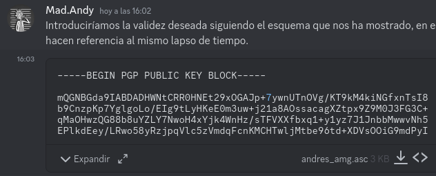
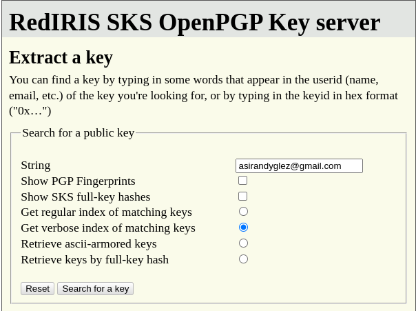
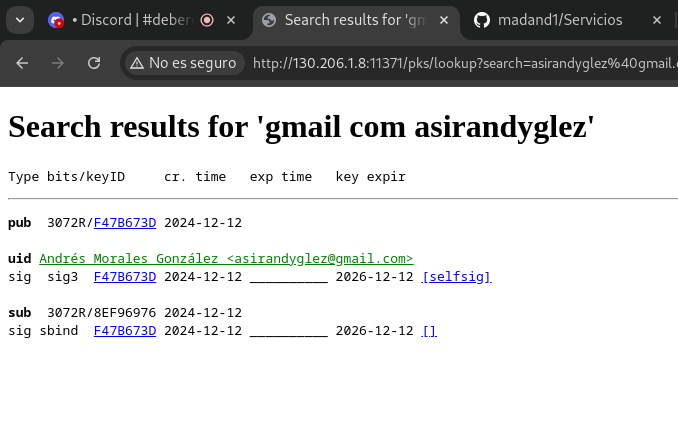

# Tarea 1: Generación de claves (gpg).

## Genera un par de claves (pública y privada). ¿En que directorio se guarda las claves de un usuario?

Para generar el par de claves haremos uso de la opción ```--gen-key``` de *gpg*:

```
madandy@toyota-hilux:~$ 
gpg --gen-key
gpg (GnuPG) 2.2.40; Copyright (C) 2022 g10 Code GmbH
This is free software: you are free to change and redistribute it.
There is NO WARRANTY, to the extent permitted by law.

Nota: Usa "gpg --full-generate-key" para el diálogo completo de generación de clave.

GnuPG debe construir un ID de usuario para identificar su clave.

Nombre y apellidos: 

```

Lo primero que nos pedirá será nuestro nombre junto con los apellidos, logrando así tener una forma para identificar la clave sobre el resto. Introduciremos nuestro nombre y apellidos y continuaremos.

```
Nombre y apellidos: Andrés Morales González
```
Tras ello, nos pedirá también nuestra dirección de correo electronico asi que la introduciremos y continuaremos.

```
Dirección de correo electrónico: asirandyglez@gmail.com
Está usando el juego de caracteres 'utf-8'.
Ha seleccionado este ID de usuario:
    "Andrés Morales González <asirandyglez@gmail.com>"

¿Cambia (N)ombre, (D)irección o (V)ale/(S)alir? 
```
Una vez introducida dicha información, nos mostrará los datos y nos pedirá una confirmación. En caso de que los datos mostrados sean correctos, elegiremos la opción V.


```
¿Cambia (N)ombre, (D)irección o (V)ale/(S)alir? V
Es necesario generar muchos bytes aleatorios. Es una buena idea realizar
alguna otra tarea (trabajar en otra ventana/consola, mover el ratón, usar
la red y los discos) durante la generación de números primos. Esto da al
generador de números aleatorios mayor oportunidad de recoger suficiente
entropía.
```
Cuando lleguemos a este punto se nos pedirá una frase de paso para proteger nuestra ***clave privada***, así que la introduciremos dos veces y continuaremos para que comience la generación del par de claves. Tal y como se nos ha indicado en el mensaje, es aconsejable realizar alguna que otra tarea en nuestra máquina durante su generación.

```
gpg: creado el directorio '/home/madandy/.gnupg/openpgp-revocs.d'
gpg: certificado de revocación guardado como '/home/madandy/.gnupg/openpgp-revocs.d/AA989A5B6AEC4D0C4F5C877ED3D72D48F47B673D.rev'
claves pública y secreta creadas y firmadas.

pub   rsa3072 2024-12-12 [SC] [caduca: 2026-12-12]
      AA989A5B6AEC4D0C4F5C877ED3D72D48F47B673D
uid                      Andrés Morales González <asirandyglez@gmail.com>
sub   rsa3072 2024-12-12 [E] [caduca: 2026-12-12]
```

Nuestro par de claves ya se encuentra generado y añadido con confianza absoluta a nuestro keyring ***pubring.kbx***, que se encuentra almacenado en nuestro directorio personal, dentro de un directorio de nombre ***.gnupg/***. Además, ha generado de forma automática un certificado de revocación dentro de ***.gnupg/openpgp-revocs.d/*** por si nuestra clave privada llegase a malas manos o simplemente quisiésemos dejar de utilizar dicho par de claves, de manera que se notificará a otros usuarios que la clave pública no debe ser usada nunca más para cifrar.

## Lista las claves públicas que tienes en tu almacén de claves. Explica los distintos datos que nos muestra. ¿Cómo deberías haber generado las claves para indicar, por ejemplo, que tenga un 1 mes de validez?

Para listar las claves públicas haremos uso de la opción ```--list-keys``` de gpg:

```
madandy@toyota-hilux:~$ 
gpg --list-keys
/home/madandy/.gnupg/pubring.kbx
--------------------------------
pub   rsa3072 2024-12-12 [SC] [caduca: 2026-12-12]
      AA989A5B6AEC4D0C4F5C877ED3D72D48F47B673D
uid        [  absoluta ] Andrés Morales González <asirandyglez@gmail.com>
sub   rsa3072 2024-12-12 [E] [caduca: 2026-12-12]


```

En lugar de explicar ahora los datos que nos ha mostrado, vamos a esperar al siguiente ejercicio y así podemos hacer una explicación más completa y detallada sobre la información que se está mostrando.

Para generar claves con una determinada validez, tendríamos que haber hecho uso de la opción ```--full-gen-key``` de **gpg**, donde nos habríamos encontrado un mensaje de la siguiente forma:

Lo primero que tendriamos que hacer es elegir el tipo de clave que vamos a querer, por defecto elegiremos el primero, ya que es RSA:

```
madandy@toyota-hilux:~$ 
gpg --full-generate-key
gpg (GnuPG) 2.2.40; Copyright (C) 2022 g10 Code GmbH
This is free software: you are free to change and redistribute it.
There is NO WARRANTY, to the extent permitted by law.

Por favor seleccione tipo de clave deseado:
   (1) RSA y RSA (por defecto)
   (2) DSA y ElGamal
   (3) DSA (sólo firmar)
   (4) RSA (sólo firmar)
  (14) Existing key from card
Su elección: 
las claves RSA pueden tener entre 1024 y 4096 bits de longitud.
```
Lo segundo que nos apareceria por pantalla es el tamaño de la clave como ya la tengo hecha con anterioridad elegire los valores por defectos:

```
¿De qué tamaño quiere la clave? (3072) 
El tamaño requerido es de 3072 bits
```

Y ahora es cuando viene el tiempo de validez para dicha clave, y aqui podemos especificar su tiempo:

```
Por favor, especifique el período de validez de la clave.
         0 = la clave nunca caduca
      <n>  = la clave caduca en n días
      <n>w = la clave caduca en n semanas
      <n>m = la clave caduca en n meses
      <n>y = la clave caduca en n años
¿Validez de la clave (0)? 
```
Introduciríamos la validez deseada siguiendo el esquema que nos ha mostrado, en este caso, para que tenga un mes de validez, podríamos haber indicado ***30***, ***4w*** o ***1m***, pues todas hacen referencia al mismo lapso de tiempo.


## Lista las claves privadas de tu almacén de claves.

Para listar las claves privadas haremos uso de la opción ```--list-secret-keys``` de *gpg*:

```
madandy@toyota-hilux:~$ 
gpg --list-secret-keys
/home/madandy/.gnupg/pubring.kbx
--------------------------------
sec   rsa3072 2024-12-12 [SC] [caduca: 2026-12-12]
      AA989A5B6AEC4D0C4F5C877ED3D72D48F47B673D
uid        [  absoluta ] Andrés Morales González <asirandyglez@gmail.com>
ssb   rsa3072 2024-12-12 [E] [caduca: 2026-12-12]

```
### Explicación de las abreviaturas devueltas por los comandos

#### Claves públicas
Cuando listamos las claves públicas usando `gpg --list-keys`, obtenemos las siguientes abreviaturas:

- **pub**: Clave primaria pública.
- **uid**: Identificador único del usuario (User-ID).
- **sub**: Clave secundaria pública.

#### Claves privadas
Al listar las claves privadas con `gpg --list-secret-keys`, observamos estas abreviaturas:

- **sec**: Clave primaria privada (secreta).
- **uid**: Identificador único del usuario (User-ID).
- **ssb**: Clave secundaria privada (secreta).

#### Funcionamiento de las claves
En criptografía asimétrica, siempre trabajamos con pares de claves:
- **Clave pública**: Se utiliza para encriptar mensajes y verificar firmas.
- **Clave privada (secreta)**: Se utiliza para desencriptar mensajes y firmar.

Cuando generamos un par de claves OpenPGP con GnuPG, por defecto se crea:
1. **Un par de claves primario (master-key)**:
   - Contiene uno o más User-IDs (nombre, apellidos y correo electrónico).
   - Se utiliza para firmar y verificar firmas como prueba de identidad.
   - Es crucial proteger su clave privada.

2. **Un par de claves secundario**:
   - Está firmado por el par de claves primario, confirmando su asociación con el User-ID.
   - Se utiliza para encriptar y desencriptar información.

El propósito de esta estructura es permitir que las claves secundarias puedan revocarse de forma independiente, o almacenarse por separado. En otras palabras, aunque son claves independientes, están asociadas al par de claves maestro.

#### Relación entre las claves
Al ejecutar los comandos, podemos entender mejor la información mostrada:
- `gpg --list-keys`: Muestra claves públicas del par maestro (**pub**) y del par secundario (**sub**).
- `gpg --list-secret-keys`: Muestra claves privadas del par maestro (**sec**) y del par secundario (**ssb**).

En ambos casos, se incluye un **uid**, que corresponde al User-ID asociado a las claves.

#### Detalles mostrados
Además de las abreviaturas, los comandos muestran:
- El algoritmo utilizado (por ejemplo, `rsa3072`).
- La fecha de creación de la clave (por ejemplo, `2024-12-12`).
- Las banderas o **flags**.
- La fecha de caducidad de la clave (por ejemplo, `2025-12-12`).

#### Significado de los flags
- **S**: Firma de archivos (**Signing**).
- **C**: Certificación de claves (**Certify**).
- **A**: Autenticación en sistemas (**Authenticate**).
- **E**: Encriptación de información (**Encrypt**).

En este contexto:
- El par de claves maestro tiene los flags **[SC]**, indicando que se utiliza para firmar y verificar firmas.
- El par de claves secundario tiene el flag **[E]**, lo que indica que se utiliza para encriptar y desencriptar información.

#### Conclusión
El diseño de los pares de claves en GnuPG permite una separación clara de responsabilidades:
- **Par de claves maestro**: Firmar y certificar claves.
- **Par de claves secundario**: Encriptar y desencriptar información.

De esta forma, los pares de claves ofrecen flexibilidad y seguridad al manejar las tareas de cifrado y firma de datos.

# Tarea 2: Importar/exportar clave pública (gpg).

## Exporta tu clave pública en formato ASCII, guárdalo en un archivo “nombre_apellido.asc” y envíalo al compañero con el que vas a hacer esta práctica.

Para exportar nuestras claves públicas haremos uso de la opción --export de gpg junto con la opción ***-a <nombre>***, para posteriormente redireccionar la salida a un fichero. En este caso, el nombre que debemos introducir es el mismo que hemos introducido a la hora de generar el par de claves. El comando a ejecutar sería:

```
madandy@toyota-hilux:~$ 
gpg --export -a "Andrés Morales González" > andres_amg.asc
```

Como podemos ver este comando no nos ha devuelto ninguna salida por pantalla por lo que vamso a comprobarlo haciendo un ```ls```:

```
madandy@toyota-hilux:~$ 
ls
andres_amg.asc  Escritorio       GNS3      iso     Nextcloud             pools       Servicios  vagrant
Descargas       examen24-25.sql  homebrew  kernel  oracle_vbox_2016.asc  prueba.txt  snap       Vídeos
Documentos      gems             Imágenes  Música  Plantillas            Público     themes     win10.qcow2

```
Efectivamente, las claves públicas se encuentran correctamente exportadas dentro del fichero ***andres_amg.asc***.

Esta practica la he realizado junto a *Alejandro Liañez Frutos*, por lo que le he paso mi clave a través de una plataforma de comunicación:



## Importa las claves públicas recibidas de vuestro compañero.

Ahora me bajo la calve publica de mi compañero Alejandro:


Para importar las claves públicas de nuestro compañero haremos uso de la opción ```--import <fichero>``` de gpg. En este caso, el fichero que debemos introducir es el que acabamos de recibir, es decir, ***alejandro_alf.asc***. El comando a ejecutar sería:

```
madandy@toyota-hilux:~$ 
gpg --import alejandro_alf.asc 
gpg: clave 9E7BEEE532BE0469: clave pública "Alejandro Liáñez Frutos <alejandroliafru@gmail.com>" importada
gpg: Cantidad total procesada: 1
gpg:               importadas: 1
```

Como podemos observar, nos ha devuelto un mensaje por pantalla informando que las claves públicas de Alejandro han sido correctamente importadas.


## Comprueba que las claves se han incluido correctamente en vuestro keyring.

De nuevo, volveremos a hacer uso de opción ```--list-keys``` de gpg (ya que no tendría sentido usar la opción ```--list-secret-keys```, pues lo que hemos importado son claves públicas, no privadas) para verificar que las claves públicas han sido correctamente importadas a nuestro keyring:

```
madandy@toyota-hilux:~$ 
gpg --list-keys
/home/madandy/.gnupg/pubring.kbx
--------------------------------
pub   rsa3072 2024-12-12 [SC] [caduca: 2026-12-12]
      AA989A5B6AEC4D0C4F5C877ED3D72D48F47B673D
uid        [  absoluta ] Andrés Morales González <asirandyglez@gmail.com>
sub   rsa3072 2024-12-12 [E] [caduca: 2026-12-12]

pub   rsa3072 2024-12-12 [SC] [caduca: 2026-12-12]
      B39722468D0599C3B62F9AEA9E7BEEE532BE0469
uid        [desconocida] Alejandro Liáñez Frutos <alejandroliafru@gmail.com>
sub   rsa3072 2024-12-12 [E] [caduca: 2026-12-12]
```

Y efectivamente, las claves públicas de Alejandro han sido correctamente importadas a nuestro keyring en ***.gnupg/pubring.kbx***.

# Tarea 3: Cifrado asimétrico con claves públicas (gpg).

## Cifraremos un archivo cualquiera y lo remitiremos por email a uno de nuestros compañeros que nos proporcionó su clave pública.

En este caso, hemos creado un fichero .txt de nombre archivo.txt que es el que voy a encriptar con la clave pública de mi compañero para posteriormente enviárselo. Para cifrar haremos uso de la opción -e de gpg junto con la ```opción -u <remitente>``` y la ````opción -r <destinatario>````, para posteriormente indicar el fichero a cifrar. En este caso, el remitente sería yo y el destinatario, Alejandro, de manera que introduciendo su nombre como destinatario, buscará entre las claves públicas existentes y usará la suya, para que no haya confusión. El comando a ejecutar sería:

```
madandy@toyota-hilux:~$ 
gpg --output archivo_cifrado.gpg --encrypt --recipient "Alejandro Liáñez Frutos" archivo.txt
gpg: 0E4BC9F6F259E1BA: No hay seguridad de que esta clave pertenezca realmente
al usuario que se nombra

sub  rsa3072/0E4BC9F6F259E1BA 2024-12-12 Alejandro Liáñez Frutos <alejandroliafru@gmail.com>
 Huella clave primaria: B397 2246 8D05 99C3 B62F  9AEA 9E7B EEE5 32BE 0469
      Huella de subclave: C0E8 F117 FBB5 7488 E46A  B441 0E4B C9F6 F259 E1BA

No es seguro que la clave pertenezca a la persona que se nombra en el
identificador de usuario. Si *realmente* sabe lo que está haciendo,
puede contestar sí a la siguiente pregunta.

¿Usar esta clave de todas formas? (s/N) s
```

Tras mostrarnos una advertencia de seguridad y confirmar que queremos usar dicha clave, el fichero ya se encontrará cifrado, por lo que vamos a proceder a ejecutar el correspondiente comando para asegurarnos de que así ha sido:

```
madandy@toyota-hilux:~$ 
ls -l | egrep archivo
-rw-r--r--  1 madandy madandy         525 dic 12 16:21 archivo_cifrado.gpg
-rw-r--r--  1 madandy madandy          66 dic 12 16:19 archivo.txt
```

Como se puede apreciar ahora tenemos dos ficheros, el original (***archivo.pdf***) y el cifrado (***archivo.pdf.gpg***), que cuenta con la _**extensión**_ **.gpg**.

Y ahora nos lo enviaremos a través de Discord.

## Nuestro compañero, a su vez, nos remitirá un archivo cifrado para que nosotros lo descifremos.

En este caso, he recibido un fichero cifrado de nombre archivo_cifrado_de_alejandro.gpg por parte de Alejandro a través de discord.


## Tanto nosotros como nuestro compañero comprobaremos que hemos podido descifrar los mensajes recibidos respectivamente.

Para descifrar haremos uso de la opción -d de gpg, para posteriormente indicar el fichero a descifrar. En este caso, el fichero a descifrar sería el que acabamos de recibir por parte de Alejandro, es decir, archivo_cifrado_de_alejandro.gpg.gpg. El comando a ejecutar sería:

```
gpg -d archivo_cifrado_de_alejandro.gpg 
```

Nos parecera por pantalla la frase que metimos antes, y nos devolvera lo siguiente por pantalla:

```
madandy@toyota-hilux:~/Descargas$ 
gpg -d archivo_cifrado_de_alejandro.gpg 
gpg: cifrado con clave de 3072 bits RSA, ID 923AF5638EF96976, creada el 2024-12-12
      "Andrés Morales González <asirandyglez@gmail.com>"
Hola Andrés, este es el archivo de la Tarea 3 de la práctica.
madandy@toyota-hilux:~/Descargas$ 
```
Esto se debe a que es un texto plano, pero si fuera un *PDF* lo que tendriamos que hacer para visualizarlo correctamente es volver a ejecutar el comando pero esta vez, redirigiendo la salida a un fichero de formato .pdf (por ejemplo, a uno de nombre desencriptado.pdf), de la siguiente manera:

```
gpg -d espartaco.pdf.gpg > desencriptado.pdf
```
##  Por último, enviaremos el documento cifrado a alguien que no estaba en la lista de destinatarios y comprobaremos que este usuario no podrá descifrar este archivo.

Para este punto he pedido ayuda a Andrea Santos, la cual le enviamos los ficheros tanto Alejandro Liañez como yo, la cual tiene los archivos cifrados, y al tratar de descifrarlo, le sale el siguiente error por pantalla:

```
andrea@Andrea:~/Descargas$ gpg -d archivo_cifrado_de_andres.gpg 
gpg: cifrado con clave RSA, ID 0E4BC9F6F259E1BA
gpg: descifrado fallido: No secret key
```

## Para terminar, indica los comandos necesarios para borrar las claves públicas y privadas que posees.

Es importante mencionar que en caso de que no vayamos a usar más un par de claves, sería recomendable revocarlo primero, pero en este caso vamos a aprender a eliminarlo únicamente.

Es necesario seguir un determinado orden a la hora de llevar a cabo la eliminación de dicho par de claves, ya que de lo contrario, nos devolverá un error. Primero hay que eliminar la clave privada y posteriormente, la clave pública.

Para eliminar la clave privada haremos uso de la opción ````--delete-secret-key <nombre>```` de gpg. En este caso, el nombre que debemos introducir es el mismo que hemos introducido a la hora de generar el par de claves. 

El comando a ejecutar sería:

```
madandy@toyota-hilux:~$ 
gpg --delete-secret-key "Andrés Morales González"
gpg (GnuPG) 2.2.40; Copyright (C) 2022 g10 Code GmbH
This is free software: you are free to change and redistribute it.
There is NO WARRANTY, to the extent permitted by law.


sec  rsa3072/D3D72D48F47B673D 2024-12-12 Andrés Morales González <asirandyglez@gmail.com>

¿Eliminar esta clave del anillo? (s/N) s
¡Es una clave secreta! ¿Eliminar realmente? (s/N) s
```

Tras un par de confirmaciones, nuestra clave privada se encontrara eliminada, así que por último, vamos a eliminar la clave pública. Para ello, haremos uso de la opción ```--delete-key <nombre>``` de gpg. En este caso, el nombre que debemos introducir es el mismo que hemos introducido a la hora de generar el par de claves. El comando a ejecutar sería:

```
madandy@toyota-hilux:~$ 
gpg --delete-key "Andrés Morales González"
gpg (GnuPG) 2.2.40; Copyright (C) 2022 g10 Code GmbH
This is free software: you are free to change and redistribute it.
There is NO WARRANTY, to the extent permitted by law.


pub  rsa3072/D3D72D48F47B673D 2024-12-12 Andrés Morales González <asirandyglez@gmail.com>

¿Eliminar esta clave del anillo? (s/N) s
```
Listo. Nuestro par de claves ya se encuentra eliminado, pero para verificarlo, volveremos a ejecutar los comandos:

```
madandy@toyota-hilux:~$ 
gpg --list-keys
gpg: comprobando base de datos de confianza
gpg: no se encuentran claves absolutamente fiables
/home/madandy/.gnupg/pubring.kbx
--------------------------------
pub   rsa3072 2024-12-12 [SC] [caduca: 2026-12-12]
      B39722468D0599C3B62F9AEA9E7BEEE532BE0469
uid        [desconocida] Alejandro Liáñez Frutos <alejandroliafru@gmail.com>
sub   rsa3072 2024-12-12 [E] [caduca: 2026-12-12]
```
Ahora listamos lo que sería las claves, para ver si están:

```
madandy@toyota-hilux:~$ 
gpg --list-secret-keys

```

Como se puede apreciar, no ha quedado ningún rastro de nuestro par de claves, la única clave existente actualmente en nuestra máquina es la clave pública de Alejandro.

# Tarea 4: Exportar clave a un servidor público de claves PGP (gpg).

## Genera la clave de revocación de tu clave pública para utilizarla en caso de que haya problemas.

En realidad, gpg ha generado una clave de revocación de forma automática cuando se generó el par de claves, pero para mostrarlo, vamos a generar uno nuevo. Para ello, haremos uso de la opción ```--gen-revoke <ID>``` de gpg. En este caso, el ID que debemos introducir es aquel identificador (comunmente conocido como fingerprint) de 40 dígitos que encontramos al ejecutar el comando gpg ```--list-keys```, aunque si especificamos los últimos 8 dígitos del mismo también sería válido. El comando a ejecutar sería:

```
madandy@toyota-hilux:~/Descargas$ 
gpg --gen-revoke "Andrés Morales González" 

sec  rsa3072/D3D72D48F47B673D 2024-12-12 Andrés Morales González <asirandyglez@gmail.com>

¿Crear un certificado de revocación para esta clave? (s/N) s
Por favor elija una razón para la revocación:
  0 = No se dio ninguna razón
  1 = La clave ha sido comprometida
  2 = La clave ha sido reemplazada
  3 = La clave ya no está en uso
  Q = Cancelar
(Probablemente quería seleccionar 1 aquí)
¿Su decisión? 
Introduzca una descripción opcional; acábela con una línea vacía:
> 
Razón para la revocación: La clave ha sido comprometida
(No se dió descripción)
¿Es correcto? (s/N) s
se fuerza salida con armadura ASCII.
-----BEGIN PGP PUBLIC KEY BLOCK-----
Comment: This is a revocation certificate

iQG2BCABCgAgFiEEqpiaW2rsTQxPXId+09ctSPR7Zz0FAmdbBXACHQIACgkQ09ct
SPR7Zz0qCQv/cAon7WUks7u/yqHsFUeoCj44WgOkcQsioIcCzouJJBJO7Dr9FVWs
eS10KOW0NxrMl44t/eeNbmjkWN2uIuooxwTdU0gjUpSXXVRLtwUJqm8yTOkvhqSm
XzHTSaJ/AKs5dIUu8DyZgtsnb+XiOhZHtpwQdscmibCrTtCRNp66aZuibgvI9AZY
RGtJvZT50tN1Yub9RLiz8JHO4jgi+P2sgUqYrsJqj1TGfe44Wg0XoBbfof32Es2U
YxS4wRMeBolCU8J0TPVpVEbjCjALTDoglgSlBPItBBCd6FDdSqS5gjiymmIfjyYi
5rDWzN8VZ4HVrdnwRWccXx4EiHOxSiB56RplpvmdhRS/JXn009Ph1d7fzQFHhiex
If2eAw1AYHx8dqhG/Pamn75fw+MedCSWhJdO9RQmY0G98fQQlfXPQ1b2TU9BZi0E
YSgYS8kOEF1//GKouI/1l0ECvthryXY4KGz61esyii+P4MEwEk0Tnh3MhWsAO8ne
w0nvjRU9dsDc
=CVmZ
-----END PGP PUBLIC KEY BLOCK-----
Certificado de revocación creado.

Por favor consérvelo en un medio que pueda esconder; si alguien consigue
acceso a este certificado puede usarlo para inutilizar su clave.
Es inteligente imprimir este certificado y guardarlo en otro lugar, por
si acaso su medio resulta imposible de leer. Pero precaución: ¡el sistema
de impresión de su máquina podría almacenar los datos y hacerlos accesibles
a otras personas!

```
El certificado de revocación es aquello contenido entre **—–BEGIN PGP PUBLIC KEY BLOCK—– y —–END PGP PUBLIC KEY BLOCK—–**, por lo que es necesario guardarlo en un lugar seguro por si en algún momento necesitásemos revocar nuestro par de claves (soy consciente de que estoy mostrando el certificado, pero no es algo relevante, pues el par de claves fue generado únicamente para la práctica y ya ha sido revocado).


## Exporta tu clave pública al servidor pgp.rediris.es.


Para exportar la clave pública a un servidor de claves públicas haremos uso de la opción ```--keyserver <servidor>``` de gpg junto con la opción ```--send-key <ID>```. En este caso, el servidor que debemos introducir es pgp.rediris.es y el ID es aquel identificador (fingerprint) de 40 dígitos que encontramos al ejecutar el comando gpg ```--list-keys```, aunque si especificamos los últimos 8 dígitos del mismo también sería válido. El comando a ejecutar sería:

```
madandy@toyota-hilux:~/Descargas$ 
gpg --keyserver pgp.rediris.es --send-key  AA989A5B6AEC4D0C4F5C877ED3D72D48F47B673D
gpg: enviando clave D3D72D48F47B673D a hkp://pgp.rediris.es

```

Nuestra clave ya ha sido enviada al servidor de claves públicas pgp.rediris.es, pero para verificarlo, vamos a acceder al mismo mediante el navegador. Dentro, encontraremos un apartado para buscar claves públicas introduciendo un string, que puede ser nuestro nombre o nuestro correo electrónico, por ejemplo. 

En este caso, voy a introducir mi correo electrónico:



Tras ello, pulsaremos en ***“Search for a key”*** para ver los resultados y así verificar que la clave pública se encuentra correctamente subida:



Como se puede apreciar, ha aparecido una coincidencia referente a la clave que acabamos de subir, por lo que podemos concluir que la subida se ha completado satisfactoriamente.

## Borra la clave pública de alguno de tus compañeros de clase e impórtala ahora del servidor público de rediris.

Tal y como hemos visto en uno de los ejercicios anteriores, para eliminar una clave pública de nuestro keyring, haremos uso de la opción ```--delete-key <nombre>``` de gpg. En este caso, el nombre que debemos introducir es el de Alejandro.

El comando a ejecutar sería:

```
madandy@toyota-hilux:~/Descargas$ 
gpg --delete-key "Alejandro Liáñez Frutos"
gpg (GnuPG) 2.2.40; Copyright (C) 2022 g10 Code GmbH
This is free software: you are free to change and redistribute it.
There is NO WARRANTY, to the extent permitted by law.


pub  rsa3072/9E7BEEE532BE0469 2024-12-12 Alejandro Liáñez Frutos <alejandroliafru@gmail.com>

¿Eliminar esta clave del anillo? (s/N) s
```

Listo. La clave pública de Alejandro ya se encuentra eliminada, pero para verificarlo, volveremos a ejecutar el comando:

```
madandy@toyota-hilux:~/Descargas$ 
gpg --list-keys
/home/madandy/.gnupg/pubring.kbx
--------------------------------
pub   rsa3072 2024-12-12 [SC] [caduca: 2026-12-12]
      AA989A5B6AEC4D0C4F5C877ED3D72D48F47B673D
uid        [  absoluta ] Andrés Morales González <asirandyglez@gmail.com>
sub   rsa3072 2024-12-12 [E] [caduca: 2026-12-12]
```

Como podemos ver no hay registro de ninguna clave pública.

Una vez que la clave pública ha sido totalmente eliminada, es hora de volver a importarla, pero esta vez, desde el servidor de claves públicas. Para ello, haremos uso de la opción ```--keyserver <servidor>``` de gpg junto con la opción ```--recv-keys <ID>```. En este caso, el servidor que debemos introducir es pgp.rediris.es y el ID es aquel identificador (fingerprint) de 40 dígitos de la clave de Alejandro, aunque si especificamos los últimos 8 dígitos del mismo también sería válido. 

El comando a ejecutar sería:

```
madandy@toyota-hilux:~/Descargas$ 
gpg --keyserver pgp.rediris.es --search-keys "alejandroliafru@gmail.com"
gpg: data source: http://130.206.1.8:11371
(1)	Alejandro Liáñez Frutos <alejandroliafru@gmail.com>
	  3072 bit RSA key 9E7BEEE532BE0469, creado: 2024-12-12, caduca: 2026-12-12
Introduzca número(s), O)tro, o F)in > 
```
Y nos quedamos con la key: ***9E7BEEE532BE0469***
```
madandy@toyota-hilux:~/Descargas$ 
gpg --keyserver pgp.rediris.es --recv-keys 9E7BEEE532BE0469
gpg: clave 9E7BEEE532BE0469: clave pública "Alejandro Liáñez Frutos <alejandroliafru@gmail.com>" importada
gpg: Cantidad total procesada: 1
gpg:               importadas: 1

```

Y vamos a listarla pata ver si esta:

```
madandy@toyota-hilux:~/Descargas$ 
gpg --list-keys
/home/madandy/.gnupg/pubring.kbx
--------------------------------
pub   rsa3072 2024-12-12 [SC] [caduca: 2026-12-12]
      AA989A5B6AEC4D0C4F5C877ED3D72D48F47B673D
uid        [  absoluta ] Andrés Morales González <asirandyglez@gmail.com>
sub   rsa3072 2024-12-12 [E] [caduca: 2026-12-12]

pub   rsa3072 2024-12-12 [SC] [caduca: 2026-12-12]
      B39722468D0599C3B62F9AEA9E7BEEE532BE0469
uid        [desconocida] Alejandro Liáñez Frutos <alejandroliafru@gmail.com>
sub   rsa3072 2024-12-12 [E] [caduca: 2026-12-12]


```
Y como podemos ver, la clave de Alejandro ha vuelto a ser importada satisfactoriamente a nuestro ***keyring*** y ya podemos volver a hacer uso de la misma para cifrar ficheros.


# Tarea 5: Cifrado asimétrico con openssl.

## Generar un par de claves (públicidad y privadad)

Para generar el par de claves vamos a hacer uso del algoritmo RSA, por lo que tendremos que indicar la opción genrsa. Además, vamos a hacer que la clave privada tenga que ser desbloqueada haciendo uso de una frase de paso, que utilizará el algoritmo AES128, por lo que tendremos que indicar la opción -aes256. Este par de claves se generará en un único fichero .pem, por lo que para indicar dicho fichero, haremos uso de la opción -out <fichero>. En este caso, el fichero de salida será key.pem. Por último, especificaremos el tamaño de la clave, que es recomendable que sea de al menos 2048 bits. El comando a ejecutar sería:

```
madandy@toyota-hilux:~$ 
openssl genpkey -algorithm RSA -out key.pem -aes256
........+..........+..+...+....+...+..+.+++++++++++++++++++++++++++++++++++++++++++++++++++++++++++++++++*........+....+...+++++++++++++++++++++++++++++++++++++++++++++++++++++++++++++++++*..+.......+...+..+.............+...............+..+....+...............+.....+.........+....+..+.+.....+...+.......+...+.....+.......+..+.......+...+........+...+.+......+...+..+.............+.....+.+......+.................+...+....+.....+.............+....................+.+.....+.+......+.........+.........+.....+.........+.+......+.....+..........+...+..+...............+....+......+...+........+...+.+.........+...........+.+..+............+......+...+....+..+..........+...+..+......+...+....+....................+.+.....+.......+...+.....+..........+...........+.+..+.............+..+.......+.........+.........+.....+...+.........+...+......+.........+...+++++++++++++++++++++++++++++++++++++++++++++++++++++++++++++++++
.................+...+++++++++++++++++++++++++++++++++++++++++++++++++++++++++++++++++*.+.+...+..+...+......+++++++++++++++++++++++++++++++++++++++++++++++++++++++++++++++++*..+..+.+.....+....+..+.........+.......+.....+...+.........+.+...........+...+...+....+...+...........+.+...+.....+.......+..............+.+...+........+....+++++++++++++++++++++++++++++++++++++++++++++++++++++++++++++++++
Enter PEM pass phrase:
Verifying - Enter PEM pass phrase:
```
Tras habernos preguntado en dos ocasiones la frase de paso que queremos utilizar, el par de claves habrá sido generado en un fichero .pem, pero para verificarlo, vamos a listar el contenido del directorio actual con el comando ls:

```
madandy@toyota-hilux:~$ 
ls
alejandro_alf.asc              Descargas        gems      iso      Nextcloud             pools       snap     win10.qcow2
andres_amg.asc                 Documentos       GNS3      kernel   oracle_vbox_2016.asc  prueba.txt  themes
archivo_cifrado_de_andres.gpg  Escritorio       homebrew  key.pem  Plantillas            Público     vagrant
archivo.txt                    examen24-25.sql  Imágenes  Música   Plan-v2.pdf           Servicios   Vídeos
```

Y como podemos ver, así ha sido. El par de claves se ha generado correctamente con nombre ***key.pem***.

##  Envía tu clave pública a un compañero

Dado que openssl genera el par de claves (tanto privada como pública) en un mismo fichero, tendremos que llevar a cabo la extracción de la clave pública para enviársela a nuestro compañero, ya que no es un procedimiento seguro el enviar el fichero directamente. Para ello, haremos uso de la opción ***-in <pardeclaves>*** para indicar el par de claves del que queremos extraer la clave pública, junto con la opción -pubout para indicar que extraiga la clave pública y la opción ***-out <ficherosalida>*** para extraer la clave a un fichero .public.pem. Además, tendremos que indicar el algoritmo, en este caso, rsa. En este caso, el pardeclaves será key.pem y el ficherosalida será key.public.pem. 

El comando a ejecutar sería:

```
madandy@toyota-hilux:~$ 
sudo openssl rsa -in key.pem -pubout -out key.public.pem
Enter pass phrase for key.pem:
writing RSA key
```

Nos ha solicitado la frase de paso y a continuación ha generado el fichero con la clave pública. Para verificarlo, vamos a leer el contenido haciendo uso del comando ***cat <fichero>***:

```
madandy@toyota-hilux:~$ 
cat key.public.pem 
-----BEGIN PUBLIC KEY-----
MIIBIjANBgkqhkiG9w0BAQEFAAOCAQ8AMIIBCgKCAQEAjCLJHijHMbi/ZWz6F+Av
QugqtoESRiD5xZcT7m7UrsC+5bOXojORWdn2AZKZ7DslJ1s5Hjqkv+Neh+/4/5dV
QLtYl1b6Cxy/nkBX3VuiN59HGxRpKAQ7kpWlbwdKkaELGrQtJa1nsHk848zUkFQ8
IkFG0m1FzKX45CKGw8fvxIjvxUOvCcXF5hgg3SRujCg/Rz2aHopLBfKS0xNAo3+f
io0SV2PZoFJg+rMJYT5/dpeh63eAVaTQ1rCJnqOvIX/K4jd+QR1rpXgh9DDIE3Ts
UV1xHc0YdC5zQ3QrvNc3658aSUoXe6umPE6qMZclorleNTKEH4eDShiVfYisC6ey
fQIDAQAB
-----END PUBLIC KEY-----
```

Efectivamente, así ha sido. La clave pública ha sido correctamente extraída, y se la enviaremos a nuetsro comapñero, y de la misma el nos la enviara.

## Utilizando la clave pública cifra un fichero de texto y envíalo a tu compañero.

Lo primero que tendremos que hacer será generar un fichero de texto con un determinado contenido que deseemos. En este caso, voy a hacer uso de echo para redirigir la salida a un fichero de texto (por ejemplo, a uno de nombre fichero.txt). El comando a ejecutar sería:

```echo "Esto es un fichero cifrado." > fichero.txt```

Tras ello, podremos proceder a cifrar dicho fichero. Para ello, haremos uso de la opción ***-encrypt*** junto con la opción ***-in <fichero>*** para indicar el fichero a encriptar, la opción ***-out <ficherosalida>*** para indicar el fichero de salida de la encriptación (.enc), la opción ***-inkey <clavepublica>*** para indicar la clave pública con la que cifrar y la opción -pubin para indicar que vamos a firmar con una clave pública. Además, tenemos que indicar que vamos a usar RSA para firmar, verificar, cifrar o descifrar, por lo que tendremos que introducir la opción rsautl. En este caso, el fichero de entrada sería fichero.txt, el fichero de salida será fichero.enc y la clave pública será la de Alejandro, es decir, ***pub-liañez.pem***. El comando a ejecutar sería:

```
madandy@toyota-hilux:~$ 
openssl pkeyutl -encrypt -in fichero.txt  -out fichero.enc -inkey pub-liañez.pem -pubin
```
Verifico:

```
madandy@toyota-hilux:~$ 
ls
alejandro_alf.asc              Documentos       gems      kernel          oracle_vbox_2016.asc  pub-liañez.pem  vagrant
andres_amg.asc                 Escritorio       GNS3      key.pem         Plantillas            Público         Vídeos
archivo_cifrado_de_andres.gpg  examen24-25.sql  homebrew  key.public.pem  Plan-v2.pdf           Servicios       win10.qcow2
archivo.txt                    fichero.enc      Imágenes  Música          pools                 snap
Descargas                      fichero.txt      iso       Nextcloud       prueba.txt            themes
```

##  Tu compañero te ha mandado un fichero cifrado, muestra el proceso para el descifrado

Para descifrar un fichero cifrado, haremos uso de la opción ***-decrypt*** junto con la opción ****-in <fichero>**** para indicar el fichero a desencriptar, la opción ***-out <ficherosalida>***  para indicar el fichero de salida de la desencriptación y la opción ***-inkey <claveprivada>*** para indicar la clave privada con la que descifrar. Además, tenemos que indicar que vamos a usar RSA para firmar, verificar, cifrar o descifrar, por lo que tendremos que introducir la opción rsautl. En este caso, el fichero de entrada sería documento_cifrado.bin, el fichero de salida será documento_cifrado.txt y la claveprivada será la que hemos generado anteriormente, es decir, ***key.pem***. 
El comando a ejecutar sería:

```
madandy@toyota-hilux:~$ 
sudo openssl pkeyutl -decrypt -in documento_cifrado.bin -out documento_cifrado.txt -inkey key.pem
Enter pass phrase for key.pem:
madandy@toyota-hilux:~$ 
cat documento_cifrado.txt
Este es un mensaje secreto.
madandy@toyota-hilux:~$ 
```

Efectivamente, el fichero ha sido correctamente desencriptado y podemos leer su contenido.

