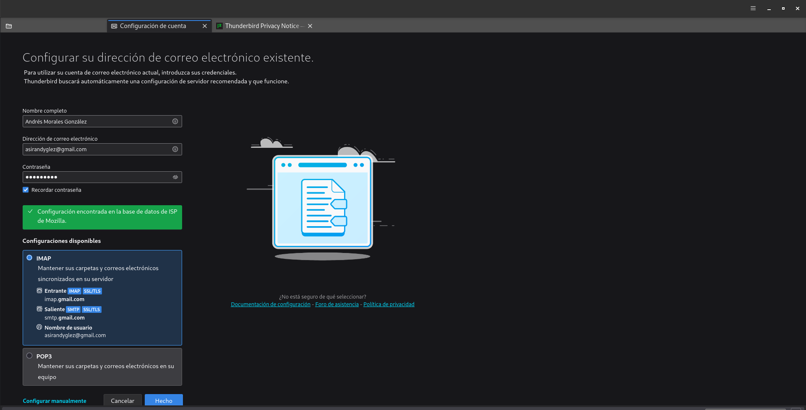
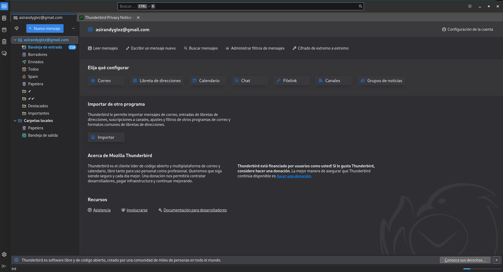
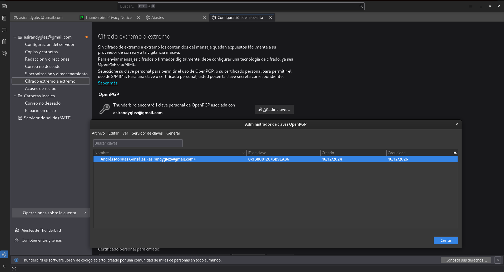
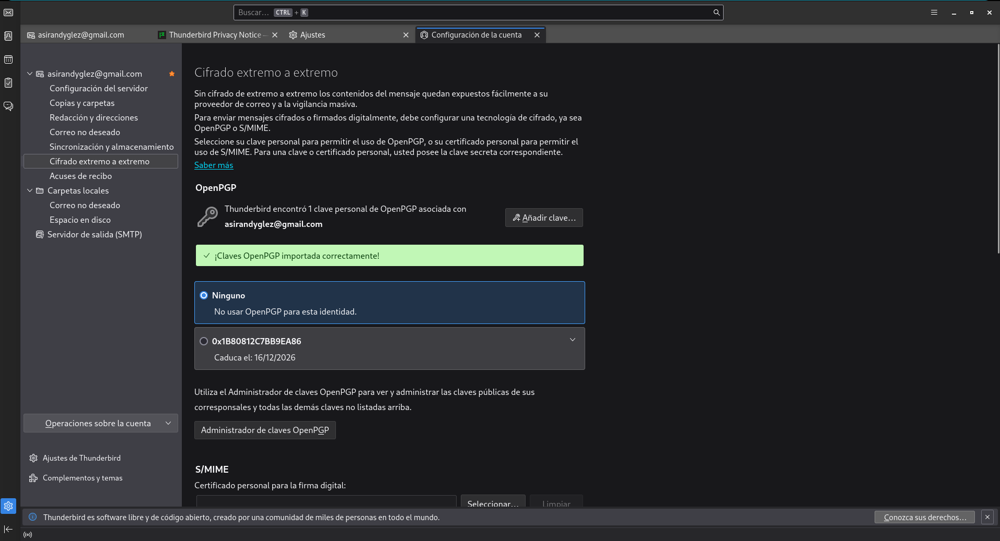
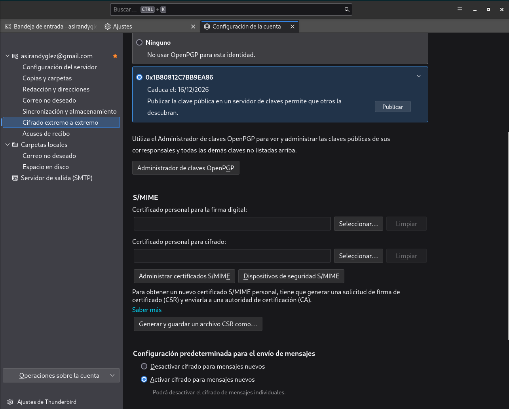
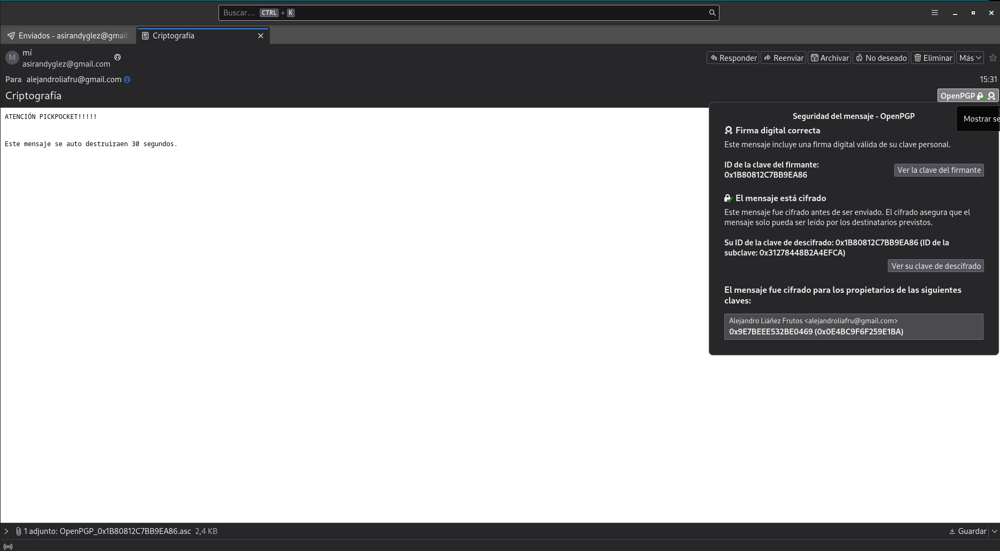
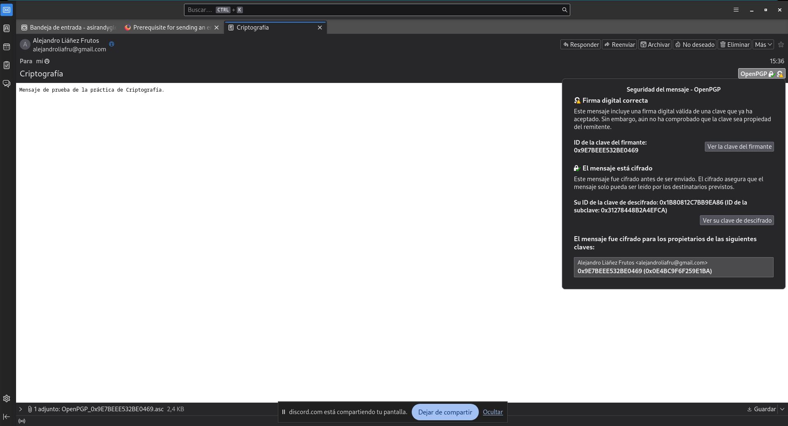
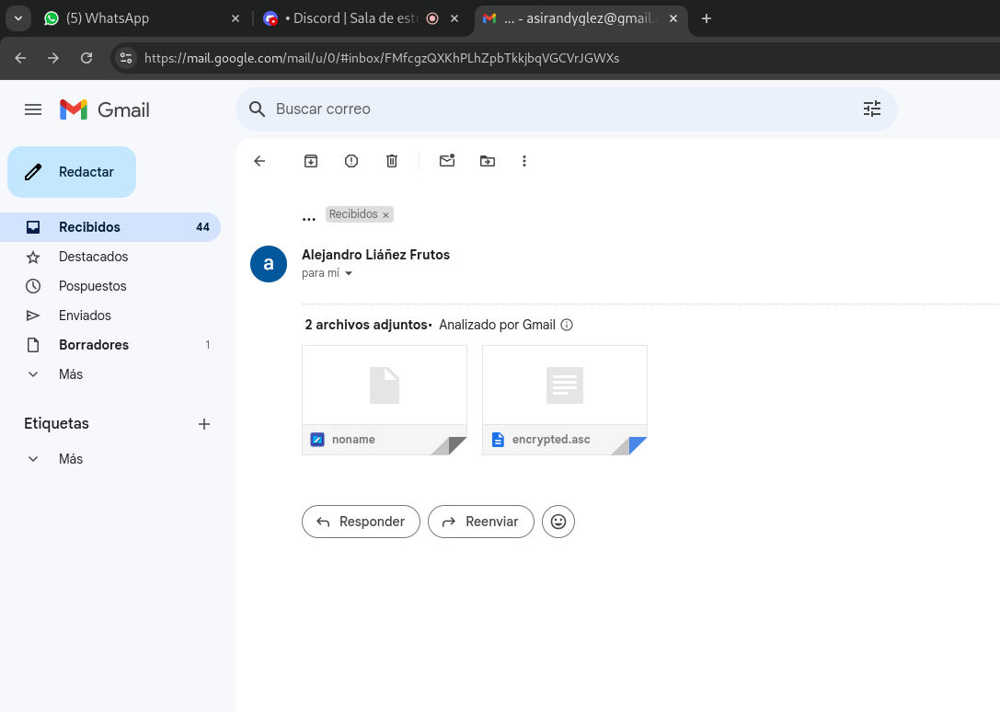
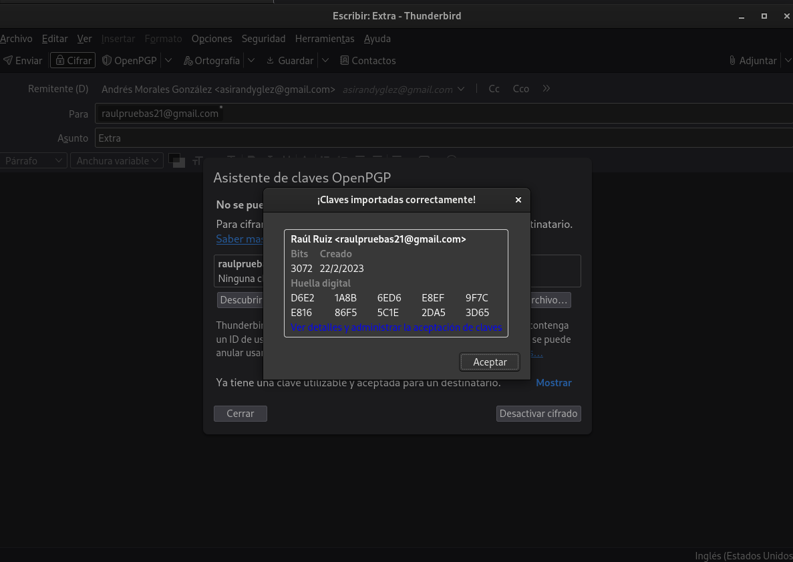
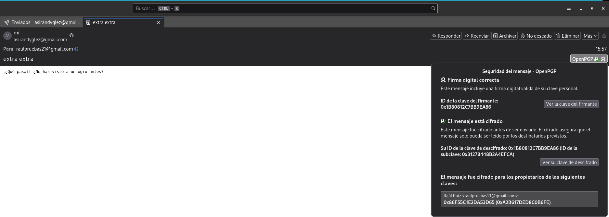

# Integridad, firmas y autenticación

Si vas a empezar esta práctica debes de tener los conceptos claros que explico en este [documento](Cifadro-Asimétrico.md), ya que sin este no podrás realizar esta práctica.

## Tarea 1: Firmas electrónicas

En este primer apartado vamos a trabajar con las firmas eléctronicas, por lo que vamos a apoyarnos en los siguientes enlaces:

- [Intercambio de claves](https://www.gnupg.org/gph/es/manual/x75.html)
- [Validación de otras claves en nuestro anillo de claves públicas](https://www.gnupg.org/gph/es/manual/x354.html)
- [Firmado de claves (Debian)](https://www.debian.org/events/keysigning.es.html)


### Manda un documento y la firma electrónica del mismo a un compañero. Verifica la firma que tú has recibido.

Para esta tarea voy a previsualizar las claves que tengo en mi ***keyring*** para ver desde que punto partire, pro lo que ejeuctaré el siguiente comando:

```gpg --list-keys```

```
madandy@toyota-hilux:~/Documentos/SegundoASIR/security$ 
gpg --list-keys
/home/madandy/.gnupg/pubring.kbx
--------------------------------
pub   rsa3072 2024-12-12 [SC] [caduca: 2026-12-12]
      B39722468D0599C3B62F9AEA9E7BEEE532BE0469
uid        [desconocida] Alejandro Liáñez Frutos <alejandroliafru@gmail.com>
sub   rsa3072 2024-12-12 [E] [caduca: 2026-12-12]

pub   rsa3072 2024-12-16 [SC] [caduca: 2026-12-16]
      B7E822D8FB45BD8BAF2F31561B80812C7BB9EA86
uid        [  absoluta ] Andrés Morales González <asirandyglez@gmail.com>
sub   rsa3072 2024-12-16 [E] [caduca: 2026-12-16]
```

Como podemos ver, las claves existentes en mi anillo de claves es la mía personal y la de ***Alejandro Liáñez Frutos***, así que procederemos a subir dicha clave a un servidor de claves, como por ejemplo, keys.gnupg.net (haciendo uso del fingerprint para así poder identificarla). Para ello, haremos uso del comando:

```gpg --keyserver keys.gnupg.net --send-key <ID> ```

```
madandy@toyota-hilux:~/Documentos/SegundoASIR/security$ 
gpg --keyserver keys.gnupg.net --send-key B7E822D8FB45BD8BAF2F31561B80812C7BB9EA86
gpg: enviando clave 1B80812C7BB9EA86 a hkp://pgp.surf.nl
```

La clave ya ha sido subida al servidor de claves, de manera que la persona que reciba mi fichero firmado podrá importarla para verificar mi firma.

Podríamos firmar un fichero e incluir la firma en el mismo, de manera que estaría unificado ```(opción --sign)```, o bien podríamos tener el fichero por un lado, y la firma por otro, tal y como vamos a hacer en esta ocasión ```(opción --detach-sign)```.

En este caso, vamos a firmar un fichero de nombre *espartaco.pdf* y a separar la firma en un fichero aparte, ejecutando para ello el comando:

```
madandy@toyota-hilux:~/Documentos/SegundoASIR/security$ 
gpg --detach-sign espartaco.pdf 
```

Para llevar a cabo el proceso de firmado, nos pedirá la frase de paso de nuestra clave privada, así que la introduciremos. Tras ello, listaremos el contenido del directorio actual, estableciendo un filtro por nombre:

```
madandy@toyota-hilux:~/Documentos/SegundoASIR/security$ 
ls -l | egrep 'espartaco'
-rw-r--r-- 1 madandy madandy 108265 dic 16 16:53 espartaco.pdf
-rw-r--r-- 1 madandy madandy    438 dic 16 16:54 espartaco.pdf.sig
```
Despues vamos a comprobar que esta firmado por nosotros antes de mandarseloa  nuestro compañero, con el siguiente comando:

```gpg --verify <fichero.sig o .asc> <fichero>```

Por lo que en este caso en concreto se veriía de la siguiente manera:

```
madandy@toyota-hilux:~/Documentos/SegundoASIR/security$ 
gpg --verify espartaco.pdf.sig espartaco.pdf 
gpg: Firmado el lun 16 dic 2024 17:55:59 CET
gpg:                usando RSA clave B7E822D8FB45BD8BAF2F31561B80812C7BB9EA86
gpg: Firma correcta de "Andrés Morales González <asirandyglez@gmail.com>" [absoluta]
```

Como se puede apreciar, el fichero original (espartaco.pdf) y la firma (espartaco.pdf.sig) se encuentran en ficheros separados, de manera que podríamos enviarlos a un compañero para que así verificase la integridad del fichero, haciendo uso de nuestra clave pública.

Nuestro compañero (Alejandro Liáñez Frutos) ha realizado de forma paralela el mismo procedimiento que nosotros, por lo tanto, antes de tratar de verificar la firma de dicho fichero, tendré que importar la clave pública de la persona que lo ha firmado. Para ello, ejecutaré el comando:

```
madandy@toyota-hilux:~/Documentos/SegundoASIR/security$ 
gpg --verify fichero.txt.sig fichero.txt
gpg: Firmado el lun 16 dic 2024 16:43:41 CET
gpg:                usando RSA clave B39722468D0599C3B62F9AEA9E7BEEE532BE0469
gpg: Firma correcta de "Alejandro Liáñez Frutos <alejandroliafru@gmail.com>" [desconocido]
gpg: ATENCIÓN: ¡Esta clave no está certificada por una firma de confianza!
gpg:          No hay indicios de que la firma pertenezca al propietario.
Huellas dactilares de la clave primaria: B397 2246 8D05 99C3 B62F  9AEA 9E7B EEE5 32BE 0469
```

Como podemos ver la firma es correcta, tal y como nos ha informado la salida del comando. Pero si nos fijamos con más detenimiento, este nos devuelve un mensaje en el cual nos informa que la clave no está certificada por una firma de confianza, por lo que no hay indicios de que la firma sea de quien dice ser. Esto se debe a que no tenemos validez en la clave pública que hemos importado, en este caso en la de ***Alejandro Liáñez Frutos***, o para que nos entendamos, aún no hemos firmado ni tampoco tenemos personas intermediarias con las que validar la clave de forma indirecta.

Ahora para seguir con la práctica, lo que haré será eliminar la clave pública de ***Alejandro Liáñez Frutos*** de mi anillo de claves, para asi poder empezar desde un punto completamente limpio e impoluto, solamente con mi clave en mi anillo, por lo que he hecho uso de la siguiente opción de comando ```--delete-keys```:

```
madandy@toyota-hilux:~/Documentos/SegundoASIR/security$ 
gpg --delete-keys B39722468D0599C3B62F9AEA9E7BEEE532BE0469
gpg (GnuPG) 2.2.40; Copyright (C) 2022 g10 Code GmbH
This is free software: you are free to change and redistribute it.
There is NO WARRANTY, to the extent permitted by law.


pub  rsa3072/9E7BEEE532BE0469 2024-12-12 Alejandro Liáñez Frutos <alejandroliafru@gmail.com>

¿Eliminar esta clave del anillo? (s/N) s

```
Con esto la clave pública de ***Alejandro Liáñez Frutos*** ha sido eliminada de mi keyring, y haremos la comprobación de que se ha ejecutado con exito:

```
madandy@toyota-hilux:~/Documentos/SegundoASIR/security$ 
gpg --list-keys
/home/madandy/.gnupg/pubring.kbx
--------------------------------
pub   rsa3072 2024-12-16 [SC] [caduca: 2026-12-16]
      B7E822D8FB45BD8BAF2F31561B80812C7BB9EA86
uid        [  absoluta ] Andrés Morales González <asirandyglez@gmail.com>
sub   rsa3072 2024-12-16 [E] [caduca: 2026-12-16]
```
### ¿Qué significa el mensaje que aparece en el momento de verificar la firma?

```
 gpg: Firma correcta de "Pepe D <josedom24@gmail.com>" [desconocido]
 gpg: ATENCIÓN: ¡Esta clave no está certificada por una firma de confianza!
 gpg:          No hay indicios de que la firma pertenezca al propietario.
 Huellas dactilares de la clave primaria: E8DD 5DA9 3B88 F08A DA1D  26BF 5141 3DDB 0C99 55FC
```
El mensaje muestra que la firma digital del archivo o mensaje es válida y corresponde a la clave asociada a "Pepe D josedom24@gmail.com", pero también advierte que no se puede asegurar que esa clave pertenezca realmente a esa persona porque no está certificada como confiable. Esto ocurre porque no he validado la clave ni hay una cadena de confianza que lo respalde. Para confirmar su autenticidad, puedo verificar manualmente la huella dactilar con el propietario, y si confío en ella, marcarla como confiable en mi sistema.

### Crea un anillo de confianza entre los miembros de la clase.


En el uso habitual de los pares de claves GPG, surge un problema crucial: la confianza. Es indispensable contar con un método que nos permita confirmar que las claves públicas que utilizamos realmente pertenecen a la persona que afirman representar. Esto nos asegura que, al cifrar un archivo con una clave pública, el destinatario sea quien corresponde y no un impostor. Asimismo, cuando verificamos la firma de un archivo, debemos tener la certeza de que la persona que lo firmó es realmente quien dice ser.

Una solución posible es establecer un anillo de confianza, que consiste en un grupo reducido de personas que se conocen entre sí. Para demostrar que confiamos en la clave pública de alguien, firmamos la huella digital (o fingerprint) de dicha clave utilizando nuestra clave privada. Luego, enviamos la clave firmada al propietario, quien puede importarla y redistribuirla con nuestra firma añadida. Esto aumenta la autenticidad y la confianza en esa clave.

Gracias a este mecanismo, si confiamos en alguien que nos envió su clave pública y esa persona a su vez valida la clave de una tercera persona (firmándola), podríamos aceptar esta tercera clave como válida. Esto depende de nuestra configuración y se basa en la relación de confianza compartida. En este sistema, la responsabilidad de validar claves públicas recae en las personas en las que confiamos. Puede parecer un poco complejo, así que usaremos un ejemplo para aclararlo.

### Pasos para crear un anillo de confianza

#### 1. Subir mi clave pública a un servidor de claves

El primer paso es subir tu clave pública a un servidor de claves, en este caso lo subiremos a ```pgp.rediris.es```, de la siguiente manera:

```
madandy@toyota-hilux:~/Documentos/SegundoASIR/security$ 
gpg --keyserver pgp.rediris.es --send-key B7E822D8FB45BD8BAF2F31561B80812C7BB9EA86
gpg: enviando clave 1B80812C7BB9EA86 a hkp://pgp.rediris.es
```

#### 2. Enviar mi fingerprint a mis compañeros

Para que mis compañeros puedan descargar mi clave pública, lo que debemos enviarse es  ***fingerprint*** o tambien llamada huella digital, la cual se obtiene con el siguiente comando:

``` gpg --fingerprint Andrés Morales González ```

y la cual nos da la siguiente salida por pantalla:

```
madandy@toyota-hilux:~/Documentos/SegundoASIR/github/Seguridad$ 
gpg --fingerprint "Andrés Morales González"
pub   rsa3072 2024-12-16 [SC] [caduca: 2026-12-16]
      B7E8 22D8 FB45 BD8B AF2F  3156 1B80 812C 7BB9 EA86
uid        [  absoluta ] Andrés Morales González <asirandyglez@gmail.com>
sub   rsa3072 2024-12-16 [E] [caduca: 2026-12-16]
```

De esto que nos aparece en pantalla nos quedaremos con la línea que esta entre ***pub*** y ***uid**** y es lo que le mandaremos a nuestro compañero.

#### 3. Descargar claves públicas de mis compañeros

Procedemos a descargarnos las claves públicas de mis compañeros, usando sus ***fingerprints***, con el siguiente comando: ```gpg --keyserver pgp.rediris.es --recv-keys <fingerprint>```

```
madandy@toyota-hilux:~/Documentos/SegundoASIR/security$ 
gpg --keyserver pgp.rediris.es --recv-keys B39722468D0599C3B62F9AEA9E7BEEE532BE0469
gpg: clave 9E7BEEE532BE0469: clave pública "Alejandro Liáñez Frutos <alejandroliafru@gmail.com>" importada
gpg: Cantidad total procesada: 1
gpg:               importadas: 1
```


#### 4. Firmar las claves públicas de los compañeros

Procedemos a firmar las claves públicas descargadas para su validacia¡ón en nuestro anillo de confianza, de la siguiente manera ```gpg --sign-key <fingerprint>```, por lo que en pantalla se vería de la siguiente manera:

```
madandy@toyota-hilux:~/Documentos/SegundoASIR/security$ 
gpg --sign-key B39722468D0599C3B62F9AEA9E7BEEE532BE0469

pub  rsa3072/9E7BEEE532BE0469
     creado: 2024-12-12  caduca: 2026-12-12  uso: SC  
     confianza: desconocido   validez: desconocido
sub  rsa3072/0E4BC9F6F259E1BA
     creado: 2024-12-12  caduca: 2026-12-12  uso: E   
[desconocida] (1). Alejandro Liáñez Frutos <alejandroliafru@gmail.com>


pub  rsa3072/9E7BEEE532BE0469
     creado: 2024-12-12  caduca: 2026-12-12  uso: SC  
     confianza: desconocido   validez: desconocido
 Huella clave primaria: B397 2246 8D05 99C3 B62F  9AEA 9E7B EEE5 32BE 0469

     Alejandro Liáñez Frutos <alejandroliafru@gmail.com>

Esta clave expirará el 2026-12-12.
¿Está realmente seguro de querer firmar esta clave
con su clave: "Andrés Morales González <asirandyglez@gmail.com>" (1B80812C7BB9EA86)?

¿Firmar de verdad? (s/N) s

```
He hecho lo mismo con mis compañeros ***Pablo Martín Hidalgo*** y ***Jose Antonio Canalo González***, pero no lo he puesto porque el procedimiento es el mismo.

#### 5. Exportar y enviar las claves firmadas

Exporta las claves públicas que firmaste y envíalas de vuelta a sus propietarios para que puedan incorporarlas a sus anillos de confianza.

```
madandy@toyota-hilux:~/Documentos/SegundoASIR/security$ 
gpg --armor --export -a B39722468D0599C3B62F9AEA9E7BEEE532BE0469 > alf.asc
Comprueba que puedes verificar con confianza una firma de una persona en las que no confías, pero sin embargo si confía otra persona en la que tu tienes confianza total.
```

La misma operación he realizado con mis compañeros mencionados anteriormente.

#### 6. Importar claves firmadas por mis compañeros

Cuando reciba mi clave firmada por mi compañero, la importo para incluirla en mi anillo de confianza, obviamente tengo que importar con anterioridad la de ellos, para que sirva la firma.

```
madandy@toyota-hilux:~/Documentos/SegundoASIR/security$ 
gpg --import andres.asc 
gpg: clave 1B80812C7BB9EA86: "Andrés Morales González <asirandyglez@gmail.com>" 1 firma nueva
gpg: Cantidad total procesada: 1
gpg:         nuevas firmas: 1
gpg: marginals needed: 3  completes needed: 1  trust model: pgp
gpg: nivel: 0  validez:   1  firmada:   1  confianza: 0-, 0q, 0n, 0m, 0f, 1u
gpg: nivel: 1  validez:   1  firmada:   0  confianza: 1-, 0q, 0n, 0m, 0f, 0u
gpg: siguiente comprobación de base de datos de confianza el: 2026-12-12
```

#### 7. Verifico que mis compañeros hayan firmado mi clave

Comprueba que mi clave pública contiene las firmas de mis compañeros:

```
madandy@toyota-hilux:~/Documentos/SegundoASIR/security$ 
gpg --list-sig "Andrés Morales González"
pub   rsa3072 2024-12-16 [SC] [caduca: 2026-12-16]
      B7E822D8FB45BD8BAF2F31561B80812C7BB9EA86
uid        [  absoluta ] Andrés Morales González <asirandyglez@gmail.com>
sig 3        1B80812C7BB9EA86 2024-12-16  Andrés Morales González <asirandyglez@gmail.com>
sig          9E7BEEE532BE0469 2024-12-17  Alejandro Liáñez Frutos <alejandroliafru@gmail.com>
sig          5DD99C6F8D4E1C65 2024-12-18  jose antonio Canalo Gonzalez <joseantoniocgonzalez83@gmail.com>
sig          ED45D8BE85D4DB1A 2024-12-18  Pablo Martín Hidalgo <pmartinhidalgo19@gmail.com>
sub   rsa3072 2024-12-16 [E] [caduca: 2026-12-16]
sig          1B80812C7BB9EA86 2024-12-16  Andrés Morales González <asirandyglez@gmail.com>
```
Donde nos tenemos que fijar en esta salida del comando es en las siguientes líneas:

```
sig 3        1B80812C7BB9EA86 2024-12-16  Andrés Morales González <asirandyglez@gmail.com>
sig          9E7BEEE532BE0469 2024-12-17  Alejandro Liáñez Frutos <alejandroliafru@gmail.com>
sig          5DD99C6F8D4E1C65 2024-12-18  jose antonio Canalo Gonzalez <joseantoniocgonzalez83@gmail.com>
sig          ED45D8BE85D4DB1A 2024-12-18  Pablo Martín Hidalgo <pmartinhidalgo19@gmail.com>
```


### Comprueba que ya puedes verificar sin “problemas” una firma recibida por una persona en la que confías.

Como he importado la clave pública de mi compañero ***Alejandro Liáñez Frutos*** en mi anillo de confianza, puedo  verificar sin ningún tipo de problemas el archivo:

```
madandy@toyota-hilux:~/Documentos/SegundoASIR/security$ 
gpg --verify fichero.txt.sig 
gpg: asumiendo que los datos firmados están en 'fichero.txt'
gpg: Firmado el lun 16 dic 2024 16:43:41 CET
gpg:                usando RSA clave B39722468D0599C3B62F9AEA9E7BEEE532BE0469
gpg: Firma correcta de "Alejandro Liáñez Frutos <alejandroliafru@gmail.com>" [total]
```
### Comprueba que puedes verificar con confianza una firma de una persona en las que no confías, pero sin embargo si confía otra persona en la que tu tienes confianza total.

Para esta parte del trabajo le he tenido que pedir una cuarta firma en mi clave pública a mi compañero ***Juan Antonio Pineda Amador***, la cual me ha pasado por correo, los pasos que he seguido han sido los siguientes:

1. Exportar mi clave pública.

```
madandy@toyota-hilux:~/Documentos/SegundoASIR/security$ 
gpg --armor --export -a "Andrés Morales González" > andy-and1.asc

```

2. Importar la clave pública de mi compañero.

```
madandy@toyota-hilux:~/Documentos/SegundoASIR/security$ 
gpg --import javi_huete.asc 
gpg: key 6E42360E895488ED: 3 firmas no comprobadas por falta de claves
gpg: clave 6E42360E895488ED: clave pública "Francisco Javier Huete Mejías <fjhuete.m@gmail.com>" importada
gpg: Cantidad total procesada: 1
gpg:               importadas: 1
gpg: marginals needed: 3  completes needed: 1  trust model: pgp
gpg: nivel: 0  validez:   1  firmada:   3  confianza: 0-, 0q, 0n, 0m, 0f, 1u
gpg: nivel: 1  validez:   3  firmada:   0  confianza: 3-, 0q, 0n, 0m, 0f, 0u
gpg: siguiente comprobación de base de datos de confianza el: 2025-12-18

```
3. Firmar la clave pública de mi compañero.

```
madandy@toyota-hilux:~/Documentos/SegundoASIR/security$ 
gpg --sign-key "Juan Antonio Pineda Amador"

pub  rsa3072/D30D0B7E734FCF74
     creado: 2024-12-13  caduca: 2026-12-13  uso: SC  
     confianza: desconocido   validez: desconocido
sub  rsa3072/BC028BCC730037FF
     creado: 2024-12-13  caduca: 2026-12-13  uso: E   
[desconocida] (1). Juan Antonio Pineda Amador <juanantpiama@gmail.com>


pub  rsa3072/D30D0B7E734FCF74
     creado: 2024-12-13  caduca: 2026-12-13  uso: SC  
     confianza: desconocido   validez: desconocido
 Huella clave primaria: 97AA B306 BAF9 F7A0 600C  9F7C D30D 0B7E 734F CF74

     Juan Antonio Pineda Amador <juanantpiama@gmail.com>

Esta clave expirará el 2026-12-13.
¿Está realmente seguro de querer firmar esta clave
con su clave: "Andrés Morales González <asirandyglez@gmail.com>" (1B80812C7BB9EA86)?

¿Firmar de verdad? (s/N) s

```
4. Editamos la clave de mi compañera con que confiamos plenamente en él.

```
madandy@toyota-hilux:~/Documentos/SegundoASIR/security$ 
gpg --edit-key "Juan Antonio Pineda Amador"
gpg (GnuPG) 2.2.40; Copyright (C) 2022 g10 Code GmbH
This is free software: you are free to change and redistribute it.
There is NO WARRANTY, to the extent permitted by law.


gpg: comprobando base de datos de confianza
gpg: marginals needed: 3  completes needed: 1  trust model: pgp
gpg: nivel: 0  validez:   1  firmada:   4  confianza: 0-, 0q, 0n, 0m, 0f, 1u
gpg: nivel: 1  validez:   4  firmada:   0  confianza: 4-, 0q, 0n, 0m, 0f, 0u
gpg: siguiente comprobación de base de datos de confianza el: 2025-12-18
pub  rsa3072/D30D0B7E734FCF74
     creado: 2024-12-13  caduca: 2026-12-13  uso: SC  
     confianza: desconocido   validez: total
sub  rsa3072/BC028BCC730037FF
     creado: 2024-12-13  caduca: 2026-12-13  uso: E   
[   total   ] (1). Juan Antonio Pineda Amador <juanantpiama@gmail.com>

gpg> trust 
pub  rsa3072/D30D0B7E734FCF74
     creado: 2024-12-13  caduca: 2026-12-13  uso: SC  
     confianza: desconocido   validez: total
sub  rsa3072/BC028BCC730037FF
     creado: 2024-12-13  caduca: 2026-12-13  uso: E   
[   total   ] (1). Juan Antonio Pineda Amador <juanantpiama@gmail.com>

Por favor, decida su nivel de confianza en que este usuario
verifique correctamente las claves de otros usuarios (mirando
pasaportes, comprobando huellas dactilares en diferentes fuentes...)


  1 = No lo sé o prefiero no decirlo
  2 = NO tengo confianza
  3 = Confío un poco
  4 = Confío totalmente
  5 = confío absolutamente
  m = volver al menú principal

¿Su decisión? 5
¿De verdad quiere asignar absoluta confianza a esta clave? (s/N) s

pub  rsa3072/D30D0B7E734FCF74
     creado: 2024-12-13  caduca: 2026-12-13  uso: SC  
     confianza: absoluta      validez: total
sub  rsa3072/BC028BCC730037FF
     creado: 2024-12-13  caduca: 2026-12-13  uso: E   
[   total   ] (1). Juan Antonio Pineda Amador <juanantpiama@gmail.com>
Ten en cuenta que la validez de clave mostrada no es necesariamente
correcta a menos de que reinicies el programa.

gpg> quit
```

5. Exportar la clave de mi compañero ya firmada para que pueda unirla a su anillo.

```
madandy@toyota-hilux:~/Documentos/SegundoASIR/security$ 
gpg --armor --export -a "Francisco Javier Huete Mejías" > fjhm.asc
```

Como ***Juan Antonio Pineda*** le ha dado a su vez su clave a ***Alejandro Herrera Jiménez***, y este a a mi, por lo que yo tengo confianza completa en la clave de ***Juan Antonio Pineda Amador***

```
madandy@toyota-hilux:~/Documentos/SegundoASIR/security$ 
gpg --verify parapineda.txt.sig parapineda.txt
gpg: Firmado el dom 15 dic 2024 14:08:22 CET
gpg:                usando RSA clave 04338BE234F189A13D276B85D7A7A7D08CE3107B
gpg: Firma correcta de "Alejandro Herrera Jiménez <alejandroherrera140697@gmail.com>" [total]

```

## Tarea 2: Correo seguro con evolution/thunderbird

### Configura el cliente de correo evolution/thunderbird con tu cuenta de correo habitual.

Para esta ocasión lo que haremos sera la instalación de ***Thunderbird***, con el siguiente comando:

```sudo apt install thunderbird-l10n-es-es -y```

Y como podemos ver lo tenemos ya instalado, gracias al comando anteriormente mencionado:

```
madandy@toyota-hilux:~/Documentos/SegundoASIR/security$ 
thunderbird -version
Thunderbird 128.5.0esr
```

Ahora lo que tenemos que hacer es abrir el programa, con el comando ```thunderbird```y rellenar los siguientes campos:



Y ya despues de la verificación en dos pasos, y terminar de configurarlo, podemos entrar:



### Añade a la cuenta las opciones de seguridad para poder enviar correos firmados con tu clave privada o cifrar los mensajes para otros destinatarios

Para esto lo primero que tendremos que hacer es ver nuestra clave privada, para ello haremos uso del siguiente comando ```gpg --list-secret-keys```, la cual la metemos en la terminal y nos aparecera lo siguiente por pantalla, que es la lista de claves privadas:

```
madandy@toyota-hilux:~/Documentos/SegundoASIR/security$ 
gpg --list-secret-keys 
/home/madandy/.gnupg/pubring.kbx
--------------------------------
sec   rsa3072 2024-12-16 [SC] [caduca: 2026-12-16]
      B7E822D8FB45BD8BAF2F31561B80812C7BB9EA86
uid        [  absoluta ] Andrés Morales González <asirandyglez@gmail.com>
ssb   rsa3072 2024-12-16 [E] [caduca: 2026-12-16]
```

Ahora procedemos a exportar mi clave privada, obviamente con fines de configuración, con el siguiente comando:

```gpg --export-secret-keys --armor <ID> > clave-correo.asc```

Por lo que metemos a continuación en nuestra terminal lo siguiente:

```
madandy@toyota-hilux:~/Documentos/SegundoASIR/security$ 
gpg --export-secret-keys --armor B7E822D8FB45BD8BAF2F31561B80812C7BB9EA86 > clave-correo.asc
```

Y para comprobarlo haremos un ```ls``` para verificar su creación:

```
madandy@toyota-hilux:~/Documentos/SegundoASIR/security$ 
ls
alf.asc         andres.asc        espartaco.pdf      fichero.txt
andres_amg.asc  clave-correo.asc  espartaco.pdf.sig  fichero.txt.sig
```

Y como podemos observar se hizo a la perfección.

Ahora lo siguiente es irnos a ***Thunderbird*** en ***ajustes*** y una vez ahí tendremos que irnos a ***configuración de la cuenta*** y nos iremos a cifrado ***extremo a extremo***, se veria una vez que se mete de la siguiente forma:



Y por ultimo se vería tal que así:



### Envía y recibe varios mensajes con tus compañeros y comprueba el funcionamiento adecuado de GPG

Para que esto tenga validez lo que haremos sera seleccionar mi clave privada en nuestros ajustes de configuración:




Una vez esto lo que haremos será escribir el nuevo mensaje para nuestro compañero, y este lo que tendremos que hacer es importar su clave, y ya con eso podremos mandarle el mail correspondiente.

Desde ****Thunderbird**** podemos ver el mensaje encriptado, que nos ha pasado nuestro compañero, mientras que si lo abrimos en nuestro correo ordinario (Gmail) no lo podemos abrir:





#### Añadid a la tarea 2 un último punto consistente en enviarle un correo electrónico al profesor un mensaje firmado por vosotros y que solo pueda descifrar yo.

Para realizar esta actividad extra, vamos a importar la clave pública del profesor a nuestro sistema, y la exportamos en formato ASCII para poder enviarla por correo electrónico.


Por lo que procederemos a meternos en la [wiki](https://dit.gonzalonazareno.org/redmine/projects/asir2/wiki/Claves_p%C3%BAblicas_PGP_2024-2025) y procedemos a descargarnos la clave de Raúl Ruiz Padilla.

- Descarga de la clave pública:

```
madandy@toyota-hilux:~/Documentos/SegundoASIR/security$ 
gpg --keyserver keyserver.ubuntu.com --recv-keys 86f55c1e2da53d65
gpg: clave 86F55C1E2DA53D65: clave pública "Raúl Ruiz <raulpruebas21@gmail.com>" importada
gpg: Cantidad total procesada: 1
gpg:               importadas: 1
```

- Exportar la clave pública:

```
madandy@toyota-hilux:~/Documentos/SegundoASIR/security$ 
gpg --export --armor 86f55c1e2da53d65 > clave-profesor.asc
```

Hacemos un mail, y metemos la clave que acabod e exportar:



y como vemos esta enviado con ***OPENGPG***



## Tarea 3: Integridad de ficheros

### Para validar el contenido de la imagen CD, solo asegúrese de usar la herramienta apropiada para sumas de verificación. Para cada versión publicada existen archivos de suma de comprobación con algoritmos fuertes (SHA256 y SHA512); debería usar las herramientas sha256sum o sha512sum para trabajar con ellos.

Para no manchar lo que es el apartado de esta tarea, dejo por aqui el [script](scrip-apartado1-tarea3.md) de lo que saldría por pantalla con la secuencia de comandos que mencionare con posteridad.

Pasos para la validacion del contenido de la imagen:

- Descargamos la imagen de debian 12:

```
wget https://cdimage.debian.org/debian-cd/current/amd64/iso-cd/debian-12.8.0-amd64-netinst.iso
```

- Descargamos el fichero de sumas de comprobación:

```
wget https://cdimage.debian.org/debian-cd/current/amd64/iso-cd/SHA512SUMS
``` 

- Comprobamos la integridad de la imagen:

```
sha512sum --check --ignore-missing SHA512SUMS
```

Esto nos sale por pantalla lo siguiiente cuando hacemos la comprobación:

```
madandy@toyota-hilux:~/Documentos/SegundoASIR/security$ 
sha512sum --check --ignore-missing SHA512SUMS
debian-12.8.0-amd64-netinst.iso: La suma coincide
```

### Verifica que el contenido del hash que has utilizado no ha sido manipulado, usando la firma digital que encontrarás en el repositorio. Puedes encontrar una guía para realizarlo en este artículo: How to verify an authenticity of downloaded Debian ISO images.

Como en el apartado anterior dejo por aquí el [script](script-apartado2-tarea3.md) de lo que sale por pantalla de este apartado

- Descargamos la firma digital del repositorio:

```
wget https://cdimage.debian.org/debian-cd/current/amd64/iso-cd/SHA512SUMS.sign
```

- Verificamos la firma:

```
gpg --verify SHA512SUMS.sign SHA512SUMS
```

Y esto nos muestra por panrtalla lo siguiente:

```
madandy@toyota-hilux:~/Documentos/SegundoASIR/security$ 
gpg --verify SHA512SUMS.sign SHA512SUMS
gpg: Firmado el sáb 09 nov 2024 17:35:02 CET
gpg:                usando RSA clave DF9B9C49EAA9298432589D76DA87E80D6294BE9B
gpg: Imposible comprobar la firma: No public key
```

Como podemos observar si nos fijamos en la siguiente linea, nos dice lo siguiente:

```
gpg: Imposible comprobar la firma: No public key
```
Este nos dice que es imposible verificar la firma, esto se debe a que no tenemos la ***clave pública*** de la persona que ha firmado dicho fichero, pero este tiene solución, la cual sera importar la clave pública de la persona que ha fimrado el fichero:

```
gpg --keyserver keyserver.ubuntu.com --recv-keys DF9B9C49EAA9298432589D76DA87E80D6294BE9B
```

Lo cual nos sale por pantalla lo siguiente:

```
madandy@toyota-hilux:~/Documentos/SegundoASIR/security$ 
gpg --keyserver keyserver.ubuntu.com --recv-keys DF9B9C49EAA9298432589D76DA87E80D6294BE9B
gpg: clave DA87E80D6294BE9B: clave pública "Debian CD signing key <debian-cd@lists.debian.org>" importada
gpg: Cantidad total procesada: 1
gpg:               importadas: 1
```

Y ahora procedemos a verificar de nuevo:

```
gpg --verify SHA512SUMS.sign SHA512SUMS
```

Y por pantalla nos muestra lo siguiente:

```
madandy@toyota-hilux:~/Documentos/SegundoASIR/security$ 
gpg --verify SHA512SUMS.sign SHA512SUMS
gpg: Firmado el sáb 09 nov 2024 17:35:02 CET
gpg:                usando RSA clave DF9B9C49EAA9298432589D76DA87E80D6294BE9B
gpg: Firma correcta de "Debian CD signing key <debian-cd@lists.debian.org>" [desconocido]
gpg: ATENCIÓN: ¡Esta clave no está certificada por una firma de confianza!
gpg:          No hay indicios de que la firma pertenezca al propietario.
Huellas dactilares de la clave primaria: DF9B 9C49 EAA9 2984 3258  9D76 DA87 E80D 6294 BE9B
```

Y como podemos apreciar ahora si que si, nos ha devuelto la firma correctamente.

## Tarea 4: Integridad y autenticidad (apt secure)

### ¿Qué software utiliza apt secure para realizar la criptografía asimétrica?

La herramienta empleada en *Secure-Apt* para firmar los archivos y verificar sus firmas es ***GPG*** (*GNU Privacy Guard*), cuyo funcionamiento se detallará a continuación.

### ¿Para qué sirve el comando apt-key? ¿Qué muestra el comando apt-key list?

El comando `apt-key` es una herramienta que permite gestionar las claves utilizadas por APT para autenticar paquetes, considerando como confiables aquellos paquetes que han sido correctamente autenticados mediante estas claves. Las opciones más comunes son:

- `add`: Añade una nueva clave a la lista de claves de confianza desde un archivo que se pasa como parámetro.
- `del`: Elimina una clave de la lista de claves de confianza, especificando el fingerprint de la clave como parámetro.
- `export`: Muestra la clave a través de la salida estándar, indicando el fingerprint de la misma como parámetro.
- `exportall`: Muestra todas las claves de confianza por la salida estándar.
- `list`: Muestra todas las claves de confianza.
- `finger`: Muestra los fingerprints de todas las claves de confianza.

A continuación, mostramos un ejemplo de la salida del comando `apt-key list`, que nos mostrará todas las claves consideradas como confiables por APT:

```
madandy@toyota-hilux:~/Documentos/SegundoASIR/security$ 
apt-key list
Warning: apt-key is deprecated. Manage keyring files in trusted.gpg.d instead (see apt-key(8)).
/etc/apt/trusted.gpg
--------------------
pub   rsa2048 2015-10-28 [SC]
      BC52 8686 B50D 79E3 39D3  721C EB3E 94AD BE12 29CF
uid        [desconocida] Microsoft (Release signing) <gpgsecurity@microsoft.com>

pub   rsa4096 2016-10-05 [SC]
      72EC F46A 56B4 AD39 C907  BBB7 1646 B01B 86E5 0310
uid        [desconocida] Yarn Packaging <yarn@dan.cx>
sub   rsa4096 2016-10-05 [E]
sub   rsa4096 2019-01-02 [S] [caduca: 2026-01-23]
sub   rsa4096 2019-01-11 [S] [caduca: 2026-01-23]

pub   rsa4096 2017-02-22 [SCEA]
      9DC8 5822 9FC7 DD38 854A  E2D8 8D81 803C 0EBF CD88
uid        [desconocida] Docker Release (CE deb) <docker@docker.com>
sub   rsa4096 2017-02-22 [S]

pub   rsa4096 2016-04-22 [SC]
      B9F8 D658 297A F3EF C18D  5CDF A2F6 83C5 2980 AECF
uid        [desconocida] Oracle Corporation (VirtualBox archive signing key) <info@virtualbox.org>
sub   rsa4096 2016-04-22 [E]

/etc/apt/trusted.gpg.d/debian-archive-bookworm-automatic.asc
------------------------------------------------------------
pub   rsa4096 2023-01-21 [SC] [caduca: 2031-01-19]
      B8B8 0B5B 623E AB6A D877  5C45 B7C5 D7D6 3509 47F8
uid        [desconocida] Debian Archive Automatic Signing Key (12/bookworm) <ftpmaster@debian.org>
sub   rsa4096 2023-01-21 [S] [caduca: 2031-01-19]

/etc/apt/trusted.gpg.d/debian-archive-bookworm-security-automatic.asc
---------------------------------------------------------------------
pub   rsa4096 2023-01-21 [SC] [caduca: 2031-01-19]
      05AB 9034 0C0C 5E79 7F44  A8C8 254C F3B5 AEC0 A8F0
uid        [desconocida] Debian Security Archive Automatic Signing Key (12/bookworm) <ftpmaster@debian.org>
sub   rsa4096 2023-01-21 [S] [caduca: 2031-01-19]

/etc/apt/trusted.gpg.d/debian-archive-bookworm-stable.asc
---------------------------------------------------------
pub   ed25519 2023-01-23 [SC] [caduca: 2031-01-21]
      4D64 FEC1 19C2 0290 67D6  E791 F8D2 585B 8783 D481
uid        [desconocida] Debian Stable Release Key (12/bookworm) <debian-release@lists.debian.org>

/etc/apt/trusted.gpg.d/debian-archive-bullseye-automatic.asc
------------------------------------------------------------
pub   rsa4096 2021-01-17 [SC] [caduca: 2029-01-15]
      1F89 983E 0081 FDE0 18F3  CC96 73A4 F27B 8DD4 7936
uid        [desconocida] Debian Archive Automatic Signing Key (11/bullseye) <ftpmaster@debian.org>
sub   rsa4096 2021-01-17 [S] [caduca: 2029-01-15]

/etc/apt/trusted.gpg.d/debian-archive-bullseye-security-automatic.asc
---------------------------------------------------------------------
pub   rsa4096 2021-01-17 [SC] [caduca: 2029-01-15]
      AC53 0D52 0F2F 3269 F5E9  8313 A484 4904 4AAD 5C5D
uid        [desconocida] Debian Security Archive Automatic Signing Key (11/bullseye) <ftpmaster@debian.org>
sub   rsa4096 2021-01-17 [S] [caduca: 2029-01-15]

/etc/apt/trusted.gpg.d/debian-archive-bullseye-stable.asc
---------------------------------------------------------
pub   rsa4096 2021-02-13 [SC] [caduca: 2029-02-11]
      A428 5295 FC7B 1A81 6000  62A9 605C 66F0 0D6C 9793
uid        [desconocida] Debian Stable Release Key (11/bullseye) <debian-release@lists.debian.org>

/etc/apt/trusted.gpg.d/debian-archive-buster-automatic.asc
----------------------------------------------------------
pub   rsa4096 2019-04-14 [SC] [caduca: 2027-04-12]
      80D1 5823 B7FD 1561 F9F7  BCDD DC30 D7C2 3CBB ABEE
uid        [desconocida] Debian Archive Automatic Signing Key (10/buster) <ftpmaster@debian.org>
sub   rsa4096 2019-04-14 [S] [caduca: 2027-04-12]

/etc/apt/trusted.gpg.d/debian-archive-buster-security-automatic.asc
-------------------------------------------------------------------
pub   rsa4096 2019-04-14 [SC] [caduca: 2027-04-12]
      5E61 B217 265D A980 7A23  C5FF 4DFA B270 CAA9 6DFA
uid        [desconocida] Debian Security Archive Automatic Signing Key (10/buster) <ftpmaster@debian.org>
sub   rsa4096 2019-04-14 [S] [caduca: 2027-04-12]

/etc/apt/trusted.gpg.d/debian-archive-buster-stable.asc
-------------------------------------------------------
pub   rsa4096 2019-02-05 [SC] [caduca: 2027-02-03]
      6D33 866E DD8F FA41 C014  3AED DCC9 EFBF 77E1 1517
uid        [desconocida] Debian Stable Release Key (10/buster) <debian-release@lists.debian.org>

/etc/apt/trusted.gpg.d/deb-multimedia-keyring.gpg
-------------------------------------------------
pub   rsa4096 2014-03-05 [SC]
      A401 FF99 368F A1F9 8152  DE75 5C80 8C2B 6555 8117
uid        [desconocida] Christian Marillat <marillat@debian.org>
uid        [desconocida] Christian Marillat <marillat@free.fr>
uid        [desconocida] Christian Marillat <marillat@deb-multimedia.org>
sub   rsa4096 2014-03-05 [E]

/etc/apt/trusted.gpg.d/google-chrome.gpg
----------------------------------------
pub   rsa4096 2016-04-12 [SC]
      EB4C 1BFD 4F04 2F6D DDCC  EC91 7721 F63B D38B 4796
uid        [desconocida] Google Inc. (Linux Packages Signing Authority) <linux-packages-keymaster@google.com>
sub   rsa4096 2023-02-15 [S] [caduca: 2026-02-14]
sub   rsa4096 2024-01-30 [S] [caduca: 2027-01-29]

/etc/apt/trusted.gpg.d/microsoft.gpg
------------------------------------
pub   rsa2048 2015-10-28 [SC]
      BC52 8686 B50D 79E3 39D3  721C EB3E 94AD BE12 29CF
uid        [desconocida] Microsoft (Release signing) <gpgsecurity@microsoft.com>

/etc/apt/trusted.gpg.d/spotify-2021-10-27-5E3C45D7B312C643.gpg
--------------------------------------------------------------
pub   rsa4096 2021-10-27 [SC] [caducó: 2023-01-20]
      F9A2 1197 6ED6 62F0 0E59  361E 5E3C 45D7 B312 C643
uid        [  caducada ] Spotify Public Repository Signing Key <tux@spotify.com>

/etc/apt/trusted.gpg.d/spotify-2022-11-14-7A3A762FAFD4A51F.gpg
--------------------------------------------------------------
pub   rsa4096 2022-11-14 [SC] [caducó: 2024-02-07]
      E274 09F5 1D1B 6633 7F2D  2F41 7A3A 762F AFD4 A51F
uid        [  caducada ] Spotify Public Repository Signing Key <tux@spotify.com>

/etc/apt/trusted.gpg.d/spotify-2023-11-16-6224F9941A8AA6D1.gpg
--------------------------------------------------------------
pub   rsa4096 2023-11-16 [SC] [caduca: 2025-02-08]
      63CB EEC9 0066 0208 8F9B  1932 6224 F994 1A8A A6D1
uid        [desconocida] Spotify Public Repository Signing Key <tux@spotify.com>

/etc/apt/trusted.gpg.d/spotify.gpg
----------------------------------
pub   rsa4096 2023-11-16 [SC] [caduca: 2025-02-08]
      63CB EEC9 0066 0208 8F9B  1932 6224 F994 1A8A A6D1
uid        [desconocida] Spotify Public Repository Signing Key <tux@spotify.com>
```

### ¿En que fichero se guarda el anillo de claves que usa la herramienta apt-key?

El anillo de claves gestionado por `apt-key` se encuentra en el archivo `/etc/apt/trusted.gpg`, donde se van añadiendo las nuevas claves. Sin embargo, como se mostró en el ejemplo anterior, existen varios keyrings adicionales dentro del directorio `/etc/apt/trusted.gpg.d/`, los cuales contienen más claves de confianza.

### ¿Qué contiene el archivo Release de un repositorio de paquetes? ¿Y el archivo Release.gpg? Explica el proceso por el cual el sistema nos asegura que los ficheros que estamos descargando son legítimos.

Los repositorios de Debian incluyen varios archivos, entre los que se encuentran `Release` y `Release.gpg`.

El archivo `Release` contiene una lista de los archivos `Packages` (incluyendo sus versiones comprimidas, como `Packages.gz` y `Packages.xz`), así como sus hashes MD5, SHA1 y SHA256. Esto permite verificar que los archivos `Packages` no han sido alterados, comparando el hash proporcionado con el que calculamos sobre el archivo descargado. Si los hashes coinciden, podemos estar seguros de que el archivo no ha sido manipulado.

Sin embargo, este método no sería efectivo si un atacante modificara también el archivo `Release`, haciéndonos creer que no ha habido alteraciones al coincidir los hashes. Para evitar esto, se firma el hash del archivo `Release`, y el resultado de esa firma se encuentra en el archivo `Release.gpg`, lo que hace imposible falsificar la información. Así, APT utiliza las claves públicas contenidas en `/etc/apt/trusted.gpg` y `/etc/apt/trusted.gpg.d/` para verificar la firma del archivo `Release`.

El contenido de los archivos `Packages` es una lista de los paquetes disponibles en el repositorio junto con sus hashes, lo que garantiza que el contenido de esos paquetes tampoco ha sido modificado.

En resumen, cuando se realiza un `apt update`, se descargan los archivos `Packages.gz`, `Release` y `Release.gpg`. Estos archivos son esenciales para la descarga de paquetes, ya que primero se verifica que el hash del paquete `.deb` coincida con el indicado en el archivo `Packages.gz`, luego se comprueba que coincida con el hash en el archivo `Release` y, finalmente, se valida la firma del archivo `Release` contenida en `Release.gpg`.

Se establece así una estructura de firma jerárquica, de modo que cualquier alteración, incluso la más pequeña, sería fácilmente detectada, ya que modificar un solo bit cambiaría completamente el hash.

Por lo que, el uso de los archivos `Release` y `Release.gpg` está en declive, ya que se está implementando una transición al archivo `InRelease`, que está firmado criptográficamente en línea, a diferencia de los otros casos que requieren dos archivos debido a que la firma se maneja por separado.

### Añade de forma correcta el repositorio de VirtualBox junto a su clave pública.

- Añadimos las claves públicas de `virtualbox` a nuestro sistema.

```
        wget -q https://www.virtualbox.org/download/oracle_vbox_2016.asc -O- | sudo apt-key add -
        wget -q https://www.virtualbox.org/download/oracle_vbox.asc -O- | sudo apt-key add -
```
Esto no mostrará por pantalla:

```
madandy@toyota-hilux:~/Documentos/SegundoASIR/security$ 
wget -q https://www.virtualbox.org/download/oracle_vbox_2016.asc -O- | sudo apt-key add -
Warning: apt-key is deprecated. Manage keyring files in trusted.gpg.d instead (see apt-key(8)).
OK
madandy@toyota-hilux:~/Documentos/SegundoASIR/security$ 
wget -q https://www.virtualbox.org/download/oracle_vbox.asc -O- | sudo apt-key add -
Warning: apt-key is deprecated. Manage keyring files in trusted.gpg.d instead (see apt-key(8)).
OK
```
- Añadimos el repositorio de virtualbox a neustro sistema.
```
echo "deb [arch=amd64] https://download.virtualbox.org/virtualbox/debian buster contrib" | sudo tee /etc/apt/sources.list.d/virtualbox.list
```

- Actualizamos el sistema.

```
sudo apt update
```

Y esto nos muestra por pantalla:

```
madandy@toyota-hilux:~/Documentos/SegundoASIR/security$ 
sudo apt update
Obj:1 http://security.debian.org/debian-security bookworm-security InRelease
Obj:2 http://deb.debian.org/debian bookworm InRelease                          
Des:3 http://download.virtualbox.org/virtualbox/debian bookworm InRelease [4.434 B]
Des:4 http://deb.debian.org/debian bookworm-updates InRelease [55,4 kB]        
Obj:5 https://download.docker.com/linux/debian bookworm InRelease              
Obj:6 https://packages.microsoft.com/repos/vscode stable InRelease             
Obj:7 https://dl.yarnpkg.com/debian stable InRelease                           
Obj:8 http://repository.spotify.com stable InRelease                           
Obj:9 https://packages.microsoft.com/repos/code stable InRelease               
Obj:10 http://deb-multimedia.org bookworm InRelease                            
Obj:11 https://dl.google.com/linux/chrome/deb stable InRelease                 
Obj:12 http://download.virtualbox.org/virtualbox/debian bullseye InRelease     
Des:13 https://download.virtualbox.org/virtualbox/debian buster InRelease [7.736 B]
Des:14 http://download.virtualbox.org/virtualbox/debian bookworm/contrib amd64 Packages [1.947 B]
Des:15 https://download.virtualbox.org/virtualbox/debian buster/contrib amd64 Packages [1.984 B]
Descargados 71,5 kB en 3s (27,6 kB/s)  
Leyendo lista de paquetes... Hecho
Creando árbol de dependencias... Hecho
Leyendo la información de estado... Hecho
```

## Tarea 5: Autentificación: ejemplo SSH 

### Explica los pasos que se producen entre el cliente y el servidor para que el protocolo cifre la información que se transmite. ¿Para qué se utiliza la criptografía simétrica? ¿Y la asimétrica?

Una de las principales *ventajas* que ofrece el protocolo SSH frente a sus predecesores es el uso de cifrado para **garantizar** una ***transferencia segura de información entre el cliente y el servidor remoto***.

Cuando un cliente intenta conectarse al servidor a través de TCP, el servidor presenta los protocolos de cifrado y las versiones que soporta. Si el cliente tiene un protocolo y una versión compatibles, se llega a un acuerdo y se inicia la conexión con el protocolo seleccionado. En este punto, ambas partes generan claves temporales y se intercambian las claves públicas, utilizando criptografía asimétrica. El cliente debe autenticar al servidor, verificando la clave del host recibida. Si es la primera vez que se conecta, se le pregunta al usuario si confía en ella, o bien, se compara con las claves almacenadas en un archivo de hosts de confianza.

Una vez realizada esta verificación, ambas partes utilizan el Algoritmo de Intercambio de Claves Diffie-Hellman para generar una clave simétrica. Este algoritmo permite que tanto el cliente como el servidor lleguen a una clave de cifrado común, que se empleará para cifrar toda la sesión de comunicación. El uso de criptografía asimétrica para mantener la conexión cifrada durante todo el proceso sería inviable debido al elevado costo computacional que implicaría.

Tras establecerse el cifrado simétrico para asegurar la comunicación entre el servidor y el cliente, el cliente debe autenticarse para permitir el acceso.

### Explica los dos métodos principales de autentificación: por contraseña y utilizando un par de claves públicas y privadas.

La última etapa antes de otorgar acceso al servidor al usuario es la autenticación de sus credenciales, para lo cual se utilizan dos métodos principales de autenticación:

1. **Contraseña**: Se solicita al usuario la contraseña asociada al nombre de usuario con el que intenta conectarse. Estas credenciales se transmiten de manera segura a través del túnel cifrado simétricamente, garantizando que no puedan ser interceptadas por terceros.

2. **Par de claves**: El usuario tiene su clave pública almacenada en el servidor (específicamente en el archivo `~/.ssh/authorized_keys`). Al intentar conectarse, el usuario le informa al servidor que es el propietario de esa clave. El servidor, al no confiar completamente, le realiza un "desafío", que consiste en cifrar un mensaje con la clave pública y enviarlo al usuario. El usuario debe descifrar el mensaje utilizando su clave privada asociada a la clave pública.


### En el cliente, ¿para qué sirve el contenido que se guarda en el fichero ~/.ssh/known_hosts?

Se emplea para autenticar los servidores a los que nos conectamos. En este archivo se almacenan todas las claves públicas de los servidores con los que hemos establecido conexión previamente. Así, cuando nos conectamos a un servidor, el cliente verifica que la clave pública del servidor coincida con la que tiene registrada en el archivo.


### ¿Qué significa este mensaje que aparece la primera vez que nos conectamos a un servidor?

Como se ha mencionado anteriormente, cuando el cliente lleva a cabo la conexión TCP con el servidor, éste debe ser autentificado por el cliente, pero si es la primera vez que se lleva a cabo la conexión, este nos mostrará el sisguiente mensaje:

```
 $ ssh debian@172.22.200.74
 The authenticity of host '172.22.200.74 (172.22.200.74)' can't be established.
 ECDSA key fingerprint is SHA256:7ZoNZPCbQTnDso1meVSNoKszn38ZwUI4i6saebbfL4M.
 Are you sure you want to continue connecting (yes/no)? 
```

En este caso el usuario puede decidir si desea continuar o no con la conexión, según su nivel de confianza en el servidor. Si acepta, la clave del servidor se añadirá al archivo ubicado en `~/.ssh/known_hosts`, de modo que en futuras conexiones no se le volverá a preguntar al cliente, sino que se verificará en ese archivo si la clave ya está registrada.

### En ocasiones cuando estamos trabajando en el cloud, y reutilizamos una ip flotante nos aparece este mensaje:

```
$ ssh debian@172.22.200.74
 @@@@@@@@@@@@@@@@@@@@@@@@@@@@@@@@@@@@@@@@@@@@@@@@@@@@@@@@@@@
 @    WARNING: REMOTE HOST IDENTIFICATION HAS CHANGED!     @
 @@@@@@@@@@@@@@@@@@@@@@@@@@@@@@@@@@@@@@@@@@@@@@@@@@@@@@@@@@@
 IT IS POSSIBLE THAT SOMEONE IS DOING SOMETHING NASTY!
 Someone could be eavesdropping on you right now (man-in-the-middle attack)!
 It is also possible that a host key has just been changed.
 The fingerprint for the ECDSA key sent by the remote host is
 SHA256:W05RrybmcnJxD3fbwJOgSNNWATkVftsQl7EzfeKJgNc.
 Please contact your system administrator.
 Add correct host key in /home/jose/.ssh/known_hosts to get rid of this message.
 Offending ECDSA key in /home/jose/.ssh/known_hosts:103
   remove with:
   ssh-keygen -f "/home/jose/.ssh/known_hosts" -R "172.22.200.74"
 ECDSA host key for 172.22.200.74 has changed and you have requested strict checking.
```

Este mensaje nos sale por pantalla, es porque el servidor ha cambiado su clave pública pero la dirección IP del host no ha cambiado, por lo que nos da un aviso de que alguien puede que este haciendo un ***ataque man-in-the-middle***, por lo que podemos solucionarlo eliminando la clave pública del serviodor del fichero ***~/.ssh/known_hosts***, con el siguiente comando:

```ssh-keygen -f "/home/jose/.ssh/known_hosts" -R "172.22.200.74"```

### ¿Qué guardamos y para qué sirve el fichero en el servidor ~/.ssh/authorized_keys? 

Este archivo es exclusivo para cada usuario y contiene las claves públicas de los clientes que se han conectado al servidor. Así, el servidor guarda las claves públicas de los clientes que han establecido conexión con él y puede autenticar su identidad.
