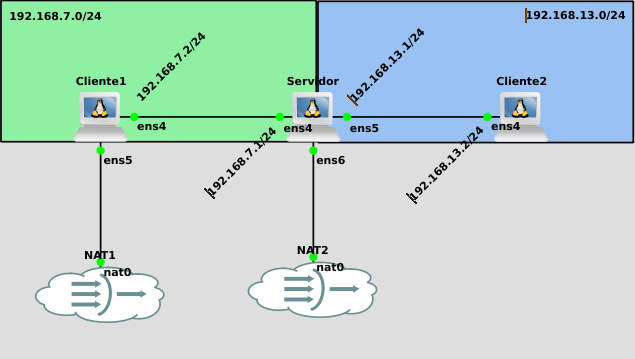
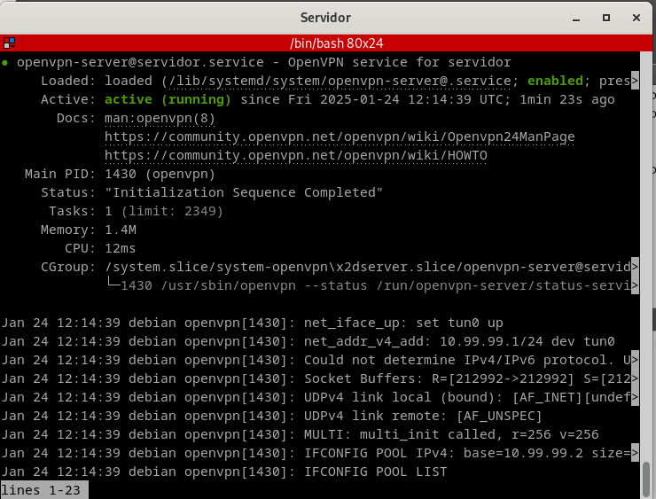
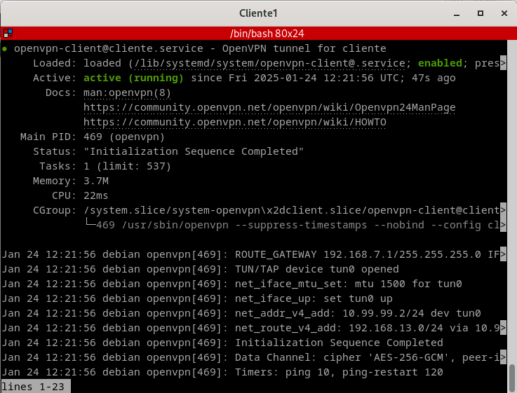
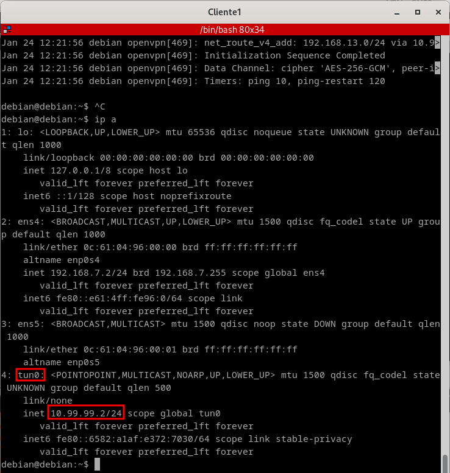
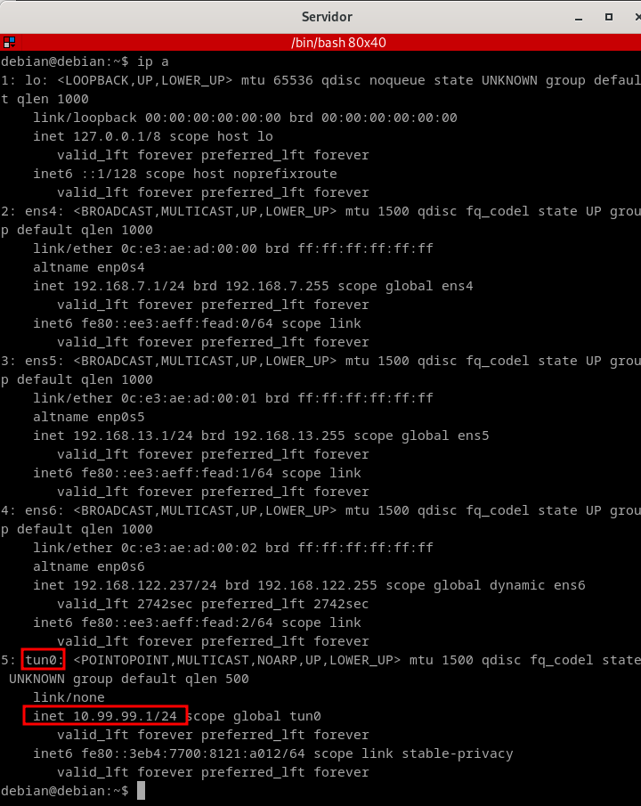

# Acceso remoto con OpenVpn y certificados x509

Lo primero que quiero aclarar que es voy a trabajar con una **VPN** esto ahora mismo nos suena como a chino por lo que voy a explicar lo que es, y para que sirve, por lo que voy a comenzar con una breve introducción.

- **¿Que es la VPN?**: Estas letras son una abreviacion de **Virtual Private Network**.
- **¿Para que sirve?**: Para  conectar varias redes privadas entre sí a través de una publica como seriá el caso de cuando trabajamos desde casa en el Openstack del centro educativo.

EL escenario de este apartado será el siguiente:



Valga la aclaración de que estoy trabajando desde el programa **GNS3** usando **máquinas Debian**

Vamos a ir por parte y vamos a configurar primeramente el servidor y por consiguiente el cliente número 1.


## Configuración del servidor

Lo primero que vamos a hacer después de arrancar la máquina será instalar **openvpn** con el siguiente comando:
`sudo apt install openvpn -y`

Trás eso vamos a habilitar el **bit de forwarding**, por lo que editaremos el siguiente fichero `/etc/sysctl.conf` descomentando la línea que pone lo siguiente:

`net.ipv4.ip_forward=1`

Tras ello aseguramos que se ha habilitado bien, haciendo uso del siguiente comando `sysctl -p`

Ahora lo que vamos a hacer a continuación es copiar la configuración del fichero **easy-rsa** a **/etc/openvpn**. Esto lo hago para que las actualizaciones no sobreescriban los ficheros que están ya, por lo que usamos el siguiente comando:

`sudo cp -r /usr/share/easy-rsa /etc/openvpn`

Hasta aquí es sencillo solo son tres comandos, ahora lo que vamos a hacer movernos al siguiente directorio **/etc/open/esasy-rsa**, para trabajar desde este directorio sobre todo para poder facilitar el trabajo ya que vamos a centralizar todo el directorio de **OpenVPN**, ya que voy a generar los certificados y las claves que vamos a usar para nuestra infraestuctira de clave púbklica, lo que se llama **PKI**.

- ¿Que es EasyRSA?

Easy-RSA es una herramienta que facilita la creación y gestión de certificados y claves para asegurar conexiones OpenVPN. También genera parámetros Diffie-Hellman, necesarios para establecer claves compartidas de forma segura. Es esencial para autenticar y proteger las comunicaciones.

Si teneis más dudas, podeis mirar el siguiente [post](https://nebul4ck.wordpress.com/2016/07/08/configurar-openvpn/)

Después de todo lo que he contado espero que haya quedado claro, con lo que es, ahora vamos a iniciar nuestra infraestructura, por lo que tendremos que hacer lo siguiente:

```
debian@debian:/etc/openvpn/easy-rsa$  sudo ./easyrsa init-pki
* Notice:

  init-pki complete; you may now create a CA or requests.

  Your newly created PKI dir is:
  * /etc/openvpn/easy-rsa/pki

* Notice:
  IMPORTANT: Easy-RSA 'vars' file has now been moved to your PKI above.
```
Con esto que acabamos de hacer es iniciar nuestra infraestuctura.
- La frase de paso y todo es usuario
Hecho todo lo anterior (no se pueden tener fallos con los pasos anteriores), lo que vamos a hacer es generar el certificado de la Autoridad Certificadora, y la clave con la que vamos a firmar los certificados del servidor y los clientes.
  - **SPOILER** mi clave es **usuario**

Por lo que tenemos que meter es el siguiente comando:

`sudo ./easyrsa build-ca`

Por lo que en pantalla tendremos que ver lo siguiente:

```
debian@debian:/etc/openvpn/easy-rsa$ sudo ./easyrsa build-ca
* Notice:
Using Easy-RSA configuration from: /etc/openvpn/easy-rsa/pki/vars

* Notice:
Using SSL: openssl OpenSSL 3.0.13 30 Jan 2024 (Library: OpenSSL 3.0.13 30 Jan 2024)


Enter New CA Key Passphrase: 
Re-Enter New CA Key Passphrase: 
Using configuration from /etc/openvpn/easy-rsa/pki/eaeefce0/temp.29afe878
...+.+...+...+.....+...+......+......+....+...+............+...+......+.........+++++++++++++++++++++++++++++++++++++++++++++++++++++++++++++++++*....+.........+.+...+..+++++++++++++++++++++++++++++++++++++++++++++++++++++++++++++++++*..............+.....+...+.......+........+...............+................+.....+...+...+...+.........+......+.+.....+.+........+.+++++++++++++++++++++++++++++++++++++++++++++++++++++++++++++++++
.....+....+......+...+..+...+++++++++++++++++++++++++++++++++++++++++++++++++++++++++++++++++*...+.+..+.......+.....+...+...+....+...+........+.+..............+.+......+...+..+...+.+++++++++++++++++++++++++++++++++++++++++++++++++++++++++++++++++*.....+......+...................+..+..........+..+............+.........+.+...+.....+.+......+......+..+................+.....+.........+...+.......+........+...+....+..+.+...+..............................+......+++++++++++++++++++++++++++++++++++++++++++++++++++++++++++++++++
Enter PEM pass phrase:
Verifying - Enter PEM pass phrase:
-----
You are about to be asked to enter information that will be incorporated
into your certificate request.
What you are about to enter is what is called a Distinguished Name or a DN.
There are quite a few fields but you can leave some blank
For some fields there will be a default value,
If you enter '.', the field will be left blank.
-----
Common Name (eg: your user, host, or server name) [Easy-RSA CA]:andy

* Notice:

CA creation complete and you may now import and sign cert requests.
Your new CA certificate file for publishing is at:
/etc/openvpn/easy-rsa/pki/ca.crt
```
Voy a hacer una aclaración, la **clave privada** la encontraras en `/etc/openvpn/easy-rsa/pki/private/ca.key` y el **certificado** en `/etc/openvpn/easy-rsa/pki/ca.crt`.

Ahora vamos a crear parámetros Diffie-Hellman, esenciales para autenticar los extremos de la VPN. 
- **¿Por qué son necesarios**? Su propósito es impedir que un atacante descifre el tráfico en la VPN. Esto se logra generando dos números primos grandes y calculando el módulo de su producto, el cual se envía a los extremos de la VPN para que generen una clave de sesión segura.

Es decir mete el siguiente comando para ello:

`sudo ./easyrsa gen-dh`

Y lo que nos aparecera por pantalla es lo siguiente:


```
debian@debian:/etc/openvpn/easy-rsa$ sudo ./easyrsa gen-dh
* Notice:
Using Easy-RSA configuration from: /etc/openvpn/easy-rsa/pki/vars

* Notice:
Using SSL: openssl OpenSSL 3.0.13 30 Jan 2024 (Library: OpenSSL 3.0.13 30 Jan 2024)

Generating DH parameters, 2048 bit long safe prime
....................................................................
...
..
.
.
..
* Notice:

DH parameters of size 2048 created at /etc/openvpn/easy-rsa/pki/dh.pem

```

Ahora vamos a generar el certificado y clave privada del servidor, y vamos a deshabilitar la frase de paso, por lo que metemos el siguiente comando:

`sudo ./easyrsa build-server-full <nombre_que_necesitemos> nopass`

En este caso en concreto voy a poner server, por lo que quedaría de la siguiente manera:

`sudo ./easyrsa build-server-full server nopass`

Y esto es lo que nos mostrará por pantalla:

```
debian@debian:/etc/openvpn/easy-rsa$ sudo ./easyrsa build-server-full server nopass
* Notice:
Using Easy-RSA configuration from: /etc/openvpn/easy-rsa/pki/vars

* Notice:
Using SSL: openssl OpenSSL 3.0.13 30 Jan 2024 (Library: OpenSSL 3.0.13 30 Jan 2024)

....+...+...............+........+................+...+..+.+++++++++++++++++++++++++++++++++++++++++++++++++++++++++++++++++*....+...........+....+...+.................+.+...+.........+............+++++++++++++++++++++++++++++++++++++++++++++++++++++++++++++++++*.......+..+.+.........+..+................+........+......+...................+.....+....+.....+.+.....+.+...+...+...+......+.....+....+...........+.+..+++++++++++++++++++++++++++++++++++++++++++++++++++++++++++++++++
.....+.......+..+.+...........+++++++++++++++++++++++++++++++++++++++++++++++++++++++++++++++++*.....+++++++++++++++++++++++++++++++++++++++++++++++++++++++++++++++++*.......+............+.....+...+....+...............+..+................+...+...........+...+...+...+.........+.+..............+......+..........+..+++++++++++++++++++++++++++++++++++++++++++++++++++++++++++++++++
-----
* Notice:

Keypair and certificate request completed. Your files are:
req: /etc/openvpn/easy-rsa/pki/reqs/server.req
key: /etc/openvpn/easy-rsa/pki/private/server.key


You are about to sign the following certificate.
Please check over the details shown below for accuracy. Note that this request
has not been cryptographically verified. Please be sure it came from a trusted
source or that you have verified the request checksum with the sender.

Request subject, to be signed as a server certificate for 825 days:

subject=
    commonName                = server


Type the word 'yes' to continue, or any other input to abort.
  Confirm request details: yes

Using configuration from /etc/openvpn/easy-rsa/pki/1224b2fe/temp.b1d2ba87
Enter pass phrase for /etc/openvpn/easy-rsa/pki/private/ca.key:
Check that the request matches the signature
Signature ok
The Subject's Distinguished Name is as follows
commonName            :ASN.1 12:'server'
Certificate is to be certified until Apr 29 11:45:53 2027 GMT (825 days)

Write out database with 1 new entries
Database updated

* Notice:
Certificate created at: /etc/openvpn/easy-rsa/pki/issued/server.crt

```
Ya hemos configurado el servidor, mi enhorabuena, ahora vamos con el cliente número 1, por lo que vamos a usar el mismo comando, pero esta vez vamos a poner **cliente1**, en vez de **server**, por lo que va quedar el siguiente comando:

`sudo ./easyrsa build-client-full cliente1 nopass`

Esto nos muestra por pantalla:

```
debian@debian:/etc/openvpn/easy-rsa$ sudo ./easyrsa build-client-full cliente1 nopass
* Notice:
Using Easy-RSA configuration from: /etc/openvpn/easy-rsa/pki/vars

* Notice:
Using SSL: openssl OpenSSL 3.0.13 30 Jan 2024 (Library: OpenSSL 3.0.13 30 Jan 2024)

......+.+....................+.+..+.+...........+.............+++++++++++++++++++++++++++++++++++++++++++++++++++++++++++++++++*..+......+.+..+.+........................+...+..+.......+.....+++++++++++++++++++++++++++++++++++++++++++++++++++++++++++++++++*...+...........+.........+.+...+........+......................+++++++++++++++++++++++++++++++++++++++++++++++++++++++++++++++++
.+...........+++++++++++++++++++++++++++++++++++++++++++++++++++++++++++++++++*..+..+++++++++++++++++++++++++++++++++++++++++++++++++++++++++++++++++*.....+...+.+...+.....+...+....+..............+.......+...+..+.......+...............+..+.+.....+++++++++++++++++++++++++++++++++++++++++++++++++++++++++++++++++
-----
* Notice:

Keypair and certificate request completed. Your files are:
req: /etc/openvpn/easy-rsa/pki/reqs/cliente1.req
key: /etc/openvpn/easy-rsa/pki/private/cliente1.key


You are about to sign the following certificate.
Please check over the details shown below for accuracy. Note that this request
has not been cryptographically verified. Please be sure it came from a trusted
source or that you have verified the request checksum with the sender.

Request subject, to be signed as a client certificate for 825 days:

subject=
    commonName                = cliente1


Type the word 'yes' to continue, or any other input to abort.
  Confirm request details: yes

Using configuration from /etc/openvpn/easy-rsa/pki/f899d2f2/temp.3171a298
Enter pass phrase for /etc/openvpn/easy-rsa/pki/private/ca.key:
Check that the request matches the signature
Signature ok
The Subject's Distinguished Name is as follows
commonName            :ASN.1 12:'cliente1'
Certificate is to be certified until Apr 29 11:49:07 2027 GMT (825 days)

Write out database with 1 new entries
Database updated

* Notice:
Certificate created at: /etc/openvpn/easy-rsa/pki/issued/cliente1.crt

```
Ya con todo lo del cliente creado, sus certificados y tal, lo que vamos a hacer a continuación es la creacion del directorio en el servidor para pasarlo a lo que será a la máquina cliente:

```
debian@debian:/etc/openvpn/easy-rsa$ cd
debian@debian:~$ mkdir cliente1
debian@debian:~$ sudo cp -rp /etc/openvpn/easy-rsa/pki/{ca.crt,issued/cliente1.crt,private/cliente1.key} /home/debian/cliente1/
debian@debian:~# tree
.
└── cliente1
    ├── ca.crt
    ├── cliente1.crt
    └── cliente1.key

2 directories, 3 files

```

Comprueba los permisos y cambiarlo ya que van a estar en root y hay que pasarlo a debian(es el usuario que viene el GNS3 por defecto), para que no nos de problemas, por lo que sigue los siguientes estos pasos:

- Comprueba que permisos tiene:
```
debian@debian:~/cliente1$ ls -l
total 16
-rw------- 1 root root 1176 Jan 24 11:40 ca.crt
-rw------- 1 root root 4465 Jan 24 11:49 cliente1.crt
-rw------- 1 root root 1704 Jan 24 11:49 cliente1.key

```

Y los cambiamos con el comando: `sudo chown -R debian:debian cliente1/`

- Comprobamos si ya están bien:

```
debian@debian:~/cliente1$ ls -l
total 16
-rw------- 1 debian debian 1176 Jan 24 11:40 ca.crt
-rw------- 1 debian debian 4465 Jan 24 11:49 cliente1.crt
-rw------- 1 debian debian 1704 Jan 24 11:49 cliente1.key

```

Ahora se los transfiere al cliente1 por lo que me ayudare del comando **scp**, y se vera de la siguiente manera:

```
debian@debian:~$ scp -r /home/debian/cliente1 debian@192.168.7.2:/home/debian/
The authenticity of host '192.168.7.2 (192.168.7.2)' can't be established.
ED25519 key fingerprint is SHA256:Gojcktfl97qAXF9KaBhKTK93gIYeN/574t8Ph9Zl2D0.
This key is not known by any other names.
Are you sure you want to continue connecting (yes/no/[fingerprint])? yes+
Please type 'yes', 'no' or the fingerprint: yes
Warning: Permanently added '192.168.7.2' (ED25519) to the list of known hosts.
debian@192.168.7.2's password: 
ca.crt                                        100% 1176   837.5KB/s   00:00    
cliente1.key                                  100% 1704     1.5MB/s   00:00    
cliente1.crt                                  100% 4465     5.6MB/s   00:00    
debian@debian:~$ 
 
```
Entramos en la máquina cliente y vemos que estan en el directorio al cual lo mandamos:

```
debian@debian:~$ cd 
.ssh/     cliente1/ 
debian@debian:~$ cd cliente1/
debian@debian:~/cliente1$ ls -l
total 16
-rw------- 1 debian debian 1176 Jan 24 12:08 ca.crt
-rw------- 1 debian debian 4465 Jan 24 12:08 cliente1.crt
-rw------- 1 debian debian 1704 Jan 24 12:08 cliente1.key
debian@debian:~/cliente1$ 

```

Ahora configuramos el tunel en el servidor, por lo que se va a crear el fichero de configuracion, en este caso lo he llamado **servidor.conf** por lo que usamos el siuguiente comando:

```
sudo nano /etc/openvpn/server/servidor.conf
```
Y escribimos lo siguiente en el fichero:
```

#Puerto, protocolo y dispositivo
port 1194
proto udp
dev tun

#Autentificación
ca /etc/openvpn/easy-rsa/pki/ca.crt
cert /etc/openvpn/easy-rsa/pki/issued/server.crt
key /etc/openvpn/easy-rsa/pki/private/server.key
dh /etc/openvpn/easy-rsa/pki/dh.pem

#Topologia de red
topology subnet

# El rango de ip de la interfaz que se creará 
server 10.99.99.0 255.255.255.0

ifconfig-pool-persist /var/log/openvpn/ipp.txt

# Aquí especificamos la ruta que se usará para acceder al cliente 2
push "route 192.168.13.0 255.255.255.0" 

keepalive 10 120
cipher AES-256-CBC
persist-key
persist-tun
status /var/log/openvpn/openvpn-status.log
verb 3
explicit-exit-notify 1

```

Donde:

- `port 1194`: Puerto utilizado por OpenVPN (predeterminado).
- `proto udp`: Usa el protocolo UDP para la conexión.
- `dev tun`: Usa una interfaz virtual TUN para el túnel VPN.
- `ca /etc/openvpn/easy-rsa/pki/ca.crt`: Ruta al certificado de la CA.
- `cert /etc/openvpn/easy-rsa/pki/issued/server.crt`: Ruta al certificado del servidor.
- `key /etc/openvpn/easy-rsa/pki/private/server.key`: Ruta a la clave privada del servidor.
- `dh /etc/openvpn/easy-rsa/pki/dh.pem`: Parámetros Diffie-Hellman para generar claves seguras.
- `topology subnet`: Asignación de IP basada en subred.
- `server 10.99.99.0 255.255.255.0`: Red y máscara para asignar IP a los clientes.
- `ifconfig-pool-persist /var/log/openvpn/ipp.txt`: Guarda asignaciones de IP a clientes.
- `push "route 192.168.13.0 255.255.255.0"`: Envia una ruta para que los clientes accedan a esa red.
- `keepalive 10 120`: Verifica la conectividad con intervalos de 10 y 120 segundos.
- `cipher AES-256-CBC`: Usa cifrado AES de 256 bits.
- `persist-key`: Mantiene la clave privada activa después de reiniciar.
- `persist-tun`: Mantiene la interfaz TUN activa tras reiniciar.
- `status /var/log/openvpn/openvpn-status.log`: Guarda el estado del servidor.
- `verb 3`: Configura el nivel de detalle de los registros.
- `explicit-exit-notify 1`: Notifica al cliente cuando se cierre la conexión.

Tras terminar el fichero de **servidor.conf**, lo que tendrás que habilitar el servicio por lo que simplemente mete el siguiente comando:
```
systemctl enable --now openvpn-server@servidor
```
Y nos aparece por pantalla esto:

```
debian@debian:~$ sudo systemctl enable --now openvpn-server@servidor
Created symlink /etc/systemd/system/multi-user.target.wants/openvpn-server@servidor.service → /lib/systemd/system/openvpn-server@.service.
debian@debian:~$ [ 2462.014554] tun: Universal TUN/TAP device driver, 1.6

debian@debian:~$ 

```

Y vemos su estado, con el siguiente comando `sudo systemctl status openvpn-server@servidor`



Has ido volando, enhorabuena 🎉. Si esto falla, empieza de nuevo; es la mejor solución después de 15 horas perdidas delante del ordenador 😅.

Ahora paso al siguiente nivel:

## Configuración del cliente

Lo primero que haras será instalar **openvpn** con el siguiente comando:```sudo apt install openvpn -y```

Mueve los ficheros que pasaste con anterioridad ```sudo mv cliente1/* /etc/openvpn/client/```

Creas otro fichero como en el **servidor.conf** pero esta vez para el cliente, este fichero es la configuración para lo que será la VPN:

```nano /etc/openvpn/client/cliente.conf```

El contenido del fichero será el siguiente:

```
#Puerto de escucha, protocolo y dispositivo
client
dev tun
proto udp

#Autentificación
remote 192.168.7.1 1194
resolv-retry infinite
nobind
persist-key
persist-tun

#Autentificación
ca /etc/openvpn/client/ca.crt
cert /etc/openvpn/client/cliente1.crt
key /etc/openvpn/client/cliente1.key

#Topología de la red
remote-cert-tls server
cipher AES-256-CBC
verb 3
```

Donde:

- `client`: Define que es una configuración para cliente.
- `dev tun`: Usa una interfaz de red virtual tun.
- `proto udp`: Utiliza el protocolo UDP.
- `remote 192.168.7.1 1194`: Dirección IP y puerto del servidor.
- `resolv-retry infinite`: Intenta resolver la dirección del servidor indefinidamente.
- `nobind`: No fija un puerto específico.
- `persist-key y persist-tun`: Mantiene las claves y la interfaz activa tras desconexiones.
- `ca, cert, key`: Archivos necesarios para la autenticación (certificados y claves).
- `remote-cert-tls server`: Verifica el certificado del servidor.
- `cipher AES-256-CBC`: Usa el cifrado AES-256-CBC.
- `verb 3`: Establece el nivel de detalle de los logs.


Luego de hacer el fichero de configuración, habilitas el servicoo de OpenVPN:

```
sudo systemctl enable --now openvpn-client@cliente
```

Vemos por pantalla lo siguiente:

```
debian@debian:~$ sudo systemctl enable --now openvpn-client@cliente
Created symlink /etc/systemd/system/multi-user.target.wants/openvpn-client@cliente.service → /lib/systemd/system/openvpn-client@.service.
debian@debian:~$ [  852.837359] tun: Universal TUN/TAP device driver, 1.6
```
Y metiendo el coamndo `sudo systemctl status openvpn-client@cliente`  podemos verificar que esta corriendo, y activado:



Por lo que ahora nos vamos a ir a ambas máquinas tanto cliente como servidor, y vemos con el comando **ip a** si están listos:

- Cliente


- **Servidor**




Despues de toda la odisea que he hecho vanmos a probar a ver si va bien con un **traceroute** al cliente 2 desde el cliente 1

```
debian@debian:~$ traceroute 192.168.13.2
traceroute to 192.168.13.2 (192.168.13.2), 30 hops max, 60 byte packets
 1  10.99.99.1 (10.99.99.1)  1.977 ms  1.881 ms  1.847 ms
 2  192.168.13.2 (192.168.13.2)  2.174 ms  2.136 ms  2.103 ms
```

Y como podemos ver, sin tener nuestra suerte de lado hemos salido exitosos.

