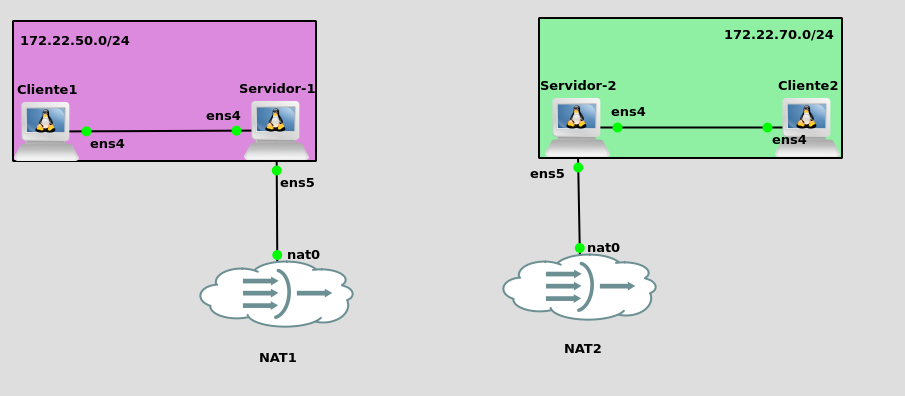
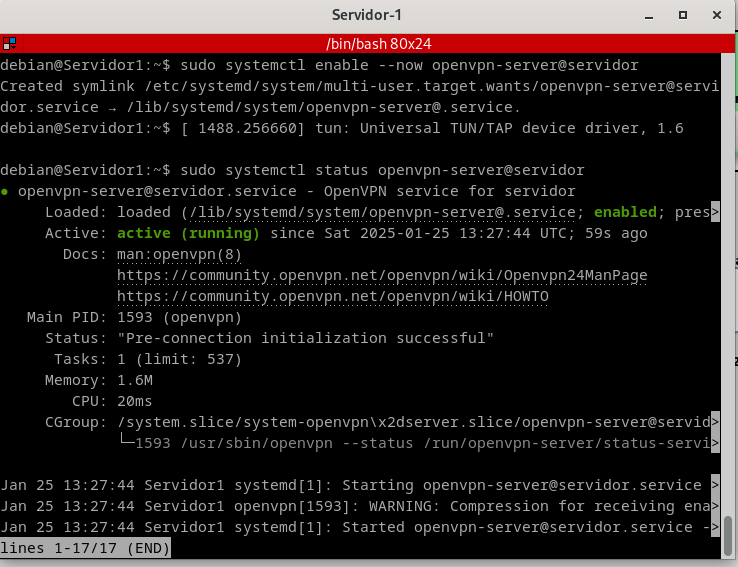
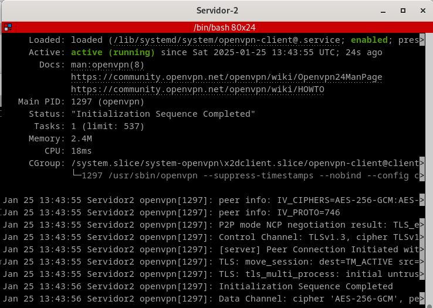
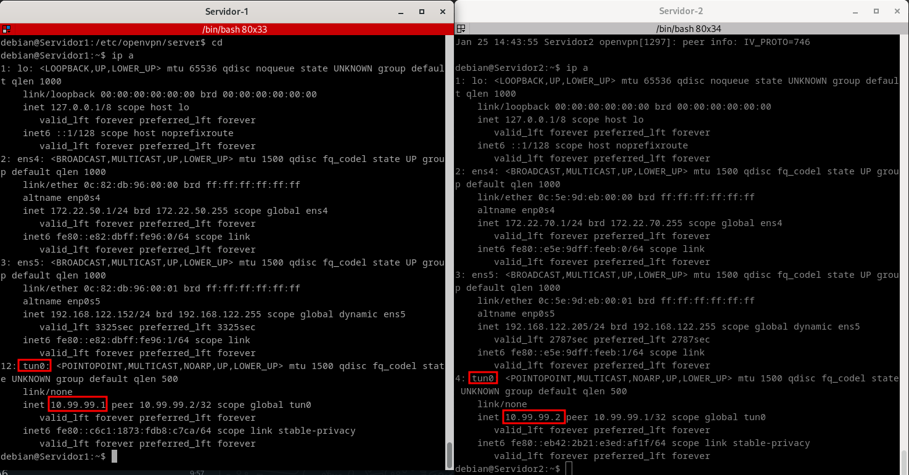
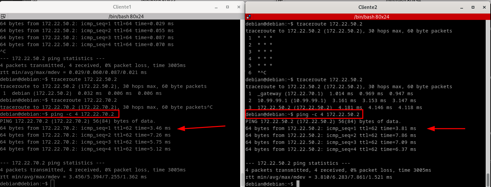
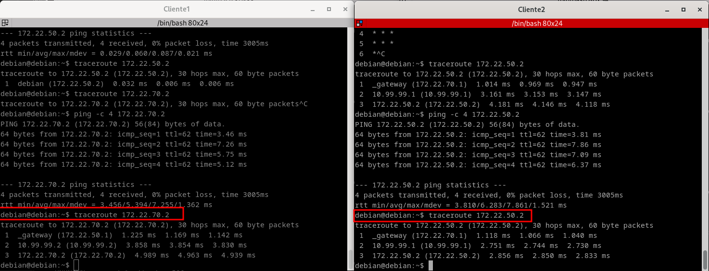

# VPN sitio a sitio con OpenVPN y certificados x509

Antes de nada para hacer este ejercicio hemos recurrido a este [conjuro](https://www.youtube.com/watch?v=NoBBFQWrr20&ab_channel=CriterioMusic) para que nos salga perfectamente bien y entenderlo a la primera.

Y sin más preambulo presentamos lo que será lo que nos pide:

- Cada equipo estará conectado a dos redes, una de ellas en común 
    - Para la autenticación de los extremos se usarán obligatoriamente certificados digitales, que se generarán utilizando openssl y se almacenarán en el directorio /etc/openvpn, junto con con los parámetros Diffie-Helman y el certificado de la propia Autoridad de Certificación. 
    - Se utilizarán direcciones de la red 10.99.99.0/24 para las direcciones virtuales de la VPN. 
    - Tras el establecimiento de la VPN, una máquina de cada red detrás de cada servidor VPN debe ser capaz de acceder a una máquina del otro extremo. 

## Escenario.

Por lo que el escernario tendrá la siguiente apariencia:


## Configuración del Servidor 1.
Ahora lo que vamos a hacer el servidor 1, como la autoridad Certificadora, por lo que vamos a empezar por instalar **OpenVPN**, con el siguiente comando:

`debian@Servidor1:~$ sudo apt install openvpn -y`

Trás eso vamos a habilitar el **bit de forwarding**, por lo que editaremos el siguiente fichero `/etc/sysctl.conf` descomentando la línea que pone lo siguiente:

`net.ipv4.ip_forward=1`

Tras ello aseguramos que se ha habilitado bien, haciendo uso del siguiente comando `sysctl -p`

**🚨 Esto que acabamos de hacer nos ahorrará demasiados quebraderos de cabeza, ya lo confirmo yo. 🚨**

AHora hacemos el siguiente comando:

`sudo cp /usr/share/easy-rsa/vars.example /etc/openvpn/easy-rsa/vars`

Esto lo tienes que hacer para poder personalizar los parametros de generación de certificados para **OpenVPN**, aqui dejo las modificaciones que tiene mi fichero `vars`

- Fichero vars modificado:

```
set_var EASYRSA_REQ_COUNTRY     "USA"
set_var EASYRSA_REQ_PROVINCE    "Gotham"
set_var EASYRSA_REQ_CITY        "Gotham City"
set_var EASYRSA_REQ_ORG "Batman Corporation"
set_var EASYRSA_REQ_EMAIL       "asirandyglez@gmail.com"
set_var EASYRSA_REQ_OU          "Apartado B"

```

Ahoras generas el directorio pki, el cual lo generamos en el directorio `/usr/share/easy-rsa`, con el siguiente comando:

`sudo ./easy init-pky`

Nos mostrará esto por consola:

```
debian@debian:/usr/share/easy-rsa$ sudo ./easyrsa init-pki
* Notice:

  init-pki complete; you may now create a CA or requests.

  Your newly created PKI dir is:
  * /usr/share/easy-rsa/pki

```

Ahora generas la clave Diffie-Hellman, con el siguiente comando:

`sudo ./easyrsa gen-dh`

Nos va a mostrar por consola lo siguiente (esto tarda una barbaridad):

```
debian@debian:/usr/share/easy-rsa$ sudo ./easyrsa gen-dh
* Notice:
Using Easy-RSA configuration from: /usr/share/easy-rsa/vars

* WARNING:

  Move your vars file to your PKI folder, where it is safe!

* Notice:
Using SSL: openssl OpenSSL 3.0.13 30 Jan 2024 (Library: OpenSSL 3.0.13 30 Jan 2024)

Generating DH parameters, 2048 bit long safe prime
...............................+........................................................+...................................................+..............................................................................................+........................................+.........................................................................................................................................................................................................................................................................................+...................................................................................................................................................................................................................++*++*++*++*++*++*++*++*++*++*++*++*++*++*++*++*++*++*++*++*++*++*++*++*++*++*++*++*++*++*++*++*++*++*++*++*++*++*++*++*++*++*++*++*++*++*++*++*++*++*++*++*++*++*++*++*++*++*++*++*++*++*++*++*

* Notice:

DH parameters of size 2048 created at /usr/share/easy-rsa/pki/dh.pem

```

Ya que esta iniciada lo que será la tarea, lo que hay que generar es la autoridad certificadora, con el siguiente comando :

`sudo ./easyrsa build-ca`

Y nos aparece por pantalla lo siguiente, cabe destracar que en Common Name he puesto **Andy CA**

```
debian@debian:/usr/share/easy-rsa$ sudo ./easyrsa build-ca
* Notice:
Using Easy-RSA configuration from: /usr/share/easy-rsa/vars

* WARNING:

  Move your vars file to your PKI folder, where it is safe!

* Notice:
Using SSL: openssl OpenSSL 3.0.13 30 Jan 2024 (Library: OpenSSL 3.0.13 30 Jan 2024)


Enter New CA Key Passphrase: 
Re-Enter New CA Key Passphrase: 
Using configuration from /usr/share/easy-rsa/pki/542b0bd0/temp.996e2146
.+..............+....+.....+......+....+......+.....+.........+.+.....+......+.......+...+...+++++++++++++++++++++++++++++++++++++++++++++++++++++++++++++++++*.+.+..+.........+.........+.+......+..+.+......+...............+.....+....+..+..........+...+..+.........+++++++++++++++++++++++++++++++++++++++++++++++++++++++++++++++++*..+.........+..+.......+...........+.........+...+.......+..+.+.....+....+...+...............+..+.+.....+.......+.....+.+......+...+...+..+...+...+.........+.+...........+...+..........+...........+.+......+.....+..........+.........+........+......+....+.....+...+.......+..+.+........+......+...+......+....+..+.+..+.............+........+.......+.........+...+.....+......+...............+.+......+...+..............+......+...............+.+......+...+..+.........+....+..........................................+..+.+...........+.+..+.+...........+.+........+...............+.......+...+..+.........+...+..........+...+...+..........................+.+...+..+.......+..+......+.........+.............+..+.+..................+..+.............+......+........+.......+.....+...+...+...+.........+...+...+.+......+...+..+...+..........+.........+............+...+......+..............+.+......+......+..............+...+............+.+...+.........+..+++++++++++++++++++++++++++++++++++++++++++++++++++++++++++++++++
..+...+++++++++++++++++++++++++++++++++++++++++++++++++++++++++++++++++*......+...+.....+++++++++++++++++++++++++++++++++++++++++++++++++++++++++++++++++*..........................+.+..+.+......+.....+....+.........+..+........................+....+.....+...+............+.+.....+.+++++++++++++++++++++++++++++++++++++++++++++++++++++++++++++++++
Enter PEM pass phrase:
Verifying - Enter PEM pass phrase:
-----
You are about to be asked to enter information that will be incorporated
into your certificate request.
What you are about to enter is what is called a Distinguished Name or a DN.
There are quite a few fields but you can leave some blank
For some fields there will be a default value,
If you enter '.', the field will be left blank.
-----
Common Name (eg: your user, host, or server name) [Easy-RSA CA]:Andy CA

* Notice:

CA creation complete and you may now import and sign cert requests.
Your new CA certificate file for publishing is at:
/usr/share/easy-rsa/pki/ca.crt

```

AHora creas y firmas el certificado que usará la máquina servidor, por lo que usare estos comando:

- Creación: `sudo ./easyrsa gen-req server`, pero si en el caso que quieras poner el nombre de **Rogelia**, el comando seria el mismo, pero con esta variación `sudo ./easyrsa gen-req Rogelia`

```
debian@debian:/usr/share/easy-rsa$ sudo ./easyrsa gen-req server
* Notice:
Using Easy-RSA configuration from: /usr/share/easy-rsa/vars

* WARNING:

  Move your vars file to your PKI folder, where it is safe!

* Notice:
Using SSL: openssl OpenSSL 3.0.13 30 Jan 2024 (Library: OpenSSL 3.0.13 30 Jan 2024)

..+.........+........................+..........+..............+.+..+...+....+...+.........+++++++++++++++++++++++++++++++++++++++++++++++++++++++++++++++++*....+....+...+........+....+...+++++++++++++++++++++++++++++++++++++++++++++++++++++++++++++++++*.......+...+.......+.........+...............+...+.....+...+..........+..+.+......+..............+....+...........+....+..+....+.....+..........+...........+....+..+.......+......+.....+.+.........+...........+...+...+....+...........+...+.....................+.+..+.+..+.......+...............+...+..+...+...+....+..+...+............+.+++++++++++++++++++++++++++++++++++++++++++++++++++++++++++++++++
...+.....+...+...+....+......+..+.+......+.....+.+........+.+.....+......+...+++++++++++++++++++++++++++++++++++++++++++++++++++++++++++++++++*.............+......+.+..............+.........+.......+........+.+..+++++++++++++++++++++++++++++++++++++++++++++++++++++++++++++++++*................+..+.........+.+.....+....+........+...+...+.+........+.+.....+.+...+......+.....+......................+........+....+...........+....+...+.........+.........+............+...+.....+....+..+..................+.+..+.......+...+.....+....+...+..+......+...+....+........+............+...+...+.+.............................+...............+.+...+++++++++++++++++++++++++++++++++++++++++++++++++++++++++++++++++
Enter PEM pass phrase:
Verifying - Enter PEM pass phrase:
-----
You are about to be asked to enter information that will be incorporated
into your certificate request.
What you are about to enter is what is called a Distinguished Name or a DN.
There are quite a few fields but you can leave some blank
For some fields there will be a default value,
If you enter '.', the field will be left blank.
-----
Common Name (eg: your user, host, or server name) [server]:
* Notice:

Keypair and certificate request completed. Your files are:
req: /usr/share/easy-rsa/pki/reqs/server.req
key: /usr/share/easy-rsa/pki/private/server.key

```

- Firmas lo que acabas de crear con  `sudo ./easyrsa sign-req server server` y para firmar pero con otro nombre sería lo mismo pero con esta variación `sudo ./easyrsa sign-req server Rogelia`

Y lo que nos muestra por pantalla es lo siguiente:

```
debian@debian:/usr/share/easy-rsa$ sudo ./easyrsa sign-req server server
* Notice:
Using Easy-RSA configuration from: /usr/share/easy-rsa/vars

* WARNING:

  Move your vars file to your PKI folder, where it is safe!

* Notice:
Using SSL: openssl OpenSSL 3.0.13 30 Jan 2024 (Library: OpenSSL 3.0.13 30 Jan 2024)


You are about to sign the following certificate.
Please check over the details shown below for accuracy. Note that this request
has not been cryptographically verified. Please be sure it came from a trusted
source or that you have verified the request checksum with the sender.

Request subject, to be signed as a server certificate for 825 days:

subject=
    commonName                = server


Type the word 'yes' to continue, or any other input to abort.
  Confirm request details: yes 

Using configuration from /usr/share/easy-rsa/pki/52877b46/temp.fb158b78
Enter pass phrase for /usr/share/easy-rsa/pki/private/ca.key:
Check that the request matches the signature
Signature ok
The Subject's Distinguished Name is as follows
commonName            :ASN.1 12:'server'
Certificate is to be certified until Apr 30 11:37:51 2027 GMT (825 days)

Write out database with 1 new entries
Database updated

* Notice:
Certificate created at: /usr/share/easy-rsa/pki/issued/server.crt
```

Ahora lo que voy a crear y firmar es el certificado que va a usar el servidor 2, ya que pertenece a otra red y tiene que acceder a la VPN.

- Creación del certificado: `sudo ./easy gen-req server2`

```
debian@Servidor1:/usr/share/easy-rsa$ sudo ./easyrsa gen-req server2
* Notice:
Using Easy-RSA configuration from: /usr/share/easy-rsa/vars

* WARNING:

  Move your vars file to your PKI folder, where it is safe!

* Notice:
Using SSL: openssl OpenSSL 3.0.13 30 Jan 2024 (Library: OpenSSL 3.0.13 30 Jan 2024)

...+.........+.....+.+...+...............+...+++++++++++++++++++++++++++++++++++++++++++++++++++++++++++++++++*...+....+...........+...+.+.........+++++++++++++++++++++++++++++++++++++++++++++++++++++++++++++++++*.........+.....+...+.+...............+.....+......+....+.....+.+......+...+..+............+................+++++++++++++++++++++++++++++++++++++++++++++++++++++++++++++++++
.....+..+.......+...........+......+...............+.+.....+++++++++++++++++++++++++++++++++++++++++++++++++++++++++++++++++*...+....+...+..+.+++++++++++++++++++++++++++++++++++++++++++++++++++++++++++++++++*...+.........+..+....+.....+.+...+......+......+...............+.........+..+...+....+...+++++++++++++++++++++++++++++++++++++++++++++++++++++++++++++++++
Enter PEM pass phrase:
Verifying - Enter PEM pass phrase:
-----
You are about to be asked to enter information that will be incorporated
into your certificate request.
What you are about to enter is what is called a Distinguished Name or a DN.
There are quite a few fields but you can leave some blank
For some fields there will be a default value,
If you enter '.', the field will be left blank.
-----
Common Name (eg: your user, host, or server name) [server2]:
* Notice:

Keypair and certificate request completed. Your files are:
req: /usr/share/easy-rsa/pki/reqs/server2.req
key: /usr/share/easy-rsa/pki/private/server2.key

```

Ahora le tocara a quien sera el cliente del segundo escenario en este caso será el servidor2 al que hemos nombrado **server2**, con el siguiente comando: `sudo ./easyrsa sign-req client server2`

```
debian@Servidor1:/usr/share/easy-rsa$ sudo ./easyrsa sign-req client server2
* Notice:
Using Easy-RSA configuration from: /usr/share/easy-rsa/vars

* WARNING:

  Move your vars file to your PKI folder, where it is safe!

* Notice:
Using SSL: openssl OpenSSL 3.0.13 30 Jan 2024 (Library: OpenSSL 3.0.13 30 Jan 2024)


You are about to sign the following certificate.
Please check over the details shown below for accuracy. Note that this request
has not been cryptographically verified. Please be sure it came from a trusted
source or that you have verified the request checksum with the sender.

Request subject, to be signed as a client certificate for 825 days:

subject=
    commonName                = server2


Type the word 'yes' to continue, or any other input to abort.
  Confirm request details: yes

Using configuration from /usr/share/easy-rsa/pki/6209ab6e/temp.42c9170c
Enter pass phrase for /usr/share/easy-rsa/pki/private/ca.key:
Check that the request matches the signature
Signature ok
The Subject's Distinguished Name is as follows
commonName            :ASN.1 12:'server2'
Certificate is to be certified until Apr 30 13:15:47 2027 GMT (825 days)

Write out database with 1 new entries
Database updated

* Notice:
Certificate created at: /usr/share/easy-rsa/pki/issued/server2.crt
```

Ahora lo que hay que hacer es copiar algunos ficheros que se han generado en **/usr/share/easy-rsa/pki** a **/etc/openvpn/server** esto sera para el servidor 1 (llamado server), seria de la siguiente forma:

```
root@Servidor1:/usr/share/easy-rsa/pki# cp ca.crt /etc/openvpn/server/
root@Servidor1:/usr/share/easy-rsa/pki# cp dh.pem /etc/openvpn/server/
root@Servidor1:/usr/share/easy-rsa/pki# cp issued/server.crt /etc/openvpn/server/
root@Servidor1:/usr/share/easy-rsa/pki# cp private/server.key /etc/openvpn/server/
```

AHora hay que pasar algunos ficheros al servidor 2, por lo que voy a crear un directorio primero:

```
debian@Servidor1:~$ sudo mkdir servidor2
debian@Servidor1:~$ cd servidor2/
debian@Servidor1:~/servidor2$ pwd
/home/debian/servidor2

```

Y lo que hago a continuación es pasarlo con su correspondiente verificación:

```
root@Servidor1:~# cd /usr/share/easy-rsa/pki/
root@Servidor1:/usr/share/easy-rsa/pki# cp ca.crt /home/debian/servidor2/
root@Servidor1:/usr/share/easy-rsa/pki# cp issued/server2.crt /home/debian/servidor2/
root@Servidor1:/usr/share/easy-rsa/pki# cp private/server2.key /home/debian/servidor2/
root@Servidor1:/usr/share/easy-rsa/pki# cd
root@Servidor1:~# cd /home/debian/
root@Servidor1:/home/debian# tree
.
└── servidor2
    ├── ca.crt
    ├── server2.crt
    └── server2.key

2 directories, 3 files

```

Ahora que tenemos esto, tienes que cambiarle los permisos, con el siguiente comando `sudo chown -R debian:debian /servidor2` y se quedarán de la siguiente manera:

```
root@Servidor1:/home/debian# chown -R debian:debian servidor2/
root@Servidor1:/home/debian# 
exit
debian@Servidor1:~$ ls -l servidor2/
total 16
-rw------- 1 debian debian 1188 Jan 25 13:19 ca.crt
-rw------- 1 debian debian 4478 Jan 25 13:20 server2.crt
-rw------- 1 debian debian 1854 Jan 25 13:20 server2.key
debian@Servidor1:~$ 
```

Ahora se los transfieres al servidor 2 por lo que te ayudaras del comando **scp**, y se vera de la siguiente manera:

```
debian@Servidor1:~$ scp -r /home/debian/servidor2 debian@192.168.122.205:/home/debian/
The authenticity of host '192.168.122.205 (192.168.122.205)' can't be established.
ED25519 key fingerprint is SHA256:Gojcktfl97qAXF9KaBhKTK93gIYeN/574t8Ph9Zl2D0.
This key is not known by any other names.
Are you sure you want to continue connecting (yes/no/[fingerprint])? yes
Warning: Permanently added '192.168.122.205' (ED25519) to the list of known hosts.
debian@192.168.122.205's password: 
server2.crt                                   100% 4478     2.9MB/s   00:00    
ca.crt                                        100% 1188     1.7MB/s   00:00    
server2.key                                   100% 1854     2.7MB/s   00:00  
```

Y comprobamos que ha llegado, y sus permisos en el servidor 2, que se llama server2:


```
debian@Servidor2:~$ tree
.
└── servidor2
    ├── ca.crt
    ├── server2.crt
    └── server2.key

2 directories, 3 files
debian@Servidor2:~$ ls -l
total 4
drwxr-xr-x 2 debian debian 4096 Jan 25 13:22 servidor2
debian@Servidor2:~$ ls -l servidor2/
total 16
-rw------- 1 debian debian 1188 Jan 25 13:22 ca.crt
-rw------- 1 debian debian 4478 Jan 25 13:22 server2.crt
-rw------- 1 debian debian 1854 Jan 25 13:22 server2.key
```

Ahora vas a configurar el fichero para la configuracion para el sevridor VPN, por lo que metes el siguiente comando:

```sudo nano /etc/openvpn/server/servidor.conf```

El contendio del fichero será el siguiente:

```
dev tun
ifconfig 10.99.99.1 10.99.99.2
route 172.22.70.0 255.255.255.0
tls-server
ca ca.crt
cert server.crt
key server.key
dh dh.pem
comp-lzo
keepalive 10 120
log /var/log/openvpn/server.log
verb 3
askpass clave1.txt
```
- Donde:
  - **`dev tun`**: Crea una interfaz de red virtual para tráfico cifrado.
  - **`ifconfig 10.99.99.1 10.99.99.2`**: Asigna IPs a los extremos de la VPN (servidor: 10.99.99.1, cliente: 10.99.99.2).
  - **`route 172.22.70.0 255.255.255.0`**: Crea una ruta para el tráfico hacia la red 172.22.70.0.
  - **`tls-server`**: Activa el protocolo TLS para la seguridad de la conexión.
  - **`ca ca.crt`**: Especifica el certificado de la autoridad certificadora (CA).
  - **`cert server.crt`**: Define el certificado del servidor para la autenticación.
  - **`key server.key`**: Define la clave privada del servidor.
  - **`dh dh.pem`**: Usa Diffie-Hellman para establecer una clave compartida segura.
  - **`comp-lzo`**: Habilita la compresión de datos con LZO.
  - **`keepalive 10 120`**: Envía pings cada 10 segundos, reconectando si no hay respuesta en 120 segundos.
  - **`log /var/log/openvpn/server.log`**: Guarda los registros de actividad del servidor.
  - **`verb 3`**: Define el nivel de detalle de los registros (nivel 3).
  - **`askpass clave1.txt`**: Lee la contraseña de la clave privada desde el archivo `clave1.txt`.


He creado un **clave1.txt** donde tienes que **poner tu frase de paso**, la mia es **usuario**, si vemos lo que tengo ahora mismo es esto:

```
debian@debian:/etc/openvpn/server$ tree
.
├── ca.crt
├── clave1.txt
├── dh.pem
├── server.crt
├── server.key
└── servidor.conf
```

Ahora iniciamos el servicio con este comando:

```
sudo systemctl enable --now openvpn-server@servidor
```

Esto nos aparecera por pantalla:

```
debian@Servidor1:~$ sudo systemctl enable --now openvpn-server@servidor
Created symlink /etc/systemd/system/multi-user.target.wants/openvpn-server@servidor.service → /lib/systemd/system/openvpn-server@.service.
debian@Servidor1:~$ [ 1488.256660] tun: Universal TUN/TAP device driver, 1.6
```

Y se verificamos con el siguiente comando:

```
sudo systemctl status openvpn-server@servidor
```




Ahora vamos a por la configuración del servidor 2 tambien llamado esutaquio.

# Configuración de Servidor 2.

Por lo que vamos a a instalar **OpenVPN** , con el siguiente comando: `sudo apt install openvpn`

Trás eso vamos a habilitar el **bit de forwarding**, por lo que editaremos el siguiente fichero `/etc/sysctl.conf` descomentando la línea que pone lo siguiente:

`net.ipv4.ip_forward=1`

Tras ello aseguramos que se ha habilitado bien, haciendo uso del siguiente comando `sysctl -p`

**🚨 Esto que acabamos de hacer nos ahorrará demasiados quebraderos de cabeza, ya lo confirmo yo. 🚨**

Tras este paso lo que haceemos es mover los ficheros que pasamos anteriormente, a la siguiente dirección con el siguiente comando:

`debian@Servidor2:~$ sudo mv servidor2/* /etc/openvpn/client/`

Ahora lo que hacemos es crear el fichero de configuración de la VPN, al cual vamos a llamar cliente.conf y lo vamos a crear en el directorio `/etc/openvpn/client` con el siguiente contenido:

```
debian@Servidor2:/etc/openvpn/client$ cat cliente.conf 
dev tun
remote 192.168.122.152
ifconfig 10.99.99.2 10.99.99.1
route 172.22.50.0 255.255.255.0
tls-client
ca ca.crt
cert server2.crt
key server2.key
comp-lzo
keepalive 10 60
verb 3
askpass claveserver2.txt

```

- Donde:
  - **`dev tun`**: Crea una interfaz de red virtual para la VPN.
  - **`remote 192.168.122.152`**: Define la dirección IP del servidor VPN al que conectarse.
  - **`ifconfig 10.99.99.2 10.99.99.1`**: Asigna IPs a los extremos de la conexión VPN.
  - **`route 172.22.50.0 255.255.255.0`**: Crea una ruta para el tráfico hacia la red 172.22.50.0.
  - **`tls-client`**: Usa el protocolo TLS para la seguridad de la conexión cliente.
  - **`ca ca.crt`**: Especifica el archivo del certificado de la autoridad certificadora.
  - **`cert server2.crt`**: Define el archivo del certificado del cliente.
  - **`key server2.key`**: Define la clave privada del cliente.
  - **`comp-lzo`**: Habilita la compresión de datos.
  -  **`keepalive 10 60`**: Mantiene la conexión activa enviando pings cada 10 segundos, reconectando si no hay respuesta por 60 segundos.
  - **`verb 3`**: Define el nivel de detalle de los registros.
  - **`askpass claveserver2.txt`**: Lee la contraseña de la clave privada desde un archivo, el cual hice antes que se llama claveserver2.txt tiene usuario.


Luego de esto aplicamos el comando para que este enbale con el siguiente comando: 

`/etc/openvpn/client$ sudo systemctl enable --now openvpn-client@cliente`

Y veremos esto por pantalla:

```
debian@Servidor2:/etc/openvpn/client$ sudo systemctl enable --now openvpn-client@cliente
Created symlink /etc/systemd/system/multi-user.target.wants/openvpn-client@cliente.service → /lib/systemd/system/openvpn-client@.service.
debian@Servidor2:/etc/openvpn/client$ [ 2387.991051] tun: Universal TUN/TAP device driver, 1.6

```
Ahora comprobamos qel estado con el siguiente comando:

`sudo systemctl status openvpn-client@cliente`



## Comprobaciones

Ahora solo quedaria verificar los tuneles hecho con un **ip a**.



Comprobaciones:

- Ping 



- Tracerouter



# Errores a evitar

Y después de 2 horas sin saber por el motivo del fallo, era que no se habian aplicado los cambios en el **bit de forwarding**, asi que por ese motivo teneis que echar cuenta a ese paso.

