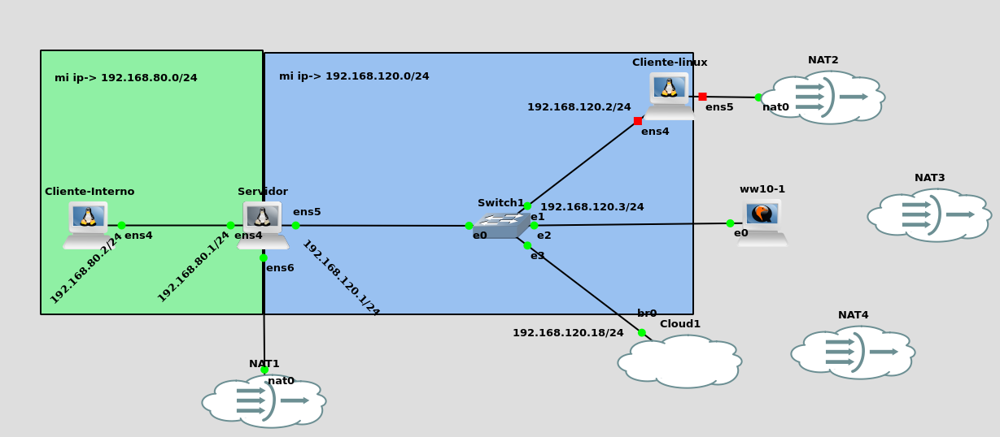
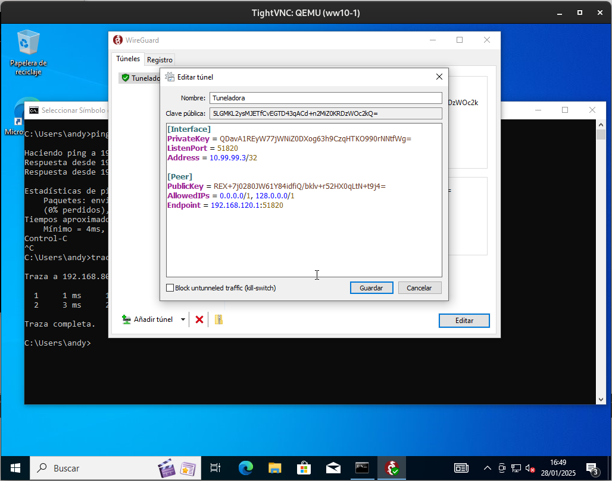
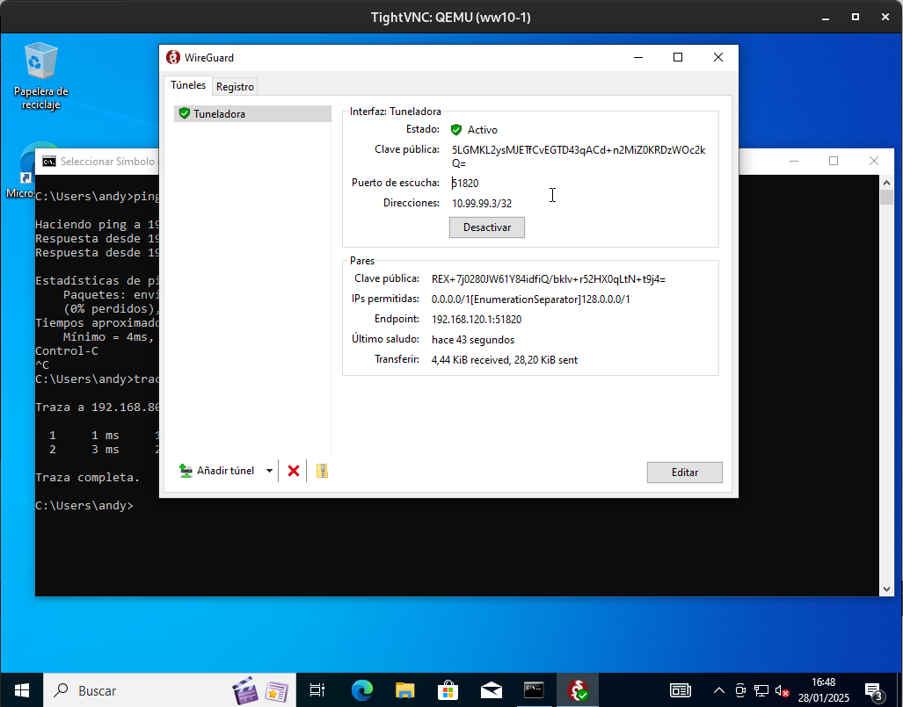
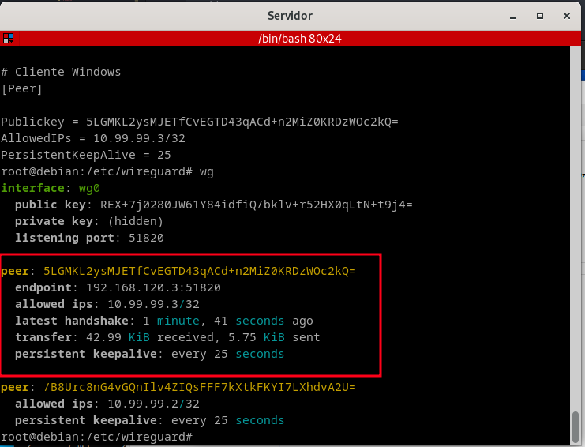
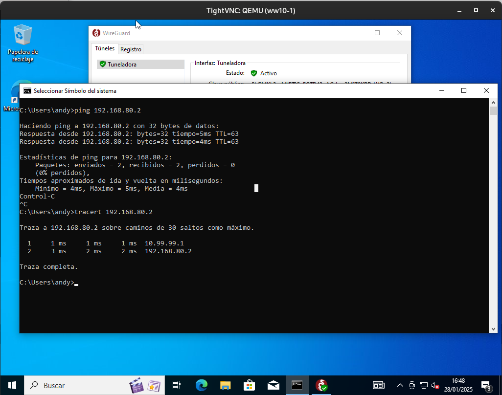

# Escenario




Antes de empezar a configurar lo que son las vpn, y servidorhe hecho ha sido confirgurarado el cliente que va a estar hiper aislado, es decir, **cliente 1** solo con su ip correspondiente y con la puerta de enlace dirigida al servidor.

Por lo que vas a proceder a lo siguiente:

# Configuraciones

## Configuración de maquina servidor

- Instalación de Wireguard por lo que vamos a meter el siguiente comando:

`root@debian:~# sudo apt install wireguard -y`

Te vas a dirigir al sudo apt install wireguard de **WireGuard**, creamos las claves del servidor que nos servirán para configurar los clientes y el fichero de configuración del servidor.

```root@debian:~# cd /etc/wireguard/```

Para la creación de la clave, usaremos el siguiente comando en el directorio mencionado antes:

```wg genkey | tee serverprivatekey | wg pubkey > serverpublickey```

Donde si hago un desglose del mismo comando:

- `wg genkey`: Este comando genera una **clave privada** para WireGuard. 

- `| tee serverprivatekey`: 
  - El comando `tee serverprivatekey` guarda la clave privada en un archivo llamado `serverprivatekey`.  
  - Al mismo tiempo, la clave privada también se envía a la siguiente parte del pipeline.

- `| wg pubkey`
  - El comando `wg pubkey` toma la clave privada como entrada y genera su correspondiente **clave pública**.

- `> serverpublickey`
  - Finalmente, la salida de `wg pubkey` (la clave pública) se redirige y guarda en un archivo llamado `serverpublickey`.


Y vemos como se ha generado la clave tanto privada como pública:

- Clave privada
```
root@debian:/etc/wireguard# cat serverprivatekey 
6DkFuGeDmjJV8jOQ7+DjzRXWmqrNVFYYgIgPKJlWgl0=
```
- Clave pública

```
root@debian:/etc/wireguard# cat serverpublickey 
REX+7j0280JW61Y84idfiQ/bklv+r52HX0qLtN+t9j4=
```
Si lo vemos por pantalla seria tal que así:


Ahora creamos el fichero de configuración que se llamara **wg0.conf** el que tendra el siguiente contenido:

```
# Server config
[Interface]

# Ip que va a tomar el servidor por el tunel, vamos la que vamos a ponerle
Address = 10.99.99.1 

# clave privada del servidor
PrivateKey = 6DkFuGeDmjJV8jOQ7+DjzRXWmqrNVFYYgIgPKJlWgl0=

#Puerto de escucha
ListenPort = 51820
```

Ahora activo lo que será la interfaz de **WireGuard**, por lo que hacemos uso del siguiente comando:

`wg-quick up wg0`

Y nos saldrá por pantalla lo siguiente:


Y compruebo que funciona con el siguiente comando `wg` y lo podemos ver a continuación:


Y a parte verificamos lo que será en las interfaces con el comando `ip a`:


## Configuración cliente Linux

Lo primero que tendremos que hacer es hacer un **update**, y luego **instalarnos** lo que sera **WireGuard**:

```
debian@debian:~$ sudo apt update
debian@debian:~$ sudo apt install wireguard -y
```

Ahora vamos al directorio `/etc/wireguard` y creamos un par de claves:

```
root@debian:~# cd /etc/wireguard/
root@debian:/etc/wireguard#  wg genkey | tee clientprivatekey | wg pubkey > clientpublickey

```

- Clave cliente pública
```
root@debian:/etc/wireguard# cat clientpublickey 
/B8Urc8nG4vGQnIlv4ZIQsFFF7kXtkFKYI7LXhdvA2U=

```
- Clave cliente privada

```
root@debian:/etc/wireguard# cat clientprivatekey 
MOy6FX61P+0Ti8nSlX6hd+qLU9zMPiBWJbJekfX8xHM=

```

Creo el ficherco de configuración que se llamará `wg0.conf`, el cual tendrá la siguiente información:

```
 [Interface]
 # Ip que va a pillar este cliente 
    Address = 10.99.99.2/24 
 #Clave privada del cliente
    PrivateKey = MOy6FX61P+0Ti8nSlX6hd+qLU9zMPiBWJbJekfX8xHM=
 #Puerto de escucha del servidor
    ListenPort = 51820

    [Peer]
 #Clave pública del servidor
    PublicKey = REX+7j0280JW61Y84idfiQ/bklv+r52HX0qLtN+t9j4=
 # Rango de direcciones permitidas para el túnel.
    AllowedIPs = 0.0.0.0/0
 #Punto de acceso del servidor
    Endpoint = 192.168.120.1:51820
 #Tiempo de espera de la conexión
    PersistentKeepalive = 25
```

Una vez hecho lo que es el fichero pasamaos a activarlo, con el siguiente comando:

`root@debian:/etc/wireguard#  wg-quick up wg0`

Y nos parecera por pantalla lo siguiente:


Y para verificar del todo metemos el comando `ip a`:


Ahora que hemos configurado el cliente, tendremos que **volver a lo que es el servidor** y editar el archivo `wg0.conf` donde tendremos que incluir el cliente Linux que acabamos de configurar, por lo que el fichero va a quedar con este aspecto:

```
# Server config
[Interface]
Address = 10.99.99.1

#Clave privada del servidor
PrivateKey = 6DkFuGeDmjJV8jOQ7+DjzRXWmqrNVFYYgIgPKJlWgl0=
ListenPort = 51820

#Bit de forwarding
PreUp = sysctl -w net.ipv4.ip_forward=1


# Cliente Linux
[Peer]

#Clave pública del cliente
Publickey = /B8Urc8nG4vGQnIlv4ZIQsFFF7kXtkFKYI7LXhdvA2U=
#IP del cliente
AllowedIPs = 10.99.99.2/32
#Tiempo de espera de respuesta
PersistentKeepAlive = 25

```

Por lo que despues de esta modificación tendras que reiniciar el servicio de la siguiente manera:

```
wg-quick down wg0
wg-quick up wg0
```

Como podemos ver:


Y ahora hago la comprobación tanto del **ping** como de un **traceroute**:


## Configuración cliente Windows
Lo primero que hice fue descargar de su página oficial de [WireGuard](https://www.wireguard.com/install/) para lo que es el cliente Windows, es un ejecutable.

Despues de eso lo que hago es coger y cambiar la ip, y lo que es su puerta de enlace, luego de eso ejecutamos el ejecutable descargado, y lo que hacemos es añadir un nuevo tunel desde cero, por lo que tenemos lo siguiente configuración:

- **Dirección cliente  Windows**


- **Archivo de WireGuard en Windows**



- **Tunel activo**




Archivo de configuracion wireguard de servidor, ya que tenemos que ***añadir*** al **cliente windows**

```
root@debian:/etc/wireguard# cat wg0.conf 
# Server config
[Interface]
Address = 10.99.99.1

#Clave privada del servidor
PrivateKey = 6DkFuGeDmjJV8jOQ7+DjzRXWmqrNVFYYgIgPKJlWgl0=
ListenPort = 51820

#Bit de forwarding
PreUp = sysctl -w net.ipv4.ip_forward=1


# Cliente Linux
[Peer]

#Clave pública del cliente
Publickey = /B8Urc8nG4vGQnIlv4ZIQsFFF7kXtkFKYI7LXhdvA2U=
#IP del cliente
AllowedIPs = 10.99.99.2/32
#Tiempo de espera de respuesta
PersistentKeepAlive = 25

#Cliente windows

# Cliente Windows
[Peer]

Publickey = 5LGMKL2ysMJETfCvEGTD43qACd+n2MiZ0KRDzWOc2kQ=
AllowedIPs = 10.99.99.3/32
PersistentKeepAlive = 25
```
Por lo que despues de esta modificación tendras que reiniciar el servicio de la siguiente manera:

```
wg-quick down wg0
wg-quick up wg0
```

Y como podemos observar, esta activada la que esta en windows:



Y ahora lo que hacemos es la comprobación de que se ve desde el cliente windows a cliente interno, he hehco tanto un oping como un tracerouter para ver el saltito que pega:



Y como podemos ver esta que va volando la configuración

## Configuracion de ANdroid

Para ello lo que tiene sque hacer por no complicarte la vida, y porque lo he visto en 27000 foros, después de estar peleando con esto 3 días, es coger y bajarte la app de **WireGuard**, creas un tunel desde cero, por aqui te dejo la configuración:


y como podemos ver esta activada:


# Conclusión

Hay que comparar esto con el punto a, solo es mi opinión , y es que si me pogo a comparar lo que es el manejo, es mucho más sencillo el uso para el usuario, y más facíl saber donde te equivocas por si fallas, y que tambien no hay que crear un certificado para cada cliente, eso hace que el apartado a y b, sea bastante engorroso, y tampoco hace falta que nuesrro servidor tenga si o si una IP pública, por lo que la verdad es bastante más versatil a lo que a la realidad se acerca esta práctica.


Aquí tienes una cervecita fresquita y opertiva🍻, y salud!!!🍻😄

