Lo primero que he hecho ha sido confirgurar un cliente interno


# Configuración de maquina servidor

Instalación de Wireguard


Nos dirigimos al directorio de configuración de WireGuard, creamos las claves del servidor que nos servirán para configurar los clientes y el fichero de configuración del servidor.
```root@debian:~# cd /etc/wireguard/```
Para la creación de la clave, usaremos el siguiente comando en el directorio mencionado antes:


```wg genkey | tee serverprivatekey | wg pubkey > serverpublickey```

Donde si hago un desglose del mismo comando:

- `wg genkey`: Este comando genera una **clave privada** para WireGuard. La clave privada es única y se utiliza para la autenticación y el cifrado.

- `| tee serverprivatekey`:
  - El símbolo `|` pasa la salida de `wg genkey` (la clave privada) al comando `tee`.  
  - El comando `tee serverprivatekey` guarda la clave privada en un archivo llamado `serverprivatekey`.  
  - Al mismo tiempo, la clave privada también se envía a la siguiente parte del pipeline.

- `| wg pubkey`
  - El comando `wg pubkey` toma la clave privada como entrada y genera su correspondiente **clave pública**.

- `> serverpublickey`
  - Finalmente, la salida de `wg pubkey` (la clave pública) se redirige y guarda en un archivo llamado `serverpublickey`.


Y vemos como se ha geberado la clave tanto privada como pública:

- Clave privada
```
root@debian:/etc/wireguard# cat serverprivatekey 
6DkFuGeDmjJV8jOQ7+DjzRXWmqrNVFYYgIgPKJlWgl0=

```
- Clave pública

```
root@debian:/etc/wireguard# cat serverpublickey 
REX+7j0280JW61Y84idfiQ/bklv+r52HX0qLtN+t9j4=

```
Si lo vemos por pantalla seria tal que así:


Ahora creamos el fichero de configuración que se llamara **wg0.conf** el que tendra el siguiente contenido:

```
# Server config
[Interface]

# Ip del servidor 
Address = 10.99.99.1

# clave prvada del servidor
PrivateKey = 6DkFuGeDmjJV8jOQ7+DjzRXWmqrNVFYYgIgPKJlWgl0=

#Puerto de escucha
ListenPort = 51820

```

Donde:


Ahora activo lo que será la interfaz de **WireGuard**, por lo que hacemos uso del siguiente comando:

`wg-quick up wg0`

Y nos saldrá por pantalla lo siguiente:

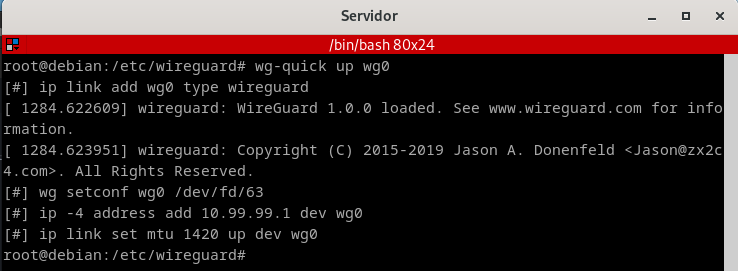

Y compruebo que funciona con el siguiente comando `wg` y lo podemos ver a continuación:

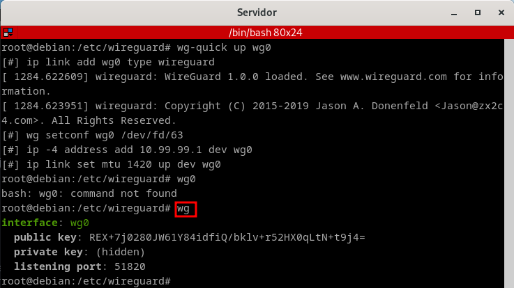

Y a parte verificamos lo que será en las interfaces con el comando `ip a`:

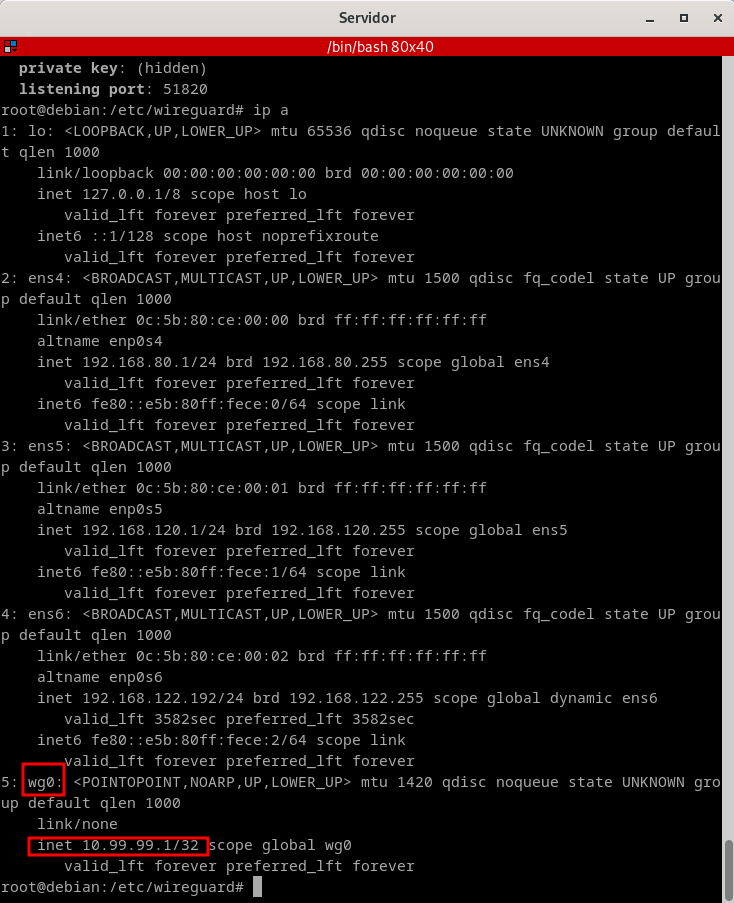


# COnfiguración cliente Linux

Lo primero que tendremos que hacer es hacer un update, y luego instalarnos lo que sera WireGuard:

```
debian@debian:~$ sudo apt update
debian@debian:~$ sudo apt install wireguard -y
```

Ahora vamos al directorio `/etc/wireguard` y creamos un par de claves:

```
root@debian:~# cd /etc/wireguard/
root@debian:/etc/wireguard#  wg genkey | tee clientprivatekey | wg pubkey > clientpublickey

```

- Clave cliente pública
```
root@debian:/etc/wireguard# cat clientpublickey 
/B8Urc8nG4vGQnIlv4ZIQsFFF7kXtkFKYI7LXhdvA2U=

```
- Clave cliente privada

```
root@debian:/etc/wireguard# cat clientprivatekey 
MOy6FX61P+0Ti8nSlX6hd+qLU9zMPiBWJbJekfX8xHM=

```

Creo el ficherco de configuración que se llamará `wg0.conf`, el cual tendrá la siguiente información:

```
 [Interface]
    Address = 10.99.99.2/24
    #Clave privada del cliente
    PrivateKey = MOy6FX61P+0Ti8nSlX6hd+qLU9zMPiBWJbJekfX8xHM=
    #Puerto de escucha del servidor
    ListenPort = 51820

    [Peer]
    #Clave pública del servidor
    PublicKey = REX+7j0280JW61Y84idfiQ/bklv+r52HX0qLtN+t9j4=
    AllowedIPs = 0.0.0.0/0
    #Punto de acceso del servidor
    Endpoint = 192.168.120.1:51820
    #Tiempo de espera de la conexión
    PersistentKeepalive = 25
```

Una vez hecho lo que es el fichero pasamaos a activarlo, con el siguiente comando:

`root@debian:/etc/wireguard#  wg-quick up wg0`

Y nos parecera por pantalla lo siguiente:

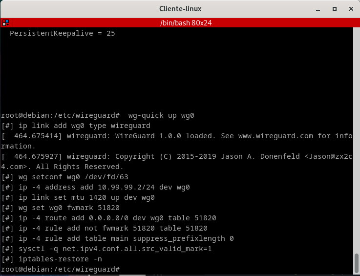

Y para verificar del todo metemos el comando `ip a`:

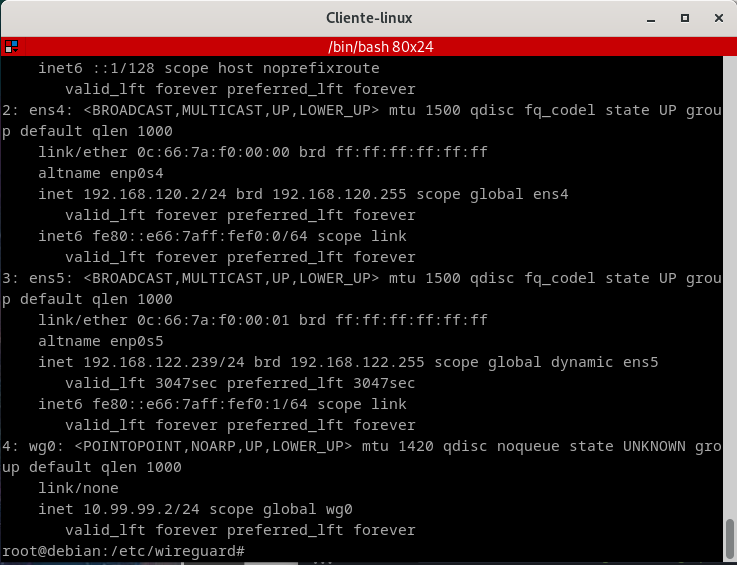

Ahora que hemos configurado el cliente, tendremos que volver a lo que es el servidor y editar el archivo `wg0.conf` donde tendremos que incluir el cliente Linux que acabamos de configurar, por lo que el fichero va a quedar con este aspecto:

```
# Server config
[Interface]
Address = 10.99.99.1

#Clave privada del servidor
PrivateKey = 6DkFuGeDmjJV8jOQ7+DjzRXWmqrNVFYYgIgPKJlWgl0=
ListenPort = 51820

#Bit de forwarding
PreUp = sysctl -w net.ipv4.ip_forward=1


# Cliente Linux
[Peer]

#Clave pública del cliente
Publickey = /B8Urc8nG4vGQnIlv4ZIQsFFF7kXtkFKYI7LXhdvA2U=
#IP del cliente
AllowedIPs = 10.99.99.2/32
#Tiempo de espera de respuesta
PersistentKeepAlive = 25

```

Por lo que despues de esta modificación tendras que reiniciar el servicio de la siguiente manera:

```
wg-quick down wg0
wg-quick up wg0
```

Como podemos ver:

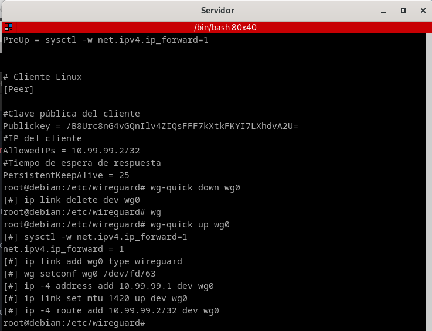

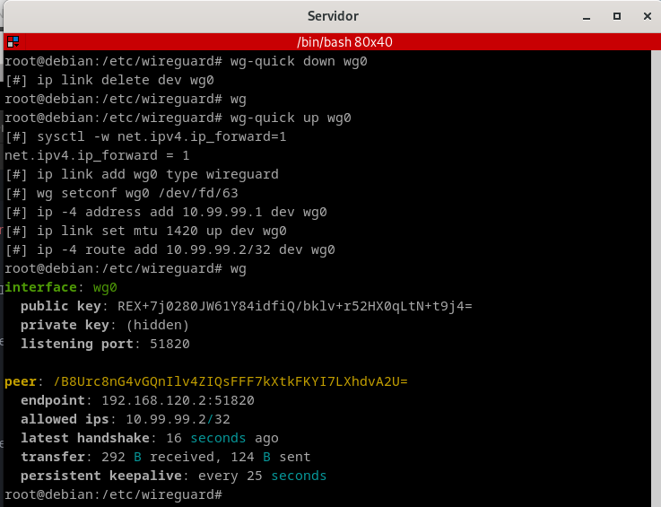

Y ahora hago la comprobación tanto del **ping** como de un **traceroute**:

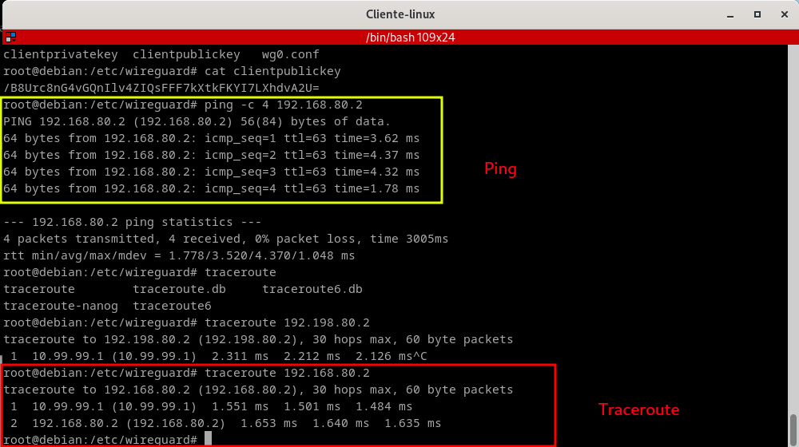


# Configuración cliente Windows

En este caso lo que tenemos que hacer es cambiar la ip del cliente windows, yo lo he hecho por interfaz grafica, y ahroa tengo la siguiente:

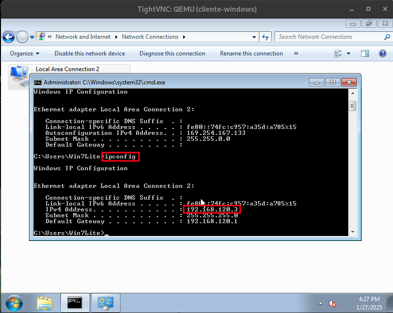

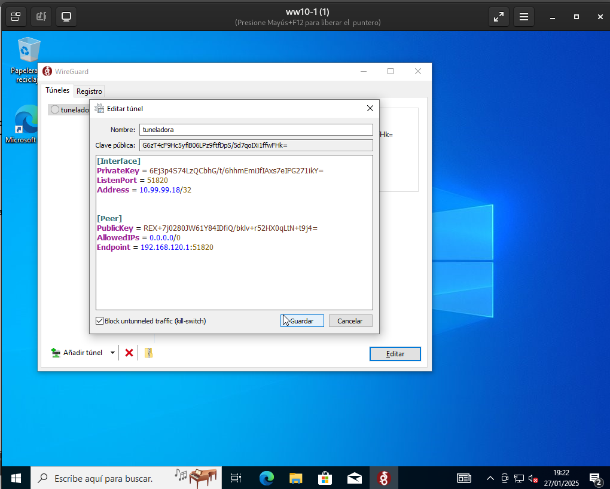

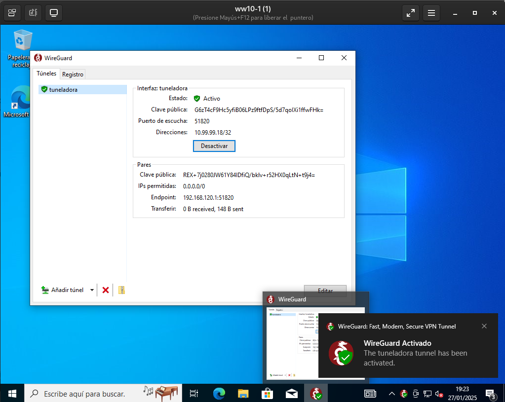
Archivo de configuracion wireguard de servidor:

```
# Server config
[Interface]
Address = 10.99.99.1

#Clave privada del servidor
PrivateKey = 6DkFuGeDmjJV8jOQ7+DjzRXWmqrNVFYYgIgPKJlWgl0=
ListenPort = 51820

#Bit de forwarding
PreUp = sysctl -w net.ipv4.ip_forward=1


# Cliente Linux
[Peer]

#Clave pública del cliente
Publickey = /B8Urc8nG4vGQnIlv4ZIQsFFF7kXtkFKYI7LXhdvA2U=
#IP del cliente
AllowedIPs = 10.99.99.2/32
#Tiempo de espera de respuesta
PersistentKeepAlive = 25

# Cliente Windows
[Peer]
Publickey = G6zT4cF9Hc5yfiB06LPz9ftfDpS/5d7qolXi1ffwFHk=
AllowedIPs = 10.99.99.3/32
PersistentKeepAlive = 25
```
Por lo que despues de esta modificación tendras que reiniciar el servicio de la siguiente manera:

```
wg-quick down wg0
wg-quick up wg0
```
# COnfiguracion de ANdroid

En este caso h eusado lo que seria mi propio telefono para crear la VPN es tan facil como bajarnos la app, y estar desde nuestro wifi y seguir lo pasos que nos pone:

