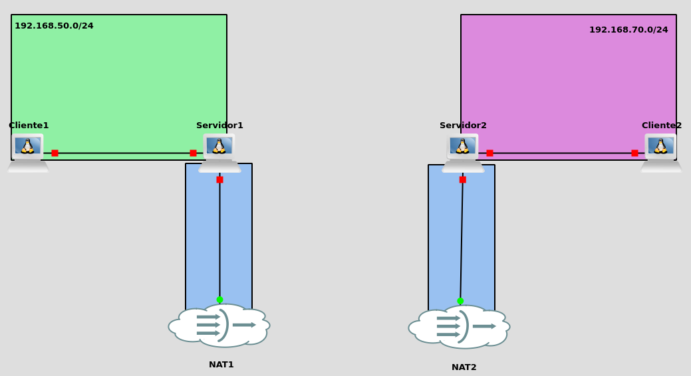
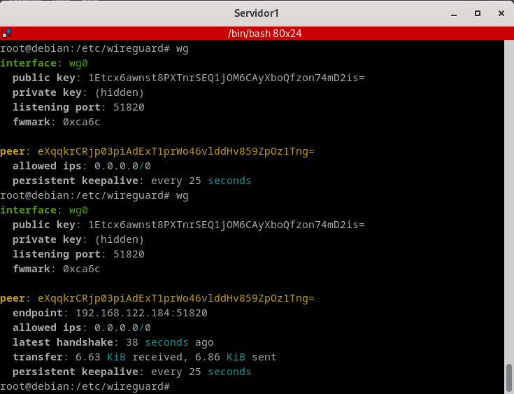
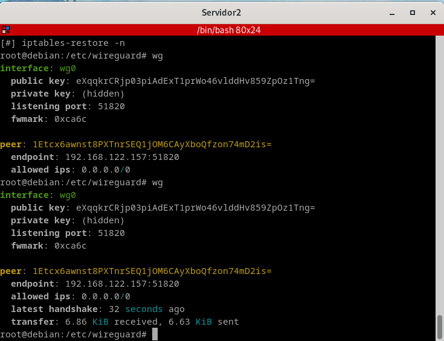
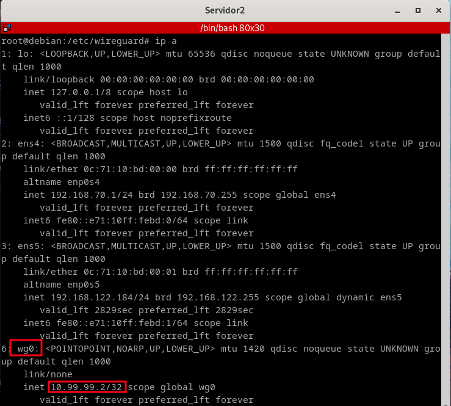
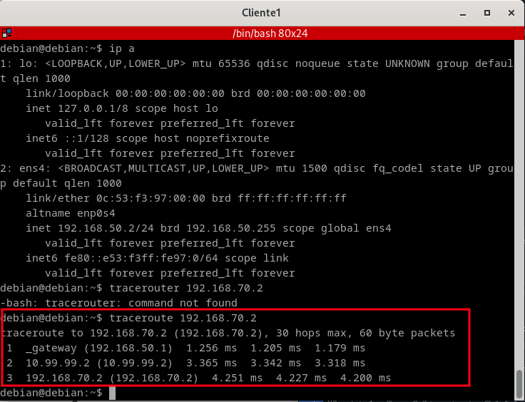
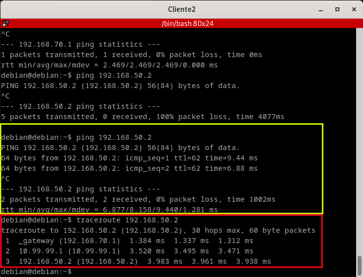

# VPN site to site con WireGuard

Lo que vas a hacer a continuación es hacer la configuración de los servidores,. empezarás por el **servidor 1** y continuarás con el **servidor 2**.

El escenario tendrá la siguiente apariencia:



## Configuración servidores 

### Servidor 1

Lo primero que vamos a hacer es meternos como **root**, es decir, con el comando `sudo su`, y procedemos a instalar lo que será **WireGuard** con el siguiente comando:

`apt install wireguard -y`

Ni que decir tengo que como en los demás apartado es impertaivo activar el **bit de forwarding**, voy a ser bastante reiterativo y haré uso del mismo párrafo a lo que la activación se corresponde.

- Habilitar el **bit de forwarding**, por lo que editaremos el siguiente fichero `/etc/sysctl.conf` descomentando la línea que pone lo siguiente:

                                `net.ipv4.ip_forward=1`

Tras ello aseguramos que se ha habilitado bien, haciendo uso del siguiente comando `sysctl -p`

**🚨 Esto que acabamos de hacer nos ahorrará demasiados quebraderos de cabeza, ya lo confirmo yo. 🚨**

Ahora nos dirigimos al siguiente directorio `/etc/wireguard` y en donde generamos un par de claves, por lo que harás uso del siguiente comando:

``wg genkey | tee serverprivatekey | wg pubkey > serverpublickey``

Y como podemos observar tenemos tanto la clave pública como la privada.

- Clave pública:
```
root@debian:/etc/wireguard# cat serverpublickey 
1Etcx6awnst8PXTnrSEQ1jOM6CAyXboQfzon74mD2is=
```
- Clave privada:

```
root@debian:/etc/wireguard# cat serverprivatekey 
YKW61eRKCA1vUJrbNhtUpID5Pj3dK2U/zxRBMSTl3Us=

```

Ahora lo que tendrás que hacer es hacer el fichero de configuración por el que **WireGuard** se va regir , el cual vamos a llamar **wg0.conf** y el cual va a tener el siguiente contenido:

```
[Interface]
Address = 10.99.99.1
PrivateKey = YKW61eRKCA1vUJrbNhtUpID5Pj3dK2U/zxRBMSTl3Us=
ListenPort = 51820

```

Donde:

- `Address`: Es la ip que va a tener nuestro túnel.
- `ProvateKey`: Es la clave privada del servidor, es decir, la que acabamos de generar.
- `ListenPort`: Es pro el puerto que escucha WireGuard
Ahora lo que hacenmos es iniciar el servicio con el siguiente comando:

`wg-quick up wg0`

Ahora lo que tendrás que hacer es la configuración del servidor 2.

### Servidor 2

En este caso vas a hacer lo mismo que en el **servidor 1**, por lo que me voy a reiterar.

Lo primero que vamos a hacer es meternos como **root**, es decir, con el comando `sudo su`, y procedemos a instalar lo que será **WireGuard** con el siguiente comando:

`apt install wireguard -y`

Ni que decir tengo que como en los demás apartado es impertaivo activar el **bit de forwarding**, voy a ser bastante reiterativo y haré uso del mismo párrafo a lo que la activación se corresponde.

- Habilitar el **bit de forwarding**, por lo que editaremos el siguiente fichero `/etc/sysctl.conf` descomentando la línea que pone lo siguiente:

                                `net.ipv4.ip_forward=1`

Tras ello aseguramos que se ha habilitado bien, haciendo uso del siguiente comando `sysctl -p`

**🚨 Esto que acabamos de hacer nos ahorrará demasiados quebraderos de cabeza, ya lo confirmo yo. 🚨**

Ahora nos dirigimos al siguiente directorio `/etc/wireguard` y en donde generamos un par de claves, por lo que harás uso del siguiente comando:

``wg genkey | tee serverprivatekey | wg pubkey > serverpublickey``

Y como podemos observar tenemos tanto la clave pública como la privada.

- Clave pública:
```
root@debian:/etc/wireguard# cat serverpublickey 
eXqqkrCRjp03piAdExT1prWo46vlddHv859ZpOz1Tng=
```
- Clave privada:

```
root@debian:/etc/wireguard# cat serverprivatekey 
GKwuEMEMZxoh9nbKGxNx4+nYtKJlPLmiRWg4X2a4ekE=
```

Al igual que antes crearemos lo que será el fichero de configuración **wg0.conf**, el cual tendrá lo siguiente:

```
[Interface]
Address = 10.99.99.2 #Ip que va a coger el server 2, con el túnel
PrivateKey = GKwuEMEMZxoh9nbKGxNx4+nYtKJlPLmiRWg4X2a4ekE= #Clave privada del server 2
ListenPort = 51820 # Puerto por el que va a conectarse

[Peer]
PublicKey = 1Etcx6awnst8PXTnrSEQ1jOM6CAyXboQfzon74mD2is= # clave pública del servidor 1
AllowedIPs = 0.0.0.0/0 # Rango de direcciones permitidas para el túnel.
Endpoint = 192.168.122.157:51820 #Ip lo que da inernet en el servidor 1
```
Y ahora lo que tendrá que hacer antes de iniciar nada es volver al servidor 1 para añadir en el fichero de configuración **wgo.conf** por lo que va a quedar de la siguiente manera:

```
# Fichero de configuracion tunel del server 1

[Interface]
Address = 10.99.99.1 #Ip que va a coger el server 1, con el túnel
PrivateKey = YKW61eRKCA1vUJrbNhtUpID5Pj3dK2U/zxRBMSTl3Us= # Clave privada del server 1
ListenPort = 51820 # Puerto por el que va a escuchar


# Servidor 2
[Peer]
PublicKey = eXqqkrCRjp03piAdExT1prWo46vlddHv859ZpOz1Tng= #Clave publica del server 2
AllowedIPs = 0.0.0.0/0 # Rango de direcciones permitidas para el túnel.
PersistentKeepalive = 25 # Tiempo de escuchar

```

Ahora que hemos acabado con esto, lo que tendremos que hacer es iniciar o más bien resetear lo que son los túneles, por lo que te dejo por aquí los siguientes comandos:

```
wg-quick down wg0

wg-quick up wg0
```
Y ahora podemos ver como estan levantados o más bien funcionando:

- **Servidor 1**

 

- **Servidor 2**

 

Podemos ver como se ha añadido lo que es una interfaz nueva, con las ip que dimos en los ficheros:
- **Servidor 1**


- **Servidor 2**

 

Y ahora para hacer la verificación lo haremos tanto por parte del **cliente 1** como del **cliente **2, tanto un **ping** como con un **traceroute**

- **Cliente 1**
 



- **Cliente 2**

 


# Enhorabuena

🍻 ¡Enhorabuena! 🎉  Ahora te mereces una cerveza bien fría. ¡Salud! 🍺😎  
¡Disfruta tu cerveza! 🍺😄

