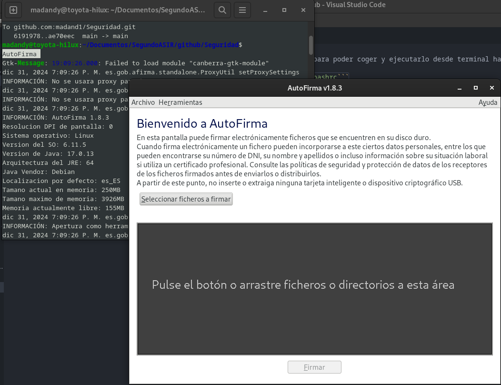

Una vez que nos descargamos la versión que queremos, lo que he hecho para poder coger y ejecutarlo desde terminal ha sido lo siguioente:

1. Abrir el archivo de configuración de shell y editarlo: ```nano ~/.bashrc```
2. Agrego esta linea ```alias AutoFirma='java -jar /usr/lib/AutoFirma/AutoFirma.jar'```
3. Guardamos y cerramos el archovo y hacermos una recagar de configuración ``` source ~/.bashrc```
4. Ejecutamos desde terminal **AutoFirma** 

