# Certificados digitales. HTTPS

Para la realización de esta práctica recomiendo que se haga una lectura de los siguientes documentos:

- [Cifrado asimétrico](Seguridad/Practicas/Cifadro-Asimétrico.md)
- [Integridad, firmas y autentificación](Seguridad/Practicas/Integridadi-firmas-y-autencificación.md)

Ya que estos tendrán un tema importante en esta parte, pero al haberlo tratado con ahinco anteriormente, no me voy a parar en lo que no sea de ayuda en estos momentos.

## Certificado digital de persona física

### Introducción

#### ¿Qué es un certificado digital?

Un certificado digital es un archivo electrónico que acredita la identidad de una persona, ya sea física o jurídica, y se emplea para la firma de documentos digitales. Este certificado incluye datos sobre el solicitante, como su nombre, apellidos, número de identificación (DNI), fecha de nacimiento, entre otros. También incorpora información sobre la entidad emisora, como su nombre, CIF, dirección, y otros detalles relevantes.


Ahora vamos a proceder obtener el certificado, y hacer la instalación.

## Tarea 1: Instalación del certificado

### Instalación del certificado en nuestro navegador

1. **Una vez que hayas obtenido tu certificado, explica brevemente como se instala en tu navegador favorito.**

Para ello he usado la app [Certificado digital FNMT](https://play.google.com/store/apps/details?id=es.fnmtrcm.ceres.certificadoDigitalFNMT&hl=es_419&pli=1),la cual lo hice a través de mi teléfono móvil, ya que para pedirlo he tenido que hacer una video llamada para conseguirlo, y una vez que hayamos pagado procedemos a instalarlo por lo que nos pedirá nuestro nombre, primer apellido y tendremos que poner una contraseña, y ahora lo que tendremos que hacer es instalarlo.

Una vez instalado el certificado, nos preguntara si queremos crear una copia de seguirdad del certificado, se nos confirmará que la copia de seguridad se realizo correctamente, como la tengo en el móvil lo que voy a hacer es pasarla a través de whatsapp, tal y como muestro a continuación:


Una vez que tengo esto, procederé a instalarlo lo que será al navegador, como no voy a usar **firefox** , por lo que tendremos que abrir en primer luegar el navegador, y nos dirigeremos a la sección de **Ajustes**


2. **Muestra una captura de pantalla donde se vea las preferencias del navegador donde se ve instalado tu certificado.**


Una vez dentro nos dirigiremos a la sección **Privacidad & Seguridad > Certificados > Ver certificados** y haremos clic en **Importar** y seleccionaremos el archivo que tiene como extensión **.p12** y meteremos la contraseña que le pusimos en el dispositivo móvil con anterioridad, y una vez hecho confirmaremos la importación, y se nos veriá tal que así despues de seguir estos pasos:


3. **¿Cómo puedes hacer una copia de tu certificado?¿Como vas a realizar la copia de seguridad de tu certificado?. Razona la respuesta.**

Para hacer este paso, nos deberemos dirigir a la parte derecha superior en el buscador e ir a lo siguiente **Ajustes > Privacidad y Seguridad > Certificados > Ver Certificados**. Este nos abrira la misma ventana que hemos visto con anterioridad. 

Clicariamos en el certificado que queremos hacer una copia de seguridad en este caso el que pone **MORALES GONZALEZ ANDRES**, y pulsariamos en **Hacer copia**, el cual nos abrirá la ventana en la que nos pedirá que instroduzcamos la contraseña de nuuestro certificado.


Una vez introduzcamos la contraseña para proteger nuestra copia de seguridad, tendremos hecha la copia.


Como la tengo en mi móvil lo que he hecho ha sido una copia para este ejercicio, pero mi copia original la que uso para todo esta en mi **Drive** desde el minuto uno, y es la que uso para cualquier dispositivo que sea mio, y me haga falta.


4. **Investiga como exportar la clave públia de tu certificado.**

La clave pública se utiliza para garantizar que los datos cifrados puedan ser descifrados solo por la clave privada asociada, que está en manos del titular del certificado. Este proceso es esencial para compartir la parte pública de un par de claves en comunicaciones seguras o validaciones de firma.

#### Pasos para exportar la clave públcia:

1. ***Convertir el certificado P12 a JKS (Java KeyStore): Esto es necesario para utilizar herramientas que operan con este formato.***

```
keytool -importkeystore -srckeystore certificado-andres.p12 -srcstoretype pkcs12 -destkeystore certificado.jks -deststoretype JKS

```

Donde:

- ```srckeystore```: Indica el archivo fuente, en este caso el archivo .p12.
- ```srcstoretype``` pkcs12: Especifica que el tipo de almacén de claves de origen es PKCS12.
- ````destkeystore````: Indica el archivo de destino.
- ````deststoretype JKS````: Especifica que el formato de destino será Java KeyStore.

Nos saldra en pantalla lo siguiente:

El comando solicitará las contraseñas del almacén de claves fuente y destino, y notificará sobre la correcta importación del certificado.


Por lo que veremos en terminal lo siguiente:

```
madandy@toyota-hilux:~/Documentos/certificado-digital/tarea1$ 
keytool -v -importkeystore -srckeystore certificado-andres.p12 -srcstoretype pkcs12 -destkeystore certificado.jks -deststoretype JKS
Importando el almacén de claves de certificado-andres.p12 a certificado.jks...
Introduzca la contraseña de almacén de claves de destino:  
Volver a escribir la contraseña nueva: 
Introduzca la contraseña de almacén de claves de origen:  
La entrada del alias morales_gonzalez_andres___49134204v_sdc_1_2_18_a se ha importado correctamente.
Comando de importación completado: 1 entradas importadas correctamente, 0 entradas incorrectas o canceladas
[Almacenando certificado.jks]

Warning:
El almacén de claves JKS utiliza un formato propietario. Se recomienda migrar a PKCS12, que es un formato estándar del sector que utiliza "keytool -importkeystore -srckeystore certificado.jks -destkeystore certificado.jks -deststoretype pkcs12".
```

2. ***Listar alias del almacén JKS para identificar el alias correcto:***

Antes de exportar la clave pública, debes identificar el alias del certificado dentro del almacén.

comando ```keytool -list -keystore certificado.jks``` y nos saldrá lo siguiente:

```
madandy@toyota-hilux:~/Documentos/certificado-digital/tarea1$ 
keytool -list -keystore certificado.jks
Introduzca la contraseña del almacén de claves:  
Tipo de Almacén de Claves: JKS
Proveedor de Almacén de Claves: SUN

Su almacén de claves contiene 1 entrada

morales_gonzalez_andres___49134204v_sdc_1_2_18_a, 31 dic 2024, PrivateKeyEntry, 
Huella de certificado (SHA-256): F4:AF:60:56:D6:1E:7B:DF:DE:D1:ED:1F:26:BF:71:CF:50:53:12:CB:49:FE:63:11:94:86:E0:9C:C8:C6:D9:BD

Warning:
El almacén de claves JKS utiliza un formato propietario. Se recomienda migrar a PKCS12, que es un formato estándar del sector que utiliza "keytool -importkeystore -srckeystore certificado.jks -destkeystore certificado.jks -deststoretype pkcs12".
```

3. ***Exportar la clave pública al formato PEM
Utiliza el alias correcto para exportar la clave pública, para ello haremos uso del siguiente comando ```keytool -exportcert -keystore certificado.jks -alias morales_gonzalez_andres___49134204v_sdc_1_2_18_a -file clave-publica.pem -rfc```***

Donde:

- ```keystore certificado.jks```: Especifica el almacén de claves.
- ```alias```: Indica el alias del certificado.
- ```file```: Define el archivo de salida donde se almacenará la clave pública.
- ```rfc```: Genera la salida en formato Base64 compatible con PEM.

Y si lo hacemos por pantalla veremos lo siguinte:

```madandy@toyota-hilux:~/Documentos/certificado-digital/tarea1$ 
keytool -exportcert -keystore certificado.jks -alias morales_gonzalez_andres___49134204v_sdc_1_2_18_a -file clave-publica.pem -rfc
Introduzca la contraseña del almacén de claves:  
Certificado almacenado en el archivo <clave-publica.pem>

Warning:
El almacén de claves JKS utiliza un formato propietario. Se recomienda migrar a PKCS12, que es un formato estándar del sector que utiliza "keytool -importkeystore -srckeystore certificado.jks -destkeystore certificado.jks -deststoretype pkcs12".
```

4. ***Verificamos el contenmido del archivo que hemos exportado***

Para ello nos ayudaremos del comando ```cat calve-publica.pem```

Lo que vemos por pantalla:

```
madandy@toyota-hilux:~/Documentos/certificado-digital/tarea1$ 
cat clave-publica.pem
-----BEGIN CERTIFICATE-----
MIIHnDCCBoSgAwIBAgIQfFWLQiUDD4FnaTTutZgDkTANBgkqhkiG9w0BAQsFADBL
MQswCQYDVQQGEwJFUzERMA8GA1UECgwIRk5NVC1SQ00xDjAMBgNVBAsMBUNlcmVz
MRkwFwYDVQQDDBBBQyBGTk1UIFVzdWFyaW9zMB4XDTI0MTIyMzEwMDExOFoXDTI4
MTIyMzEwMDExOFowgYExCzAJBgNVBAYTAkVTMRgwFgYDVQQFEw9JRENFUy00OTEz
NDIwNFYxDzANBgNVBCoMBkFORFJFUzEZMBcGA1UEBAwQTU9SQUxFUyBHT05aQUxF
WjEsMCoGA1UEAwwjTU9SQUxFUyBHT05aQUxFWiBBTkRSRVMgLSA0OTEzNDIwNFYw
ggEiMA0GCSqGSIb3DQEBAQUAA4IBDwAwggEKAoIBAQCVJc55vVAXW7VSXduFFRh6
p3C90xxAZQV8ME+ao+BnewhanIxDUwaqjqDm34iheHbVuGkz2yk7kBjs8HkJ9Yvj
gCl7/o15lbRv6YZAL0ozE0JD5aFAntRTNEF+Fz6Rn8FtSqARoJEFuEbGd5VBeuZB
i4V6jzQHorpdF13uoTw7SNa6VpkqzZkoUqpr+Ag3X+1a/5eeS0TL1RXbKx2Q4kf4
YrBHldngzoSO22gofpEjcfQYUNClnSptxtqtrLd/d2KacBvIIoPa3KCBGtWN1rPm
yAqigybyjrwbIheHslLSEhKiqy9hkAejoh+OTdv/o6wwK7Fukw+r1pMfpwlmemsJ
AgMBAAGjggRDMIIEPzBvBgNVHREEaDBmpGQwYjEYMBYGCSsGAQQBrGYBBAwJNDkx
MzQyMDRWMRcwFQYJKwYBBAGsZgEDDAhHT05aQUxFWjEWMBQGCSsGAQQBrGYBAgwH
TU9SQUxFUzEVMBMGCSsGAQQBrGYBAQwGQU5EUkVTMAwGA1UdEwEB/wQCMAAwDgYD
VR0PAQH/BAQDAgXgMCoGA1UdJQQjMCEGCCsGAQUFBwMCBgorBgEEAYI3CgMMBgkq
hkiG9y8BAQUwHQYDVR0OBBYEFPrWkEcYIL3+SV4jKQVrPdXHjtiuMB8GA1UdIwQY
MBaAFLHUT8QjefpEBQnG6znP6DWwuCBkMIGCBggrBgEFBQcBAQR2MHQwPQYIKwYB
BQUHMAGGMWh0dHA6Ly9vY3NwdXN1LmNlcnQuZm5tdC5lcy9vY3NwdXN1L09jc3BS
ZXNwb25kZXIwMwYIKwYBBQUHMAKGJ2h0dHA6Ly93d3cuY2VydC5mbm10LmVzL2Nl
cnRzL0FDVVNVLmNydDCCARUGA1UdIASCAQwwggEIMIH6BgorBgEEAaxmAwoBMIHr
MCkGCCsGAQUFBwIBFh1odHRwOi8vd3d3LmNlcnQuZm5tdC5lcy9kcGNzLzCBvQYI
KwYBBQUHAgIwgbAMga1DZXJ0aWZpY2FkbyBjdWFsaWZpY2FkbyBkZSBmaXJtYSBl
bGVjdHLDs25pY2EuIFN1amV0byBhIGxhcyBjb25kaWNpb25lcyBkZSB1c28gZXhw
dWVzdGFzIGVuIGxhIERQQyBkZSBsYSBGTk1ULVJDTSBjb24gTklGOiBRMjgyNjAw
NC1KIChDL0pvcmdlIEp1YW4gMTA2LTI4MDA5LU1hZHJpZC1Fc3Bhw7FhKTAJBgcE
AIvsQAEAMIG6BggrBgEFBQcBAwSBrTCBqjAIBgYEAI5GAQEwCwYGBACORgEDAgEP
MBMGBgQAjkYBBjAJBgcEAI5GAQYBMHwGBgQAjkYBBTByMDcWMWh0dHBzOi8vd3d3
LmNlcnQuZm5tdC5lcy9wZHMvUERTQUNVc3Vhcmlvc19lcy5wZGYTAmVzMDcWMWh0
dHBzOi8vd3d3LmNlcnQuZm5tdC5lcy9wZHMvUERTQUNVc3Vhcmlvc19lbi5wZGYT
AmVuMIHmBgNVHR8Egd4wgdswgdiggdWggdKGgZ9sZGFwOi8vbGRhcHVzdS5jZXJ0
LmZubXQuZXMvY249Q1JMVTIxMTksY249QUMlMjBGTk1UJTIwVXN1YXJpb3Msb3U9
Q0VSRVMsbz1GTk1ULVJDTSxjPUVTP2NlcnRpZmljYXRlUmV2b2NhdGlvbkxpc3Q7
YmluYXJ5P2Jhc2U/b2JqZWN0Y2xhc3M9Y1JMRGlzdHJpYnV0aW9uUG9pbnSGLmh0
dHA6Ly93d3cuY2VydC5mbm10LmVzL2NybHNhY3VzdS9DUkxVMjExOS5jcmwwDQYJ
KoZIhvcNAQELBQADggEBAFEVhSvhFYQHa8VzKHWJffmq5ppxovtGtZ2G+Mntuy9t
awHeGbu8xE5KzNgy5L1CXVxKJ7DyM+gmXxwdsZcPEsXDo+UJyR5HSigHQzuge2Jb
0RauJnTLN0pwvSPRnkLMMPMce8fMfxOOFJnJ3lQL5pwR1mtYShuNpYhCpu+iX9TJ
LME4bRqo/fJKZ+mrw9Q6emAevY+jEIHh7jWcoaMuFDjz/zJoRirYtHptLRtyCVCB
O6MkXt43+M2hCSGO7CGLG/nfkaXGDIHIERIO7ntzuEAy1q2BZfbwd0dtoog3a6/b
22PGazPADMvetpghAUqeRcMO6ZAIqUMrS6pr7ClVWto=
-----END CERTIFICATE-----

```

### ¿Para qué sirve este proceso?

- **Compartición segura**: La clave pública puede compartirse libremente para que terceros cifren mensajes o verifiquen firmas realizadas por el titular del certificado.

- **Validación de firmas digitales**: Permite que otros validen la autenticidad de los documentos firmados digitalmente con la clave privada correspondiente.

- **Interoperabilidad en sistemas**: Algunos sistemas requieren el archivo de clave pública en formato PEM para integrarse o autenticar al usuario.

## Tarea 2: Validación del certificado

Lo primero que haremos será instalar **AutoFirma**, para ello nos dirigiremos a su [página](https://firmaelectronica.gob.es/Home/Descargas.htm) y nos descargamos su instalador (en nuestro caso será para **Debian**), una vez instalado, [abriremos la aplicación](autofirma.md) y nos pedira que instroduzcamos la contraseña de nuestro certificado. Una vez introducida, nos pedirá que introduzcamos la contraseña de nuestro certificado para poder instarlo.


Para validar el certificado que acabamos de instalar, vamos a hacer uso de la utilidad [VALIDe](https://valide.redsara.es/valide/) que nos proporciona el Gobierno de España. Por lo que, vamos a acceder al apartado [Validar Certificado](https://valide.redsara.es/valide/validarCertificado/ejecutar.html) y una vez pulsado el **Seleccionar Certificado**, se nos abre una ventana emergente para seleccionar el certificado que queremos validar.


Y si le damos a **Ver información ampliada**, nos mostrará lo siguiente:


## Tarea 3: Firma electrónica

1. **Utilizando la página VALIDe y el programa autofirma, firma un documento con tu certificado y envíalo por correo a un compañero.**

Para esto lo que vamos a crear dos documentos, cada uno para una función:

- Uno para la comprobación de la página VALIDe.
- Otro documento para la aplicación de autofirma.

Asi que vamos a hacerlo con un archivo con extensión **txt**, en este caso serán de la siguiente manera:

```
madandy@toyota-hilux:~/Documentos/SegundoASIR/github/Seguridad/Practicas/documentos-para-tarea3$ 
echo "Hola. Como vas?. Hace tiempo no se de ti. Esto es una prueba de VALIDe." > valide.txt
madandy@toyota-hilux:~/Documentos/SegundoASIR/github/Seguridad/Practicas/documentos-para-tarea3$ 
echo "Hola. Como vas?. Hace tiempo no se de ti. Esto es una prueba de AutoFirma." > autofirma.txt

```

Estan creado en el siguiente directorio: ```/home/madandy/Documentos/SegundoASIR/github/Seguridad/Practicas/documentos-para-tarea3```

Como podemos ver aqui:

```
madandy@toyota-hilux:~/Documentos/SegundoASIR/github/Seguridad/Practicas/documentos-para-tarea3$ 
ls
autofirma.txt  valide.txt
```

Y su contenido como hicimos anteriormente con el comando ```echo```, es :

```
madandy@toyota-hilux:~/Documentos/SegundoASIR/github/Seguridad/Practicas/documentos-para-tarea3$ 
cat valide.txt 
Hola. Como vas?. Hace tiempo no se de ti. Esto es una prueba de VALIDe.
madandy@toyota-hilux:~/Documentos/SegundoASIR/github/Seguridad/Practicas/documentos-para-tarea3$ 
cat autofirma.txt 
Hola. Como vas?. Hace tiempo no se de ti. Esto es una prueba de AutoFirma.
```

Una vez hemos creado los documentos, y hemos revisado su contenido, lo que tendremos que hacer es firmarlos tanto con **VALIDe** como con **AutoFirma**, correspondientemente, de la siguiente manera:

- **Autofirma**:
  - Arrastramos y como podemos ver lo tenemos ya firmado:
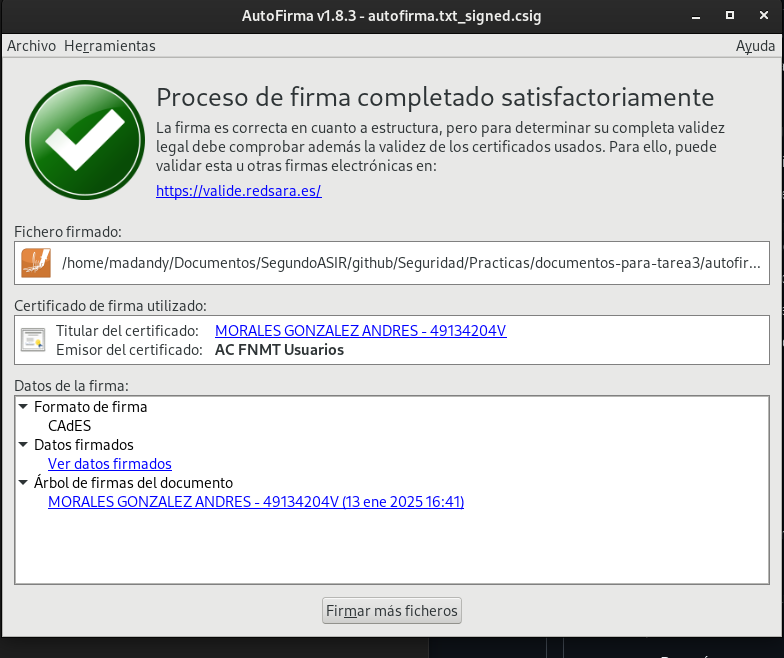

- **VALIDe**

  - Para esto lo que tendremos que irnos será a la pestaña de **Realizar firma**, una vez aquí tendremos que pulsar el botón **Firmar** y se nos abrira una nueva pantalla, en la cual tendremos que elegir el fichero que queremos firmar, despues vamos a pulsar **Guardar Firma** una vez acabado este poceso tendremos que ir a la pestaña donde ponde **Visualizar Firma** y elegir como podemos ver el fichero y quien la firmo:
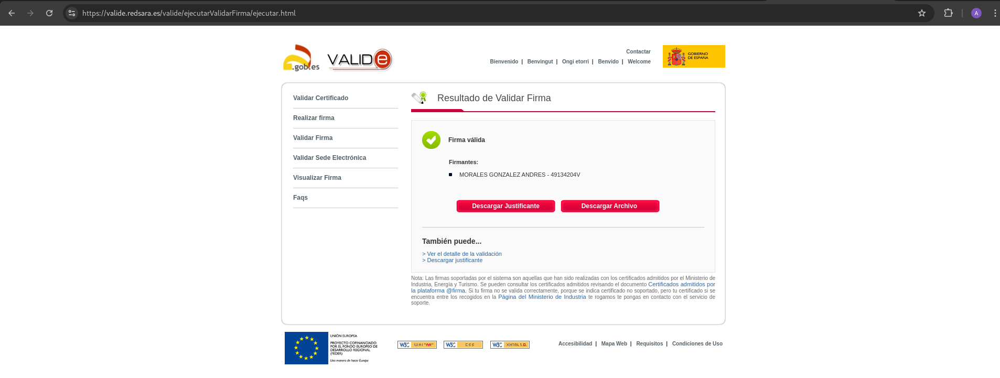


2. **Tu debes recibir otro documento firmado por un compañero y utilizando las herramientas anteriores debes visualizar la firma (Visualizar Firma) y (Verificar Firma). ¿Puedes verificar la firma aunque no tengas la clave pública de tu compañero?, ¿Es necesario estar conectado a internet para hacer la validación de la firma?. Razona tus respuestas.**

He recibido el fichero de mi compañero **Alejandro Liañez Frutos** y podmeos ver como el fichero que nos ha mandado ha sido firmado por el:

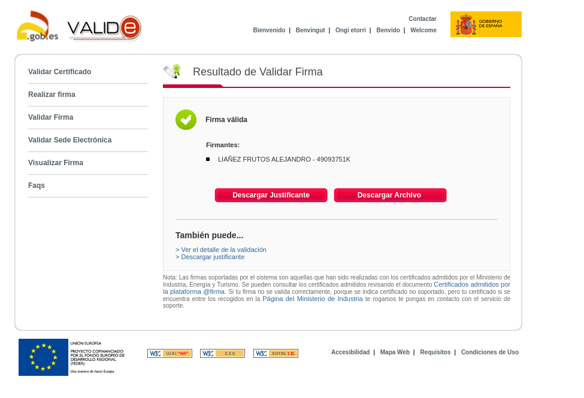

y que tambien le podemos ver el contenido si no svamos a **Visualizar Firma**:

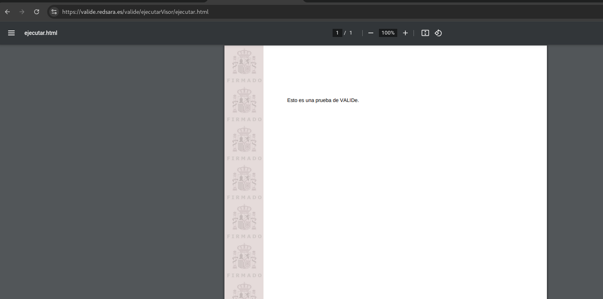

Y en el caso de **AutoFirma**, tendremos que usar la aplicación, y se nos abrira al elegir el fichero en cuestión, la siguiente pantalla:

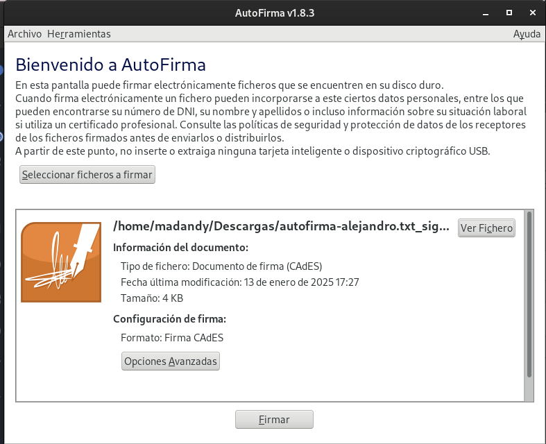

Y si le damos a **Ver Fichero** no sale quien es el firmante:

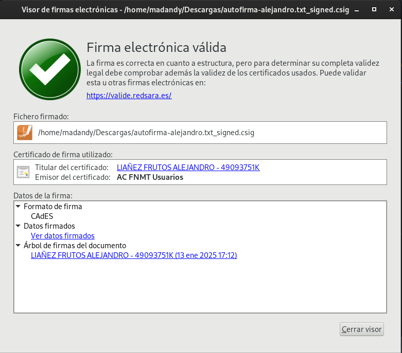

Y si ya queremos ver el contenido, le daremos a lo que esta marcado:
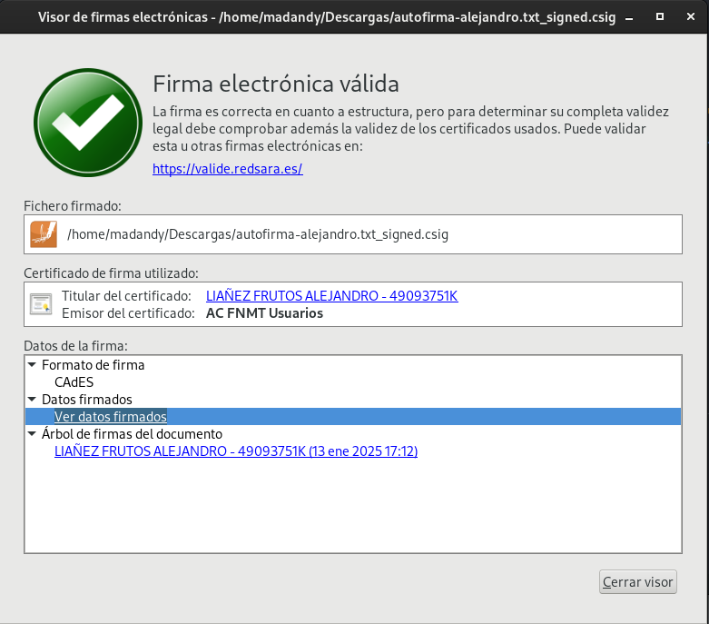

y este es el contenido:

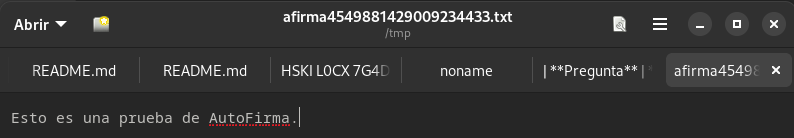

**Repuestas a las preguntas:**

Y respondiendo a las preguntas anteriores si podemos verificar la fimr aunaque no tengamso la clave pública de neuestro compañero, ya que es debido a que esta clave pública se adjunta en el propio fichero que ya esta firmado, por lo que se puede verificar la firma.

Y no es necesario Internet para **AutoFirma** ya que es una aplicación que se ejecuta en nuestro propio pc, pero si que es necesario para **VALIDe**

**3. Entre dos compañeros, firmar los dos un documento, verificar la firma para comprobar que está firmado por los dos.**


Mi compañero va a firmar los documentos anteriores que le pase, y ahora vere quien esta firmado tanto en **VALIDe** como en **AutoFirma**

- **Valide**

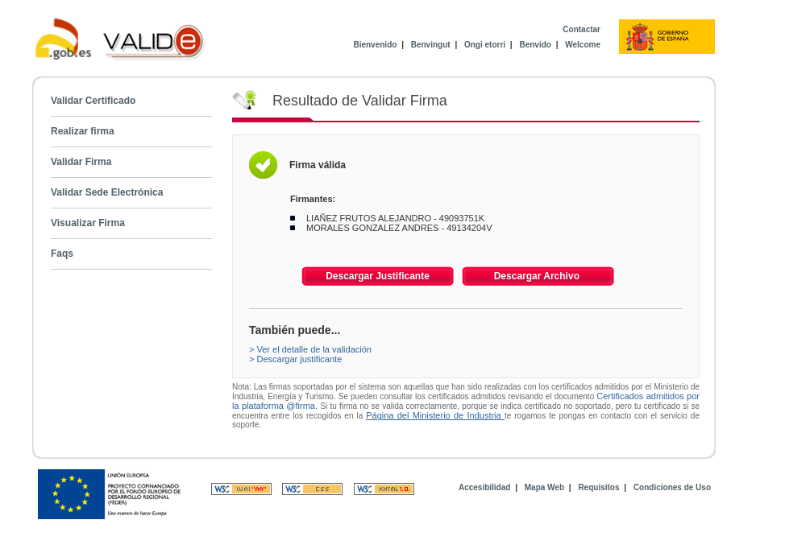
- **AutoFirma**

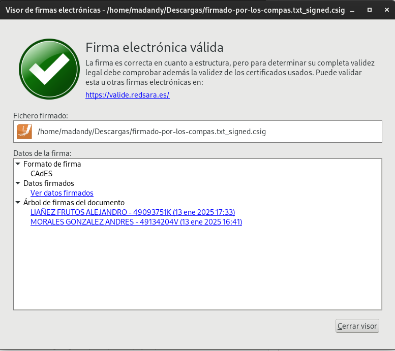

## Tarea 4: Autentificación

**1. Utilizando tu certificado accede a alguna página de la administración pública (cita médica, becas, puntos del carnet,…). Entrega capturas de pantalla donde se demuestre el acceso a ellas.**

Vamos a acceder a la página web de [DGT](https://www.dgt.es/nuestros-servicios/permisos-de-conducir/tus-puntos-y-tus-permisos/consulta-y-certificado-de-puntos/), para poder verificcar el uso de nuestro certificado digital, tendremos que irnos a este apartado:

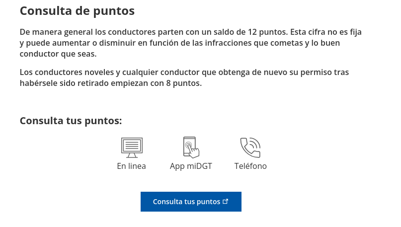

Pulsaremos donde nos pone **Consulta tus puntos** esto nos redirigira, a la siguiente página donde tendremos que coger la opción **Cl@ve**.

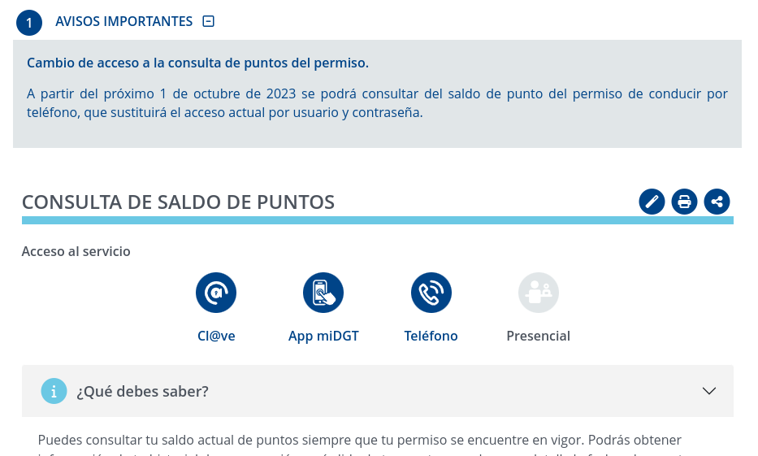

Dentro de esta opción se nos abrira otra página y tendremos qu eelegir la opción de **Accesso DNIe / Certificado electrónico**


Se nos abrira lo siguiente, y pulsamos en **Aceptar**

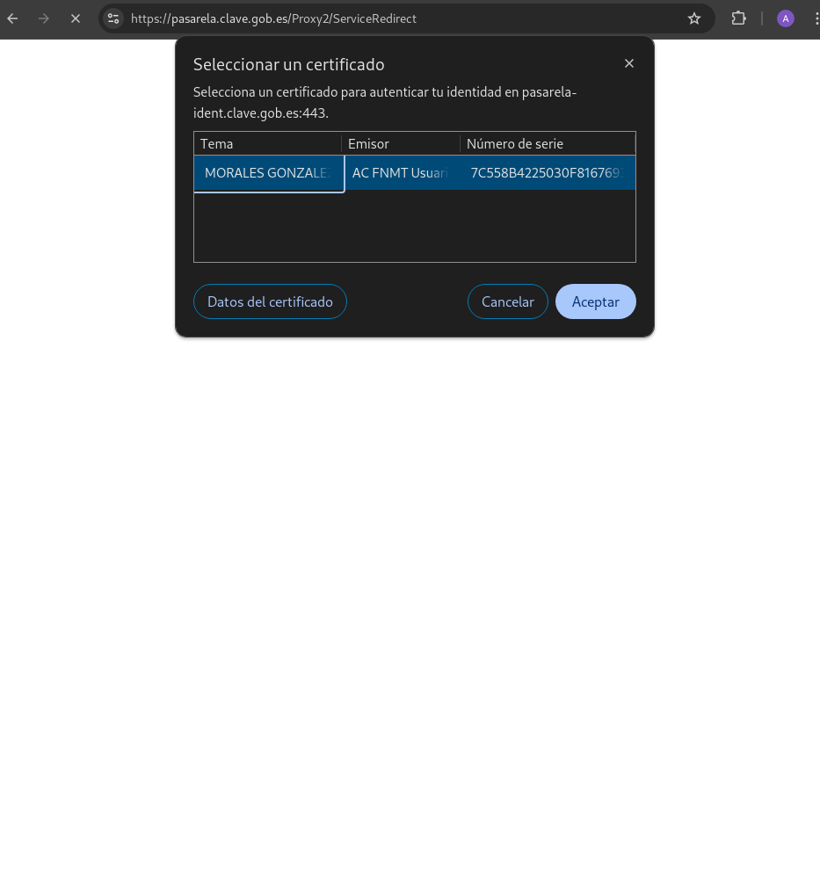

y ya tendremos nuestros datos, como podemos ver a continuación:

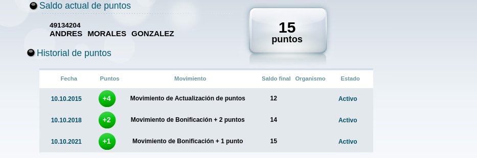


## HTTPS / SSL


### Introducción 

Voy a realizar esta práctica con mi compañero **Alejandro Liañez Frutos** ya que para esta parte de la práctica necesito la colaboración de un compañera, ya que firmaré una **Autoridad Certificadora** y mi compañero la firmará, y al contrario.

Para este caso voy a hacer uso de una máquina de **OpenStack**, con la siguiente **ip** ```172.22.200.139```:


Una vez dentro de la máquina llamada **Cripto** vamos a comenzar a hacer esta práctica.

La página la he hecho de la siguiente manera explicada en el siguiente [post](./pagina.md)

### Creación de Autoridad Certificadora

Primero, crearemos un directorio llamado CA/ para organizar nuestra entidad certificadora (CA). Dentro de este, añadiremos subdirectorios específicos para diferentes propósitos:

- **certs**: Almacén los certificados firmados.
- **crs**: Almacén los ficheros de solicitud de firma de certificados.
- **crl**: Almacén la lista de certificados que han sido revocados.
- **private**: Almacén la clave privada de la autoridad certificadora.

A parte del directorio y sus subdirectorios, necesitare en el directorio **CA/** un fichero el cual vamos a llamar **index.txt**, que va a actuar como bases de datis para los certificados existente.


Ahora haré una series de paso que será los siguientes que no piden en las preguntas de la práctica:

1. **Crear su autoridad certificadora (generar el certificado digital de la CA). Mostrar el fichero de configuración de la AC.**

- Creamos el directorio donde alojaremos todo lo necesario para la **CA** , dandole los permisos necesarios.

```
debian@cripto:~$ mkdir CA
debian@cripto:~$ cd CA/
debian@cripto:~$ mkdir certs csr crl newcerts private
debian@cripto:~/CA$ chmod 700 private
debian@cripto:~/CA$ touch index.txt
debian@cripto:~/CA$  touch index.txt.attr
debian@cripto:~/CA$ echo 1000 > serial
debian@cripto:~/CA$ tree
.
├── certs
├── crl
├── csr
├── index.txt
├── index.txt.attr
├── newcerts
├── private
└── serial

6 directories, 3 files

```
- Ahora a continuación lo que hare será crear las variables de entorno donde voy a definir los datos de configuracion de la **CA**:

Para esto tendremos que meterlo en el final de ``.bashrc``, meteremos lo siguiente:

```
# Variables de entorno para la practica

export countryName_default="ES"
export stateOrProvinceName_default="Sevilla"
export localityName_default="Dos Hermanas"
export organizationName_default="Andrés"
export organizationalUnitName_default="ASIR2"
export emailAddress_default="asirandyglez@gmail.com"
export DIR_CA="$HOME/CA"

```

Y agregamos estas variables con un ``source .bashrc``

Ahora crearemos el fichero de configuración el cual vamos a llamar ``openssl.cnf``, y tendra el siguiente contenido:

```
# man
default_ca = CA_default

[ CA_default ]
# Directory and file locations
dir               = /home/debian/CA
certs             = $dir/certs
crl_dir           = $dir/crl
new_certs_dir     = $dir/newcerts
database          = $dir/index.txt
serial            = $dir/serial
RANDFILE          = $dir/private/.rand

# The root key and root certificate
private_key       = $dir/private/private.key
certificate       = $dir/certs/cacert.crt

# For certificate revocation lists
crlnumber         = $dir/crlnumber
crl               = $dir/crl/ca.crl.pem
crl_extensions    = crl_ext
default_crl_days  = 30

# SHA-1 is deprecated, so use SHA-2 instead
default_md        = sha256

# Certificate options
name_opt          = ca_default
cert_opt          = ca_default
default_days      = 375
preserve          = no
policy            = policy_strict

[ policy_strict ]
countryName             = match
stateOrProvinceName     = match
organizationName        = match
organizationalUnitName  = optional
commonName              = supplied
emailAddress            = optional

[ policy_loose ]
countryName             = optional
stateOrProvinceName     = optional
localityName            = optional
organizationName        = optional
organizationalUnitName  = optional
commonName              = supplied
emailAddress            = optional

[ req ]
default_bits        = 2048
distinguished_name  = req_distinguished_name
string_mask         = utf8only
default_md          = sha256
x509_extensions     = v3_ca
req_extensions      = v3_req

[ v3_req ]
basicConstraints = CA:FALSE
keyUsage = nonRepudiation, digitalSignature, keyEncipherment
# subjectAltName = $ENV::SAN

[ req_distinguished_name ]
countryName                     = Country Name (2 letter code)
stateOrProvinceName             = State or Province Name
localityName                    = Locality Name
0.organizationName              = Organization Name
organizationalUnitName          = Organizational Unit Name
commonName                      = Common Name
emailAddress                    = Email Address

countryName_default             = ES
stateOrProvinceName_default     = Sevilla
localityName_default            = Dos Hermanas
0.organizationName_default      = Andrés
organizationalUnitName_default  = ASIR2
emailAddress_default            = asirandyglez@gmail.com

[ v3_ca ]
subjectKeyIdentifier = hash
authorityKeyIdentifier = keyid:always,issuer
basicConstraints = critical, CA:true
keyUsage = critical, digitalSignature, cRLSign, keyCertSign

[ server_cert ]
basicConstraints = CA:FALSE
subjectKeyIdentifier = hash
authorityKeyIdentifier = keyid,issuer
keyUsage = critical, digitalSignature, keyEncipherment
extendedKeyUsage = serverAuth

[ usr_cert ]
basicConstraints = CA:FALSE
subjectKeyIdentifier = hash
authorityKeyIdentifier = keyid,issuer
keyUsage = critical, nonRepudiation, digitalSignature, keyEncipherment
extendedKeyUsage = clientAuth, emailProtection

[ crl_ext ]
authorityKeyIdentifier = keyid:always

[ ocsp ]
basicConstraints = CA:FALSE
subjectKeyIdentifier = hash
authorityKeyIdentifier = keyid,issuer
keyUsage = critical, digitalSignature
extendedKeyUsage = critical, OCSPSigning

```

- Ahora creare tanto la clave como el certificado de **AC** (Autoridad certifficadora) con el siguiente comado:

1. **Creación de la clave privada (Generación de clave RSA para la Autoridad Certficadora):**

- Comando:

```
openssl genrsa -aes256 -out private/private.key 4096
```
Demostración: 

```
debian@cripto:~/CA$ openssl genrsa -aes256 -out private/private.key 4096
Enter PEM pass phrase:
Verifying - Enter PEM pass phrase:

```
Donde:

- ``openssl`` genrsa: Este comando genera una clave privada RSA 
- ``-aes256``: Indica que la clave privada debe ser cifrada con el algoritmo AES-256, lo que añade una capa extra de seguridad al proteger la clave con una contraseña. 
- ``-out private/private.key``: Especifica la ubicación donde se guardará la clave privada generada, en este caso en el archivo private/private.key
- ``4096``: Define el tamaño de la clave privada en bits. 

Por lo que se guarda el archivo ``private/private.key``

1. **Creación del certificado autofirmado de la Autoridad Certificadora (AC)**

Para hacer esto, tenemos que estar en el directorio donde se encuentre ``openssl.cnf``, y una vez en ese directorio, vamos a crearlo:
-  Comando para crearlo:
```
openssl req -config ./openssl.cnf -key private/private.key -new -x509 -days 3650 -sha256 -out certs/cacert.crt
```

- Demostración:

```
debian@cripto:~/CA$ openssl req -config ./openssl.cnf -key private/private.key -new -x509 -days 3650 -sha256 -out certs/cacert.crt
Enter pass phrase for private/private.key:
You are about to be asked to enter information that will be incorporated
into your certificate request.
What you are about to enter is what is called a Distinguished Name or a DN.
There are quite a few fields but you can leave some blank
For some fields there will be a default value,
If you enter '.', the field will be left blank.
-----
Country Name (2 letter code) [ES]:
State or Province Name [Sevilla]:
Locality Name [Dos Hermanas]:
Organization Name [Andrés]:
Organizational Unit Name [ASIR2]:
Common Name []:
Email Address [asirandyglez@gmail.com]:
```

Donde:

- ``openssl req``: Este comando se utiliza para crear una Solicitud de Certificado (CSR) o un certificado autofirmado. Aquí se está creando un certificado autofirmado, ya que la opción -x509 se usa para ello.

- ``-config ./openssl.cnf``: Este parámetro especifica el archivo de configuración de OpenSSL que se utilizará, en este caso, openssl.cnf, que contiene configuraciones predeterminadas como las ubicaciones de archivos y parámetros para la generación del certificado.

- ``-key private/private.key``: Especifica la clave privada que se utilizará para firmar el certificado. En este caso, se usa la clave privada que generaste previamente, ubicada en private/private.key.

- ``-new``: Indica que se está creando un nuevo certificado. Esto es parte de la creación de la solicitud de certificado (CSR).

- ``-x509``: Indica que se debe generar un certificado autofirmado (en lugar de solo una CSR). Este certificado es firmado por la propia Autoridad Certificadora (AC), que eres tú en este caso.

- ``-days 3650``: Establece la duración del certificado en días. En este caso, se está creando un certificado que será válido durante 10 años (3650 días).

- ``-sha256``: Indica que se debe usar el algoritmo de hash SHA-256 para firmar el certificado. SHA-256 es parte de la familia de funciones de hash SHA-2 y es una opción estándar para la firma de certificados, ofreciendo un alto nivel de seguridad.

- ``-out certs/cacert.crt``: Especifica el archivo de salida donde se guardará el certificado generado, en este caso en certs/cacert.crt.

Y como podemos ver lo tenemos en sus directorios:

```
debian@cripto:~/CA$ tree
.
├── certs
│   └── cacert.crt
├── crl
├── csr
├── index.txt
├── index.txt.attr
├── newcerts
├── openssl.cnf
├── private
│   └── private.key
└── serial

6 directories, 6 files

```
Ahora haré un inciso y voy a realizar un archivo **CSR** para poder enviarselo a mi compañero, para ello he usado el siguiente comando ``openssl req -new -key private/private.key -out csr/amg-alf.csr -config openssl.cnf`` , hay que **rellenar todos los campos** y vamos a comprobar que lo tenemos ya hecho haciendo un tree desde dnuestra consola:

```
debian@cripto:~$ tree
.
└── CA
    ├── certs
    │   └── cacert.crt
    ├── crl
    ├── csr
    │   └── amg-alf.csr
    ├── index.txt
    ├── index.txt.attr
    ├── newcerts
    ├── openssl.cnf
    ├── private
    │   └── private.key
    └── serial

7 directories, 7 files
```

Una vez comprobado, vamos a mandarselo para que nos la firme, y asi tambien que tendrá que hacer nuestro compañero. Por lo que nos va a enviar a nosostros la suya, para poder firmarla,o y la nuestra ya firmada por él.

- Firmada por **Alejandro Liañez Frutos**

El cual es ``andres-firmado.crt`` esto lo tengo en el el siguiente directorio, ya que somos una autoridad certificadora:

```
debian@cripto:~$ ls
CA  andres_firmado.crt  andy.csr

```


- Firmar el certificado de **Alejandro Liañez Frutos**:

Para ello hare lo siguiente comando ```openssl ca -config openssl.cnf -extensions v3_req -days 3650 -notext -md sha256 -in csr/alejandro.csr -out certs/alejandro.crt -policy policy_loose``` y rellenamos los campos necesarios.

Y vemos como se ha firmado en el directorio ```/certs``:

```
debian@cripto:~/CA$ tree 
.
├── certs
│   ├── alejandro.crt
│   └── cacert.crt
├── crl
├── csr
│   └── alejandro.csr
├── index.txt
├── index.txt.attr
├── index.txt.attr.old
├── index.txt.old
├── newcerts
│   └── 1000.pem
├── openssl.cnf
├── private
│   └── private.key
├── serial
└── serial.old

6 directories, 12 files


```
Y ahora se lo pasamos a nuestro compañero:

```
debian@cripto:~/CA/certs$ scp alejandro.crt alejandro@172.22.12.25:/home/alejandro/CA/certs
alejandro@172.22.12.25's password: 
alejandro.crt                                 100% 2163     1.6MB/s   00:00 
```

Por lo que ahora vamos a comprobar que tengo tanto el mio firmado como el suyo que esta firmado, siendo el mio que le firme a mi comapñero, el fichero ```alejandro.crt``` y yo el que le firme y le pase ```andres_firmado.crt```, como podemos ver a continuación:

```
debian@cripto:~/CA$ tree
.
├── certs
│   ├── alejandro.crt
│   └── cacert.crt
...
..
.
```
El mio que es ``andres_firmado.crt`` al ser autoridad certificadora lo tenemos que tener fuera del servidor web.

```
debian@cripto:~$ ls
CA  andres_firmado.crt  andy.csr
```

- ¿Qué otra información debes aportar a tu compañero para que éste configure de forma adecuada su servidor web con el certificado generado?

Va a necesitar lo siguiente:

1. **Certificado firmado**

- El certificado que le acabas de generar, por ejemplo: ``alf-firmado.crt``.

2. **Certificado de la Autoridad Certificadora (CA)**

- Proporcionar mi certificado raíz, el cual se llama ```cacert.crt```. Ya que es necesario para que el servidor web pueda establecer la cadena de confianza.

3. Archivo de clave privada de su CSR

La clave privada (```private.key```) que se generó originalmente y que corresponde al CSR. Este archivo debe mantenerse en secreto y debe ser configurado en el servidor para cifrar las comunicaciones y firmar la conexión.

Además, necesitará información que se encuentra en el fichero openssl.conf relacionada al **countryName, stateOrProvinceName y localityName**.

### Administramos el servidor Web

#### Preparación del escenario

#### Apache 
Para este punto necesitareis meterse en este [post](./pagina.md) ya que como anteriormente dije, tenemos el pao a paso explicado de como se hara nuestra página.

Por lo que voy a proceder a comenzar con la práctica con los siguientes pasos:

1. **Creación de una clave privada RSA de 4096 bits para la identificación del servidor.**

**Nota**: Esta parte lo haremos siendo **root**.

- Comandos usados:

```
    sudo openssl genrsa -aes256 -out /etc/ssl/private/andy-priv.key 4096
    sudo chmod 400 /etc/ssl/private/andy-priv.key
```
- Demostracion:

```
root@cripto:~# sudo openssl genrsa -aes256 -out /etc/ssl/private/andy-priv.key 4096
Enter PEM pass phrase:
Verifying - Enter PEM pass phrase:
root@cripto:~# chmod 400 /etc/ssl/private/andy-priv.key 
```
Y comprobación de que estan hecho:
```
root@cripto:~# tree /etc/ssl/private/ 
/etc/ssl/private/
├── andy-priv.key
└── ssl-cert-snakeoil.key

1 directory, 2 files

```

2. Usar la clave anterior para generar un CSR, considerando que deseas acceder al servidor con el FQDN (andy.iesgn.org).

- Modificaremos el fichero de configuración:

Para ellos nos hemos pasado el ```cacert```, de nuestro compañero a la ``/home``, ya que somos administradores, no autoridad certificadora, por lo que estaria todo aqui:

```
debian@cripto:~$ ls
CA  andres_firmado.crt  andy.csr  cacert.crt
```
Ahora modificaremos el fichero de configuracion ```/etc/apache2/sites-available/default-ssl.conf```y meteremos lo siguiente:

```
debian@cripto:~/CA$ cat /etc/apache2/sites-available/default-ssl.conf
<IfModule mod_ssl.c>
        <VirtualHost *:443>
            ServerName andy.iesgn.org
            DocumentRoot /var/www/andy.iesgn.org
            ErrorLog ${APACHE_LOG_DIR}/error-andy.log
            CustomLog ${APACHE_LOG_DIR}/access-andy.log combined

            SSLEngine on
            SSLCertificateFile /etc/ssl/certs/andres_firmado.crt
            SSLCertificateKeyFile /etc/ssl/private/andy-priv.key
            SSLCACertificateFile /etc/ssl/certs/cacert.crt

            <Directory /var/www/andy.iesgn.org>
                Options Indexes FollowSymLinks
                AllowOverride None
                Require all granted               
            </Directory>
        </VirtualHost>
    </IfModule>
```

- Muevo los ficheros quye he generado anteriormente 

```
debian@cripto:~$ sudo chown root:root /etc/ssl/certs/andres_firmado.crt 
debian@cripto:~$ sudo chown root:root /etc/ssl/certs/cacert.crt 
debian@cripto:~$ sudo chmod 644 /etc/ssl/certs/andres_firmado.crt 
debian@cripto:~$ sudo chmod 644 /etc/ssl/certs/cacert.crt 
```
Ahora una ve que tenemos puesto todo, hacemos lo siguiente:

```
debian@cripto:~$ sudo a2enmod ssl
debian@cripto:~$ sudo a2ensite default-ssl.conf

debian@cripto:~$ sudo systemctl restart apache2
🔐 Enter passphrase for SSL/TLS keys for andy.iesgn.org:443 (RSA): (press TAB for no echo) 
Broadcast message from root@cripto (Fri 2025-01-10 12:21:04 UTC):

Password entry required for 'Enter passphrase for SSL/TLS keys for andy.iesgn.org:443 (RSA):' (PID 4517).
Please enter password with the systemd-tty-ask-password-agent tool.

*******

```
Una vez tenemos el reinicio de apache, se nos vera de la siguiente manera:


La advertencia de seguridad indica que la redirección de http:// a https:// ha funcionado, pero el navegador no puede verificar la firma del certificado recibido porque no tiene la clave pública o el certificado de la CA. Por ello, es necesario importarlo manualmente.

En Firefox, para importar el certificado de una CA, sigue estos pasos:

- Haz clic en el icono de las tres barras en la parte superior.
- Ve a Preferencias o Ajustes.
- En el apartado Privacidad & Seguridad, desplázate hacia abajo hasta Certificados y selecciona Ver certificados.
- En la pestaña Autoridades, haz clic en Importar y selecciona el certificado de la CA.
- Cuando aparezca el mensaje que dice Se le ha pedido que confíe en una nueva Autoridad Certificadora (CA), confirma la acción seleccionando Aceptar.

Tras todo esto, podremos ver que ha sido correctamente importado:


Actualizamos el navegador para así volver a mostrar la página ``andy.iesgn.org``, accediendo desde HTTPS:


Y como podemos apreciar se nos ha vuelto a mostrar la advertencia de seguridad, si nos fijamos al lado de la URL, pero podemos bver la información:


Y si le damos a **Ver certificado**, nos saldrá lo siguiente:


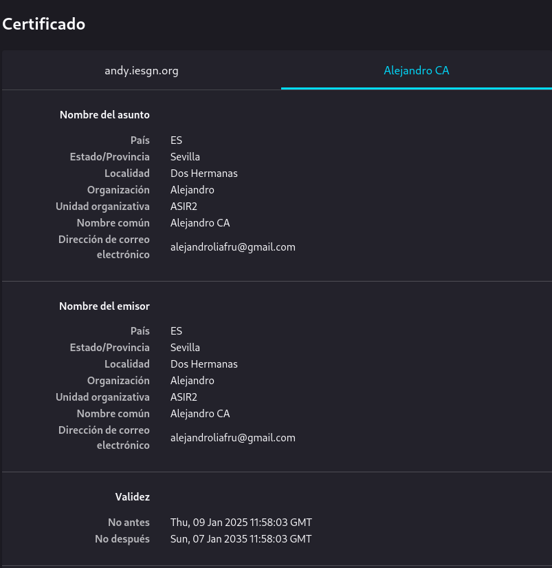

Podemos ver todda la información técnica sobre el certificado.

##### ¿Por qué no es seguro siendo HTTPS?

Dado que en el navegador nos sigue mostrando qyue el sitio **no es seguro** ya que lo que estoy usando es un certificado que ha sido emitido por una Autoridad Certificadora (CA) que no esta reconocida como confiable por los navegadores, esto esta ocurriendo porque el certificado ha sido emitido por una CA de mi compañero, por lo que aunque tengamos el HTTPS configurado, los navegadores (chrome o firefox) no van a confiar en una entidad que no este reconocida internacionalmente.

Ya hemos comprobado que con **apache2** hemos conseguido hacer que HTTPS funcione (no funciona sin pagar a la entidad certificadora) por lo que sin la verificación de una entidad internacional, así que ahora vamos a hacer la misma prueba con la otra cara de la moneda, con **nginx**.

#### Nginx

Lo primero que voy a hacer es desinstalar apache e instalar nginx, para que no haya ningún conflicto, tambien puedes tenerlo en el mimso sitios ambos servidores, pero por comodidad, yo tengo una máquina para cosa, por lo que ejeutaremos el siguiente comando:

```
debian@cripto:~$ sudo apt remove apache2 && apt install nginx -y
```

Configuracion del server que se encuentra ubicado en ``/etc/nginx/sites-available/default``. Para modificarlo:

```debian@cripto:~$ sudo nano /etc/nginx/sites-available/default```

Para configurar un servidor con soporte para HTTPS, se definen dos directivas server:

VirtualHost en el puerto 80 (HTTP):

Configuramos el ServerName correspondiente al dominio.
Implementamos una redirección permanente para forzar el uso de HTTPS.
VirtualHost en el puerto 443 (HTTPS):
Configuramos las siguientes directivas:

- server_name: Especificamos el dominio a través del cual accederemos al servidor.
- ssl: Activamos SSL para habilitar HTTPS (valor: on).
- ssl_certificate: Indicamos la ruta del certificado del servidor (por ejemplo, /etc/ssl/certs/andres_firmado.crt).
- ssl_certificate_key: Especificamos la ruta de la clave privada asociada al certificado (por ejemplo, /etc/ssl/private/andy-priv.key).

Por lo que el fichero editado será así:

```
debian@cripto:~$ cat /etc/nginx/sites-available/andy.iesgn.org
server {
    listen 80;
    listen [::]:80;
    server_name andy.iesgn.org;
    return 301 https://$server_name$request_uri;
}

server {
    listen 443 ssl http2;
    listen [::]:443 ssl http2;
    server_name andy.iesgn.org;

    ssl_certificate /etc/ssl/certs/andres_firmado.crt;
    ssl_certificate_key /etc/ssl/private/andy-priv.key;
    ssl_trusted_certificate /etc/ssl/certs/cacert.crt;

    root /var/www/html/andy.iesgn.org;
    index index.html;

    location / {
        try_files $uri $uri/ =404;
    }
}
debian@cripto:~$ cat /etc/nginx/sites-available/default 
server {
        listen 80 default_server;
        listen [::]:80 default_server;

        server_name andy.iesgn.org;

        return 301 https://$host$request_uri;
}

server {
        listen 443 ssl default_server;
        listen [::]:443 ssl default_server;

        ssl    on;
        ssl_certificate    /etc/ssl/certs/andres_firmado.crt;
        ssl_certificate_key    /etc/ssl/private/andy-priv.key;

        root /var/www/html;

        index index.html index.htm index.nginx-debian.html;

        server_name andy.iesgn.org;

        location / {
                try_files $uri $uri/ =404;
        }
}
```
AHora hare un ```index.html``` en la siguiente dirección ``/var/www/html/andy.iesgn.org/index.html``
:

```
debian@cripto:/var/www/html/andy.iesgn.org$ cat index.html 
<!DOCTYPE html>
<html>
    <head>
        <title>andy.iesgn.org</title>
    </head>
    <body>
        <h1>andy.iesgn.org</h1>
        <p>Web de prueba para cripto 3 - HTTPS</p>
        <p>PRUEBA NGINX</p>
    </body>
</html>

```

Hacemos la realización del enlace simbolico del fichero de configuracion y reinicio el servicio de nginx:

```
sudo ln -s /etc/nginx/sites-available/andy.iesgn.org /etc/nginx/sites-enabled/

sudo systemctl restart nginx
```

Y ahora vamos a comprobar que funciona por lo que dejo por aqui la demostración:
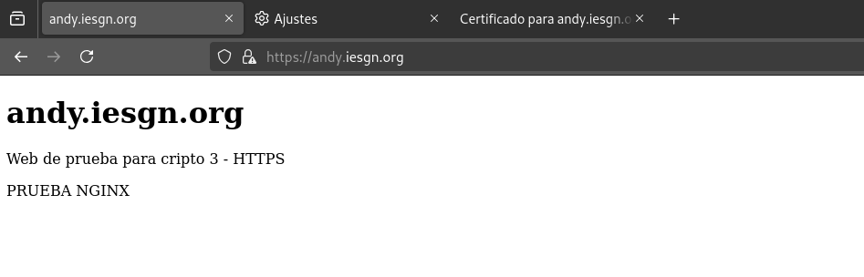

Y como podemos comprobar esta el certificado de mi compañero en la página:


Al igual que antes explique, antes haré de nuevo la mención en parafraseando lo anterior 

##### ¿Por qué no es seguro siendo HTTPS?


Aunque el sitio esté configurado para usar HTTPS, los navegadores siguen mostrando que el sitio **no es seguro**. Esto ocurre porque el certificado SSL que se está utilizando ha sido emitido por una Autoridad Certificadora (CA) que no es reconocida como confiable por los navegadores. En este caso, el certificado ha sido emitido por una CA interna o de un compañero, lo que significa que, aunque el sitio esté protegido con HTTPS, los navegadores (como Chrome o Firefox) no confían en una entidad que **no esté oficialmente reconocida** a nivel internacional. 
Por lo que el resultado, nos muestran advertencias de seguridad indicando que el sitio no es completamente seguro.

