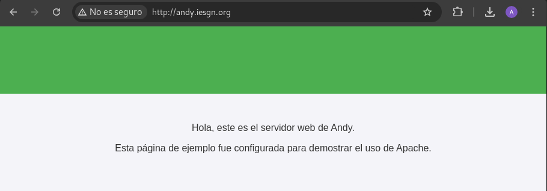

Voy a dejar por aqui los pasos que he realizado y el como se ve a primera vista la página web:

- Actualizar el sistema:

```
ebian@cripto:~$ sudo apt update
Get:1 file:/etc/apt/mirrors/debian.list Mirrorlist [30 B]
Get:5 file:/etc/apt/mirrors/debian-security.list Mirrorlist [39 B]
Get:2 https://deb.debian.org/debian bookworm InRelease [151 kB]
Get:3 https://deb.debian.org/debian bookworm-updates InRelease [55.4 kB]
Get:4 https://deb.debian.org/debian bookworm-backports InRelease [59.0 kB]
Get:6 https://deb.debian.org/debian-security bookworm-security InRelease [48.0 kB]
Get:7 https://deb.debian.org/debian bookworm/main Sources [9494 kB]
Get:8 https://deb.debian.org/debian bookworm/main amd64 Packages [8789 kB]
Get:9 https://deb.debian.org/debian bookworm/main Translation-en [6109 kB]
Get:10 https://deb.debian.org/debian bookworm-updates/main Sources [3120 B]
Get:11 https://deb.debian.org/debian bookworm-updates/main amd64 Packages [8856 B]
Get:12 https://deb.debian.org/debian bookworm-updates/main Translation-en [8248 B]
Get:13 https://deb.debian.org/debian bookworm-backports/main Sources [311 kB]
Get:14 https://deb.debian.org/debian bookworm-backports/main amd64 Packages [274 kB]
Get:15 https://deb.debian.org/debian bookworm-backports/main Translation-en [226 kB]
Get:16 https://deb.debian.org/debian-security bookworm-security/main Sources [133 kB]
Get:17 https://deb.debian.org/debian-security bookworm-security/main amd64 Packages [239 kB]
Get:18 https://deb.debian.org/debian-security bookworm-security/main Translation-en [141 kB]
Fetched 26.1 MB in 6s (4357 kB/s)                          
Reading package lists... Done
Building dependency tree... Done
Reading state information... Done
1 package can be upgraded. Run 'apt list --upgradable' to see it.

```
- Instalar **apache**
```
debian@cripto:~$ sudo apt install apache2 -y
Reading package lists... Done
Building dependency tree... Done
Reading state information... Done
The following additional packages will be installed:
  apache2-bin apache2-data apache2-utils libapr1 libaprutil1
  libaprutil1-dbd-sqlite3 libaprutil1-ldap libgdbm-compat4 libjansson4
  liblua5.3-0 libperl5.36 perl perl-modules-5.36 ssl-cert
Suggested packages:
  apache2-doc apache2-suexec-pristine | apache2-suexec-custom www-browser
  perl-doc libterm-readline-gnu-perl | libterm-readline-perl-perl make
  libtap-harness-archive-perl
The following NEW packages will be installed:
  apache2 apache2-bin apache2-data apache2-utils libapr1 libaprutil1
  libaprutil1-dbd-sqlite3 libaprutil1-ldap libgdbm-compat4 libjansson4
  liblua5.3-0 libperl5.36 perl perl-modules-5.36 ssl-cert
0 upgraded, 15 newly installed, 0 to remove and 1 not upgraded.
Need to get 9699 kB of archives.
After this operation, 57.0 MB of additional disk space will be used.
Get:1 file:/etc/apt/mirrors/debian.list Mirrorlist [30 B]
Get:2 https://deb.debian.org/debian bookworm/main amd64 perl-modules-5.36 all 5.36.0-7+deb12u1 [2815 kB]
Get:3 https://deb.debian.org/debian bookworm/main amd64 libgdbm-compat4 amd64 1.23-3 [48.2 kB]
Get:4 https://deb.debian.org/debian bookworm/main amd64 libperl5.36 amd64 5.36.0-7+deb12u1 [4218 kB]
Get:5 https://deb.debian.org/debian bookworm/main amd64 perl amd64 5.36.0-7+deb12u1 [239 kB]
Get:6 https://deb.debian.org/debian bookworm/main amd64 libapr1 amd64 1.7.2-3+deb12u1 [102 kB]
Get:7 https://deb.debian.org/debian bookworm/main amd64 libaprutil1 amd64 1.6.3-1 [87.8 kB]
Get:8 https://deb.debian.org/debian bookworm/main amd64 libaprutil1-dbd-sqlite3 amd64 1.6.3-1 [13.6 kB]
Get:9 https://deb.debian.org/debian bookworm/main amd64 libaprutil1-ldap amd64 1.6.3-1 [11.8 kB]
Get:10 https://deb.debian.org/debian bookworm/main amd64 libjansson4 amd64 2.14-2 [40.8 kB]
Get:11 https://deb.debian.org/debian bookworm/main amd64 liblua5.3-0 amd64 5.3.6-2 [123 kB]
Get:12 https://deb.debian.org/debian bookworm/main amd64 apache2-bin amd64 2.4.62-1~deb12u2 [1386 kB]
Get:13 https://deb.debian.org/debian bookworm/main amd64 apache2-data all 2.4.62-1~deb12u2 [160 kB]
Get:14 https://deb.debian.org/debian bookworm/main amd64 apache2-utils amd64 2.4.62-1~deb12u2 [210 kB]
Get:15 https://deb.debian.org/debian bookworm/main amd64 apache2 amd64 2.4.62-1~deb12u2 [223 kB]
Get:16 https://deb.debian.org/debian bookworm/main amd64 ssl-cert all 1.1.2 [21.1 kB]
Fetched 9699 kB in 2s (5497 kB/s)
Preconfiguring packages ...
Selecting previously unselected package perl-modules-5.36.
(Reading database ... 24347 files and directories currently installed.)
Preparing to unpack .../00-perl-modules-5.36_5.36.0-7+deb12u1_all.deb ...
Unpacking perl-modules-5.36 (5.36.0-7+deb12u1) ...
Selecting previously unselected package libgdbm-compat4:amd64.
Preparing to unpack .../01-libgdbm-compat4_1.23-3_amd64.deb ...
Unpacking libgdbm-compat4:amd64 (1.23-3) ...
Selecting previously unselected package libperl5.36:amd64.
Preparing to unpack .../02-libperl5.36_5.36.0-7+deb12u1_amd64.deb ...
Unpacking libperl5.36:amd64 (5.36.0-7+deb12u1) ...
Selecting previously unselected package perl.
Preparing to unpack .../03-perl_5.36.0-7+deb12u1_amd64.deb ...
Unpacking perl (5.36.0-7+deb12u1) ...
Selecting previously unselected package libapr1:amd64.
Preparing to unpack .../04-libapr1_1.7.2-3+deb12u1_amd64.deb ...
Unpacking libapr1:amd64 (1.7.2-3+deb12u1) ...
Selecting previously unselected package libaprutil1:amd64.
Preparing to unpack .../05-libaprutil1_1.6.3-1_amd64.deb ...
Unpacking libaprutil1:amd64 (1.6.3-1) ...
Selecting previously unselected package libaprutil1-dbd-sqlite3:amd64.
Preparing to unpack .../06-libaprutil1-dbd-sqlite3_1.6.3-1_amd64.deb ...
Unpacking libaprutil1-dbd-sqlite3:amd64 (1.6.3-1) ...
Selecting previously unselected package libaprutil1-ldap:amd64.
Preparing to unpack .../07-libaprutil1-ldap_1.6.3-1_amd64.deb ...
Unpacking libaprutil1-ldap:amd64 (1.6.3-1) ...
Selecting previously unselected package libjansson4:amd64.
Preparing to unpack .../08-libjansson4_2.14-2_amd64.deb ...
Unpacking libjansson4:amd64 (2.14-2) ...
Selecting previously unselected package liblua5.3-0:amd64.
Preparing to unpack .../09-liblua5.3-0_5.3.6-2_amd64.deb ...
Unpacking liblua5.3-0:amd64 (5.3.6-2) ...
Selecting previously unselected package apache2-bin.
Preparing to unpack .../10-apache2-bin_2.4.62-1~deb12u2_amd64.deb ...
Unpacking apache2-bin (2.4.62-1~deb12u2) ...
Selecting previously unselected package apache2-data.
Preparing to unpack .../11-apache2-data_2.4.62-1~deb12u2_all.deb ...
Unpacking apache2-data (2.4.62-1~deb12u2) ...
Selecting previously unselected package apache2-utils.
Preparing to unpack .../12-apache2-utils_2.4.62-1~deb12u2_amd64.deb ...
Unpacking apache2-utils (2.4.62-1~deb12u2) ...
Selecting previously unselected package apache2.
Preparing to unpack .../13-apache2_2.4.62-1~deb12u2_amd64.deb ...
Unpacking apache2 (2.4.62-1~deb12u2) ...
Selecting previously unselected package ssl-cert.
Preparing to unpack .../14-ssl-cert_1.1.2_all.deb ...
Unpacking ssl-cert (1.1.2) ...
Setting up libapr1:amd64 (1.7.2-3+deb12u1) ...
Setting up libjansson4:amd64 (2.14-2) ...
Setting up perl-modules-5.36 (5.36.0-7+deb12u1) ...
Setting up ssl-cert (1.1.2) ...
Setting up libgdbm-compat4:amd64 (1.23-3) ...
Setting up liblua5.3-0:amd64 (5.3.6-2) ...
Setting up apache2-data (2.4.62-1~deb12u2) ...
Setting up libperl5.36:amd64 (5.36.0-7+deb12u1) ...
Setting up libaprutil1:amd64 (1.6.3-1) ...
Setting up libaprutil1-ldap:amd64 (1.6.3-1) ...
Setting up libaprutil1-dbd-sqlite3:amd64 (1.6.3-1) ...
Setting up perl (5.36.0-7+deb12u1) ...
Setting up apache2-utils (2.4.62-1~deb12u2) ...
Setting up apache2-bin (2.4.62-1~deb12u2) ...
Setting up apache2 (2.4.62-1~deb12u2) ...
Enabling module mpm_event.
Enabling module authz_core.
Enabling module authz_host.
Enabling module authn_core.
Enabling module auth_basic.
Enabling module access_compat.
Enabling module authn_file.
Enabling module authz_user.
Enabling module alias.
Enabling module dir.
Enabling module autoindex.
Enabling module env.
Enabling module mime.
Enabling module negotiation.
Enabling module setenvif.
Enabling module filter.
Enabling module deflate.
Enabling module status.
Enabling module reqtimeout.
Enabling conf charset.
Enabling conf localized-error-pages.
Enabling conf other-vhosts-access-log.
Enabling conf security.
Enabling conf serve-cgi-bin.
Enabling site 000-default.
Created symlink /etc/systemd/system/multi-user.target.wants/apache2.service → /l
ib/systemd/system/apache2.service.
Created symlink /etc/systemd/system/multi-user.target.wants/apache-htcacheclean.
service → /lib/systemd/system/apache-htcacheclean.service.
Processing triggers for man-db (2.11.2-2) ...
Processing triggers for libc-bin (2.36-9+deb12u9) ...
```

- Ver estado de servidor web:

```
debian@cripto:~$ sudo systemctl status apache2
● apache2.service - The Apache HTTP Server
     Loaded: loaded (/lib/systemd/system/apache2.service; enabled; preset: enab>
     Active: active (running) since Thu 2025-01-09 11:33:47 UTC; 11s ago
       Docs: https://httpd.apache.org/docs/2.4/
   Main PID: 1173 (apache2)
      Tasks: 55 (limit: 1108)
     Memory: 17.2M
        CPU: 46ms
     CGroup: /system.slice/apache2.service
             ├─1173 /usr/sbin/apache2 -k start
             ├─1175 /usr/sbin/apache2 -k start
             └─1176 /usr/sbin/apache2 -k start

Jan 09 11:33:47 cripto systemd[1]: Starting apache2.service - The Apache HTTP S>
Jan 09 11:33:47 cripto apachectl[1172]: AH00558: apache2: Could not reliably de>
Jan 09 11:33:47 cript
```

- Crear directori del sistio web:

```
sudo mkdir -p /var/www/andy.iesgn.org

```
- Añadir un HTML 

```
echo '<!DOCTYPE html>
<html lang="es">
<head>
    <meta charset="UTF-8">
    <meta name="viewport" content="width=device-width, initial-scale=1.0">
    <title>Bienvenido a andy.iesgn.org</title>
    <style>
        body {
            font-family: Arial, sans-serif;
            background-color: #f4f4f9;
            color: #333;
            margin: 0;
            padding: 0;
        }
        header {
            background-color: #4CAF50;
            color: white;
            text-align: center;
            padding: 1rem;
        }
        main {
            padding: 2rem;
            text-align: center;
        }
        h1 {
            color: #4CAF50;
        }
        footer {
            background-color: #333;
            color: white;
            text-align: center;
            padding: 1rem;
            position: fixed;
            bottom: 0;
            width: 100%;
        }
    </style>
</head>
<body>
    <header>
        <h1>¡Bienvenido a andy.iesgn.org!</h1>
    </header>
    <main>
        <p>Hola, este es el servidor web de Andy.</p>
        <p>Esta página de ejemplo fue configurada para demostrar el uso de Apache.</p>
    </main>
    <footer>
        <p>&copy; 2025 Andy. Todos los derechos reservados.</p>
    </footer>
</body>
</html>' | sudo tee /var/www/andy.iesgn.org/index.html

```
- Crear un archivo de configuración para el sitio:

```
sudo nano /etc/apache2/sites-available/andy.iesgn.org.conf

```

- Configurar el VirtualHost

```
<VirtualHost *:80>
    ServerName andy.iesgn.org
    DocumentRoot /var/www/andy.iesgn.org

    <Directory /var/www/andy.iesgn.org>
        Options Indexes FollowSymLinks
        AllowOverride All
        Require all granted
    </Directory>

    ErrorLog ${APACHE_LOG_DIR}/andy.iesgn.org-error.log
    CustomLog ${APACHE_LOG_DIR}/andy.iesgn.org-access.log combined
</VirtualHost>

```
- Habiliatr el sitio:

```
sudo a2ensite andy.iesgn.org.conf
sudo systemctl reload apache2

```

En nuestra mauqina anfitirona en el fichero ```/etc/hosts```

```
# Pagina de cripto-bro

172.22.200.139 andy.iesgn.org


```

Y como se ve:


